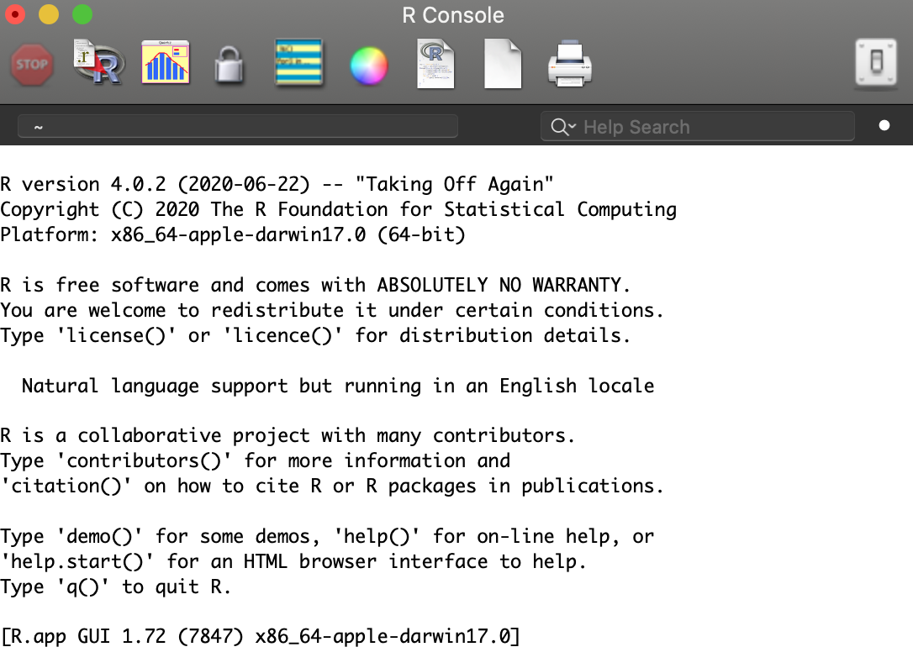
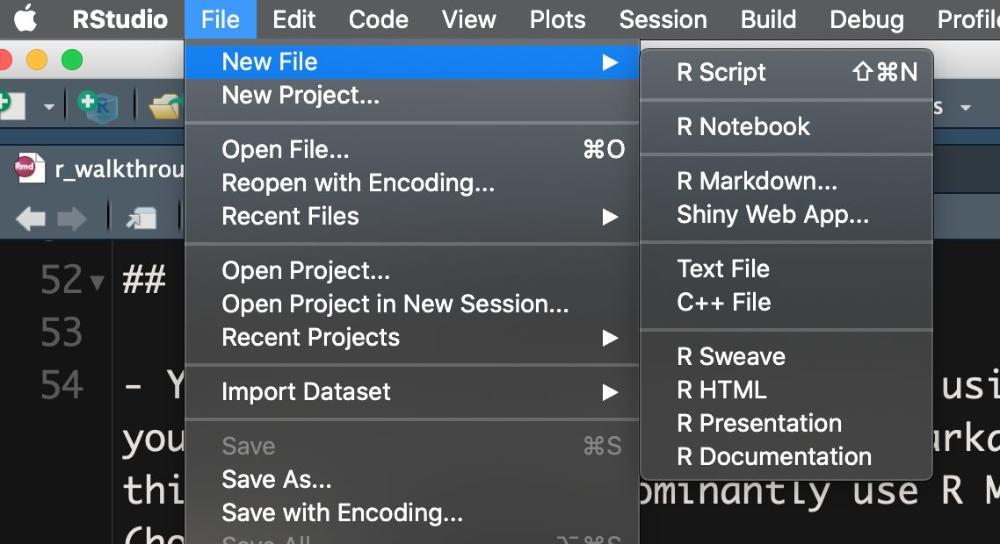
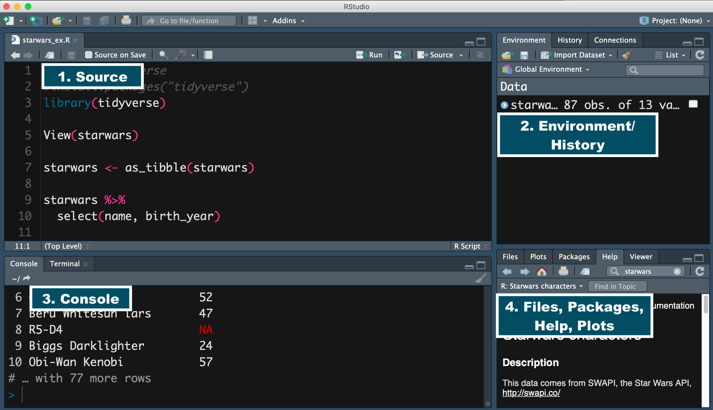

# Introduction to R  

R is a language and environment for statistical programming and visualization. The R language is similar to S which was designed in the 80s and created by John Chambers. It is part of the [GNU project](http://www.gnu.org/), a free software or operating system that respects users' freedom. R was created by Robert Gentleman and Ross Ihaka and since 1997 consists of the _R Core Team_ who write access to the R source.  

*Credit: [R-project](https://www.r-project.org/about.html), [R Language Definition](https://cran.r-project.org/doc/manuals/r-release/R-lang.pdf)*  


> "To use R, we’ll need to download two software packages: **Base-R**, and **RStudio**. Base-R is the basic software which contains the R programming language. RStudio is software that makes R programming easier. Of course, they are totally free and open source."  

{width=80%}

*Credit: [Installing Base-R and RStudio](https://bookdown.org/ndphillips/YaRrr/installing-base-r-and-rstudio.html) YaRrr! The Pirate's Guide to R*

## R script  

- You can write your code in RStudio using an R script which has a .R extension or you can write your code using an R Markdown file which has a .Rmd extension. In this class we will predominantly use R Markdown for lectures and problem sets (homeworks). 
    - The benefits of using [R Markdown](https://github.com/rstudio/cheatsheets/raw/master/rmarkdown-2.0.pdf) is that users can embed code in their text. This lets users create high quality documents, reports, presentations, etc.  
    - Let's practice opening an R script. In the far left corner click on the File tab and then select New file and then R Script  

<br>
        

- A hashtag `#` in R has a special meaning. If you use a `#` in an R script it will not be evaluated as code. In other words, R will ignore whatever is followed by the hashtag.  
    - It is important to note that a hashtag in R Markdown has a different meaning. If you want to include a `#` in your code, make sure it is done in a code chunk. 

## RStudio user interface    

<br>  

1. The source pane is where your code goes. You can think of this pane as a working document where you can create and edit your scripts.  
1. The environment pane displays all of the data objects from your current R session. This can include vectors, matrices, and dataframes.  
1. The console pane is where your code is evaluated. The greater than sign `>` is a prompt that lets you know that R is ready to evaluate new code.  
1. The files, packages, help, and plots panel provides you with a lot of information.  
    - You can set the working directory and/or navigate to other directories using the files tab.  
    - The plots tab allows you to view your plots.
    - In the packages tab you are able to view a list of packages installed and/or identify if they are currently loaded.  
    - The help tab lets you search for R functions. You can type the name of the function in the search window or type a question mark `?` followed by the name of the function in the console.  


*Credit: [The Four RStudio Windows](https://bookdown.org/ndphillips/YaRrr/the-four-rstudio-windows.html) YaRrr! The Pirate's Guide to R*  

- R Markdown outputs  
    - There are various R Markdown outputs which include html, pdf, word document, and [many more](https://bookdown.org/yihui/rmarkdown/output-formats.html).  

- R code chunks  
    - R code chunks are where you write your code  
    - You can insert a code chunk with the keyboard shortcut (cmd + option + i)  
    - Alternatively you can insert a code chunk by clicking on the `+`c insert tab and then click on the R.  
    

# R practice

<br>  

**Simple arithmetic**  

- You can perform simple math operations using these symbols `+, -, *, /, ()`

```r
1 + 2  #addition
#> [1] 3

3 * 4  #multiplication
#> [1] 12

1 + 2 / 3 * 4 
#> [1] 3.666667
1 + 2 / (3 * 4) # What is the difference here?  
#> [1] 1.166667
```


<br>  

## Objects in R 

There are various types of objects available in R (e.g., vectors, lists, matrices, etc.), however the most simple type of object in R is an atomic vector, discussed below.

- Think of an object as anything I assign values to.

**Working with objects**  

- R stores information in "objects"  
- You can assign an object using `<-` or `=`   
- Objects are organized by type or class (we will discuss this in more detail in class).

```r

1 + 3
#> [1] 4
x = 1  
d <- 4 # I prefer this method

p <- 1 + 3

p <- "Patricia"
```


### Vectors 

- A fundamental object in R is a "vector".  
- There are two types of vectors, atomic vectors and recursive vectors or lists, but for the purpose of this introduction, we will briefly review the most common atomic vectors you will encounter (logical, integer, double, and character) and recursive vectors (lists).   

- This is a logical vector or what others refer to as a boolean (TRUE, FALSE, NA).

```r
logical <- c(TRUE, FALSE, FALSE) #logical vector
typeof(logical)
#> [1] "logical"
logical
#> [1]  TRUE FALSE FALSE

TRUE == 1
#> [1] TRUE
FALSE == 1
#> [1] FALSE
FALSE == 0
#> [1] TRUE
```
  
- This is a double vector which is a subset of a numeric vector. R makes double vectors the default.  

```r
doub <- c(3.5, -2, 4) #double vector
typeof(doub)
#> [1] "double"
doub
#> [1]  3.5 -2.0  4.0
```
  
- This is an integer vector which is a subset of a numeric vector. Don't worry about the difference between a double and integer vector. Just keep in mind that doubles are approximations.   

```r
int <- c(1L, 3L, 2L) #integer vector
typeof(int)
#> [1] "integer"
int
#> [1] 1 3 2
```
  
- This is a character vector. Each element of a character vector is a string. Notice how each string is enclosed with quotations. 

```r

char <- c("a", "b", "c") #character vector
typeof(char)
#> [1] "character"
char
#> [1] "a" "b" "c"
```

- A list also known as a recursive vector, is a bit more complicated than atomic vectors. Lists can group together other R objects like atomic vectors and lists. 

```r
list1 <- list(10:30, "hello", list(TRUE, FALSE))
list1
#> [[1]]
#>  [1] 10 11 12 13 14 15 16 17 18 19 20 21 22 23 24 25 26 27 28 29 30
#> 
#> [[2]]
#> [1] "hello"
#> 
#> [[3]]
#> [[3]][[1]]
#> [1] TRUE
#> 
#> [[3]][[2]]
#> [1] FALSE
```

- We can investigate the underlying structure of an R object using the `str()` function. 

**Exercise** 


- Take a few minutes to practice creating vectors.  
- Create a character vector of the names of people in your immediate family.  
- Now create a numeric vector of the ages of people in your immediate family.  

*Credit: [The Very Basics](https://rstudio-education.github.io/hopr/basics.html) Hands-On Programming with R, [Vector basics](https://r4ds.had.co.nz/vectors.html) R for Data Science*  

<br>

### str() function:


```r
?str()

# SYNTAX AND DEFAULT VALUES
str(object, ...)
```

- Function:
  - `str()` compactly display the internal structure of an `R` object.
- Arguments:
  - `object`: any `R` object about which you want to have some information..
  


```r
str(list1)
#> List of 3
#>  $ : int [1:21] 10 11 12 13 14 15 16 17 18 19 ...
#>  $ : chr "hello"
#>  $ :List of 2
#>   ..$ : logi TRUE
#>   ..$ : logi FALSE
```
- The `str()` function helps us understand the underlying structure of the object `list1` that is a list with 3 elements.  
  - The first element is an integer vector, the second element is a character vector, and the third element is a list of 2 elements, TRUE & FALSE.

**str() using a dataframe**  

- You can use the `str()` function to give us a snapshot of the data and tell us more about it's underlying structure.


```r
str(df_school)
#> tibble [21,301 × 26] (S3: tbl_df/tbl/data.frame)
#>  $ state_code        : chr [1:21301] "AK" "AK" "AK" "AK" ...
#>  $ school_type       : chr [1:21301] "public" "public" "public" "public" ...
#>  $ ncessch           : chr [1:21301] "020000100208" "020000100211" "020000100212" "020000100213" ...
#>  $ name              : chr [1:21301] "Bethel Regional High School" "Ayagina'ar Elitnaurvik" "Kwigillingok School" "Nelson Island Area School" ...
#>  $ address           : chr [1:21301] "1006 Ron Edwards Memorial Dr" "106 Village Road" "108 Village Road" "118 Village Road" ...
#>  $ city              : chr [1:21301] "Bethel" "Kongiganak" "Kwigillingok" "Toksook Bay" ...
#>  $ zip_code          : chr [1:21301] "99559" "99559" "99622" "99637" ...
#>  $ pct_white         : num [1:21301] 11.78 0 0 0 2.52 ...
#>  $ pct_black         : num [1:21301] 0.599 0 0 0 0 ...
#>  $ pct_hispanic      : num [1:21301] 1.6 0 0 0 0 ...
#>  $ pct_asian         : num [1:21301] 0.998 0 0 0 0 ...
#>  $ pct_amerindian    : num [1:21301] 84.6 99.5 100 100 97.5 ...
#>  $ pct_other         : num [1:21301] 0.399 0.549 0 0 0 ...
#>  $ num_fr_lunch      : num [1:21301] 362 182 116 187 238 180 418 185 179 186 ...
#>  $ total_students    : num [1:21301] 501 182 120 201 238 231 428 262 179 186 ...
#>  $ num_took_math     : num [1:21301] 146 17 14 30 28 25 62 21 23 19 ...
#>  $ num_prof_math     : num [1:21301] 24.8 1.7 3.5 3 2.8 ...
#>  $ num_took_rla      : num [1:21301] 147 17 14 30 28 24 62 22 23 19 ...
#>  $ num_prof_rla      : num [1:21301] 25 1.7 3.5 3 2.8 ...
#>  $ avgmedian_inc_2564: num [1:21301] 76160 76160 NA 57656 37552 ...
#>  $ visits_by_110635  : int [1:21301] 0 0 0 0 0 0 0 0 0 0 ...
#>  $ visits_by_126614  : int [1:21301] 0 0 0 0 0 0 0 0 0 0 ...
#>  $ visits_by_100751  : int [1:21301] 0 0 0 0 0 0 0 0 0 0 ...
#>  $ inst_110635       : chr [1:21301] "CA" "CA" "CA" "CA" ...
#>  $ inst_126614       : chr [1:21301] "CO" "CO" "CO" "CO" ...
#>  $ inst_100751       : chr [1:21301] "AL" "AL" "AL" "AL" ...
```

- The `str()` output let's us know that the `df_school` object is a tibble with 21,301 observations and 26 columns. 
- It prints out all columns/variables and tells us what type of atomic vector they are (e.g., chr, int, num). 
- The first few observations of each column is returned as well.

**str() using a vector** 

```r
str(df_school$state_code)
#>  chr [1:21301] "AK" "AK" "AK" "AK" "AK" "AK" "AK" "AK" "AK" "AK" "AK" "AK" "AK" "AK" "AK" "AK" "AK" "AK" "AK" "AK" "AK" "AK" "AK" "AK" "AK" "AK" "AK" "AK" "AK" "AK" "AK" "AK" "AK" "AK" "AK" "AK" "AK" "AK" "AK" "AK" "AK" "AK" "AK" "AK" "AK" "AK" "AK" "AK" "AK" "AK" "AK" "AK" "AK" "AK" "AK" "AK" "AK" "AK" "AK" "AK" "AK" "AK" "AK" "AK" "AK" "AK" "AK" "AK" "AK" "AK" "AK" "AK" "AK" "AK" "AK" "AK" "AK" "AK" "AK" "AK" "AK" "AK" "AK" "AK" "AL" "AL" "AL" "AL" "AL" "AL" "AL" "AL" "AL" "AL" "AL" "AL" "AL" "AL" "AL" "AL" "AL" "AL" "AL" "AL" "AL" "AL" "AL" "AL" "AL" "AL" "AL" "AL" "AL" "AL" "AL" "AL" "AL" "AL" "AL" "AL" "AL" "AL" "AL" "AL" "AL" "AL" "AL" "AL" "AL" "AL" "AL" "AL" "AL" "AL" "AL" "AL" "AL" "AL" "AL" "AL" "AL" "AL" "AL" "AL" "AL" "AL" "AL" "AL" "AL" "AL" "AL" "AL" "AL" "AL" "AL" "AL" "AL" "AL" "AL" "AL" "AL" "AL" "AL" "AL" "AL" "AL" "AL" "AL" "AL" "AL" "AL" "AL" "AL" "AL" "AL" "AL" "AL" "AL" "AL" "AL" "AL" "AL" "AL" "AL" "AL" "AL" "AL" "AL" "AL" "AL" "AL" "AL" "AL" "AL" "AL" "AL" "AL" "AL" "AL" "AL" "AL" "AL" "AL" "AL" "AL" "AL" "AL" "AL" "AL" "AL" "AL" "AL" "AL" "AL" "AL" "AL" "AL" "AL" "AL" "AL" "AL" "AL" "AL" "AL" "AL" "AL" "AL" "AL" "AL" "AL" "AL" "AL" "AL" "AL" "AL" "AL" "AL" "AL" "AL" "AL" "AL" "AL" "AL" "AL" "AL" "AL" "AL" "AL" "AL" "AL" "AL" "AL" "AL" "AL" "AL" "AL" "AL" "AL" "AL" "AL" "AL" "AL" "AL" "AL" "AL" "AL" "AL" "AL" "AL" "AL" "AL" "AL" "AL" "AL" "AL" "AL" "AL" "AL" "AL" "AL" "AL" "AL" "AL" "AL" "AL" "AL" "AL" "AL" "AL" "AL" "AL" "AL" "AL" "AL" "AL" "AL" "AL" "AL" "AL" "AL" "AL" "AL" "AL" "AL" "AL" "AL" "AL" "AL" "AL" "AL" "AL" "AL" "AL" "AL" "AL" "AL" "AL" "AL" "AL" "AL" "AL" "AL" "AL" "AL" "AL" "AL" "AL" "AL" "AL" "AL" "AL" "AL" "AL" "AL" "AL" "AL" "AL" "AL" "AL" "AL" "AL" "AL" "AL" "AL" "AL" "AL" "AL" "AL" "AL" "AL" "AL" "AL" "AL" "AL" "AL" "AL" "AL" "AL" "AL" "AL" "AL" "AL" "AL" "AL" "AL" "AL" "AL" "AL" "AL" "AL" "AL" "AL" "AL" "AL" "AL" "AL" "AL" "AL" "AL" "AL" "AL" "AL" "AL" "AL" "AL" "AL" "AL" "AL" "AL" "AL" "AL" "AL" "AL" "AL" "AL" "AL" "AL" "AL" "AL" "AL" "AL" "AL" "AL" "AL" "AL" "AL" "AL" "AL" "AL" "AL" "AL" "AL" "AL" "AL" "AL" "AL" "AL" "AL" "AL" "AL" "AL" "AL" "AL" "AL" "AL" "AL" "AL" "AL" "AL" "AL" "AL" "AL" "AL" "AL" "AL" "AL" "AL" "AL" "AL" "AL" "AL" "AL" "AL" "AL" "AL" "AL" "AL" "AL" "AL" "AL" "AL" "AL" "AL" "AL" "AL" "AL" "AL" "AL" "AL" "AL" "AL" "AL" "AL" "AL" "AL" "AL" "AL" "AL" "AL" "AL" "AL" "AL" "AL" "AL" "AL" "AL" "AL" "AL" "AL" "AL" "AL" "AL" "AL" "AL" "AL" "AL" "AL" "AL" "AL" "AL" "AL" "AL" "AL" "AL" "AL" "AL" "AL" "AL" "AL" "AL" "AL" "AL" "AL" "AL" "AL" "AL" "AL" "AL" "AL" "AL" "AL" "AL" "AL" "AL" "AL" "AL" "AL" "AL" "AL" "AL" "AL" "AL" "AL" "AL" "AR" "AR" "AR" "AR" "AR" "AR" "AR" "AR" "AR" "AR" "AR" "AR" "AR" "AR" "AR" "AR" "AR" "AR" "AR" "AR" "AR" "AR" "AR" "AR" "AR" "AR" "AR" "AR" "AR" "AR" "AR" "AR" "AR" "AR" "AR" "AR" "AR" "AR" "AR" "AR" "AR" "AR" "AR" "AR" "AR" "AR" "AR" "AR" "AR" "AR" "AR" "AR" "AR" "AR" "AR" "AR" "AR" "AR" "AR" "AR" "AR" "AR" "AR" "AR" "AR" "AR" "AR" "AR" "AR" "AR" "AR" "AR" "AR" "AR" "AR" "AR" "AR" "AR" "AR" "AR" "AR" "AR" "AR" "AR" "AR" "AR" "AR" "AR" "AR" "AR" "AR" "AR" "AR" "AR" "AR" "AR" "AR" "AR" "AR" "AR" "AR" "AR" "AR" "AR" "AR" "AR" "AR" "AR" "AR" "AR" "AR" "AR" "AR" "AR" "AR" "AR" "AR" "AR" "AR" "AR" "AR" "AR" "AR" "AR" "AR" "AR" "AR" "AR" "AR" "AR" "AR" "AR" "AR" "AR" "AR" "AR" "AR" "AR" "AR" "AR" "AR" "AR" "AR" "AR" "AR" "AR" "AR" "AR" "AR" "AR" "AR" "AR" "AR" "AR" "AR" "AR" "AR" "AR" "AR" "AR" "AR" "AR" "AR" "AR" "AR" "AR" "AR" "AR" "AR" "AR" "AR" "AR" "AR" "AR" "AR" "AR" "AR" "AR" "AR" "AR" "AR" "AR" "AR" "AR" "AR" "AR" "AR" "AR" "AR" "AR" "AR" "AR" "AR" "AR" "AR" "AR" "AR" "AR" "AR" "AR" "AR" "AR" "AR" "AR" "AR" "AR" "AR" "AR" "AR" "AR" "AR" "AR" "AR" "AR" "AR" "AR" "AR" "AR" "AR" "AR" "AR" "AR" "AR" "AR" "AR" "AR" "AR" "AR" "AR" "AR" "AR" "AR" "AR" "AR" "AR" "AR" "AR" "AR" "AR" "AR" "AR" "AR" "AR" "AR" "AR" "AR" "AR" "AR" "AR" "AR" "AR" "AR" "AR" "AR" "AR" "AR" "AR" "AR" "AR" "AR" "AR" "AR" "AR" "AR" "AR" "AR" "AZ" "AZ" "AZ" "AZ" "AZ" "AZ" "AZ" "AZ" "AZ" "AZ" "AZ" "AZ" "AZ" "AZ" "AZ" "AZ" "AZ" "AZ" "AZ" "AZ" "AZ" "AZ" "AZ" "AZ" "AZ" "AZ" "AZ" "AZ" "AZ" "AZ" "AZ" "AZ" "AZ" "AZ" "AZ" "AZ" "AZ" "AZ" "AZ" "AZ" "AZ" "AZ" "AZ" "AZ" "AZ" "AZ" "AZ" "AZ" "AZ" "AZ" "AZ" "AZ" "AZ" "AZ" "AZ" "AZ" "AZ" "AZ" "AZ" "AZ" "AZ" "AZ" "AZ" "AZ" "AZ" "AZ" "AZ" "AZ" "AZ" "AZ" "AZ" "AZ" "AZ" "AZ" "AZ" "AZ" "AZ" "AZ" "AZ" "AZ" "AZ" "AZ" "AZ" "AZ" "AZ" "AZ" "AZ" "AZ" "AZ" "AZ" "AZ" "AZ" "AZ" "AZ" "AZ" "AZ" "AZ" "AZ" "AZ" "AZ" "AZ" "AZ" "AZ" "AZ" "AZ" "AZ" "AZ" "AZ" "AZ" "AZ" "AZ" "AZ" "AZ" "AZ" "AZ" "AZ" "AZ" "AZ" "AZ" "AZ" "AZ" "AZ" "AZ" "AZ" "AZ" "AZ" "AZ" "AZ" "AZ" "AZ" "AZ" "AZ" "AZ" "AZ" "AZ" "AZ" "AZ" "AZ" "AZ" "AZ" "AZ" "AZ" "AZ" "AZ" "AZ" "AZ" "AZ" "AZ" "AZ" "AZ" "AZ" "AZ" "AZ" "AZ" "AZ" "AZ" "AZ" "AZ" "AZ" "AZ" "AZ" "AZ" "AZ" "AZ" "AZ" "AZ" "AZ" "AZ" "AZ" "AZ" "AZ" "AZ" "AZ" "AZ" "AZ" "AZ" "AZ" "AZ" "AZ" "AZ" "AZ" "AZ" "AZ" "AZ" "AZ" "AZ" "AZ" "AZ" "AZ" "AZ" "AZ" "AZ" "AZ" "AZ" "AZ" "AZ" "AZ" "AZ" "AZ" "AZ" "AZ" "AZ" "AZ" "AZ" "AZ" "AZ" "AZ" "AZ" "AZ" "AZ" "AZ" "AZ" "AZ" "AZ" "AZ" "AZ" "AZ" "AZ" "AZ" "AZ" "AZ" "AZ" "AZ" "AZ" "AZ" "AZ" "AZ" "AZ" "AZ" "AZ" "AZ" "AZ" "AZ" "AZ" "AZ" "AZ" "AZ" "AZ" "AZ" "AZ" "AZ" "AZ" "AZ" "AZ" "AZ" "AZ" "AZ" "AZ" "AZ" "AZ" "AZ" "AZ" "AZ" "AZ" "AZ" "AZ" "AZ" "AZ" "AZ" "AZ" "AZ" "AZ" "AZ" "AZ" "AZ" "AZ" "AZ" "AZ" "AZ" "AZ" "AZ" "AZ" "AZ" "AZ" "AZ" "AZ" "AZ" "AZ" "AZ" "AZ" "AZ" "AZ" "AZ" "AZ" "AZ" "AZ" "AZ" "AZ" "AZ" "AZ" "AZ" "AZ" "AZ" "AZ" "AZ" "AZ" "AZ" "AZ" "AZ" "AZ" "AZ" "AZ" "AZ" "AZ" "AZ" "AZ" "AZ" "AZ" "AZ" "AZ" "AZ" "AZ" "AZ" "AZ" "AZ" "AZ" "AZ" "AZ" "AZ" "AZ" "AZ" "AZ" "AZ" "AZ" "AZ" "AZ" "AZ" "AZ" "AZ" "AZ" "AZ" "AZ" "AZ" "AZ" "AZ" "AZ" "AZ" "AZ" "AZ" "AZ" "AZ" "AZ" "AZ" "AZ" "AZ" "AZ" "AZ" "AZ" "AZ" "AZ" "AZ" "AZ" "AZ" "AZ" "AZ" "AZ" "AZ" "AZ" "AZ" "AZ" "AZ" "AZ" "AZ" "AZ" "AZ" "AZ" "AZ" "AZ" "AZ" "AZ" "AZ" "AZ" "AZ" "AZ" "AZ" "AZ" "AZ" "AZ" "AZ" "AZ" "AZ" "AZ" "AZ" "AZ" "AZ" "AZ" "AZ" "AZ" "AZ" "AZ" "AZ" "AZ" "AZ" "AZ" "AZ" "AZ" "AZ" "AZ" "AZ" "AZ" "AZ" "AZ" "AZ" "AZ" "AZ" "AZ" "AZ" "AZ" "AZ" "AZ" "AZ" "AZ" "AZ" "AZ" "AZ" "AZ" "AZ" "AZ" "AZ" "AZ" "AZ" "AZ" "AZ" "AZ" "AZ" "AZ" "AZ" "AZ" "AZ" "AZ" "AZ" "AZ" "AZ" "AZ" "AZ" "AZ" "AZ" "AZ" "AZ" "AZ" "AZ" "AZ" "AZ" "AZ" "AZ" "AZ" "AZ" "AZ" "AZ" "AZ" "AZ" "AZ" "AZ" "AZ" "AZ" "CA" "CA" "CA" "CA" "CA" "CA" "CA" "CA" "CA" "CA" "CA" "CA" "CA" "CA" "CA" "CA" "CA" "CA" "CA" "CA" "CA" "CA" "CA" "CA" "CA" "CA" "CA" "CA" "CA" "CA" "CA" "CA" "CA" "CA" "CA" "CA" "CA" "CA" "CA" "CA" "CA" "CA" "CA" "CA" "CA" "CA" "CA" "CA" "CA" "CA" "CA" "CA" "CA" "CA" "CA" "CA" "CA" "CA" "CA" "CA" "CA" "CA" "CA" "CA" "CA" "CA" "CA" "CA" "CA" "CA" "CA" "CA" "CA" "CA" "CA" "CA" "CA" "CA" "CA" "CA" "CA" "CA" "CA" "CA" "CA" "CA" "CA" "CA" "CA" "CA" "CA" "CA" "CA" "CA" "CA" "CA" "CA" "CA" "CA" "CA" "CA" "CA" "CA" "CA" "CA" "CA" "CA" "CA" "CA" "CA" "CA" "CA" "CA" "CA" "CA" "CA" "CA" "CA" "CA" "CA" "CA" "CA" "CA" "CA" "CA" "CA" "CA" "CA" "CA" "CA" "CA" "CA" "CA" "CA" "CA" "CA" "CA" "CA" "CA" "CA" "CA" "CA" "CA" "CA" "CA" "CA" "CA" "CA" "CA" "CA" "CA" "CA" "CA" "CA" "CA" "CA" "CA" "CA" "CA" "CA" "CA" "CA" "CA" "CA" "CA" "CA" "CA" "CA" "CA" "CA" "CA" "CA" "CA" "CA" "CA" "CA" "CA" "CA" "CA" "CA" "CA" "CA" "CA" "CA" "CA" "CA" "CA" "CA" "CA" "CA" "CA" "CA" "CA" "CA" "CA" "CA" "CA" "CA" "CA" "CA" "CA" "CA" "CA" "CA" "CA" "CA" "CA" "CA" "CA" "CA" "CA" "CA" "CA" "CA" "CA" "CA" "CA" "CA" "CA" "CA" "CA" "CA" "CA" "CA" "CA" "CA" "CA" "CA" "CA" "CA" "CA" "CA" "CA" "CA" "CA" "CA" "CA" "CA" "CA" "CA" "CA" "CA" "CA" "CA" "CA" "CA" "CA" "CA" "CA" "CA" "CA" "CA" "CA" "CA" "CA" "CA" "CA" "CA" "CA" "CA" "CA" "CA" "CA" "CA" "CA" "CA" "CA" "CA" "CA" "CA" "CA" "CA" "CA" "CA" "CA" "CA" "CA" "CA" "CA" "CA" "CA" "CA" "CA" "CA" "CA" "CA" "CA" "CA" "CA" "CA" "CA" "CA" "CA" "CA" "CA" "CA" "CA" "CA" "CA" "CA" "CA" "CA" "CA" "CA" "CA" "CA" "CA" "CA" "CA" "CA" "CA" "CA" "CA" "CA" "CA" "CA" "CA" "CA" "CA" "CA" "CA" "CA" "CA" "CA" "CA" "CA" "CA" "CA" "CA" "CA" "CA" "CA" "CA" "CA" "CA" "CA" "CA" "CA" "CA" "CA" "CA" "CA" "CA" "CA" "CA" "CA" "CA" "CA" "CA" "CA" "CA" "CA" "CA" "CA" "CA" "CA" "CA" "CA" "CA" "CA" "CA" "CA" "CA" "CA" "CA" "CA" "CA" "CA" "CA" "CA" "CA" "CA" "CA" "CA" "CA" "CA" "CA" "CA" "CA" "CA" "CA" "CA" "CA" "CA" "CA" "CA" "CA" "CA" "CA" "CA" "CA" "CA" "CA" "CA" "CA" "CA" "CA" "CA" "CA" "CA" "CA" "CA" "CA" "CA" "CA" "CA" "CA" "CA" "CA" "CA" "CA" "CA" "CA" "CA" "CA" "CA" "CA" "CA" "CA" "CA" "CA" "CA" "CA" "CA" "CA" "CA" "CA" "CA" "CA" "CA" "CA" "CA" "CA" "CA" "CA" "CA" "CA" "CA" "CA" "CA" "CA" "CA" "CA" "CA" "CA" "CA" "CA" "CA" "CA" "CA" "CA" "CA" "CA" "CA" "CA" "CA" "CA" "CA" "CA" "CA" "CA" "CA" "CA" "CA" "CA" "CA" "CA" "CA" "CA" "CA" "CA" "CA" "CA" "CA" "CA" "CA" "CA" "CA" "CA" "CA" "CA" "CA" "CA" "CA" "CA" "CA" "CA" "CA" "CA" "CA" "CA" "CA" "CA" "CA" "CA" "CA" "CA" "CA" "CA" "CA" "CA" "CA" "CA" "CA" "CA" "CA" "CA" "CA" "CA" "CA" "CA" "CA" "CA" "CA" "CA" "CA" "CA" "CA" "CA" "CA" "CA" "CA" "CA" "CA" "CA" "CA" "CA" "CA" "CA" "CA" "CA" "CA" "CA" "CA" "CA" "CA" "CA" "CA" "CA" "CA" "CA" "CA" "CA" "CA" "CA" "CA" "CA" "CA" "CA" "CA" "CA" "CA" "CA" "CA" "CA" "CA" "CA" "CA" "CA" "CA" "CA" "CA" "CA" "CA" "CA" "CA" "CA" "CA" "CA" "CA" "CA" "CA" "CA" "CA" "CA" "CA" "CA" "CA" "CA" "CA" "CA" "CA" "CA" "CA" "CA" "CA" "CA" "CA" "CA" "CA" "CA" "CA" "CA" "CA" "CA" "CA" "CA" "CA" "CA" "CA" "CA" "CA" "CA" "CA" "CA" "CA" "CA" "CA" "CA" "CA" "CA" "CA" "CA" "CA" "CA" "CA" "CA" "CA" "CA" "CA" "CA" "CA" "CA" "CA" "CA" "CA" "CA" "CA" "CA" "CA" "CA" "CA" "CA" "CA" "CA" "CA" "CA" "CA" "CA" "CA" "CA" "CA" "CA" "CA" "CA" "CA" "CA" "CA" "CA" "CA" "CA" "CA" "CA" "CA" "CA" "CA" "CA" "CA" "CA" "CA" "CA" "CA" "CA" "CA" "CA" "CA" "CA" "CA" "CA" "CA" "CA" "CA" "CA" "CA" "CA" "CA" "CA" "CA" "CA" "CA" "CA" "CA" "CA" "CA" "CA" "CA" "CA" "CA" "CA" "CA" "CA" "CA" "CA" "CA" "CA" "CA" "CA" "CA" "CA" "CA" "CA" "CA" "CA" "CA" "CA" "CA" "CA" "CA" "CA" "CA" "CA" "CA" "CA" "CA" "CA" "CA" "CA" "CA" "CA" "CA" "CA" "CA" "CA" "CA" "CA" "CA" "CA" "CA" "CA" "CA" "CA" "CA" "CA" "CA" "CA" "CA" "CA" "CA" "CA" "CA" "CA" "CA" "CA" "CA" "CA" "CA" "CA" "CA" "CA" "CA" "CA" ...
```

- The output is a lot shorter. 
- We can see that the variable `state_code` is a character vector with 21301 rows or observations. 

**str() using a function**  

- You could also use the `str()` function to investigate a function. 


```r
str(sd)
#> function (x, na.rm = FALSE)
```

- The output tells us that the object `sd` is a function. 
- The `sd()` function takes two arguments, `x` and `na.rm`.
- Let's do a quick investigation of the `sd()` function.


```r
?sd()

# SYNTAX AND DEFAULT VALUES
sd(x, na.rm = FALSE)
```

- Function:
  - `sd()` This function computes the standard deviation of the values in x. If na.rm is TRUE then missing values are removed before computation proceeds.
- Arguments:
  - `x`: a numeric vector or an R object but not a factor coercible to numeric by as.double(x).
  - `na.rm`: logical. Should missing values be removed?

- The help file tells us that the argument `x` has to be a numeric vector. The `na.rm=FALSE` is the default which means missing values are not removed. If we had a vector/variable with missing values we should set the `na.rm=TRUE` to remove missing values. 

**str() and pipes**

- _Note: We will review pipes in more detail in the Tidyverse and Pipes section below, but for now let's review the utility of using pipes with the `str()` function._


- Say we wanted to subset the dataframe and only include private schools and a few columns/variables.


```r
df_school %>% select(name, state_code, school_type) %>% filter(school_type == "private")
#> # A tibble: 3,822 x 3
#>    name                                 state_code school_type
#>    <chr>                                <chr>      <chr>      
#>  1 CATHOLIC SCHOOLS OF FAIRBANKS        AK         private    
#>  2 ANCHORAGE CHRISTIAN SCHOOLS          AK         private    
#>  3 GRACE CHRISTIAN SCHOOL               AK         private    
#>  4 IMMACULATE CONCEPTION SCHOOL         AK         private    
#>  5 HOLY ROSARY ACADEMY                  AK         private    
#>  6 LUMEN CHRISTI HIGH SCHOOL            AK         private    
#>  7 JOHN CARROLL CATHOLIC HIGH SCHOOL    AL         private    
#>  8 MOBILE CHRISTIAN SCHOOL              AL         private    
#>  9 NORTHSIDE METHODIST CHURCH & ACADEMY AL         private    
#> 10 WESTMINSTER SCHOOL AT OAK MOUNTAIN   AL         private    
#> # … with 3,812 more rows
```

- What is returned is a dataframe with three columns/variables (e.g., `name`, `state_code`, `school_type`) and 3,822 observations (the number of private schools). 

- Now let's run the same code but add the `str()` function at the end.

```r
df_school %>% select(name, state_code, school_type) %>% filter(school_type == "private") %>% str()
#> tibble [3,822 × 3] (S3: tbl_df/tbl/data.frame)
#>  $ name       : chr [1:3822] "CATHOLIC SCHOOLS OF FAIRBANKS" "ANCHORAGE CHRISTIAN SCHOOLS" "GRACE CHRISTIAN SCHOOL" "IMMACULATE CONCEPTION SCHOOL" ...
#>  $ state_code : chr [1:3822] "AK" "AK" "AK" "AK" ...
#>  $ school_type: chr [1:3822] "private" "private" "private" "private" ...
```

- We get a compact output that details what is being piped in-- three columns and 3822 observations that represent private high schools.

*Credit: [Okunola Musbaudeen](https://medium.com/geekculture/str-a-simple-yet-powerful-tool-for-exploratory-data-analysis-in-r-ce995e5e2a5d) from Geek Culture *  

<br>  

## Packages  

> "Many of R’s most useful functions do not come preloaded when you start R, but reside in packages that can be installed on top of R. R packages are similar to libraries in C, C++, and Javascript, packages in Python, and gems in Ruby. An R package bundles together useful functions, help files, and data sets. You can use these functions within your own R code once you load the package they live in."  

- To use a package, you have to install it first and then load it in R.  
- You only have to install a package once, but you may have to update a package periodically.  
- To install a package, use the following R function `install.packages("package name")`  


```r
#install.packages("kableExtra")
```

- While you only have to install a package once, you have to load a package in your R session every time.  
- To load a package in R use the following R function `library(package name)`  


```r
library(kableExtra)
```


*Credit: [Appendix B: R Packages](https://rstudio-education.github.io/hopr/packages2.html#packages2) Hands-On Programming with R*  

<br>  

## Data in R

**Loading R data**  

- It is common for packages to come with data. For example the  `dplyr` package includes the `starwars` data set (as a tibble) which comes from the [Star Wars API](https://swapi.dev/).  
- You can load a data set by typing it's name (ex. `starwars`)


```r
#dplyr::starwars
starwars
#> # A tibble: 87 x 14
#>    name               height  mass hair_color    skin_color  eye_color birth_year sex    gender    homeworld species films     vehicles  starships
#>    <chr>               <int> <dbl> <chr>         <chr>       <chr>          <dbl> <chr>  <chr>     <chr>     <chr>   <list>    <list>    <list>   
#>  1 Luke Skywalker        172    77 blond         fair        blue            19   male   masculine Tatooine  Human   <chr [5]> <chr [2]> <chr [2]>
#>  2 C-3PO                 167    75 <NA>          gold        yellow         112   none   masculine Tatooine  Droid   <chr [6]> <chr [0]> <chr [0]>
#>  3 R2-D2                  96    32 <NA>          white, blue red             33   none   masculine Naboo     Droid   <chr [7]> <chr [0]> <chr [0]>
#>  4 Darth Vader           202   136 none          white       yellow          41.9 male   masculine Tatooine  Human   <chr [4]> <chr [0]> <chr [1]>
#>  5 Leia Organa           150    49 brown         light       brown           19   female feminine  Alderaan  Human   <chr [5]> <chr [1]> <chr [0]>
#>  6 Owen Lars             178   120 brown, grey   light       blue            52   male   masculine Tatooine  Human   <chr [3]> <chr [0]> <chr [0]>
#>  7 Beru Whitesun lars    165    75 brown         light       blue            47   female feminine  Tatooine  Human   <chr [3]> <chr [0]> <chr [0]>
#>  8 R5-D4                  97    32 <NA>          white, red  red             NA   none   masculine Tatooine  Droid   <chr [1]> <chr [0]> <chr [0]>
#>  9 Biggs Darklighter     183    84 black         light       brown           24   male   masculine Tatooine  Human   <chr [1]> <chr [0]> <chr [1]>
#> 10 Obi-Wan Kenobi        182    77 auburn, white fair        blue-gray       57   male   masculine Stewjon   Human   <chr [6]> <chr [1]> <chr [5]>
#> # … with 77 more rows
```
 
- To save the data set in your environment as an object, make sure to assign it `<-` and give it a name.  


```r
p_data <- starwars
```

*Credit: [Tidyverse webpage](https://tidyverse.tidyverse.org/)*

<br>  

**Loading other data**  

- We will be working with various data sets in this class.  
- R data sets are stored in `.RData` files.  
- To load a `.RData` file you need to use the `load()` function.  
- Notice the `url()` function below. We use the `url()` function below because we are loading a `.RData` file from the web.  


```r
load(url("https://github.com/ozanj/rclass/raw/master/data/recruiting/recruit_school_somevars.RData"))
```
  
*Credit: [.RData files](https://bookdown.org/ndphillips/YaRrr/rdata-files.html ) YaRrr! The Pirate's Guide to R*

<br>  

**Data frames and tibbles**  

> "A data frame is a rectangular collection of variables (in the columns) and observations (in the rows)" from ([The mpg dataframe](https://r4ds.had.co.nz/data-visualisation.html))  

- We will be working with a variant of a data frame called a `tibble`.   
- Tibbles are essentially data frames, but have been updated a little bit to make them easier to work with.  

```r
typeof(df_school)  
#> [1] "list"
class(df_school)
#> [1] "tbl_df"     "tbl"        "data.frame"
```
  
- The main differences between a `data.frame` and a `tibble` are the printing and subsetting properties.  
    - A tibble shows you the first 10 rows when you print.  
    - You can extract by name or position using `$` or `[[]]`
    

```r
head(df_school$name)  
head(df_school[[4]])
```

**Quick data investigations**  

- The `glimpse()` functions allows you to see the number of rows (observations) and columns (variables) in the data frame/tibble. This function will print the columns and a few observations. 

```r
glimpse(df_school)
#> Rows: 21,301
#> Columns: 26
#> $ state_code         <chr> "AK", "AK", "AK", "AK", "AK", "AK", "AK", "AK", "AK", "AK", "AK", "AK", "AK", "AK", "AK", "AK", "AK", "AK", "AK", "AK", "AK", "AK", "AK", "AK", "AK", "AK", "AK", "AK", "AK", "AK", "AK", "AK", "AK", "AK", "AK", "AK", "AK", "AK", "AK", "AK", "AK", "AK", "AK", "AK", "AK", "AK", "AK", "AK", "AK", "AK", "AK", "AK", "AK", "AK", "AK", "AK", "AK", "AK", "AK", "AK", "AK", "AK", "AK", "AK", "AK", "AK", "AK", "AK", "AK", "AK", "AK", "AK", "AK", "AK", "AK", "AK", "AK", "AK", "AK", "AK", "AK", "AK", "AK", "AK", "AL", "AL", "AL", "AL", "AL", "AL", "AL", "AL", "AL", "AL", "AL", "AL", "AL", "AL", "AL", "AL", "AL", "AL", "AL", "AL", "AL", "AL", "AL", "AL", "AL", "AL", "AL", "AL", "AL", "AL", "AL", "AL", "AL", "AL", "AL", "AL", "AL", "AL", "AL", "AL", "AL", "AL", "AL", "AL", "AL", "AL", "AL", "AL", "AL", "AL", "AL", "AL", "AL", "AL", "AL", "AL", "AL", "AL", "AL", "AL", "AL", "AL", "AL", "AL", "AL", "AL", "AL", "AL", "AL", "AL", "AL", "AL", "AL", "AL", "AL", "AL", "AL", "AL", "AL", "AL", "AL", "AL", "AL", "AL", "AL", "AL", "AL", "AL", "AL", "AL", "AL", "AL", "AL", "AL", "AL", "AL", "AL", "AL", "AL", "AL", "AL", "AL", "AL", "AL", "AL", "AL", "AL", "AL", "AL", "AL", "AL", "AL", "AL", "AL", "AL", "AL", "AL", "AL", "AL", "AL", "AL", "AL", "AL", "AL", "AL", "AL", "AL", "AL", "AL", "AL", "AL", "AL", "AL", "AL", "AL", "AL", "AL", "AL", "AL", "AL", "AL", "AL", "AL", "AL", "AL", "AL", "AL", "AL", "AL", "AL", "AL", "AL", "AL", "AL", "AL", "AL", "AL", "AL", "AL", "AL", "AL", "AL", "AL", "AL", "AL", "AL", "AL", "AL", "AL", "AL", "AL", "AL", "AL", "AL", "AL", "AL", "AL", "AL", "AL", "AL", "AL", "AL", "AL", "AL", "AL", "AL", "AL", "AL", "AL", "AL", "AL", "AL", "AL", "AL", "AL", "AL", "AL", "AL", "AL", "AL", "AL", "AL", "AL", "AL", "AL", "AL", "AL", "AL", "AL", "AL", "AL", "AL", "AL", "AL", "AL", "AL", "AL", "AL", "AL", "AL", "AL", "AL", "AL", "AL", "AL", "AL", "AL", "AL", "AL", "AL", "AL", "AL", "AL", "AL", "AL", "AL", "AL", "AL", "AL", "AL", "AL", "AL", "AL", "AL", "AL", "AL", "AL", "AL", "AL", "AL", "AL", "AL", "AL", "AL", "AL", "AL", "AL", "AL", "AL", "AL", "AL", "AL", "AL", "AL", "AL", "AL", "AL", "AL", "AL", "AL", "AL", "AL", "AL", "AL", "AL", "AL", "AL", "AL", "AL", "AL", "AL", "AL", "AL", "AL", "AL", "AL", "AL", "AL", "AL", "AL", "AL", "AL", "AL", "AL", "AL", "AL", "AL", "AL", "AL", "AL", "AL", "AL", "AL", "AL", "AL", "AL", "AL", "AL", "AL", "AL", "AL", "AL", "AL", "AL", "AL", "AL", "AL", "AL", "AL", "AL", "AL", "AL", "AL", "AL", "AL", "AL", "AL", "AL", "AL", "AL", "AL", "AL", "AL", "AL", "AL", "AL", "AL", "AL", "AL", "AL", "AL", "AL", "AL", "AL", "AL", "AL", "AL", "AL", "AL", "AL", "AL", "AL", "AL", "AL", "AL", "AL", "AL", "AL", "AL", "AL", "AL", "AL", "AL", "AL", "AL", "AL", "AL", "AL", "AL", "AL", "AL", "AL", "AL", "AL", "AL", "AL", "AL", "AL", "AL", "AL", "AL", "AL", "AL", "AL", "AL", "AL", "AL", "AL", "AL", "AL", "AL", "AL", "AL", "AL", "AL", "AL", "AL", "AL", "AL", "AL", "AL", "AL", "AL", "AL", "AL", "AL", "AL", "AL", "AL", "AL", "AL", "AL", "AL", "AL", "AL", "AL", "AL", "AL", "AL", "AL", "AL", "AL", "AL", "AL", "AL", "AL", "AL", "AL", "AL", "AL", "AL", "AL", "AL", "AL", "AL", "AL", "AL", "AL", "AL", "AL", "AR", "AR", "AR", "AR", "AR", "AR", "AR", "AR", "AR", "AR", "AR", "AR", "AR", "AR", "AR", "AR", "AR", "AR", "AR", "AR", "AR", "AR", "AR", "AR", "AR", "AR", "AR", "AR", "AR", "AR", "AR", "AR", "AR", "AR", "AR", "AR", "AR", "AR", "AR", "AR", "AR", "AR", "AR", "AR", "AR", "AR", "AR", "AR", "AR", "AR", "AR", "AR", "AR", "AR", "AR", "AR", "AR", "AR", "AR", "AR", "AR", "AR", "AR", "AR", "AR", "AR", "AR", "AR", "AR", "AR", "AR", "AR", "AR", "AR", "AR", "AR", "AR", "AR", "AR", "AR", "AR", "AR", "AR", "AR", "AR", "AR", "AR", "AR", "AR", "AR", "AR", "AR", "AR", "AR", "AR", "AR", "AR", "AR", "AR", "AR", "AR", "AR", "AR", "AR", "AR", "AR", "AR", "AR", "AR", "AR", "AR", "AR", "AR", "AR", "AR", "AR", "AR", "AR", "AR", "AR", "AR", "AR", "AR", "AR", "AR", "AR", "AR", "AR", "AR", "AR", "AR", "AR", "AR", "AR", "AR", "AR", "AR", "AR", "AR", "AR", "AR", "AR", "AR", "AR", "AR", "AR", "AR", "AR", "AR", "AR", "AR", "AR", "AR", "AR", "AR", "AR", "AR", "AR", "AR", "AR", "AR", "AR", "AR", "AR", "AR", "AR", "AR", "AR", "AR", "AR", "AR", "AR", "AR", "AR", "AR", "AR", "AR", "AR", "AR", "AR", "AR", "AR", "AR", "AR", "AR", "AR", "AR", "AR", "AR", "AR", "AR", "AR", "AR", "AR", "AR", "AR", "AR", "AR", "AR", "AR", "AR", "AR", "AR", "AR", "AR", "AR", "AR", "AR", "AR", "AR", "AR", "AR", "AR", "AR", "AR", "AR", "AR", "AR", "AR", "AR", "AR", "AR", "AR", "AR", "AR", "AR", "AR", "AR", "AR", "AR", "AR", "AR", "AR", "AR", "AR", "AR", "AR", "AR", "AR", "AR", "AR", "AR", "AR", "AR", "AR", "AR", "AR", "AR", "AR", "AR", "AR", "AR", "AR", "AR", "AR", "AR", "AR", "AR", "AR", "AR", "AR", "AR", "AR", "AR", "AR", "AR", "AZ", "AZ", "AZ", "AZ", "AZ", "AZ", "AZ", "AZ", "AZ", "AZ", "AZ", "AZ", "AZ", "AZ", "AZ", "AZ", "AZ", "AZ", "AZ", "AZ", "AZ", "AZ", "AZ", "AZ", "AZ", "AZ", "AZ", "AZ", "AZ", "AZ", "AZ", "AZ", "AZ", "AZ", "AZ", "AZ", "AZ", "AZ", "AZ", "AZ", "AZ", "AZ", "AZ", "AZ", "AZ", "AZ", "AZ", "AZ", "AZ", "AZ", "AZ", "AZ", "AZ", "AZ", "AZ", "AZ", "AZ", "AZ", "AZ", "AZ", "AZ", "AZ", "AZ", "AZ", "AZ", "AZ", "AZ", "AZ", "AZ", "AZ", "AZ", "AZ", "AZ", "AZ", "AZ", "AZ", "AZ", "AZ", "AZ", "AZ", "AZ", "AZ", "AZ", "AZ", "AZ", "AZ", "AZ", "AZ", "AZ", "AZ", "AZ", "AZ", "AZ", "AZ", "AZ", "AZ", "AZ", "AZ", "AZ", "AZ", "AZ", "AZ", "AZ", "AZ", "AZ", "AZ", "AZ", "AZ", "AZ", "AZ", "AZ", "AZ", "AZ", "AZ", "AZ", "AZ", "AZ", "AZ", "AZ", "AZ", "AZ", "AZ", "AZ", "AZ", "AZ", "AZ", "AZ", "AZ", "AZ", "AZ", "AZ", "AZ", "AZ", "AZ", "AZ", "AZ", "AZ", "AZ", "AZ", "AZ", "AZ", "AZ", "AZ", "AZ", "AZ", "AZ", "AZ", "AZ", "AZ", "AZ", "AZ", "AZ", "AZ", "AZ", "AZ", "AZ", "AZ", "AZ", "AZ", "AZ", "AZ", "AZ", "AZ", "AZ", "AZ", "AZ", "AZ", "AZ", "AZ", "AZ", "AZ", "AZ", "AZ", "AZ", "AZ", "AZ", "AZ", "AZ", "AZ", "AZ", "AZ", "AZ", "AZ", "AZ", "AZ", "AZ", "AZ", "AZ", "AZ", "AZ", "AZ", "AZ", "AZ", "AZ", "AZ", "AZ", "AZ", "AZ", "AZ", "AZ", "AZ", "AZ", "AZ", "AZ", "AZ", "AZ", "AZ", "AZ", "AZ", "AZ", "AZ", "AZ", "AZ", "AZ", "AZ", "AZ", "AZ", "AZ", "AZ", "AZ", "AZ", "AZ", "AZ", "AZ", "AZ", "AZ", "AZ", "AZ", "AZ", "AZ", "AZ", "AZ", "AZ", "AZ", "AZ", "AZ", "AZ", "AZ", "AZ", "AZ", "AZ", "AZ", "AZ", "AZ", "AZ", "AZ", "AZ", "AZ", "AZ", "AZ", "AZ", "AZ", "AZ", "AZ", "AZ", "AZ", "AZ", "AZ", "AZ", "AZ", "AZ", "AZ", "AZ", "AZ", "AZ", "AZ", "AZ", "AZ", "AZ", "AZ", "AZ", "AZ", "AZ", "AZ", "AZ", "AZ", "AZ", "AZ", "AZ", "AZ", "AZ", "AZ", "AZ", "AZ", "AZ", "AZ", "AZ", "AZ", "AZ", "AZ", "AZ", "AZ", "AZ", "AZ", "AZ", "AZ", "AZ", "AZ", "AZ", "AZ", "AZ", "AZ", "AZ", "AZ", "AZ", "AZ", "AZ", "AZ", "AZ", "AZ", "AZ", "AZ", "AZ", "AZ", "AZ", "AZ", "AZ", "AZ", "AZ", "AZ", "AZ", "AZ", "AZ", "AZ", "AZ", "AZ", "AZ", "AZ", "AZ", "AZ", "AZ", "AZ", "AZ", "AZ", "AZ", "AZ", "AZ", "AZ", "AZ", "AZ", "AZ", "AZ", "AZ", "AZ", "AZ", "AZ", "AZ", "AZ", "AZ", "AZ", "AZ", "AZ", "AZ", "AZ", "AZ", "AZ", "AZ", "AZ", "AZ", "AZ", "AZ", "AZ", "AZ", "AZ", "AZ", "AZ", "AZ", "AZ", "AZ", "AZ", "AZ", "AZ", "AZ", "AZ", "AZ", "AZ", "AZ", "AZ", "AZ", "AZ", "AZ", "AZ", "AZ", "AZ", "AZ", "AZ", "AZ", "AZ", "AZ", "AZ", "AZ", "AZ", "AZ", "AZ", "AZ", "AZ", "AZ", "AZ", "AZ", "AZ", "AZ", "AZ", "AZ", "AZ", "AZ", "AZ", "AZ", "AZ", "AZ", "AZ", "AZ", "AZ", "AZ", "AZ", "AZ", "AZ", "AZ", "AZ", "AZ", "AZ", "AZ", "AZ", "AZ", "AZ", "AZ", "AZ", "AZ", "AZ", "AZ", "AZ", "AZ", "AZ", "AZ", "AZ", "AZ", "AZ", "AZ", "AZ", "AZ", "AZ", "AZ", "AZ", "AZ", "AZ", "AZ", "AZ", "AZ", "AZ", "AZ", "AZ", "AZ", "AZ", "AZ", "AZ", "AZ", "CA", "CA", "CA", "CA", "CA", "CA", "CA", "CA", "CA", "CA", "CA", "CA", "CA", "CA", "CA", "CA", "CA", "CA", "CA", "CA", "CA", "CA", "CA", "CA", "CA", "CA", "CA", "CA", "CA", "CA", "CA", "CA", "CA", "CA", "CA", "CA", "CA", "CA", "CA", "CA", "CA", "CA", "CA", "CA", "CA", "CA", "CA", "CA", "CA", "CA", "CA", "CA", "CA", "CA", "CA", "CA", "CA", "CA", "CA", "CA", "CA", "CA", "CA", "CA", "CA", "CA", "CA", "CA", "CA", "CA", "CA", "CA", "CA", "CA", "CA", "CA", "CA", "CA", "CA", "CA", "CA", "CA", "CA", "CA", "CA", "CA", "CA", "CA", "CA", "CA", "CA", "CA", "CA", "CA", "CA", "CA", "CA", "CA", "CA", "CA", "CA", "CA", "CA", "CA", "CA", "CA", "CA", "CA", "CA", "CA", "CA", "CA", "CA", "CA", "CA", "CA", "CA", "CA", "CA", "CA", "CA", "CA", "CA", "CA", "CA", "CA", "CA", "CA", "CA", "CA", "CA", "CA", "CA", "CA", "CA", "CA", "CA", "CA", "CA", "CA", "CA", "CA", "CA", "CA", "CA", "CA", "CA", "CA", "CA", "CA", "CA", "CA", "CA", "CA", "CA", "CA", "CA", "CA", "CA", "CA", "CA", "CA", "CA", "CA", "CA", "CA", "CA", "CA", "CA", "CA", "CA", "CA", "CA", "CA", "CA", "CA", "CA", "CA", "CA", "CA", "CA", "CA", "CA", "CA", "CA", "CA", "CA", "CA", "CA", "CA", "CA", "CA", "CA", "CA", "CA", "CA", "CA", "CA", "CA", "CA", "CA", "CA", "CA", "CA", "CA", "CA", "CA", "CA", "CA", "CA", "CA", "CA", "CA", "CA", "CA", "CA", "CA", "CA", "CA", "CA", "CA", "CA", "CA", "CA", "CA", "CA", "CA", "CA", "CA", "CA", "CA", "CA", "CA", "CA", "CA", "CA", "CA", "CA", "CA", "CA", "CA", "CA", "CA", "CA", "CA", "CA", "CA", "CA", "CA", "CA", "CA", "CA", "CA", "CA", "CA", "CA", "CA", "CA", "CA", "CA", "CA", "CA", "CA", "CA", "CA", "CA", "CA", "CA", "CA", "CA", "CA", "CA", "CA", "CA", "CA", "CA", "CA", "CA", "CA", "CA", "CA", "CA", "CA", "CA", "CA", "CA", "CA", "CA", "CA", "CA", "CA", "CA", "CA", "CA", "CA", "CA", "CA", "CA", "CA", "CA", "CA", "CA", "CA", "CA", "CA", "CA", "CA", "CA", "CA", "CA", "CA", "CA", "CA", "CA", "CA", "CA", "CA", "CA", "CA", "CA", "CA", "CA", "CA", "CA", "CA", "CA", "CA", "CA", "CA", "CA", "CA", "CA", "CA", "CA", "CA", "CA", "CA", "CA", "CA", "CA", "CA", "CA", "CA", "CA", "CA", "CA", "CA", "CA", "CA", "CA", "CA", "CA", "CA", "CA", "CA", "CA", "CA", "CA", "CA", "CA", "CA", "CA", "CA", "CA", "CA", "CA", "CA", "CA", "CA", "CA", "CA", "CA", "CA", "CA", "CA", "CA", "CA", "CA", "CA", "CA", "CA", "CA", "CA", "CA", "CA", "CA", "CA", "CA", "CA", "CA", "CA", "CA", "CA", "CA", "CA", "CA", "CA", "CA", "CA", "CA", "CA", "CA", "CA", "CA", "CA", "CA", "CA", "CA", "CA", "CA", "CA", "CA", "CA", "CA", "CA", "CA", "CA"…
#> $ school_type        <chr> "public", "public", "public", "public", "public", "public", "public", "public", "public", "public", "public", "public", "public", "public", "public", "public", "public", "public", "public", "public", "public", "public", "public", "public", "public", "public", "public", "public", "public", "public", "public", "public", "public", "public", "public", "public", "public", "public", "public", "public", "public", "public", "public", "public", "public", "public", "public", "public", "public", "public", "public", "public", "public", "public", "public", "public", "public", "public", "public", "public", "public", "public", "public", "public", "public", "public", "public", "public", "public", "public", "public", "public", "public", "public", "public", "public", "public", "public", "private", "private", "private", "private", "private", "private", "public", "private", "public", "public", "public", "public", "public", "public", "public", "public", "public", "private", "private", "private", "private", "public", "public", "public", "public", "public", "public", "public", "public", "public", "public", "public", "public", "public", "public", "public", "public", "public", "public", "public", "public", "private", "private", "private", "private", "private", "private", "private", "private", "public", "public", "public", "public", "public", "public", "public", "public", "public", "public", "public", "public", "public", "public", "public", "public", "public", "public", "public", "public", "public", "public", "public", "public", "public", "public", "public", "public", "public", "public", "public", "public", "public", "public", "public", "public", "public", "public", "public", "public", "public", "public", "public", "public", "public", "public", "public", "public", "public", "public", "public", "public", "public", "public", "public", "public", "public", "public", "public", "public", "public", "public", "public", "public", "public", "public", "public", "public", "public", "public", "public", "public", "public", "public", "public", "public", "public", "public", "private", "private", "private", "private", "private", "private", "private", "private", "private", "private", "private", "private", "private", "private", "private", "private", "private", "private", "private", "private", "public", "public", "public", "public", "public", "public", "public", "public", "public", "public", "public", "public", "public", "public", "public", "public", "public", "public", "public", "public", "public", "public", "public", "public", "public", "public", "public", "public", "public", "public", "public", "public", "public", "public", "public", "public", "public", "public", "public", "public", "public", "public", "public", "public", "public", "public", "public", "public", "public", "public", "public", "public", "public", "public", "public", "public", "public", "public", "public", "public", "public", "public", "public", "public", "public", "public", "public", "public", "public", "public", "public", "public", "public", "public", "public", "public", "public", "public", "public", "public", "public", "public", "public", "public", "public", "public", "public", "public", "public", "public", "public", "public", "public", "public", "public", "public", "public", "public", "public", "public", "public", "public", "public", "public", "public", "public", "public", "public", "public", "public", "public", "public", "public", "public", "public", "public", "public", "public", "public", "public", "public", "public", "public", "public", "public", "public", "public", "public", "public", "public", "public", "public", "public", "public", "public", "public", "public", "public", "public", "public", "public", "public", "public", "public", "public", "public", "public", "public", "public", "public", "public", "public", "public", "public", "public", "public", "public", "public", "public", "public", "public", "public", "public", "public", "public", "public", "public", "public", "public", "public", "public", "public", "public", "public", "public", "public", "public", "public", "public", "public", "public", "public", "public", "public", "public", "public", "public", "public", "public", "public", "public", "public", "public", "public", "public", "public", "public", "public", "public", "public", "public", "public", "public", "public", "public", "public", "public", "public", "public", "public", "public", "public", "public", "public", "public", "public", "public", "public", "public", "public", "public", "public", "public", "public", "public", "public", "public", "public", "public", "public", "public", "public", "public", "private", "private", "private", "private", "private", "private", "private", "private", "private", "private", "private", "private", "private", "private", "private", "private", "private", "private", "private", "private", "private", "private", "private", "private", "private", "private", "private", "private", "private", "private", "private", "private", "private", "private", "private", "private", "private", "private", "private", "private", "private", "private", "private", "private", "private", "private", "private", "private", "private", "private", "private", "private", "private", "private", "private", "private", "private", "private", "private", "private", "private", "private", "private", "private", "private", "private", "public", "public", "private", "private", "public", "public", "public", "public", "public", "private", "private", "public", "public", "public", "public", "public", "public", "public", "public", "public", "public", "public", "public", "public", "public", "public", "public", "public", "public", "public", "public", "public", "public", "public", "public", "private", "private", "private", "public", "public", "public", "public", "public", "public", "public", "public", "public", "public", "public", "public", "public", "public", "public", "public", "public", "public", "public", "public", "public", "public", "public", "public", "public", "public", "public", "public", "public", "public", "public", "public", "public", "public", "public", "public", "public", "public", "public", "public", "public", "public", "public", "public", "public", "public", "public", "public", "public", "public", "public", "public", "public", "public", "public", "public", "public", "public", "public", "public", "public", "public", "public", "public", "public", "public", "public", "public", "public", "public", "public", "public", "public", "public", "public", "public", "public", "public", "public", "public", "public", "public", "public", "public", "public", "public", "public", "public", "public", "public", "public", "public", "private", "private", "private", "private", "private", "private", "private", "private", "public", "public", "public", "public", "public", "public", "public", "public", "public", "public", "public", "public", "public", "public", "public", "public", "public", "public", "public", "public", "public", "public", "public", "public", "public", "public", "public", "public", "public", "public", "public", "public", "public", "public", "public", "public", "public", "public", "public", "public", "public", "public", "public", "public", "public", "public", "public", "public", "public", "public", "public", "public", "public", "public", "public", "public", "public", "public", "public", "public", "public", "public", "public", "public", "public", "public", "public", "public", "public", "public", "public", "public", "public", "public", "public", "public", "public", "public", "public", "public", "public", "public", "public", "public", "public", "public", "public", "public", "public", "public", "public", "public", "public", "public", "public", "public", "public", "public", "public", "public", "public", "public", "public", "public", "public", "public", "public", "public", "public", "public", "public", "public", "public", "public", "private", "private", "private", "private", "private", "private", "private", "private", "private", "private", "private", "private", "private", "private", "public", "private", "public", "public", "public", "public", "public", "public", "public", "private", "private", "private", "private", "public", "public", "public", "public", "public", "public", "public", "public", "public", "public", "public", "public", "public", "public", "public", "public", "private", "private", "private", "private", "public", "public", "public", "public", "public", "public", "public", "public", "public", "public", "public", "public", "public", "public", "public", "public", "public", "public", "public", "public", "private", "private", "private", "private", "public", "public", "public", "public", "public", "public", "public", "public", "public", "public", "public", "public", "public", "public", "public", "public", "public", "public", "public", "public", "public", "public", "public", "public", "public", "public", "public", "public", "public", "public", "public", "public", "public", "public", "public", "public", "public", "public", "public", "public", "public", "public", "public", "public", "public", "public", "public", "public", "public", "public", "public", "public", "public", "public", "public", "public", "public", "public", "public", "public", "public", "public", "public", "public", "public", "public", "public", "public", "public", "public", "public", "public", "public", "public", "public", "public", "public", "public", "public", "public", "public", "public", "public", "public", "public", "public", "public", "public", "public", "public", "public", "public", "public", "public", "public", "public", "public", "public", "public", "public", "public", "public", "public", "public", "public", "public", "public", "public", "public", "public", "public", "public", "public", "public", "public", "public", "public", "public", "public", "public", "public", "public", "public", "public", "public", "public", "public", "public", "public", "public", "public", "public", "public", "public", "public", "pu…
#> $ ncessch            <chr> "020000100208", "020000100211", "020000100212", "020000100213", "020000300216", "020000300217", "020000300219", "020000300220", "020000300410", "020000300411", "020000300412", "020000400579", "020000500582", "020000600558", "020002000012", "020002000015", "020002000468", "020006000029", "020007000039", "020009000038", "020010000630", "020012000634", "020013000252", "020013000253", "020015000047", "020015000427", "020018000057", "020018000069", "020018000073", "020018000075", "020018000101", "020018000115", "020018000120", "020018000454", "020018000458", "020018000531", "020018000555", "020021000133", "020021000737", "020024000143", "020027000639", "020039000158", "020039000537", "020039000540", "020039000645", "020039000735", "020045000179", "020048000185", "020051000227", "020051000232", "020051000237", "020051000469", "020051000586", "020051000711", "020051000731", "020052500648", "020054000251", "020054000321", "020057000568", "020060000260", "020060000270", "020060000273", "020060000281", "020060000462", "020060000464", "020060000650", "020061000286", "020061000291", "020062500293", "020062500569", "020066000570", "020068000659", "020071000336", "020072000661", "020077000357", "020077000447", "020078000370", "020081000576", "00023629", "00023866", "02001443", "A1500054", "A9504592", "A9900095", "010132000476", "00000226", "010072001493", "010300001164", "010123001501", "010138000506", "010141000511", "010173000599", "010176000608", "010192000734", "010343001304", "00001354", "00002234", "A0770139", "A9100128", "010000700251", "010000701456", "010000800831", "010001301682", "010018502137", "010027002073", "010156000538", "010180000629", "010192000469", "010192000737", "010192001752", "010237000899", "010237000906", "010237000942", "010237000989", "010252001062", "010258001070", "010303001171", "010306201367", "010339001291", "00000044", "00001401", "00001605", "00001616", "00002096", "01925841", "A9900007", "A9900064", "010000500871", "010000600883", "010001102096", "010001200874", "010010000028", "010012001472", "010018000033", "010024000046", "010024000048", "010027000024", "010027000100", "010027000641", "010027001759", "010027001810", "010039000141", "010039000164", "010042000210", "010042000211", "010051000226", "010054000243", "010099000370", "010102000377", "010102000381", "010105000389", "010117000429", "010129000471", "010147001787", "010159000544", "010164000567", "010169000582", "010174000600", "010180000636", "010180001651", "010183000662", "010183001532", "010183001751", "010192000698", "010192000704", "010192000706", "010192000725", "010192000728", "010192000732", "010195000756", "010201000764", "010201000767", "010201000770", "010204000780", "010204000783", "010207000791", "010216000815", "010222000556", "010231000868", "010237000912", "010237000934", "010237001688", "010240000973", "010240000975", "010240000980", "010243000504", "010243001024", "010248001044", "010255001064", "010263501075", "010265001573", "010291001142", "010303001170", "010303001189", "010306201362", "010306201591", "010312001200", "010318001216", "010327001240", "010336002101", "010336002102", "010339000052", "010339001274", "010345001310", "010354001355", "00000849", "00000871", "00000973", "00001015", "00001026", "00001478", "00001547", "00001558", "00001569", "00001591", "00001944", "00002063", "00002165", "01608811", "01926233", "02001272", "A0100110", "A0500005", "A0509004", "A1392003", "010000600872", "010000600878", "010000601585", "010003000003", "010006000007", "010009000011", "010024000045", "010024001408", "010027001784", "010033000087", "010036000092", "010036000099", "010039000165", "010039000176", "010039000192", "010039000198", "010039001468", "010042000203", "010042000206", "010042000208", "010042000209", "010042000213", "010045000216", "010048000218", "010051000229", "010051002144", "010054000232", "010054000240", "010054000247", "010054000250", "010054001488", "010054001489", "010060000263", "010060000271", "010063000274", "010063000278", "010063000279", "010063000282", "010063000283", "010066000261", "010066000262", "010066000265", "010066000270", "010066000288", "010066001491", "010069000291", "010069000297", "010072000298", "010078000318", "010078000321", "010081000323", "010081000327", "010081001494", "010084000333", "010084000334", "010084000335", "010087001766", "010090001749", "010093000360", "010093000361", "010093000362", "010093000363", "010096000365", "010096000367", "010096000368", "010102000374", "010102000379", "010102000380", "010102000385", "010102000387", "010105000388", "010105000390", "010108000394", "010111000397", "010111000402", "010111000406", "010114000411", "010114000415", "010114000416", "010114000419", "010114000422", "010114000424", "010114000425", "010114001860", "010117000426", "010120000148", "010123000445", "010126000461", "010129000463", "010129000465", "010129000468", "010135000484", "010135000487", "010135000492", "010138000496", "010138000498", "010138000505", "010138000507", "010138001662", "010144000516", "010147000521", "010147000525", "010159000541", "010159000545", "010159000548", "010159001869", "010162001824", "010166000570", "010166000571", "010166001519", "010168000576", "010171000588", "010171000592", "010171002162", "010172000594", "010177000611", "010177000612", "010177000614", "010177000615", "010177000617", "010180000619", "010180000631", "010180000633", "010180001374", "010183000667", "010183000668", "010183000671", "010186000673", "010189000678", "010192000702", "010192000717", "010192000744", "010195001511", "010195001720", "010198000759", "010201000765", "010201000772", "010201000774", "010201000775", "010204000776", "010204001546", "010207000790", "010207000792", "010210000797", "010210000799", "010210000800", "010210000808", "010210000810", "010210001549", "010213000813", "010216000817", "010219000824", "010219001811", "010222000836", "010222000843", "010222001683", "010225000852", "010225000856", "010225000857", "010231000862", "010231000863", "010231000866", "010231000869", "010235000891", "010237000898", "010237000900", "010237000962", "010237000964", "010237000969", "010240000979", "010243001015", "010243001035", "010243001036", "010243001417", "010243001457", "010248001042", "010248001048", "010248001052", "010248001696", "010261001073", "010264001080", "010267001577", "010267001735", "010273001098", "010273001102", "010273001104", "010276001108", "010279001112", "010279001114", "010282001119", "010282001123", "010282001125", "010285001126", "010288001802", "010294001147", "010297001160", "010303001174", "010303001177", "010303001187", "010306201376", "010306201377", "010315001207", "010318001210", "010318001213", "010318001214", "010318001215", "010318001220", "010318001226", "010321000038", "010321001229", "010321001234", "010324001238", "010330001248", "010333001602", "010336001608", "010339001282", "010339001287", "010339002153", "010342001297", "010345000135", "010345001308", "010345001311", "010345001320", "010348001335", "010348001336", "010348001337", "010348001338", "010348001339", "010351001780", "010358001356", "010358001357", "010358001359", "010358001360", "00000237", "00000394", "00000714", "00000827", "00000882", "00000962", "00000995", "00001332", "00001412", "00001445", "00001503", "00001525", "00001682", "00001693", "00001729", "00001864", "00001897", "00002154", "00002198", "00002201", "00002278", "00002289", "00002358", "00002391", "00002405", "00002518", "00002722", "00002733", "00002788", "00002802", "00002835", "00003001", "00003078", "01642488", "01925896", "01925943", "01926186", "02000359", "02000643", "02000676", "02113067", "02187186", "A0100134", "A0100330", "A0100374", "A0300019", "A0700018", "A0700031", "A0770089", "A0900020", "A1100006", "A1300010", "A1300023", "A1592002", "A9100130", "A9100150", "A9300007", "A9300011", "A9500008", "A9700005", "A9700008", "A9900015", "A9900066", "AA000278", "AA890005", "AA890012", "050306000073", "050612000319", "00047854", "00047978", "050007801078", "050369000118", "050543000257", "050699000424", "051185001559", "00047708", "A0300097", "050000100216", "050001701295", "050002801042", "050004201281", "050007901521", "050008201216", "050225000004", "050243000018", "050273000040", "050435000164", "050493000214", "050547000259", "050609000315", "050627000344", "050684000414", "050756000467", "050768000476", "050900000627", "051068001566", "051137000852", "051197000958", "051341001103", "051401001144", "051443001176", "01610343", "02004444", "A0900170", "050000900191", "050001500997", "050002001298", "050002300772", "050002901277", "050004300676", "050004501204", "050004701079", "050004801348", "050005501508", "050005900741", "050006201451", "050006500727", "050007000768", "050007101010", "050007300002", "050007300813", "050007401107", "050007600686", "050040501591", "050255000027", "050258000028", "050270000038", "050279000047", "050282000051", "050288000057", "050315000080", "050332001578", "050363000112", "050377000127", "050396000140", "050402000146", "050405000148", "050420000158", "050437001274", "050468000194", "050480000202", "050489000212", "050517000239", "050555000266", "050576000290", "050597000306", "050615000331", "050621000335", "050636000380", "050642000384", "050654000390", "050687000416", "050693000420", "050717000435", "050735000447", "050741000457", "050762000472", "050774001537", "050777000491", "050786000502", "050799000518", "050813000538", "050870000585", "050900001389", "050906000642", "050924001372", "050957000700", "050963000705", "050975000713", "050984000721", "050999000733", "051020000749", "051095000825", "051107000835", "051113000837", "051122000841", "051176000895", "051185000919", "051185000923", "051185000941", "051185000945", "051188000947", "051197001483", "051200000962", "051209000975", "051218000981", "051221000985", "051245001003", "051257001014", "051266001025", "051296001055", "051323001083", "051356001112", "0…
#> $ name               <chr> "Bethel Regional High School", "Ayagina'ar Elitnaurvik", "Kwigillingok School", "Nelson Island Area School", "Alakanuk School", "Emmonak School", "Hooper Bay School", "Ignatius Beans School", "Pilot Station School", "Kotlik School", "Scammon Bay School", "Akiachak School", "Chevak School", "Mt. Edgecumbe High School", "Gambell School", "Shishmaref School", "Tukurngailnguq School", "Cordova Jr/Sr High School", "Glennallen Jr/Sr High School", "Craig High School", "Delta Junction Sr. High School", "Dillingham Middle/High School", "Galena Interior Learning Academy (GILA)", "Interior Distance Education of Alaska (IDEA)", "Ketchikan High School", "Fast Track", "Bartlett High School", "Chugiak High School", "Dimond High School", "East High School", "Polaris K-12 School", "Steller Secondary School", "West High School", "South Anchorage High School", "Eagle River High School", "Service High School", "Highland Tech High Charter School", "Juneau-Douglas High School", "Thunder Mountain High School", "Sitka High School", "Haines High School", "Homer High School", "Kenai Central High School", "Seward High School", "Nikiski Middle/Senior High School", "River City Academy", "Klawock City School", "Kodiak High School", "Palmer High School", "Susitna Valley High", "Wasilla High School", "Twindly Bridge Charter School", "Houston High School", "Colony High School", "Mat-Su Career & Tech Ed High School", "Metlakatla High School", "Nenana City School", "CyberLynx Correspondence Program", "Nome-Beltz Jr/Sr High", "Ben Eielson Jr/Sr High School", "Lathrop High School", "North Pole High School", "West Valley High School", "Star of the North Secondary School", "Effie Kokrine Charter School", "Hutchison High School", "Barrow High School", "Alak School", "Buckland School", "Kotzebue Middle/High School", "Petersburg High School", "Saint Mary's School", "Chief Ivan Blunka School", "Unalaska Jr/Sr High School", "Tri-Valley School", "Denali PEAK", "Valdez High School", "Wrangell High School", "CATHOLIC SCHOOLS OF FAIRBANKS", "ANCHORAGE CHRISTIAN SCHOOLS", "GRACE CHRISTIAN SCHOOL", "IMMACULATE CONCEPTION SCHOOL", "HOLY ROSARY ACADEMY", "LUMEN CHRISTI HIGH SCHOOL", "Enterprise High Sch", "JOHN CARROLL CATHOLIC HIGH SCHOOL", "Jackson High Sch", "Sheffield High Sch", "Northview High Sch", "Southside High Sch", "Eufaula High Sch", "Hartselle High Sch", "Homewood High Sch", "Pinson Valley High Sch", "Vestavia Hills High Sch", "MOBILE CHRISTIAN SCHOOL", "NORTHSIDE METHODIST CHURCH & ACADEMY", "WESTMINSTER SCHOOL AT OAK MOUNTAIN", "FAITH ACADEMY", "Hoover High Sch", "Spain Park High Sch", "Bob Jones High Sch", "Hewitt-Trussville High Sch", "Saraland High Sch", "Spanish Fort High Sch", "Fort Payne High Sch", "Virgil Grissom High Sch", "Clay-Chalkville High Sch", "Pleasant Grove High Sch", "Minor High Sch", "Baker High Sch", "Citronelle High Sch", "Murphy High Sch", "Alma Bryant High Sch", "Muscle Shoals High Sch", "Opelika High Sch", "Chelsea High Sch", "Saint Clair Co High Sch", "Tuscaloosa Co High Sch", "HOLY SPIRIT CATHOLIC SCHOOL", "INDIAN SPRINGS SCHOOL", "RANDOLPH SCHOOL", "THE ALTAMONT SCHOOL", "THE LAKESIDE SCHOOL", "MCGILL-TOOLEN CATHOLIC HIGH SCHOOL", "ST JOHN PAUL II CATHOLIC HIGH SCHOOL", "PROVIDENCE CHRISTIAN SCHOOL", "Albertville High Sch", "Kate D Smith DAR High Sch", "Leeds High Sch", "Boaz High Sch", "Arab High Sch", "Athens High Sch", "Etowah High Sch", "Marbury Sch", "Prattville High Sch", "Robertsdale High Sch", "Fairhope High Sch", "Gulf Shores High Sch", "Daphne High Sch", "Baldwin Co High Sch", "Huffman High Sch-Magnet", "Jackson-Olin High Sch", "Locust Fork High Sch", "Southeastern Elem Sch", "Greenville High Sch", "Saks High Sch", "Cullman High Sch", "Fairview High Sch", "Holly Pond High Sch", "Dale Co High Sch", "Decatur High Sch", "Wetumpka High Sch", "Fayette Co High Sch", "Phil Campbell High Sch", "Geneva High Sch", "Guntersville High Sch", "Abbeville High Sch", "Lee High Sch", "Columbia High School", "North Sand Mt Sch", "Pisgah High Sch", "North Jackson High Sch", "Corner High Sch", "Fultondale High Sch", "Gardendale High Sch", "McAdory High Sch", "Mortimer Jordan High Sch", "Oak Grove High Sch", "Sulligent Sch", "Brooks High Sch", "Lauderdale Co High Sch", "Lexington Sch", "Hatton High Sch", "Lawrence Co High Sch", "Beulah High Sch", "Calhoun High Sch", "Madison Co High Sch", "Hamilton High Sch", "WP Davidson High Sch", "Mary G Montgomery High Sch", "Theodore High Sch", "Monroe Co High Sch", "Excel High Sch", "J U Blacksher Sch", "Booker T Washington Magnet High Sch", "Jefferson Davis High Sch", "Falkville High Sch", "Oneonta High Sch", "Oxford High Sch", "Pell City High Sch", "Russellville High Sch", "Calera High Sch", "Oak Mt High Sch", "Ashville High Sch", "Moody High Sch", "Sylacauga High Sch", "Fayetteville High Sch", "Tarrant High Sch", "Paul W Bryant High", "Northridge High Sch", "Hillcrest High Sch", "Brookwood High Sch", "Curry High Sch", "Winfield High Sch", "BESSEMER ACADEMY", "JOHN T MORGAN ACADEMY", "MARS HILL BIBLE SCHOOL", "ESCAMBIA ACADEMY", "ABBEVILLE CHRISTIAN ACADEMY", "TRINITY PRESBYTERIAN SCHOOL", "ST JAMES SCHOOL", "TUSCALOOSA ACADEMY", "UMS-WRIGHT PREPARATORY SCHOOL", "MONTGOMERY ACADEMY", "DECATUR HERITAGE CHRISTIAN ACADEMY", "HOOPER ACADEMY", "MADISON ACADEMY", "KINGWOOD CHRISTIAN SCHOOL", "BRIARWOOD CHRISTIAN SCHOOL", "AMERICAN CHRISTIAN ACADEMY", "COTTAGE HILL CHRISTIAN ACADEMY - WEST CAMPUS", "BAYSIDE ACADEMY", "WHITESBURG CHRISTIAN ACADEMY", "ST LUKE'S EPISCOPAL SCHOOL", "Asbury Sch", "Douglas High Sch", "Brindlee Mt High Sch", "Benjamin Russell High Sch", "Andalusia High Sch", "Anniston High Sch", "Billingsley High Sch", "Autaugaville Sch", "Foley High Sch", "Jess Lanier High Sch", "Bibb Co High Sch", "West Blocton High Sch", "Parker High Sch", "Ramsay High Sch", "Wenonah High Sch", "Woodlawn High Sch-Magnet", "George Washington Carver High Sch", "Appalachian ?Sch", "Cleveland High Sch", "Hayden High Sch", "JB Pennington High Sch", "Susan Moore High Sch", "TR Miller High Sch", "Bullock Co High Sch", "McKenzie High Sch", "Georgiana School", "Alexandria High Sch", "Ohatchee High Sch", "Weaver High Sch", "White Plains High Sch", "Pleasant Valley High Sch", "Wellborn High Sch", "Lafayette High Sch", "Valley High Sch", "Cedar Bluff High Sch", "Cherokee Co High Sch", "Gaylesville High Sch", "Sand Rock High Sch", "Spring Garden High Sch", "Isabella High Sch", "Jemison High Sch", "Maplesville High Sch", "Thorsby High Sch", "Verbena High Sch", "Chilton Co High Sch", "Choctaw Co High Sch", "Southern Choctaw High Sch", "Clarke Co High Sch", "Cleburne Co High Sch", "Ranburne High Sch", "Kinston Sch", "Zion Chapel High Sch", "New Brockton High Sch", "Cherokee High Sch", "Colbert Co High Sch", "Colbert Heights High Sch", "Hillcrest High Sch", "Central High Sch", "Florala High Sch", "Pleasant Home Sch", "Red Level High Sch", "Straughn High Sch", "Brantley High Sch", "Highland Home High Sch", "Luverne High Sch", "Cold Springs High Sch", "Good Hope High Sch", "Hanceville High Sch", "Vinemont High Sch", "West Point High Sch", "Ariton Sch", "George W Long High Sch", "Daleville High Sch", "Dallas Co High Sch", "Keith Middle-High Sch", "Southside High Sch", "Collinsville High Sch", "Fyffe High Sch", "Geraldine Sch", "Ider Sch", "Plainview Sch", "Sylvania Sch", "Valley Head High Sch", "Crossville High Sch", "Austin High Sch", "Demopolis High Sch", "Dothan High Sch", "Elba High Sch", "Elmore Co High Sch", "Holtville High Sch", "Stanhope Elmore High Sch", "Escambia Co High Sch", "Flomaton High Sch", "W S Neal High Sch", "Gaston High Sch", "Glencoe High Sch", "Sardis High Sch", "West End High Sch", "Hokes Bluff High Sch", "Fairfield High Preparatory Sch", "Berry High Sch", "Hubbertville Sch", "Belgreen High Sch", "Red Bay High Sch", "Vina High Sch", "Tharptown High Sch", "Gadsden City High Sch", "Geneva Co High Sch", "Samson High Sch", "Slocomb High Sch", "Greene Co High Sch", "Hale Co High Sch", "Sunshine High Sch", "Greensboro High Sch", "Haleyville High Sch", "Ashford High Sch", "Cottonwood High Sch", "Houston Co High Sch", "Rehobeth High Sch", "Wicksburg High Sch", "SR Butler High Sch", "Huntsville High Sch", "JO Johnson High Sch", "New Century Tech Demo High Sch", "Section High Sch", "Skyline High Sch", "Woodville High Sch", "Jacksonville High Sch", "Walker High Sch", "Erwin High Sch", "Hueytown High Sch", "Shades Valley High Sch", "Lamar Co High-Intermediate", "South Lamar Sch", "Lanett Senior High Sch", "Central High Sch", "Rogers High Sch", "Waterloo High Sch", "Wilson High Sch", "R A Hubbard High Sch", "East Lawrence High Sch", "Beauregard High Sch", "Loachapoka High Sch", "Ardmore High Sch", "Clements High Sch", "East Limestone High Sch", "Tanner High Sch", "West Limestone High Sch", "Elkmont High Sch", "Linden High Sch", "Central High Sch", "Notasulga High Sch", "Booker T Washington High", "Hazel Green High Sch", "New Hope High Sch", "Buckhorn High Sch", "Amelia L. Johnson High Sch", "Marengo High Sch", "Sweet Water High Sch", "Brilliant High Sch", "Marion Co High Sch", "Hackleburg Sch", "Phillips High Sch", "Midfield High Sch", "Ben C Rain High Sch", "Mattie T Blount High Sch", "John L Leflore Preparatory Acad", "CF Vigor High Sch", "Lillie B Williamson High Sch", "J F Shields High Sch", "Carver Senior High Sch", "Lee High Sch", "Lanier Senior High Sch", "Loveless Academic Magnet Prog High Sch", "Brewbaker Tech Magnet High Sch", "Danville High Sch", "Priceville High Sch", "West Morgan High Sch", "Albert P Brewer High Sch", "Opp High Sch", "Carroll High Sch", "Robert C Hatch High Sch", "Marion High Sch", "Aliceville High Sch", "Pickens Co High Sch", "Gordo High Sch", "Piedmont High Sch", "Pike Co High Sch", "Goshen High Sch", "Randolph Co High Sch", "Wadley High Sch", "Woodland High Sch", "Handley High Sch", "Russell Co High Sch", "Scottsboro High Sch", "Selma High Sch", "Shelby Co High Sch", "Montevallo High Sch", "Vincent Middle High Sch", "Ragland High Sch", "Springvill…
#> $ address            <chr> "1006 Ron Edwards Memorial Dr", "106 Village Road", "108 Village Road", "118 Village Road", "9 School Road", "General Delivery", "General Delivery", "100 High School Road", "5090 School Road", "20129 School Road", "General Delivery", "Akiachak #51100", "985 KSD Way", "1330 Seward Avenue", "169 Main Street", "Seaview Lane", "Main Street", "100 Fisherman Ave.", "1976 Aurora Dr", "100 Panther Way", "1655 N. Clearwater Ave.", "565 Seward Street", "359 Challenger", "2157 VanHorn Rd", "2610 4th Ave", "2931 Baranof Ave", "1101 Golden Bear Drive", "16525 S. Birchwood Loop Road", "2909 W 88th Ave", "4025 E Northern Lights Blvd", "6200 Ashwood Street", "2508 Blueberry Lane", "1700 Hillcrest Dr", "13400 Elmore Road", "8701 Yosemite Drive", "5577 Abbott Rd", "5530 E Northern Lights Suite 1", "1639 Glacier Avenue", "3101 Riverside Drive", "1000 Lake Street", "604 Haines Highway", "600 E Fairview Ave", "9583 Kenai Spur Hwy", "2100 Swetmann", "52275 Education Dr", "46188 Sterling Highway", "715 Bayview Blvd", "917 Rezanof East", "1170 W Arctic Ave", "Mile 98.6 Parks Highway", "701 Bogard Rd", "141 E Seldon Road Suite C", "12501 W Hawk Rd", "9550 E Colony School Drive", "2472 N Seward Meridian Parkway", "4th & Milton Street", "2nd & C Street", "3rd & D Street", "Mile 3.5 Nome-Teller Highway", "675 Raven's Way", "901 Airport Way", "601 NPHS Blvd", "3800 Geist Road", "2945 Monk Court", "601 Loftus Road", "3750 Geist Road", "1684 Okpik St", "567 Main St", "9900 University Dr", "744 Third Ave", "109 Charles W Street", "1 Dixon Circle", "29 Old Airport Way", "55 East Broadway", "400 Suntrana Street", "1 Suntrana Street", "319 Robe River Drive", "Reid Street", "615 MONROE ST", "6575 E NORTHERN LIGHTS BLVD", "12407 PINTAIL ST", "615 MONROE ST", "1010 W FIREWEED LN", "8110D JEWEL LAKE RD", "1801 Boll Weevil Circle", "300 LAKESHORE PKWY", "321 Stanley Dr.", "2800 19th Ave", "3209 Reeves St", "2361 School Drive", "530 Lake Dr", "1000 Bethel Road NE", "1901 S Lakeshore Dr", "6895 Highway 75", "2235 Lime Rock Rd", "5900 COTTAGE HILL RD", "2600 REDMOND RD", "5080 CAHABA VALLEY TRCE", "8650 TANNER WILLIAMS RD", "1000 Buccaneer Drive", "4700 Jaguar Drive", "650 Hughes Rd", "6450 Husky Parkway", "1115 Industrial Parkway", "One Plaza De Toros", "201 45th St NE", "7901 Bailey Cove Rd", "6623 Roe Chandler Rd", "100 Spartan Drive", "2285 Minor Pkwy", "8901 Airport Blvd", "19325 Rowe St", "100 S Carlen St", "14001 Hurricane Blvd", "1900 E. Avalon Ave", "1700 Lafayette Pkwy", "10510 Highway 11", "16700 Us Highway 411", "12500 Wildcat Dr", "601 JAMES I HARRISON JR PKWY E", "190 WOODWARD DR", "1005 DRAKE AVE SE", "PO BOX 131429", "1020 LAKE DR", "1501 OLD SHELL RD", "7301 OLD MADISON PIKE NW", "4847 MURPHY MILL RD", "402 E McCord Ave", "6077 Main St", "1500 Greenwave Drive", "907 Brown St", "511 Arabian Dr NE", "100 Highway 31 N", "201 Case Ave.", "2360 Highway 31 North", "1315 Upper Kingston Rd", "21630 Highway 59 South", "18800 Greeno Rd", "600 E 15th Ave", "9300 Champions Way", "One Tiger Dr", "900 Springville Rd", "1300 Avenue F Ensley", "77 School Rd", "18770 State Highway 75", "100 Tiger Dr", "4401 Saks Rd", "510 13th St NE", "841 Welcome Rd", "160 New Hope Road", "11470 County Road 59", "1011 Prospect Dr SE", "1251 Coosa River Pkwy", "202 Tiger Drive", "65 School St", "505 Panther Dr", "14227 Highway 431 South", "411 Graball Cutoff", "2500 Meridian St.", "300 Explorer Boulevard", "29333 AL Highway 71", "60 Metcalf St", "45549 Al Highway 277", "4301 Warrior Jasper Road", "1450 Carson Rd N", "800 Main St", "4800 McAdory School Rd", "1920 Blue Devil Road", "9494 Oak Grove Pkwy", "500 Elm St", "4300 Highway 72", "201 Cedar St", "101 School St", "6909 AL Highway 101", "102 College St", "4848 Lee Road 270", "8213 County Road 33", "174 Brock Rd", "211 Aggie Ave", "3900 Pleasant Valley Rd", "4275 Snow Rd", "6201 Swedetown Rd", "212 Tiger Dr", "3010 Hwy 136 W", "15933 Hwy 21 S", "632 S Union St", "3420 Carter Hill Rd", "43 Clark Dr", "27605 State Hwy 75", "1 Yellow Jacket Drive", "1300 Cogswell Ave", "1865 Waterloo Rd", "100 Calera Eagle Drive", "5476 Caldwell Mill Rd", "33215 US Highway 231", "714 High School Dr", "701 N Broadway", "170 W W Averitte Dr", "91 Black Creek Road", "6315 Mary Harmon Bryant Drive", "2901 Northridge Rd.", "300 Patriot Pkwy", "12322 Ember Drive", "155 Yellow Jacket Dr", "232 Pirate Cove", "1705 4TH AVE SW", "2901 W DALLAS AVE", "698 COX CREEK PKWY", "268 COWPEN CREEK RD", "PO BOX 9", "1700 E TRINITY BLVD", "6010 VAUGHN RD", "420 RICE VALLEY RD N", "65 MOBILE ST", "3240 VAUGHN RD", "PO BOX 5659", "380 FISCHER RD", "325 SLAUGHTER RD", "1351 ROYALTY DR", "2204 BRIARWOOD WAY", "2300 VETERANS MEMORIAL PKWY", "7355 CREEKWOOD DR", "303 DRYER AVE", "6806 WHITESBURG DR", "1400 S UNIVERSITY BLVD", "1990 Asbury Rd", "225 Eagle Drive", "994 Scant City Road", "225 Heard Blvd", "701 Third St", "1301 Woodstock Ave", "2446 County Road 77", "2708 Dutch Bend St", "1 Pride Pl", "4950 Premiere Parkway", "220 Birmingham Rd", "4734 Truman Aldrich Parkway", "400 Abraham Woods Jr. Blvd.", "1800 13th Ave S", "2800 Wilson Rd SW", "5620 First Ave N", "3900 24th St N", "350 County Highway 12", "71 High School St", "125 Atwood Road", "81 College St", "4040 Susan Moore Rd", "1835 Douglas Ave", "911 Sardis Road", "221 North Garland Road", "866 Highway 31 South", "353 Stadium Dr", "100 Cherokee Trl", "917 Clairmont Dr", "250 White Plains Rd", "4141 Pleasant Valley Rd", "135 Pinson Rd", "214 1st Ave SE", "501 Highway 29", "3655 Old Highway 9", "910 Warrior Dr", "760 Trojan Way", "1950 Sand Rock Avenue", "2430 County Road 29", "11338 County Road 15", "25195 US Highway 31", "1256 AL Highway 139", "54 Opportunity Dr", "202 County Road 510", "1214 7th St S", "277 Tom Orr Drive", "10941 Highway 17", "151 S Church", "520 Evans Bridge Rd", "21045 Main St", "201 College Street", "29256 Highway 87", "210 South Tyler Street", "850 High School Dr", "2200 High School St", "6825 Woodmont Dr", "1989 Jaguar Rd", "243 Coosa County Rd 75", "22114 Begonia St.", "12548 Falco Road", "28551 Barrow Road", "29448 Straughn School Road", "8879 N Main St", "1434 Montgomery Hwy", "194 First Ave", "9010 County Road 109", "210 Good Hope School Rd", "801 Commercial St", "High School Road", "4314 County Road 1141", "264 Creel Richardson Drive", "2565 Co Rd 60", "626 N Daleville Ave", "335 5th Ave", "1166 Dallas Road 115", "7975 US Highway 80 E", "802 S Valley St", "153 Church St", "13011 Highway 227", "1064 Crabapple Ln", "76 Chavies Rd", "133 1st St NW", "235 1st Ave", "5405 Co Road 28", "1625 Danville Rd SW", "701 Hwy 80 W", "1236 S Oates St", "371 Tiger Dr", "155 N College St", "10425 Holtville Rd", "4300 Main St", "1215 S Presley St", "21200 Highway 31", "801 Andrew Jackson Street", "4550 US Highway 411", "803 Lonesome Bend Rd", "1420 Church St", "4515 Elm St", "1865 Appalachia Rd", "610 Valley Rd", "18242 Highway 18 E", "7360 County Road 49", "14220 Highway 187", "800 8th St", "8250 County Road 23", "255 Highway 80", "1917 Black Creek Parkway", "301 Lily St", "209 N Broad St", "Esto Hwy", "623 Mesopotamia Avenue", "50 Wildcat Way", "3125 County Road 10", "620 Carver Street", "2001 20th St", "607 Church St", "663 Houston St", "200 W Church St", "373 Malvern Road", "1172 S State Highway 123", "3401 Holmes Ave", "2304 Billie Watkins SW", "6201 Pueblo Dr", "2500 Meridian Street NW", "141 AL Highway 71", "897 County Road 25", "290 County Road 63", "1000 George Douthit Dr SW", "1601 Highland Ave", "1000 Eagle Drive", "4881 15th Street Road", "6100 Old Leeds Rd", "8990 Highway 18", "300 Sls Road", "1301 S 8th Ave", "3000 County Road 200", "300 Rogers Ln", "311 Schoolhouse Ln", "7601 Highway 17", "12905 Jesse Jackson Pkwy", "55 County Road 370", "7343 AL Highway 51", "685 Lee Road 61", "30285 Ardmore Ave", "7730 Highway 72 W", "15641 E Limestone Rd", "12060 Sommers Rd", "10945 School House Rd", "25630 Evans Ave.", "321 N. Main Street", "145 Main St", "500 E Main St", "3803 M L K Highway", "14380 Highway 231-431 N", "5216 Main Dr", "4123 Winchester Rd", "Coates St", "212 Panther Drive", "440 Main Street", "Odis Dickinson Dr", "8115 US Highway 43", "189 School St", "142 School Avenue", "1600 High School Rd", "3125 Dauphin Island Pkwy", "5450 Lott Road", "700 Donald St", "913 N. Wilson Ave.", "1567 E Dublin St", "17688 Highway 21 N", "2001 W Fairview Ave", "225 Ann St", "1756 S Court St", "921 West Jeff Davis", "4405 Brewbaker Dr", "9235 Danville Rd", "317 Highway 67 S", "261 S Greenway Dr", "59 Eva Rd", "502 N Maloy St", "315 Eagle Way", "470 West Avenue", "Hwy. 14 West", "417 3rd St Se", "205 4th Ave SE", "630 4th St NW", "750 Tom Bible Mem Hwy", "552 S. Main Street", "286 Eagle Circle", "465 Woodland Ave", "105 Bailey St", "24574 Highway 48", "100 Tiger Circle", "4699 Old Seale Highway", "25053 John T Reid Pkwy", "2180 Broad St", "101 Washington St", "980 Oak St", "42505 Highway 25", "1060 Main St", "8295 U S Hwy 11", "1177 McMillan Street East", "801 Seminole Ave", "122 Fay S Perry Dr", "78989 AL Hwy 77", "5104 Howell Cove Rd", "300 Cedars Road", "22601 AL Highway 21", "10684 Highway 22 E", "227 Weldon St", "4085 AL Highway 120", "502 Barnett Blvd", "777 Gates Dr", "150 George Wallace Dr", "905 15th Street", "3801 Alabama Ave NE", "19230 Northside Parkway", "15815 Romulus Rd", "200 N Commons East", "217 Bulldog Boulevard", "183 School Road", "330 Glenn C Gant Cir.", "10699 Main St", "Highway 56", "13077 County Rd 1", "26301 Highway 43", "7010 Highway 43", "1 Wildcat Drive", "1310 T L Threadgill Rd", "151 School Drive", "1222 Co Rd 24", "531 E Main St", "6615 Co Rd 41", "2001 19TH STREET ENSLEY", "2048 W FAIRVIEW AVE", "5350 VAUGHN RD", "2103 S MAIN ST", "1500 HERITAGE PLACE DR", "5801 SUMMERVILLE RD", "PO BOX 99", "2501 HENRY RD", "237 JOHNS RD NW", "507 HOFFMAN ST", "901 BUENA VISTA DR", "PO BOX 10", "17395 STATE HIGHWAY 104", "15048 US HIGHWAY 431", "PO BOX 250", "PO BOX 160", "1100 GAMBLE ST", "PO BOX 550", "1512 OLD ORRVILLE RD", "4096 S ALABAMA AVE", "22…
#> $ city               <chr> "Bethel", "Kongiganak", "Kwigillingok", "Toksook Bay", "Alakanuk", "Emmonak", "Hooper Bay", "Mountain Village", "Pilot Station", "Kotlik", "Scammon Bay", "Akiachak", "Chevak", "Sitka", "Gambell", "Shishmaref", "Stebbins", "Cordova", "Glennallen", "Craig", "Delta Junction", "Dillingham", "Galena", "Fairbanks", "Ketchikan", "Ketchikan", "Anchorage", "Chugiak", "Anchorage", "Anchorage", "Anchorage", "Anchorage", "Anchorage", "Anchorage", "Eagle River", "Anchorage", "Anchorage", "Juneau", "Juneau", "Sitka", "Haines", "Homer", "Kenai", "Seward", "Nikiski", "Soldotna", "Klawock", "Kodiak", "Palmer", "Talkeetna", "Wasilla", "Wasilla", "Big Lake", "Palmer", "Wasilla", "Metlakatla", "Nenana", "Nenana", "Nome", "Eielson AFB", "Fairbanks", "North Pole", "Fairbanks", "North Pole", "Fairbanks", "Fairbanks", "Barrow", "Wainwright", "Buckland", "Kotzebue", "Petersburg", "Saint Mary's", "New Stuyahok", "Unalaska", "Healy", "Healy", "Valdez", "Wrangell", "FAIRBANKS", "ANCHORAGE", "ANCHORAGE", "FAIRBANKS", "ANCHORAGE", "ANCHORAGE", "Enterprise", "BIRMINGHAM", "Jackson", "Sheffield", "Dothan", "Southside", "Eufaula", "Hartselle", "Homewood", "Pinson", "Vestavia Hills", "MOBILE", "DOTHAN", "BIRMINGHAM", "MOBILE", "Hoover", "Hoover", "Madison", "Trussville", "Saraland", "Spanish Fort", "Fort Payne", "Huntsville", "Pinson", "Pleasant Grove", "Adamsville", "Mobile", "Citronelle", "Mobile", "Irvington", "Muscle Shoals", "Opelika", "Chelsea", "Odenville", "Northport", "TUSCALOOSA", "INDIAN SPRINGS", "HUNTSVILLE", "BIRMINGHAM", "EUFAULA", "MOBILE", "HUNTSVILLE", "DOTHAN", "Albertville", "Grant", "Leeds", "Boaz", "Arab", "Athens", "Attalla", "Deatsville", "Prattville", "Robertsdale", "Fairhope", "Gulf Shores", "Daphne", "Bay Minette", "Birmingham", "Birmingham", "Locust Fork", "Remlap", "Greenville", "Anniston", "Cullman", "Cullman", "Holly Pond", "Midland City", "Decatur", "Wetumpka", "Fayette", "Phil Campbell", "Geneva", "Guntersville", "Abbeville", "Huntsville", "Huntsville", "Higdon", "Pisgah", "Stevenson", "Dora", "Birmingham", "Gardendale", "McCalla", "Kimberly", "Bessemer", "Sulligent", "Killen", "Rogersville", "Lexington", "Town Creek", "Moulton", "Valley", "Letohatchee", "Gurley", "Hamilton", "Mobile", "Semmes", "Theodore", "Monroeville", "Excel", "Uriah", "Montgomery", "Montgomery", "Falkville", "Oneonta", "Oxford", "Pell City", "Russellville", "Calera", "Birmingham", "Ashville", "Moody", "Sylacauga", "Sylacauga", "Tarrant", "Cottondale", "Tuscaloosa", "Tuscaloosa", "Brookwood", "Jasper", "Winfield", "BESSEMER", "SELMA", "FLORENCE", "ATMORE", "ABBEVILLE", "MONTGOMERY", "MONTGOMERY", "TUSCALOOSA", "MOBILE", "MONTGOMERY", "DECATUR", "HOPE HULL", "MADISON", "ALABASTER", "BIRMINGHAM", "TUSCALOOSA", "MOBILE", "DAPHNE", "HUNTSVILLE", "MOBILE", "Albertville", "Douglas", "Guntersville", "Alexander City", "Andalusia", "Anniston", "Billingsley", "Autaugaville", "Foley", "Bessemer", "Centreville", "West Blocton", "Birmingham", "Birmingham", "Birmingham", "Birmingham", "Birmingham", "Oneonta", "Cleveland", "Hayden", "Blountsville", "Blountsville", "Brewton", "Union Springs", "McKenzie", "Georgiana", "Alexandria", "Ohatchee", "Weaver", "Anniston", "Jacksonville", "Anniston", "Lafayette", "Valley", "Cedar Bluff", "Centre", "Gaylesville", "Sand Rock", "Spring Garden", "Maplesville", "Jemison", "Maplesville", "Thorsby", "Verbena", "Clanton", "Butler", "Gilbertown", "Grove Hill", "Heflin", "Ranburne", "Kinston", "Jack", "New Brockton", "Cherokee", "Leighton", "Tuscumbia", "Evergreen", "Rockford", "Florala", "Andalusia", "Red Level", "Andalusia", "Brantley", "Highland Home", "Luverne", "Bremen", "Cullman", "Hanceville", "Vinemont", "Cullman", "Ariton", "Skipperville", "Daleville", "Plantersville", "Orrville", "Selma", "Collinsville", "Fyffe", "Geraldine", "Ider", "Rainsville", "Sylvania", "Valley Head", "Crossville", "Decatur", "Demopolis", "Dothan", "Elba", "Eclectic", "Deatsville", "Millbrook", "Atmore", "Flomaton", "East Brewton", "Gadsden", "Glencoe", "Sardis City", "Walnut Grove", "Hokes Bluff", "Fairfield", "Berry", "Fayette", "Russellville", "Red Bay", "Vina", "Russellville", "Gadsden", "Hartford", "Samson", "Slocomb", "Eutaw", "Moundville", "Newbern", "Greensboro", "Haleyville", "Ashford", "Cottonwood", "Columbia", "Dothan", "Newton", "Huntsville", "Huntsville", "Huntsville", "Huntsville", "Section", "Scottsboro", "Woodville", "Jacksonville", "Jasper", "Center Point", "Hueytown", "Irondale", "Vernon", "Millport", "Lanett", "Florence", "Florence", "Waterloo", "Florence", "Courtland", "Trinity", "Opelika", "Loachapoka", "Ardmore", "Athens", "Athens", "Tanner", "Lester", "Elkmont", "Linden", "Hayneville", "Notasulga", "Tuskegee", "Hazel Green", "New Hope", "New Market", "Thomaston", "Dixons Mills", "Sweet Water", "Brilliant", "Guin", "Hackleburg", "Bear Creek", "Midfield", "Mobile", "Eight Mile", "Mobile", "Prichard", "Mobile", "Beatrice", "Montgomery", "Montgomery", "Montgomery", "Montgomery", "Montgomery", "Danville", "Decatur", "Trinity", "Somerville", "Opp", "Ozark", "Uniontown", "Marion", "Aliceville", "Reform", "Gordo", "Piedmont", "Brundidge", "Goshen", "Wedowee", "Wadley", "Woodland", "Roanoke", "Seale", "Scottsboro", "Selma", "Columbiana", "Montevallo", "Vincent", "Ragland", "Springville", "Talladega", "Sylacauga", "Childersburg", "Lincoln", "Talladega", "Munford", "Alpine", "New Site", "Dadeville", "Notasulga", "Tallassee", "Thomasville", "Troy", "Tuscaloosa", "Holt", "Northport", "Buhl", "Tuscumbia", "Carbon Hill", "Cordova", "Dora", "Oakman", "Chatom", "Fruitdale", "Leroy", "McIntosh", "Millry", "Camden", "Addison", "Double Springs", "Lynn", "Arley", "BIRMINGHAM", "MONTGOMERY", "MONTGOMERY", "LINDEN", "IRONDALE", "SMITHS STATION", "LOWNDESBORO", "ANNISTON", "HUNTSVILLE", "ATHENS", "DOTHAN", "GRADY", "ROBERTSDALE", "LAFAYETTE", "HARPERSVILLE", "ELMORE", "GREENVILLE", "CAMP HILL", "SELMA", "MONROEVILLE", "CARROLLTON", "TROY", "GREENSBORO", "EVERGREEN", "LANETT", "MILLBROOK", "PRATTVILLE", "ASHFORD", "MONTGOMERY", "DOTHAN", "CECIL", "AUBURN", "HOOVER", "COTTONDALE", "BUTLER", "CAMDEN", "TOXEY", "MILLBROOK", "GARDENDALE", "BIRMINGHAM", "CULLMAN", "GADSDEN", "MONTGOMERY", "PRATTVILLE", "FLORENCE", "LUVERNE", "HUNTSVILLE", "RAINBOW CITY", "JACKSON", "CULLMAN", "ATHENS", "SELMA", "HELENA", "SELMA", "ANNISTON", "MOBILE", "TUSCUMBIA", "SUMITON", "BIRMINGHAM", "MONTGOMERY", "MONTGOMERY", "COLUMBIANA", "FAIRFIELD", "JEMISON", "JACKSONVILLE", "PELL CITY", "BENTONVILLE", "FAYETTEVILLE", "LITTLE ROCK", "LITTLE ROCK", "FAYETTEVILLE", "BRYANT", "DOVER", "GREENWOOD", "MAUMELLE", "SUBIACO", "LITTLE ROCK", "DEWITT", "PARAGOULD", "STAR CITY", "HAMBURG", "OLA", "WALNUT RIDGE", "ALMA", "ARKADELPHIA", "BARTON", "CLARENDON", "DARDANELLE", "MONTICELLO", "FARMINGTON", "FORREST CITY", "GRAVETTE", "HEBER SPRINGS", "WEST HELENA", "LITTLE ROCK", "NORTH LITTLE ROCK", "PIGGOTT", "ROGERS", "VAN BUREN", "WEST FORK", "WYNNE", "LITTLE ROCK", "NORTH LITTLE ROCK", "LOWELL", "CORNING", "SHERIDAN", "PLEASANT PLAINS", "NEWPORT", "GOSNELL", "MOUNTAIN HOME", "WILSON", "TRUMANN", "LEPANTO", "ROGERS", "MAUMELLE", "HELENA", "STAMPS", "NEWARK", "STRAWBERRY", "MENA", "ODEN", "LITTLE ROCK", "EVERTON", "COVE", "ARMOREL", "ASHDOWN", "BALD KNOB", "BAUXITE", "BAY", "BEEBE", "BERRYVILLE", "BLYTHEVILLE", "BRINKLEY", "NORMAN", "CARLISLE", "JONESBORO", "CAVE CITY", "CHARLESTON", "RECTOR", "COTTER", "CROSSETT", "DANVILLE", "DERMOTT", "EARLE", "ELKINS", "EUREKA SPRINGS", "FLIPPIN", "FORDYCE", "FOUKE", "HOT SPRINGS", "GENTRY", "GREEN FOREST", "GREENLAND", "HACKETT", "HARRISBURG", "HARTFORD", "HECTOR", "CHERRY VALLEY", "HARDY", "HORATIO", "HOXIE", "HUNTSVILLE", "LAMAR", "LITTLE ROCK", "LONOKE", "MALVERN", "MAYNARD", "MCGEHEE", "MENA", "MONTICELLO", "MOUNT IDA", "MOUNTAIN VIEW", "OSCEOLA", "PANGBURN", "PARIS", "EL DORADO", "PRAIRIE GROVE", "JACKSONVILLE", "LITTLE ROCK", "SHERWOOD", "LITTLE ROCK", "QUITMAN", "ROGERS", "ROSE BUD", "SALEM", "SCRANTON", "SEARCY", "SILOAM SPRINGS", "BEE BRANCH", "SPRINGDALE", "STUTTGART", "TUCKERMAN", "VIOLA", "WALDRON", "WHITE HALL", "YELLVILLE", "LITTLE ROCK", "SEARCY", "MARVELL", "SPRINGDALE", "CENTERTON", "CONWAY", "LITTLE ROCK", "WEST MEMPHIS", "WARREN", "LAKE CITY", "MARMADUKE", "BROCKWELL", "ROSSTON", "BEARDEN", "HAVANA", "MANILA", "PALESTINE", "RISON", "BRADLEY", "EMERSON", "TAYLOR", "DEER", "MT. JUDEA", "ST. JOE", "WESTERN GROVE", "LITTLE ROCK", "DERMOTT", "LITTLE ROCK", "LITTLE ROCK", "ALPENA", "ATKINS", "AUGUSTA", "BAUXITE", "PEA RIDGE", "HARRISON", "BISMARCK", "BLEVINS", "LEAD HILL", "BRADFORD", "CALICO ROCK", "CEDARVILLE", "TEXARKANA", "JUDSONIA", "CONCORD", "BRANCH", "HOT SPRINGS", "DECATUR", "DES ARC", "DIERKS", "PINE BLUFF", "BIGELOW", "EL DORADO", "ENGLAND", "CAMDEN", "FOREMAN", "MALVERN", "AMITY", "GURDON", "GUY", "HAMPTON", "CAMDEN", "SPARKMAN", "BENTON", "HAZEN", "HERMITAGE", "HOPE", "HOT SPRINGS", "JESSIEVILLE", "HUGHES", "ST PAUL", "JASPER", "KINGSTON", "OARK", "JUNCTION CITY", "SEARCY", "KIRBY", "LAKE VILLAGE", "HOT SPRINGS", "LAVACA", "LINCOLN", "LITTLE ROCK", "LITTLE ROCK", "LITTLE ROCK", "MAGAZINE", "MALVERN", "MAMMOTH SPRING", "MANSFIELD", "MARIANNA", "MARKED TREE", "MARSHALL", "MARVELL", "MAYFLOWER", "MCCRORY", "MELBOURNE", "MINERAL SPRINGS", "MT VERNON", "MOUNTAIN PINE", "MOUNTAINBURG", "MURFREESBORO", "CENTER RIDGE", "JONESBORO", "NORFORK", "NORTH LITTLE ROCK", "OMAHA", "DONALDSON", "PERRYVILLE", "POYEN", "PRESCOTT", "JACKSONVILLE", "SHIRLEY", "IMBODEN", "SMACKOVER", "MORRILTON", "HOPE", "STRONG", "TEXARKANA", "TEXARKANA", "VALLEY SPRINGS", "COAL HILL", "GREERS FERRY", "HATTIEVILLE", "RISON", "PARAGOULD", "GENTRY", "SHERWOOD", "MORRILTON", "MAGNOLIA", "FORT SMITH", "NORTH LITTLE ROCK", "FORT SMITH", "LITTLE ROCK", "NORTH LITTLE ROCK", "JONESBORO", "TEXARKANA", "CONWAY", "PINE BLUFF", "Scottsdale", "PHOENIX", "Phoenix", "Phoenix", "Anthem", "Chandler", "Mesa", "Phoenix", "Phoenix", "TUCSON", "PHOENIX", "PHOENIX", "GILBERT", "Scottsdale", "Tempe", "Avondale", "Goodyear", "Oro Valley", "Peoria", "Chandl…
#> $ zip_code           <chr> "99559", "99559", "99622", "99637", "99554", "99581", "99604", "99632", "99650", "99620", "99662", "99551", "99563", "99835", "99742", "99772", "99671", "99574", "99588", "99921", "99737", "99576", "99741", "99701", "99901", "99901", "99504", "99567", "99502", "99508", "99507", "99503", "99517", "99516", "99577", "99507", "99504", "99801", "99801", "99835", "99827", "99603", "99611", "99664", "99635", "99669", "99925", "99615", "99645", "99676", "99654", "99654", "99652", "99645", "99654", "99926", "99760", "99760", "99762", "99702", "99701", "99705", "99709", "99705", "99709", "99709", "99723", "99782", "99727", "99752", "99833", "99658", "99636", "99685", "99743", "99743", "99686", "99929", "99701", "99504", "99516", "99701", "99503", "99502", "36330", "35209", "36545", "35660", "36303", "35907", "36027", "35640", "35209", "35126", "35216", "36609", "36303", "35242", "36608", "35244", "35242", "35758", "35173", "36571", "36527", "35967", "35802", "35126", "35127", "35005", "36608", "36522", "36606", "36544", "35661", "36801", "35043", "35120", "35475", "35405", "35124", "35802", "35213", "36027", "36604", "35806", "36303", "35950", "35747", "35094", "35957", "35016", "35611", "35954", "36022", "36067", "36567", "36532", "36542", "36526", "36507", "35215", "35218", "35097", "35133", "36037", "36206", "35055", "35058", "35083", "36350", "35601", "36092", "35555", "35581", "36340", "35976", "36310", "35811", "35806", "35979", "35765", "35772", "35062", "35217", "35071", "35111", "35091", "35023", "35586", "35645", "35652", "35648", "35672", "35650", "36854", "36047", "35748", "35570", "36609", "36575", "36582", "36460", "36439", "36480", "36104", "36111", "35622", "35121", "36203", "35125", "35653", "35040", "35242", "35953", "35004", "35150", "35151", "35217", "35453", "35406", "35405", "35444", "35503", "35594", "35022", "36701", "35630", "36502", "36310", "36106", "36116", "35406", "36607", "36106", "35601", "36043", "35758", "35007", "35243", "35404", "36695", "36526", "35802", "36609", "35951", "35964", "35976", "35010", "36420", "36207", "36006", "36003", "36535", "35022", "35042", "35184", "35204", "35205", "35221", "35212", "35207", "35121", "35049", "35079", "35031", "35031", "36426", "36089", "36456", "36033", "36250", "36271", "36277", "36207", "36265", "36201", "36862", "36854", "35959", "35960", "35973", "35983", "36275", "36750", "35085", "36750", "35171", "36091", "35045", "36904", "36908", "36451", "36264", "36273", "36453", "36346", "36351", "35616", "35646", "35674", "36401", "35136", "36442", "36420", "36474", "36421", "36009", "36041", "36049", "35033", "35057", "35077", "35179", "35057", "36311", "36374", "36322", "36758", "36767", "36701", "35961", "35971", "35974", "35981", "35986", "35988", "35989", "35962", "35601", "36732", "36301", "36323", "36024", "36022", "36054", "36502", "36441", "36426", "35901", "35905", "35956", "35990", "35903", "35064", "35546", "35555", "35653", "35582", "35593", "35654", "35904", "36344", "36477", "36375", "35462", "35474", "36765", "36744", "35565", "36312", "36320", "36319", "36301", "36352", "35816", "35801", "35810", "35811", "35771", "35768", "35776", "36265", "35501", "35215", "35023", "35210", "35592", "35576", "36363", "35633", "35634", "35677", "35634", "35618", "35673", "36804", "36865", "35739", "35611", "35613", "35671", "35647", "35620", "36748", "36040", "36866", "36083", "35750", "35760", "35761", "36783", "36736", "36782", "35548", "35563", "35564", "35543", "35228", "36605", "36613", "36617", "36610", "36605", "36425", "36108", "36107", "36104", "36108", "36116", "35619", "35603", "35673", "35670", "36467", "36360", "36786", "36756", "35442", "35481", "35466", "36272", "36010", "36035", "36278", "36276", "36280", "36274", "36875", "35768", "36701", "35051", "35115", "35178", "35131", "35146", "35160", "35150", "35044", "35096", "35160", "36268", "35014", "36256", "36853", "36866", "36078", "36784", "36081", "35401", "35404", "35475", "35446", "35674", "35549", "35550", "35062", "35579", "36518", "36539", "36548", "36553", "36558", "36726", "35540", "35553", "35575", "35541", "35218", "36108", "36116", "36748", "35210", "36877", "36752", "36207", "35806", "35611", "36303", "36036", "36567", "36862", "35078", "36025", "36037", "36850", "36701", "36460", "35447", "36081", "36744", "36401", "36863", "36054", "36067", "36312", "36109", "36305", "36013", "36830", "35226", "35453", "36904", "36726", "36921", "36054", "35071", "35208", "35055", "35904", "36106", "36066", "35633", "36049", "35896", "35906", "36545", "35056", "35613", "36701", "35080", "36701", "36207", "36693", "35674", "35148", "35232", "36117", "36106", "35051", "35064", "35085", "36265", "35125", "72712", "72701", "72205", "72205", "72703", "72022", "72837", "72936", "72113", "72865", "72201", "72042", "72450", "71667", "71646", "72853", "72476", "72921", "71923", "72312", "72029", "72834", "71655", "72730", "72335", "72736", "72543", "72390", "72204", "72114", "72454", "72758", "72956", "72774", "72396", "72223", "72113", "72745", "72422", "72150", "72568", "72112", "72315", "72653", "72395", "72472", "72354", "72756", "72113", "72342", "71860", "72562", "72469", "71953", "71961", "72205", "72633", "71937", "72310", "71822", "72010", "72011", "72411", "72012", "72616", "72315", "72021", "71960", "72024", "72404", "72521", "72933", "72461", "72626", "71635", "72833", "71638", "72331", "72727", "72632", "72634", "71742", "71837", "71901", "72734", "72638", "72737", "72937", "72432", "72938", "72843", "72324", "72542", "71842", "72433", "72740", "72846", "72210", "72086", "72104", "72444", "71654", "71953", "71655", "71957", "72560", "72370", "72121", "72855", "71730", "72753", "72076", "72223", "72120", "72206", "72131", "72756", "72137", "72576", "72863", "72143", "72761", "72013", "72764", "72160", "72473", "72583", "72958", "71602", "72687", "72212", "72149", "72366", "72762", "72719", "72032", "72212", "72303", "71671", "72437", "72443", "72517", "71858", "71720", "72842", "72442", "72372", "71665", "71826", "71740", "71861", "72628", "72655", "72675", "72685", "72203", "71638", "72201", "72209", "72611", "72823", "72006", "72011", "72751", "72601", "71929", "71825", "72644", "72020", "72519", "72932", "71854", "72081", "72523", "72928", "71901", "72722", "72040", "71833", "71602", "72016", "71730", "72046", "71701", "71836", "72104", "71921", "71743", "72061", "71744", "71701", "71763", "72015", "72064", "71647", "71801", "71913", "71949", "72348", "72760", "72641", "72742", "72852", "71749", "72143", "71950", "71653", "71901", "72941", "72744", "72202", "72205", "72209", "72943", "72104", "72554", "72944", "72360", "72365", "72650", "72366", "72106", "72101", "72556", "71851", "72111", "71956", "72946", "71958", "72027", "72401", "72658", "72117", "72662", "71941", "72126", "72128", "71857", "72076", "72153", "72434", "71762", "72110", "71801", "71765", "71875", "71254", "72682", "72832", "72067", "72063", "71665", "72450", "72734", "72120", "72110", "71753", "72904", "72113", "72904", "72209", "72116", "72404", "71854", "72032", "71603", "85259", "85012", "85018", "85050", "85086", "85225", "85202", "85018", "85048", "85719", "85012", "85017", "85296", "85266", "85283", "85323", "85338", "85737", "85383", "85225", "85718", "85224", "85143", "85032", "85142", "85284", "85281", "85353", "85711", "85253", "86351", "85712", "85260", "85374", "85308", "85225", "85396", "85259", "85308", "85260", "85383", "85212", "85750", "85297", "85234", "85233", "85209", "85297", "85302", "86314", "85207", "85040", "85353", "85004", "85224", "85015", "85053", "86323", "85635", "85607", "86001", "86021", "86510", "85928", "85034", "85281", "85256", "85256", "85040", "85210", "85004", "85003", "85022", "86409", "86047", "85939", "85704", "85713", "85719", "86440", "86442", "85714", "85122", "85607", "85349", "85350", "85635", "85730", "85364", "85364", "86004", "85501", "85308", "85051", "85032", "85345", "85032", "85014", "85282", "85142", "85028", "85004", "85745", "86326", "85345", "85013", "85719", "85224", "85020", "85014", "86054", "85901", "85203", "85705", "85709", "85021", "86004", "86040", "85205", "85713", "85748", "85247", "86314", "86301", "85602", "85602", "85040", "85017", "85022", "85017", "85034", "85741", "85048", "85283", "85007", "85042", "85204", "86403", "85716", "85706", "85710", "86322", "86314", "86301", "85281", "85382", "85032", "85019", "85203", "86442", "85366", "85033", "85017", "86401", "85037", "85308", "85051", "85308", "85388", "85326", "85323", "85221", "86326", "85936", "86314", "86305", "85283", "85374", "85051", "85710", "85033", "85128", "85552", "85323", "85345", "85204", "85019", "85745", "85220", "85225", "85029", "85306", "85705", "85364", "85714", "85051", "85296", "85032", "85006", "85282", "85715", "85051", "85035", "85233", "85033", "85305", "85021", "85701", "86426", "85008", "85042", "85501", "85207", "85215", "86314", "85043", "85395", "85321", "85013", "85308", "85042", "85706", "85282", "85621", "85222", "85365", "85225", "85043", "85281", "85053", "85029", "85705", "85704", "85742", "85356", "85710", "85710", "85747", "85730", "85204", "85228", "85379", "85711", "85226", "85220", "85220", "85205", "85296", "85018", "85018", "85705", "85746", "86322", "85746", "85621", "86301", "85017", "85122", "85007", "86314", "85006", "85716", "85043", "85238", "86320", "86321", "85348", "85603", "85326", "85338", "85326", "85635", "86322", "85222", "85222", "85222", "85248", "85249", "86503", "85228", "85243", "85128", "85607", "85534", "85335", "85374", "85388", "85374", "85131", "86004", "86001", "86004", "85132", "85132", "85705", "85741", "85268", "86022", "85536", "86505", "85337", "85234", "85234", "85051", "85301", "85053", "85029", "85021", "85023", "85021", "85303", "85501", "86023", "85292", "85295", "85236", "86025", "85013", "85634", "85634", "85140", "86032", "86033", "86403", "86432", "85631", "85743", "85742"…
#> $ pct_white          <dbl> 11.7764, 0.0000, 0.0000, 0.0000, 2.5210, 0.0000, 0.0000, 0.0000, 0.5587, 0.5376, 0.0000, 1.8957, 0.3086, 10.4513, 0.5525, 2.9703, 0.0000, 52.7273, 45.0000, 64.1975, 82.2857, 10.7143, 9.3023, 84.5771, 53.3981, 84.2105, 23.8766, 71.8779, 48.9676, 22.5926, 67.7895, 70.2128, 36.9668, 65.7895, 67.9904, 46.2712, 53.3679, 54.0582, 55.3254, 52.3256, 79.0698, 80.2030, 73.0539, 68.8172, 70.7317, 84.0909, 26.8293, 37.3793, 75.6863, 75.5682, 69.1410, 82.2222, 69.8701, 73.2919, 75.8170, 1.1628, 24.0000, 61.5566, 11.7155, 66.4789, 50.1435, 69.7368, 63.0000, 65.2850, 21.0191, 69.5090, 7.7586, 0.0000, 0.0000, 8.3601, 68.5315, 1.4151, 0.0000, 22.2222, 90.3955, 62.4060, 80.1205, 57.4713, 70.4961, 63.1027, 86.3894, 0.5208, 58.5034, 50.6024, 65.7724, 70.2381, 29.7600, 52.8662, 44.7833, 92.1525, 41.0428, 90.8524, 58.8235, 47.2325, 84.1719, 84.7571, 94.6203, 93.9781, 78.7412, 57.5275, 64.7416, 64.2442, 83.8946, 81.0783, 82.9291, 62.1993, 73.1917, 34.2395, 22.5191, 10.9091, 60.3442, 55.6373, 19.9822, 75.8185, 76.4509, 31.7131, 83.7585, 79.0017, 55.7344, 71.1790, 69.6970, 80.8687, 68.6649, 94.1980, 77.1308, 77.9255, 97.8836, 64.9018, 97.0588, 52.3207, 80.4487, 96.7703, 58.6889, 76.4624, 81.9897, 68.8780, 82.7116, 86.2491, 93.5853, 70.2024, 67.6949, 0.8378, 0.2852, 94.1176, 74.1307, 29.2049, 52.3719, 91.4191, 92.0775, 93.9394, 71.5618, 48.5981, 64.3788, 71.6590, 95.6522, 83.8235, 79.5571, 31.4634, 15.5556, 18.0739, 87.9603, 77.3148, 77.5056, 98.3271, 42.5185, 71.8663, 45.9621, 90.9686, 95.3757, 84.3866, 93.0263, 91.7667, 98.7220, 72.4706, 81.1321, 79.5987, 1.1407, 73.9583, 86.7347, 27.3802, 79.8036, 67.4939, 16.1100, 74.4739, 77.7117, 25.1509, 1.7387, 95.3162, 76.2470, 65.2666, 82.7763, 56.6952, 56.3235, 82.8326, 80.6977, 82.7273, 61.2676, 94.6746, 8.0000, 11.9266, 36.3780, 51.9817, 87.5764, 98.6817, 95.4545, 80.1303, 94.8875, 99.4152, 72.4138, 93.1193, 96.3009, 74.4989, 93.3498, 95.5140, 86.9048, 90.3465, 95.5631, 88.4161, 87.0166, 77.6503, 96.7497, 87.6712, 94.1176, 68.3060, 81.9392, 69.7674, 74.2373, 93.5310, 59.0349, 58.7891, 2.7778, 73.9508, 2.0649, 70.3520, 2.3645, 59.9631, 88.2114, 0.6024, 0.7009, 0.3871, 0.3812, 0.6321, 76.7710, 81.3397, 96.7497, 88.1557, 70.1169, 60.1719, 0.4367, 75.7946, 30.5835, 81.3975, 92.7039, 73.5986, 90.7285, 96.0861, 78.4014, 11.4625, 58.3133, 87.0717, 80.1310, 85.1064, 85.2594, 92.1533, 83.7461, 72.3636, 76.0440, 79.9157, 78.8162, 76.5416, 17.1271, 47.9695, 28.8660, 89.3175, 98.6328, 93.5922, 93.4094, 81.3754, 86.8794, 63.5762, 95.6175, 8.0605, 52.3810, 85.7143, 92.5859, 83.8828, 95.5556, 68.5575, 68.0851, 52.2196, 99.2593, 92.9245, 83.2861, 94.1520, 93.5714, 81.5592, 90.3465, 49.8134, 42.9590, 0.0000, 0.5181, 30.8204, 73.3060, 60.7407, 82.7273, 77.2922, 72.1560, 59.9147, 34.8231, 43.4507, 47.0588, 35.6970, 46.9841, 84.9576, 88.6869, 50.4140, 15.2047, 76.5376, 66.9975, 85.5422, 97.9104, 94.1970, 95.6298, 98.3133, 0.4678, 95.1673, 98.5401, 87.1910, 92.1933, 96.6049, 70.8197, 38.6971, 74.2991, 77.8261, 80.5774, 0.0000, 66.9159, 0.4505, 1.1494, 88.4990, 72.8933, 83.0345, 51.6320, 85.9331, 89.1667, 12.6930, 70.7913, 2.3649, 41.2658, 78.9091, 91.2863, 92.2366, 64.7226, 75.0000, 1.6548, 49.3519, 28.9941, 83.4808, 83.6773, 9.3496, 89.5425, 97.9390, 94.9102, 97.3438, 18.5185, 79.5148, 72.8058, 6.4378, 94.3474, 85.4237, 78.4282, 38.7022, 88.1086, 88.1387, 1.1364, 0.4098, 6.0694, 0.1712, 73.9620, 83.1579, 65.7420, 0.0000, 0.0000, 57.5499, 98.3740, 83.2031, 97.6077, 99.0950, 1.3966, 1.9355, 1.4478, 0.1083, 2.5066, 0.6711, 0.3704, 1.6654, 8.1098, 0.3538, 43.6475, 30.2817, 92.1114, 95.9368, 69.0667, 92.4468, 74.5205, 49.1429, 0.0000, 1.0499, 0.6711, 30.6620, 66.5347, 80.0000, 34.6154, 57.4786, 68.0272, 76.1905, 88.1110, 57.3333, 46.6486, 85.0765, 0.3304, 83.5148, 59.3750, 74.4330, 86.5900, 90.2222, 32.4185, 69.8381, 39.1481, 64.4101, 7.3770, 71.7054, 47.5000, 91.5167, 47.8458, 69.1832, 72.3827, 54.3388, 36.4393, 1.0145, 40.8867, 94.3107, 75.2399, 72.6141, 94.6701, 88.8060, 84.5401, 93.7656, 71.1230, 77.5656, 60.0282, 6.9767, 83.0303, 0.1852, 97.8852, 96.8531, 97.3545, 98.4962, 0.3922, 0.0000, 71.5206, 100.0000, 67.8295, 97.1134, 98.2979, 83.7838, 95.9538, 97.0370, 91.7108, 95.1220, 93.6709, 93.9891, 98.6842, 92.8803, 98.1289, 82.9545, 87.5000, 99.5227, 99.1667, 98.6175, 100.0000, 95.6938, 83.5165, 100.0000, 94.3860, 97.6190, 85.0843, 86.1413, 97.4729, 93.9655, 81.7164, 97.3607, 98.9399, 99.1561, 100.0000, 88.8889, 90.3537, 0.5464, 59.9057, 81.4815, 0.0000, 88.3495, 91.2442, 100.0000, 0.5831, 93.1389, 97.5369, 97.4026, 89.8413, 0.0000, 84.3750, 0.0000, 93.1343, 87.4286, 97.8022, 95.3757, 4.4010, 12.5000, 61.8182, 90.5325, 0.0000, 95.0311, 87.6712, 94.5783, 74.4149, 72.5137, 89.2105, 88.3677, 82.1875, 74.2815, 94.7253, 87.8571, 48.4419, 69.5876, 80.4843, 78.7179, 86.5455, 71.1066, 62.3529, 89.8167, 97.2028, 92.4905, 58.9091, 52.8205, 32.6996, 65.9574, 68.5246, 87.1469, 13.1707, 89.9838, 94.4649, 2.1710, 25.2662, 31.7261, 97.2727, 50.6700, 71.7260, 90.4040, 65.1422, 91.4599, 88.3817, 95.4839, 96.9838, 92.0752, 96.7593, 52.3214, 67.4230, 93.3931, 65.7143, 81.7768, 78.2477, 80.2521, 73.7013, 2.9289, 33.1126, 93.3333, 97.6636, 89.0785, 86.1386, 27.7202, 88.7755, 64.6925, 84.2105, 59.6452, 89.1358, 91.7864, 93.3594, 89.2895, 71.0356, 15.8798, 30.6122, 79.4872, 86.5031, 93.8066, 96.2594, 91.8269, 97.0803, 94.1980, 61.6257, 46.0581, 4.7904, 1.9672, 89.2761, 83.5000, 94.3089, 40.0524, 97.0968, 87.2038, 63.1111, 51.4825, 90.5797, 90.3333, 95.1351, 81.2081, 97.0370, 85.6140, 95.7717, 71.5818, 95.2719, 88.1559, 90.7328, 4.9127, 66.8966, 55.9028, 96.6667, 53.0572, 93.0783, 60.2985, 95.5285, 95.3678, 16.4865, 94.8787, 85.1541, 85.7939, 94.3878, 26.8991, 43.4698, 46.2564, 26.6272, 91.8605, 50.9687, 91.4425, 93.6232, 93.5000, 78.4681, 60.1076, 95.1020, 31.3881, 49.6078, 91.4894, 96.2963, 80.1325, 72.9059, 96.8627, 78.2146, 96.4286, 98.7805, 93.4879, 92.2246, 94.6188, 91.2500, 87.8307, 43.9914, 93.8005, 96.3788, 92.8571, 44.6701, 55.6391, 71.7703, 92.1283, 77.9793, 72.6872, 59.1954, 61.9835, 94.5205, 83.1683, 98.5294, 88.1720, 98.2456, 50.5376, 13.0435, 37.1542, 11.8421, 92.4779, 92.6421, 34.3558, 94.2308, 92.3747, 95.1482, 91.0828, 66.2447, 92.5926, 98.9637, 98.4127, 86.6221, 97.3054, 86.9128, 97.0297, 90.6383, 83.1541, 56.0284, 81.0036, 90.0763, 4.2553, 87.7256, 41.1498, 55.4318, 32.6648, 76.1905, 97.8193, 77.3694, 56.5041, 90.8108, 66.7969, 74.5407, 61.1111, 94.8087, 75.3695, 52.6882, 25.4121, 36.8119, 73.7762, 15.0685, 96.1165, 96.5217, 91.7431, 98.7805, 61.0619, 72.4537, 90.8163, 11.9601, 74.0625, 94.4915, 79.3037, 29.2085, 5.2986, 3.0905, 91.7969, 95.4407, 96.4126, 92.1769, 4.8469, 63.4831, 93.7349, 7.7670, 88.5638, 83.1210, 93.7838, 17.2222, 94.7368, 86.1925, 95.6311, 86.4516, 85.8065, 56.2785, 94.0909, 6.4935, 92.5532, 90.2222, 96.0663, 96.5278, 54.1371, 51.7964, 95.5224, 98.3051, 75.8025, 70.0599, 92.4460, 23.8710, 41.7722, 18.4874, 95.2218, 93.5593, 96.6346, 92.2222, 96.6038, 97.3783, 52.5641, 92.5267, 92.8287, 93.7008, 57.1429, 87.6623, 86.8000, 66.4063, 89.6266, 92.4419, 90.7063, 89.6714, 60.2837, 78.1931, 59.7412, 75.0000, 80.1474, 80.9589, 36.0202, 39.5225, 55.1704, 63.2203, 53.8017, 83.2504, 27.9487, 85.4839, 88.7324, 67.2566, 19.6522, 29.8739, 73.9526, 46.5147, 26.5475, 61.5385, 59.0535, 54.3032, 43.3001, 68.3713, 59.0435, 10.8387, 22.2720, 50.0484, 70.1534, 28.3688, 62.1094, 88.4187, 71.1538, 82.7586, 65.3237, 51.5364, 69.2308, 59.7531, 77.2166, 74.3478, 56.1856, 65.8228, 71.6656, 68.9069, 59.8000, 68.2049, 74.6418, 22.1154, 63.1872, 71.2280, 2.5791, 5.0235, 12.7072, 72.4370, 29.6875, 83.0249, 68.3562, 60.2041, 0.0000, 82.2086, 95.9752, 0.2577, 79.5082, 4.4355, 68.7179, 0.0000, 0.0000, 1.3201, 80.0000, 64.5933, 1.2821, 40.0000, 80.0000, 17.7778, 70.7692, 59.4595, 2.4390, 40.9201, 63.6494, 47.7182, 5.1181, 8.6420, 0.6897, 0.0000, 0.7937, 31.5068, 22.9167, 6.9231, 7.6923, 80.4688, 50.5882, 68.6275, 27.2727, 68.9655, 36.7347, 82.6425, 9.5349, 16.7630, 78.4287, 88.3838, 3.3113, 4.0541, 78.4247, 43.1034, 7.8014, 0.0000, 18.4783, 8.7302, 16.9231, 0.0000, 85.8824, 54.2373, 18.2432, 16.6667, 27.3973, 32.3529, 12.2449, 90.9091, 11.3208, 66.2338, 0.0000, 64.0000, 83.7963, 72.5490, 64.8649, 1.4957, 4.8889, 38.0531, 0.0000, 1.1628, 50.7205, 68.5185, 72.8261, 52.9644, 15.0000, 38.0383, 69.6078, 35.7143, 6.2402, 41.2587, 66.6667, 61.5385, 76.9231, 33.0769, 75.0000, 79.3103, 6.1069, 41.4286, 69.0110, 9.3023, 2.7650, 0.1451, 72.1698, 15.7480, 69.4737, 18.6441, 78.1250, 48.0000, 22.0779, 8.7719, 0.9709, 75.0000, 11.7647, 62.8571, 62.0690, 29.4118, 24.0866, 49.8843, 40.6953, 13.7500, 32.1429, 43.3333, 9.8361, 20.2105, 25.0909, 2.0642, 4.9020, 73.1707, 22.3881, 22.2222, 58.5106, 7.9295, 40.6780, 0.9174, 19.2469, 47.8469, 15.4506, 5.1724, 0.0000, 37.2549, 8.1633, 1.0989, 66.5236, 31.2030, 17.8344, 18.5841, 52.8409, 64.4860, 9.5385, 9.2105, 17.7419, 56.6434, 82.5581, 57.6923, 9.6629, 41.4059, 8.7719, 10.4762, 45.0000, 1.0020, 1.5982, 12.1212, 4.9180, 30.0000, 44.1253, 13.1148, 2.2059, 45.2830, 73.4940, 49.1071, 16.9533, 58.9697, 68.7191, 20.4167, 37.5000, 40.0000, 46.1538, 76.1905, 72.8916, 36.0947, 66.5323, 64.0000, 32.5380, 53.6723, 63.2669, 49.6032, 59.2920, 11.1111, 11.1111, 6.3492, 5.5814, 54.5455, 0.0000, 0.6410, 78.5714, 6.1856, 41.1003, 52.6667, 83.4197, 8.6538, 44.6281, 8.3650, 65.6510, 55.8442, 64.5740, 31.7308, 19.5584, 33.1391, 52.6519, 33.0380, 46.5369, 61.4078, 30.5604, 42.4528, 26.6911, 51.5241, 69.8413, 0.1012, 23.4043, 50.0960, 11.3043, 2.1228, 69.6970, 28.5536, 45.5840, 60.5764, 58.5893, 17.2043, 44.1776, 50.6065, 18.2540, 56.5553, 44.4444, 33.9433, 32.5000, 80.8752, 74.3802, 10.7843, 0.0000, 10.8527, 76.6069, 64.4689, 22.0053, 11.2856, 59.7015, 42.0554, 40.6977, 53.1520, 18.5531, 11.2382, 36.2069, 28.7500, 9.7826, 66.6040, 64.7507, 16.7590, 6.1224, 0.5102, 0.0000, 60.0614, 74.1379, 0.8759, 74.0957, 32.8704, 20.0730, 59.5353, 54.4323, 54.9451, 36.4143, 78.1553, 31.4445, 68.7421, 31.5874, 55.6291, 16.5625, 50.1031, 55.5835, 26.2255, 1.0256, 1.1905, 18.7721, 39.4481, 63.5252, 77.7188, 44.…
#> $ pct_black          <dbl> 0.5988, 0.0000, 0.0000, 0.0000, 0.0000, 0.0000, 0.0000, 0.0000, 0.0000, 0.0000, 0.0000, 0.0000, 0.0000, 0.4751, 0.0000, 0.0000, 0.0000, 0.6061, 0.0000, 1.2346, 5.1429, 0.0000, 0.0000, 1.2687, 0.4854, 1.3158, 10.9993, 1.4801, 4.2478, 9.9537, 1.8947, 2.8369, 7.3723, 1.7313, 7.5812, 5.3107, 8.2902, 1.3783, 2.0710, 2.0349, 0.0000, 0.2538, 0.3992, 0.5376, 0.2439, 0.0000, 0.0000, 0.2759, 2.3529, 2.2727, 2.3353, 1.2698, 0.7792, 2.3070, 1.9608, 0.0000, 0.5714, 2.9481, 0.8368, 7.6056, 11.8660, 1.8421, 4.2000, 4.1451, 5.7325, 2.5840, 0.4310, 0.0000, 0.0000, 1.6077, 1.3986, 0.0000, 0.0000, 0.0000, 0.0000, 5.5639, 0.0000, 4.5977, 3.1332, 8.5954, 0.3781, 1.0417, 1.3605, 9.6386, 20.3978, 19.2177, 68.4800, 43.3121, 47.6726, 3.6996, 54.2781, 6.1331, 27.6923, 39.0221, 7.3899, 10.5528, 0.9494, 2.1898, 18.2402, 28.4803, 23.5258, 21.5698, 11.6398, 15.0560, 10.5410, 4.9255, 13.6051, 59.9559, 75.7634, 86.4115, 31.3880, 23.2843, 73.8011, 11.4877, 18.1920, 60.9562, 10.7143, 16.8675, 36.4185, 12.6638, 6.7340, 3.9297, 10.6267, 2.3891, 14.0084, 5.5851, 0.1323, 2.0495, 0.6303, 30.5907, 1.6026, 0.2392, 27.4714, 13.9276, 15.6089, 24.4878, 10.1148, 8.3050, 1.1455, 22.1053, 27.5921, 95.9634, 97.9087, 0.9488, 2.3644, 68.8073, 37.0019, 0.7701, 1.0563, 0.9091, 24.4755, 31.4642, 30.2346, 27.1889, 0.0000, 12.9412, 8.8586, 64.6341, 75.4248, 64.3799, 0.2833, 0.1543, 12.2494, 0.3717, 34.6667, 24.7911, 45.3639, 7.0681, 3.2370, 13.7546, 2.7632, 4.0309, 0.0000, 1.6471, 4.8742, 18.3946, 98.8593, 13.1250, 6.3265, 58.5030, 14.7733, 23.8499, 83.3006, 21.5919, 13.6701, 62.3742, 92.0020, 0.9368, 3.8005, 25.3635, 13.9674, 7.5499, 37.9412, 8.5837, 10.0000, 11.0606, 35.9155, 3.9941, 75.4000, 82.5688, 58.0315, 43.5213, 9.9796, 0.0000, 2.5253, 19.8697, 1.0225, 0.5848, 4.9261, 1.3761, 1.6030, 9.4655, 2.9557, 2.6168, 6.5476, 3.2178, 2.7304, 7.3286, 10.2210, 12.1311, 2.1668, 7.7626, 0.7353, 0.5464, 7.9848, 0.1938, 1.5254, 1.6173, 37.5770, 37.1094, 94.8413, 23.1548, 96.1652, 15.9516, 93.0049, 37.0849, 10.1626, 98.1928, 98.2477, 98.5806, 93.9009, 88.4956, 0.4942, 0.2392, 2.2752, 0.5076, 0.6678, 38.3954, 93.2314, 21.7604, 67.8068, 11.7967, 3.8627, 18.2640, 5.2980, 2.3483, 19.0476, 88.1423, 37.9518, 8.0997, 8.7336, 0.5319, 0.0000, 1.8248, 6.5015, 9.0909, 20.4396, 5.4775, 10.7477, 16.3539, 81.7680, 51.7766, 70.3608, 5.7864, 0.3906, 0.1942, 1.7744, 14.3266, 9.5745, 27.5938, 1.7928, 91.1839, 44.0476, 14.2857, 4.1591, 12.4542, 3.7037, 25.9319, 26.5332, 41.8224, 0.3704, 0.7075, 7.0822, 0.5848, 0.8929, 10.4948, 7.1782, 35.0746, 55.7932, 98.7302, 99.4819, 4.7672, 0.2053, 0.7407, 0.3896, 0.4284, 0.5417, 1.7058, 0.3724, 35.9155, 48.1146, 59.0653, 45.7143, 13.3475, 8.2828, 41.3063, 74.2690, 15.4897, 29.2804, 11.1876, 1.1940, 0.5398, 0.7712, 0.7229, 98.2456, 4.0892, 0.9732, 0.2247, 1.8587, 1.5432, 1.6393, 51.0098, 18.6916, 15.6522, 11.8110, 98.9822, 30.0935, 99.5495, 98.5632, 1.7544, 22.8933, 13.1034, 41.8398, 9.0529, 4.8958, 58.1475, 19.8088, 91.0473, 38.7342, 0.5455, 0.0000, 1.4787, 30.2987, 19.1388, 95.7447, 44.2593, 60.2811, 12.9794, 12.9456, 89.0244, 5.2288, 0.3298, 1.4970, 0.6250, 71.9577, 14.2857, 24.1727, 84.5494, 0.9250, 6.4407, 16.5196, 26.9988, 2.6217, 2.1898, 96.5909, 99.5902, 90.1734, 99.6575, 15.2709, 4.7368, 19.9029, 98.4536, 100.0000, 40.3134, 0.8130, 10.9375, 0.4785, 0.0000, 98.3240, 95.6129, 97.8283, 99.0249, 96.7018, 98.3221, 99.2593, 95.5337, 82.6309, 99.0566, 27.0492, 59.6831, 2.0882, 1.8059, 7.2000, 2.2340, 22.7397, 47.0000, 99.1892, 98.1627, 98.9933, 67.9443, 29.9010, 15.4286, 60.2564, 39.7436, 22.2222, 16.7920, 5.5482, 40.6667, 43.9312, 8.0357, 99.1189, 11.0420, 23.4375, 21.6495, 10.7280, 7.1111, 66.2093, 27.7328, 58.4178, 32.3017, 89.3443, 25.0000, 50.9375, 4.4987, 50.1134, 27.2277, 25.2708, 43.8017, 59.4010, 98.2609, 52.4631, 3.0635, 19.5777, 25.3112, 3.2995, 8.7687, 13.5029, 3.9900, 20.3209, 16.7064, 26.4124, 77.6744, 14.7475, 99.6296, 0.0000, 0.6993, 0.0000, 0.3759, 96.8627, 100.0000, 14.3041, 0.0000, 29.4574, 2.4742, 1.2766, 4.2042, 2.6012, 0.3704, 1.5873, 4.0650, 1.2658, 2.1858, 0.0000, 5.8252, 0.2079, 11.3636, 9.1667, 0.0000, 0.4167, 0.2304, 0.0000, 0.0000, 8.0586, 0.0000, 5.6140, 2.3810, 8.1712, 11.9565, 2.5271, 0.8621, 13.0597, 1.4663, 0.0000, 0.0000, 0.0000, 4.4444, 7.0740, 98.9071, 1.8868, 9.2593, 1.9934, 7.4434, 2.3041, 0.0000, 92.4198, 4.4597, 1.4778, 1.9481, 5.3968, 99.6139, 5.2083, 99.2188, 5.6716, 6.8571, 1.6484, 0.8671, 94.8655, 83.7500, 35.7576, 6.5089, 94.2238, 1.2422, 6.8493, 1.2048, 3.1895, 10.7446, 1.9737, 1.1257, 2.5000, 14.5542, 0.4396, 0.2381, 42.6818, 2.5773, 11.9658, 15.6410, 4.2424, 22.9508, 27.3950, 0.4073, 0.0000, 1.5209, 33.4545, 43.8462, 55.8935, 2.3050, 25.2459, 2.8249, 85.7317, 0.4847, 0.1845, 96.6079, 55.3727, 58.9951, 0.9091, 1.4392, 3.1233, 0.7576, 32.2621, 3.1387, 7.1923, 1.0753, 0.2320, 3.2680, 0.9259, 39.8214, 24.7974, 0.2447, 28.0672, 11.1617, 11.4804, 3.7815, 19.4805, 95.8159, 64.2384, 2.8571, 0.0000, 1.0239, 0.0000, 43.0052, 0.0000, 0.2278, 8.1340, 31.9290, 2.4691, 2.4641, 1.9531, 2.8632, 0.1618, 81.2589, 63.2653, 0.4274, 11.3497, 1.9637, 0.9975, 0.7212, 0.0000, 1.0239, 34.4045, 0.0000, 92.2156, 97.7049, 0.8043, 2.0000, 0.0000, 56.5445, 1.2903, 0.7109, 0.0000, 0.2695, 1.4493, 0.6667, 2.1622, 0.6711, 0.0000, 10.8772, 1.0571, 1.8767, 0.2364, 0.2999, 1.7241, 87.2271, 23.4483, 33.8542, 0.4762, 43.5897, 0.3643, 35.0746, 0.4065, 0.8174, 78.3784, 0.8086, 4.7619, 10.0279, 0.5102, 62.1420, 43.8596, 45.0256, 62.2781, 0.0000, 1.3910, 0.0000, 1.1594, 0.0000, 10.5532, 1.1530, 0.0000, 3.1263, 43.9216, 5.1672, 0.0000, 0.6623, 20.0620, 0.0000, 8.1900, 1.0870, 0.0000, 1.3245, 0.6479, 0.4484, 4.8438, 10.5820, 34.9785, 1.6173, 1.1142, 0.7143, 50.7614, 43.9850, 0.9569, 0.2915, 17.3575, 24.6696, 37.9310, 29.7521, 4.7945, 0.0000, 1.4706, 0.0000, 0.0000, 46.2366, 78.2609, 49.0119, 84.8684, 0.4425, 1.0033, 60.7362, 0.0000, 1.5251, 0.0000, 0.6369, 20.6751, 0.6173, 0.5181, 0.0000, 0.0000, 0.8982, 0.3356, 0.0000, 0.0000, 3.2258, 1.4184, 16.8459, 0.7634, 92.9078, 5.4152, 50.5295, 39.5543, 63.4670, 15.8730, 0.3115, 0.0000, 28.8618, 7.0270, 26.5625, 16.7979, 33.3333, 0.0000, 21.6749, 15.5914, 47.3901, 44.6101, 3.8462, 82.8767, 0.0000, 1.7391, 0.9174, 1.2195, 37.4631, 10.1852, 0.5102, 76.4120, 9.2188, 0.4237, 0.3868, 57.0108, 71.4886, 89.7351, 0.3906, 0.6079, 0.0000, 0.3401, 92.3469, 33.7079, 0.0000, 89.3204, 9.8404, 15.9236, 0.8108, 68.8889, 0.4386, 10.4603, 0.9709, 7.7419, 0.0000, 33.4475, 0.0000, 88.9610, 1.0638, 1.7778, 0.4141, 0.3472, 40.6619, 35.3293, 0.9950, 0.3390, 20.7407, 22.4551, 0.0000, 69.0323, 49.4575, 77.3109, 0.6826, 0.0000, 0.0000, 3.8889, 0.0000, 0.7491, 6.4103, 4.2705, 1.5936, 1.5748, 11.4286, 9.3506, 3.6000, 18.7500, 2.4896, 3.4884, 2.6022, 1.8779, 32.2695, 2.5812, 3.0913, 1.8895, 1.5964, 1.6438, 10.0441, 8.4123, 4.2172, 6.4867, 2.6949, 2.2388, 1.7949, 1.6129, 1.0563, 3.5398, 12.6957, 12.1560, 1.0929, 2.6810, 1.1004, 2.3810, 5.5556, 10.6052, 4.3189, 3.2240, 5.7174, 12.7097, 10.4642, 1.4521, 2.9289, 10.6383, 5.0781, 1.2249, 4.9145, 3.4483, 3.0216, 6.0377, 0.5305, 7.9012, 1.3468, 1.0870, 9.7938, 2.6371, 4.5085, 3.3198, 5.7000, 4.3241, 4.0592, 9.4130, 0.8030, 4.0335, 15.8851, 10.7797, 5.5249, 1.3445, 30.7292, 0.8045, 0.6849, 6.1224, 0.0000, 0.3067, 0.0000, 0.0000, 0.8197, 6.0484, 7.1795, 0.0000, 0.0000, 3.3003, 2.0000, 4.6651, 1.2821, 3.8095, 1.9277, 2.2222, 1.5385, 0.0000, 7.3171, 5.0847, 0.8621, 2.0016, 2.7559, 6.1728, 0.6897, 0.0000, 0.0000, 4.1096, 8.3333, 0.7692, 0.9615, 0.7813, 1.1765, 2.9412, 12.1212, 3.4483, 11.2245, 3.1088, 7.2093, 15.6069, 3.5148, 0.5051, 7.2848, 4.0541, 1.0274, 13.7931, 11.3475, 0.7299, 16.3043, 7.1429, 1.5385, 0.0000, 0.0000, 16.9492, 5.4054, 0.0000, 15.7534, 1.4706, 4.0816, 0.0000, 4.7170, 5.1948, 0.0000, 0.8000, 0.0000, 2.2059, 2.7027, 8.7607, 12.8889, 6.1947, 19.6721, 19.7674, 5.0432, 2.7778, 1.6304, 3.9526, 27.5000, 7.1770, 0.0000, 8.5714, 2.4961, 5.5944, 6.6667, 1.2821, 0.0000, 3.8462, 3.9474, 3.4483, 11.1959, 5.0000, 1.5385, 2.5370, 6.4516, 0.0000, 0.9434, 10.2362, 2.1053, 9.6045, 6.2500, 5.1429, 2.5974, 12.2807, 0.0000, 0.0000, 0.0000, 0.0000, 3.4483, 11.7647, 15.0203, 2.8935, 10.2249, 1.2500, 7.1429, 0.0000, 13.1148, 7.7895, 6.1818, 3.8991, 0.0000, 2.4390, 7.4627, 8.1481, 5.3191, 5.7269, 2.2599, 0.0000, 15.0628, 9.5694, 4.2918, 10.9195, 12.0000, 15.6863, 12.7551, 2.1978, 4.2918, 11.6541, 13.3758, 13.7168, 1.7045, 5.6075, 19.6923, 9.7368, 0.0000, 5.5944, 2.9070, 1.3986, 9.2135, 9.7506, 0.0000, 14.2857, 5.0000, 23.8477, 1.1416, 36.3636, 0.0000, 0.0000, 10.4439, 1.6393, 22.7941, 7.5472, 6.8273, 10.7143, 10.2375, 2.9697, 2.3090, 0.4167, 3.4091, 2.5000, 0.0000, 4.7619, 3.4137, 4.9310, 4.8387, 2.0000, 16.4859, 10.7345, 0.6902, 9.1270, 7.9646, 6.6667, 6.3492, 6.3492, 1.3953, 0.0000, 0.0000, 0.6410, 0.0000, 5.1546, 2.5890, 5.1111, 2.0725, 10.5769, 4.1322, 6.0837, 7.0175, 1.2987, 0.0000, 0.9615, 0.9464, 7.2833, 5.3038, 10.6962, 7.4242, 0.2427, 4.4483, 0.0000, 3.4609, 8.7166, 6.3492, 0.0000, 9.0016, 9.9808, 10.4348, 0.2274, 2.0202, 8.1671, 9.0354, 9.0490, 8.2054, 12.9032, 0.8006, 1.4151, 0.7937, 8.3548, 14.8148, 2.8335, 0.0000, 0.1621, 0.0000, 0.0000, 0.0000, 0.0000, 2.8711, 3.6630, 10.3815, 8.3188, 4.7490, 7.5727, 5.4748, 7.1002, 11.2602, 9.0502, 0.8621, 1.2500, 1.0870, 4.5739, 5.9824, 0.9695, 6.1224, 0.0000, 0.0000, 4.8387, 0.8621, 0.0000, 1.2234, 0.0000, 0.0000, 2.0329, 3.8880, 2.1978, 13.8085, 2.9126, 3.9636, 2.7673, 6.3558, 4.5578, 4.3750, 2.0619, 0.8396, 0.9804, 0.1709, 0.0000, 0.2361, 4.8033, 3.8849, 1.7683, 4.5455, 0.2119, 1.3158, 0.1427, 0.0000, 4.1309, 8.1403, 2.8060, 6.9451, 4.6756, 6.8983, 3.0827, 8.5921, 1.4698, 7.5195, 2.4519, 9.9956, 3.7653, 4.1924, 6.9954, 15.6893, 27.0625, 1.2903, 0.0000, 0.1379, 0.7600, 0.0000, 0.0000, 0.0000, 0.2004, 0.0000, 0.9756, 5.5556, 0.0000, 1.1198, 3.2407, 3.2101, 0.2664, 5.9740, 5.4054, 2.4355, 7.2185, 3.3435, 0.6693, 0.0000, 2.3119, 4.1532, 5.1185, 2.9424, 2.1220, 0.3017, 1.3793, 0.3636, 0.0000, 1.8237, 1.2494, 3.8807, 3.2787, 1.7889, 10.5563, 9.0344, 20.5959, 15.8582, 0.2193, 13.3106, 6.9303, 8.3378, 4.3893, 6.3361, 0.0000, 3…
#> $ pct_hispanic       <dbl> 1.5968, 0.0000, 0.0000, 0.0000, 0.0000, 0.0000, 0.0000, 0.0000, 0.0000, 0.0000, 0.0000, 0.0000, 0.0000, 0.0000, 0.0000, 0.0000, 0.0000, 7.8788, 0.7143, 1.2346, 7.4286, 0.3968, 0.0000, 2.3383, 3.3981, 0.0000, 11.1335, 7.5856, 9.3805, 13.0556, 8.8421, 5.3191, 14.9026, 8.5873, 10.2286, 11.0734, 5.6995, 6.8913, 5.6213, 3.7791, 0.0000, 5.8376, 5.5888, 5.3763, 3.4146, 2.2727, 6.5041, 9.3793, 2.0915, 0.0000, 4.4204, 0.0000, 3.8961, 4.4366, 3.2680, 0.0000, 1.1429, 8.2547, 0.8368, 8.4507, 10.5263, 5.0000, 6.0000, 6.7358, 7.0064, 7.4935, 2.1552, 0.0000, 0.0000, 0.0000, 6.2937, 0.0000, 0.0000, 10.0529, 2.8249, 8.1203, 4.2169, 1.1494, 5.4830, 2.0964, 4.3478, 97.9167, 11.5646, 2.4096, 8.2794, 4.7619, 0.9600, 1.5924, 4.1734, 2.2422, 3.2086, 1.2474, 8.5973, 13.3764, 2.4109, 1.0050, 0.6329, 0.7299, 1.2845, 4.5696, 4.1945, 3.3140, 1.1713, 1.3225, 3.4515, 29.6678, 5.6831, 3.8942, 1.3359, 1.9139, 3.4792, 1.1029, 2.3535, 3.1591, 3.0134, 4.7809, 2.9762, 1.3769, 6.3716, 8.7336, 0.6734, 1.5512, 2.1798, 1.0239, 2.1097, 15.6915, 0.5291, 31.4261, 1.6807, 11.1814, 14.9038, 1.6746, 11.0302, 6.1281, 1.2007, 2.6829, 4.5194, 3.1314, 2.4055, 3.5628, 0.7712, 3.0465, 1.8061, 4.9336, 22.5313, 0.7645, 7.0209, 5.7206, 5.6338, 3.3333, 1.3986, 17.4455, 2.2589, 0.4608, 2.4457, 0.8824, 5.1107, 1.7073, 2.7451, 7.9156, 2.2663, 0.6173, 4.2316, 0.5576, 20.1481, 2.1356, 7.1785, 0.9162, 0.5780, 1.1152, 2.5000, 0.9434, 0.3195, 1.6471, 1.7296, 1.1706, 0.0000, 1.6667, 4.6939, 5.4498, 2.4778, 3.3898, 0.0000, 1.2809, 0.5944, 3.0181, 4.9180, 2.3419, 18.7648, 6.3813, 1.9709, 34.3305, 3.8235, 3.9240, 7.2093, 3.1818, 1.4085, 0.1479, 15.6000, 4.5872, 2.6772, 2.1341, 1.1202, 0.7533, 0.7576, 0.0000, 1.0225, 0.0000, 0.4926, 2.7523, 0.2466, 1.5590, 0.2463, 0.6542, 0.5952, 0.9901, 1.0239, 1.3002, 0.2762, 2.0765, 0.4334, 0.4566, 1.7647, 0.0000, 1.3308, 28.8760, 23.0508, 3.7736, 2.2587, 0.9766, 2.3810, 0.0000, 0.0000, 11.0011, 4.2365, 2.5830, 1.4228, 0.9639, 0.8178, 0.9032, 4.5743, 10.3666, 20.5931, 17.4641, 0.3250, 10.8291, 28.2137, 0.5731, 6.3319, 0.7335, 0.2012, 3.8113, 2.1459, 3.7975, 3.3113, 0.9785, 1.3605, 0.3953, 1.2048, 0.1558, 1.0917, 0.0000, 2.1226, 1.0949, 9.1331, 17.8182, 1.0989, 12.3596, 7.4766, 5.4960, 0.5525, 0.2538, 0.2577, 3.8576, 0.5859, 2.7184, 1.2674, 1.1461, 2.8369, 6.1810, 1.7928, 0.5038, 0.5952, 0.0000, 1.2658, 1.0989, 0.0000, 2.1070, 3.0038, 1.0514, 0.3704, 5.6604, 8.4986, 4.3860, 3.5714, 4.1979, 2.2277, 10.8209, 0.3565, 1.2698, 0.0000, 53.4368, 4.8255, 18.1893, 1.5584, 10.8826, 13.0011, 28.7846, 57.3557, 17.4648, 3.0166, 3.4649, 4.4444, 0.4237, 1.2121, 4.3238, 0.5848, 1.1390, 1.2407, 1.2048, 0.0000, 4.4534, 3.3419, 0.4819, 1.2865, 0.3717, 0.0000, 11.6854, 3.0979, 0.3086, 26.5574, 7.8176, 4.2056, 6.5217, 6.2992, 0.0000, 1.8692, 0.0000, 0.0000, 7.2125, 1.8258, 1.7931, 5.0445, 3.3426, 4.3750, 23.3276, 4.0361, 4.3919, 8.8608, 2.7273, 4.7718, 2.2181, 1.5647, 3.3493, 2.2459, 4.9074, 6.9527, 2.9499, 0.1876, 0.8130, 3.0501, 0.9893, 1.4970, 1.0938, 3.1746, 2.6954, 1.1511, 8.5837, 2.2610, 5.9322, 3.2077, 29.4322, 7.2097, 7.1168, 1.1364, 0.0000, 2.8902, 0.0000, 2.4631, 2.1053, 2.9820, 1.5464, 0.0000, 0.4274, 0.0000, 1.5625, 1.4354, 0.0000, 0.2793, 1.2903, 0.3102, 0.1083, 0.1319, 0.3356, 0.0000, 2.3467, 6.8327, 0.3538, 0.8197, 1.2324, 3.0162, 1.1287, 22.9333, 3.2979, 0.8219, 1.4286, 0.2703, 0.2625, 0.0000, 0.0000, 1.9802, 2.5714, 2.3504, 0.6410, 8.6168, 4.5113, 4.6235, 0.6667, 3.5326, 5.1020, 0.0000, 4.0435, 14.3229, 2.0619, 0.1916, 1.3333, 1.2007, 1.4170, 1.0142, 1.5474, 0.0000, 1.5504, 0.6250, 2.4422, 1.1338, 1.8564, 0.5415, 0.2066, 1.6639, 0.5797, 5.6650, 1.0941, 4.0307, 1.0373, 0.7614, 1.4925, 0.9785, 0.0000, 0.5348, 0.9547, 0.4237, 0.0000, 0.4040, 0.0000, 1.5106, 1.0490, 2.6455, 1.1278, 2.7451, 0.0000, 6.8299, 0.0000, 0.0000, 0.4124, 0.0000, 1.5015, 0.4335, 1.1111, 2.6455, 0.8130, 0.8439, 2.7322, 0.0000, 0.3236, 0.4158, 4.5455, 0.0000, 0.0000, 0.4167, 0.6912, 0.0000, 1.9139, 0.3663, 0.0000, 0.0000, 0.0000, 1.1673, 1.0870, 0.0000, 0.5747, 0.7463, 0.0000, 0.7067, 0.4219, 0.0000, 2.2222, 0.0000, 0.0000, 17.9245, 0.9259, 96.3455, 1.7799, 2.3041, 0.0000, 1.7493, 1.5437, 0.0000, 0.6494, 1.2698, 0.0000, 5.2083, 0.0000, 1.1940, 1.1429, 0.5495, 1.4451, 0.7335, 2.5000, 0.0000, 0.5917, 0.0000, 2.4845, 0.6849, 1.2048, 11.7715, 10.2949, 6.0526, 6.0038, 6.2500, 8.3640, 2.6374, 5.4762, 4.7214, 4.1237, 0.5698, 3.5897, 4.7273, 4.9180, 9.4118, 8.7576, 0.9324, 2.6616, 3.8182, 2.3077, 7.2243, 29.0780, 6.2295, 7.0621, 0.9756, 5.0081, 3.5055, 0.2714, 14.6176, 7.4149, 1.3636, 43.0769, 15.5616, 2.7778, 1.8541, 1.2409, 0.4149, 0.8602, 2.0882, 2.4510, 1.8519, 5.7143, 4.7002, 3.2626, 5.0420, 6.3781, 7.5529, 10.0840, 4.5455, 0.8368, 2.3179, 1.9048, 2.3364, 4.4369, 0.0000, 12.4352, 10.2041, 24.8292, 4.7847, 2.6608, 3.2099, 3.2854, 1.5625, 4.0297, 23.3010, 1.7167, 2.0408, 16.6667, 0.9202, 2.5680, 1.7456, 4.0865, 2.5547, 3.7543, 2.6465, 49.3776, 2.9940, 0.0000, 7.2386, 11.0000, 2.4390, 2.8796, 0.9677, 4.9763, 11.7778, 46.3612, 4.3478, 2.3333, 2.7027, 3.3557, 1.8519, 1.7544, 1.9027, 22.2520, 1.6548, 7.7961, 5.6034, 6.6594, 6.0345, 6.5972, 1.4286, 2.3669, 3.2787, 3.8806, 2.8455, 2.4523, 1.8919, 4.0431, 2.8011, 1.9499, 3.5714, 5.4795, 7.6023, 3.0769, 9.1716, 3.7791, 42.4242, 5.3790, 2.6087, 1.5000, 6.0426, 26.7487, 2.8571, 50.3543, 3.1373, 2.1277, 3.1746, 9.7130, 2.3785, 1.1765, 1.5561, 0.1553, 1.2195, 2.7594, 1.5119, 2.6906, 0.4688, 0.0000, 20.6009, 4.5822, 1.6713, 4.2857, 1.0152, 0.3759, 17.2249, 6.9971, 3.3679, 1.9824, 2.8736, 3.3058, 0.6849, 0.0000, 0.0000, 4.3011, 0.8772, 2.1505, 6.5217, 5.5336, 0.6579, 3.0973, 2.3411, 3.6810, 3.8462, 4.7930, 2.9650, 6.0510, 12.2363, 3.7037, 0.0000, 1.5873, 5.0167, 1.1976, 11.4094, 2.4752, 0.8511, 8.9606, 27.6596, 0.7168, 6.1069, 0.9456, 5.0542, 5.9002, 3.6212, 2.1490, 6.7460, 1.2461, 17.7950, 12.6016, 0.5405, 5.8594, 6.0367, 4.1667, 3.8251, 0.0000, 31.7204, 26.9231, 14.9083, 20.2797, 1.3699, 1.9417, 1.3043, 1.8349, 0.0000, 1.1799, 12.5000, 5.6122, 10.2990, 9.2969, 2.9661, 8.7041, 4.4194, 21.7830, 6.4018, 0.3906, 2.7356, 0.4484, 3.4014, 2.2959, 2.8090, 2.8916, 0.4854, 0.7979, 0.6369, 2.1622, 12.7778, 1.3158, 1.6736, 0.0000, 3.8710, 2.5806, 5.8219, 1.3636, 4.5455, 3.7234, 2.2222, 1.8634, 1.3889, 4.0189, 6.7365, 0.9950, 0.6780, 2.2222, 5.2395, 2.5180, 7.0968, 4.4304, 2.5210, 1.7065, 2.3729, 2.4038, 2.7778, 2.2642, 1.8727, 24.3590, 1.4235, 1.5936, 1.9685, 17.5510, 0.5195, 4.4000, 7.4219, 5.3942, 1.7442, 1.4870, 2.1127, 1.0638, 7.3431, 17.6132, 15.6977, 10.3561, 7.1233, 44.0806, 43.8424, 33.3333, 15.7392, 34.8412, 7.6285, 53.5897, 6.4516, 6.5141, 13.7168, 62.2029, 50.7454, 8.1967, 5.0938, 3.4388, 24.6032, 13.5802, 29.2615, 44.8505, 23.7354, 19.4894, 67.8065, 60.6270, 32.8170, 5.9972, 7.0922, 12.5000, 2.7840, 18.8034, 13.7931, 11.6547, 35.5795, 2.2546, 21.7284, 8.8664, 11.0870, 22.6804, 14.7679, 15.2786, 21.6599, 23.5500, 20.6395, 14.1356, 63.0061, 30.8833, 19.5100, 78.2532, 80.2198, 68.6924, 16.4706, 33.0729, 8.6887, 27.5342, 31.6327, 100.0000, 9.2025, 1.2384, 0.2577, 13.9344, 88.3065, 16.9231, 10.0529, 7.8431, 94.0594, 13.5385, 20.8134, 94.8718, 51.4286, 11.3253, 15.5556, 18.4615, 36.4865, 78.0488, 46.4891, 26.4368, 45.3963, 85.4331, 75.3086, 98.6207, 97.5410, 95.2381, 60.2740, 64.5833, 86.9231, 89.4231, 11.2500, 29.4118, 22.5490, 53.0303, 25.8621, 47.9592, 10.1036, 77.9070, 61.8497, 13.5768, 9.5960, 86.0927, 90.5405, 15.0685, 36.2069, 75.1773, 0.0000, 60.3261, 77.7778, 73.0769, 0.0000, 9.4118, 22.0339, 64.1892, 71.4286, 45.8904, 27.9412, 2.0408, 6.0606, 80.1887, 23.3766, 3.2787, 28.8000, 13.8889, 22.0588, 29.7297, 86.7521, 78.2222, 47.7876, 78.6885, 74.4186, 27.6657, 15.8951, 17.3913, 35.5731, 48.1250, 51.9139, 25.4902, 47.6190, 81.9033, 45.4545, 0.0000, 32.0513, 20.5128, 55.3846, 15.7895, 13.7931, 77.8626, 46.4286, 25.4945, 85.9408, 88.0184, 99.4194, 18.0818, 68.5039, 26.8421, 61.0169, 12.5000, 42.8571, 70.1299, 75.4386, 14.5631, 19.2308, 88.2353, 34.2857, 32.7586, 45.0980, 56.4276, 39.5833, 44.5808, 81.2500, 51.7857, 50.0000, 74.7541, 65.4737, 60.9091, 91.9725, 89.2157, 22.5610, 59.7015, 57.0370, 30.8511, 77.0925, 50.8475, 95.4128, 60.2510, 36.8421, 74.2489, 80.4598, 88.0000, 47.0588, 75.0000, 95.6044, 20.6009, 51.5038, 66.8790, 58.8496, 38.6364, 28.9720, 63.6923, 77.8947, 32.2581, 31.4685, 11.0465, 36.7133, 77.3034, 36.2358, 67.5439, 74.2857, 50.0000, 67.1343, 94.0639, 45.4545, 95.0820, 55.0000, 34.4648, 75.4098, 72.7941, 24.5283, 14.8594, 33.0357, 62.6536, 31.6364, 23.2545, 77.5000, 56.8182, 50.0000, 53.8462, 19.0476, 16.4659, 49.5069, 20.1613, 24.0000, 11.0629, 27.6836, 30.5215, 30.5556, 18.8791, 73.3333, 82.5397, 68.2540, 83.7209, 19.1919, 24.6575, 98.7179, 16.6667, 87.6289, 49.5146, 36.8889, 11.9171, 75.9615, 46.2810, 83.6502, 20.3139, 41.5584, 28.6996, 58.6538, 77.9180, 56.2272, 38.1871, 52.2152, 32.7297, 26.4563, 52.5130, 39.6226, 60.8285, 21.9786, 15.8730, 0.0000, 46.8085, 28.4069, 38.2609, 96.5125, 25.2525, 55.2369, 38.2173, 23.5159, 24.8081, 65.5914, 26.7103, 17.7898, 38.8889, 29.8201, 27.7778, 58.7957, 64.1667, 4.8622, 1.6529, 1.4706, 0.9506, 67.4419, 13.2137, 14.6520, 54.5697, 75.1018, 29.3080, 41.9878, 48.4981, 33.4439, 59.9183, 72.2526, 28.1034, 35.0000, 89.1304, 19.6115, 21.6422, 12.0499, 87.7551, 2.0408, 4.4444, 29.5699, 8.6207, 0.4380, 21.3298, 64.3519, 79.1971, 32.3814, 34.8885, 37.3626, 36.6370, 13.5922, 59.6301, 21.8553, 49.6008, 34.5150, 71.5625, 44.3299, 37.9513, 69.3627, 98.2906, 98.8095, 4.0142, 46.6530, 24.6763, 11.6269, 44.8052, 46.6102, 65.7895, 19.4009, 9.2308, 24.3180, 53.6731, 16.9552, 30.1459, 31.6794, 48.4440, 12.6576, 77.7256, 95.6473, 76.9043, 94.0865, 72.0124, 90.5360, 90.7052, 81.0015, 74.2524, 52.0757, 88.3871, 29.4372, 20.5517, 13.2996, 2.6119, 56.2500, 0.0000, 0.2004, 0.0000, 24.6341, 35.4497, 55.4545, 51.9597, 57.9861, 50.9728, 94.8490, 83.3766, 86.4865, 7.5986, 56.2079, 19.3769, 15.1272, 40.9091, 11.9220, 21.9525, 34.2134, 13.4220, 10.9132, 10.1056, 6.2069, 20.7273, 26.6667, 89.3617, 92.3695, 83.8145, 85.2459, 16.6369, 45.5752, 41.5020, 27.8957, 50.0000, 20.3947, 72.5012, 82.6299…
#> $ pct_asian          <dbl> 0.9980, 0.0000, 0.0000, 0.0000, 0.0000, 0.0000, 0.0000, 0.3817, 1.1173, 0.0000, 0.0000, 0.0000, 0.0000, 1.1876, 0.0000, 0.0000, 0.0000, 13.3333, 1.4286, 2.4691, 1.1429, 1.1905, 0.0000, 1.1194, 12.2977, 1.3158, 17.9074, 3.6078, 11.4454, 20.8333, 5.0526, 6.7376, 13.7967, 7.8947, 3.2491, 12.4294, 6.2176, 9.8009, 9.3195, 12.7907, 4.6512, 2.0305, 1.7964, 1.0753, 3.1707, 0.0000, 0.0000, 34.0690, 3.6601, 1.1364, 3.4195, 3.1746, 3.6364, 3.9929, 2.6144, 0.0000, 1.1429, 3.0660, 0.8368, 3.3803, 3.7321, 2.1053, 3.1000, 0.5181, 0.0000, 0.7752, 12.0690, 0.0000, 0.0000, 0.0000, 3.4965, 0.0000, 0.0000, 47.0899, 0.0000, 1.8045, 0.0000, 1.1494, 4.9608, 6.4990, 2.8355, 0.5208, 21.7687, 10.8434, 1.6651, 3.4014, 0.1600, 0.0000, 1.9262, 1.4574, 0.9358, 0.8316, 3.4389, 0.0000, 4.9790, 2.0101, 2.2152, 1.0949, 1.6699, 6.3762, 5.2280, 7.8488, 2.1962, 0.5086, 1.1194, 0.2291, 4.3054, 0.5878, 0.1908, 0.1914, 2.6188, 0.1225, 1.8206, 7.1223, 2.1205, 1.8327, 1.1054, 1.2048, 0.8048, 2.6201, 21.2121, 8.7901, 17.9837, 1.7065, 3.0380, 0.0000, 1.0582, 0.5978, 0.2101, 1.0549, 1.1218, 0.9569, 1.9771, 0.0000, 0.3431, 2.4390, 0.7891, 0.8850, 1.8328, 2.1862, 0.5141, 0.0762, 0.0000, 0.0000, 0.0000, 0.6116, 0.9488, 0.8801, 0.1761, 0.9091, 0.4662, 1.0384, 1.1295, 0.4608, 0.0000, 0.2941, 1.7036, 0.4878, 0.1307, 2.2427, 0.0000, 0.3086, 0.0000, 0.1859, 0.4444, 0.6500, 0.2991, 0.2618, 0.0000, 0.0000, 1.1842, 0.9434, 0.1065, 0.4706, 0.6289, 0.3344, 0.0000, 0.4167, 0.8163, 6.4347, 0.9818, 2.5424, 0.1965, 0.2745, 0.0000, 7.6459, 0.7452, 0.2342, 0.7126, 1.0501, 0.5998, 0.4274, 1.0294, 3.9853, 0.4651, 1.0606, 0.4225, 0.0000, 0.4000, 0.5734, 2.5197, 1.4482, 0.3055, 0.0000, 0.2525, 0.0000, 2.8630, 0.0000, 0.9852, 1.3761, 1.2330, 10.8018, 1.2315, 1.2150, 5.9524, 4.9505, 0.6826, 1.3002, 0.0000, 3.8798, 0.6501, 2.2831, 1.7647, 2.4590, 3.8023, 0.0000, 0.5085, 0.5391, 0.7187, 1.7578, 0.0000, 0.4342, 0.0000, 0.2750, 0.1970, 0.0000, 0.0000, 0.0000, 0.1168, 0.0000, 0.1271, 0.1264, 0.1647, 0.2392, 0.2167, 0.0000, 0.1669, 0.5731, 0.0000, 0.0000, 0.0000, 0.5445, 0.2146, 1.2658, 0.6623, 0.0000, 0.5102, 0.0000, 0.6024, 0.4673, 0.4367, 0.0000, 0.4717, 0.1825, 0.0000, 0.4848, 0.2198, 0.1404, 0.0000, 0.9383, 0.2762, 0.0000, 0.0000, 0.1484, 0.0000, 0.5825, 0.1267, 0.0000, 0.0000, 0.4415, 0.3984, 0.0000, 0.0000, 0.0000, 0.9042, 0.3663, 0.4938, 0.3241, 0.0000, 2.3364, 0.0000, 0.4717, 0.2833, 0.0000, 0.5357, 0.7496, 0.0000, 1.3060, 0.0000, 0.0000, 0.0000, 0.0000, 0.3080, 0.1646, 0.0000, 0.1714, 0.2167, 0.0000, 0.0000, 1.7606, 0.9050, 0.7252, 0.0000, 0.0000, 0.4040, 1.4719, 0.5848, 0.0000, 0.0000, 0.1721, 0.8955, 0.5398, 0.0000, 0.0000, 0.0000, 0.0000, 0.0000, 0.0000, 0.9913, 0.3086, 0.3279, 1.3029, 0.0000, 0.0000, 0.5249, 0.5089, 0.0000, 0.0000, 0.0000, 0.7797, 0.2809, 0.2759, 0.0000, 0.5571, 0.2083, 1.3722, 2.2836, 0.1689, 4.3038, 0.1818, 0.0000, 0.3697, 1.1380, 0.5981, 0.0000, 0.2778, 2.3669, 0.1475, 0.0000, 0.0000, 0.0000, 0.0824, 0.0000, 0.3906, 0.5291, 0.0000, 0.4317, 0.0000, 1.3361, 0.6780, 0.4812, 0.3476, 0.3745, 0.5474, 0.5682, 0.0000, 0.0000, 0.0000, 1.1260, 0.2632, 1.5257, 0.0000, 0.0000, 0.2849, 0.0000, 0.7813, 0.0000, 0.0000, 0.0000, 0.1290, 0.0000, 0.0000, 0.1319, 0.0000, 0.0000, 0.1514, 1.0217, 0.0000, 24.5902, 6.1620, 0.0000, 0.6772, 0.2667, 0.0000, 0.8219, 0.5714, 0.0000, 0.0000, 0.0000, 0.3484, 1.1881, 0.5714, 0.0000, 0.0000, 0.4535, 0.2506, 0.1321, 0.6667, 1.0870, 1.4031, 0.3304, 0.1555, 0.7813, 0.0000, 0.0000, 0.0000, 0.1715, 0.2024, 0.2028, 0.3868, 0.4098, 0.0000, 0.0000, 0.0000, 0.0000, 0.2475, 1.4440, 1.4463, 1.9967, 0.0000, 0.2463, 0.6565, 0.1919, 0.4149, 0.0000, 0.0000, 0.3914, 0.0000, 0.0000, 0.0000, 0.0000, 0.9302, 0.2020, 0.0000, 0.0000, 0.0000, 0.0000, 0.0000, 0.0000, 0.0000, 4.3814, 0.0000, 1.1628, 0.0000, 0.4255, 9.9099, 1.0116, 0.3704, 2.9982, 0.0000, 1.6878, 0.0000, 0.4386, 0.0000, 0.0000, 1.1364, 1.6667, 0.0000, 0.0000, 0.4608, 0.0000, 1.4354, 5.1282, 0.0000, 0.0000, 0.0000, 4.1505, 0.0000, 0.0000, 3.0172, 0.7463, 0.5865, 0.0000, 0.4219, 0.0000, 1.7778, 1.2862, 0.5464, 16.5094, 6.9444, 1.3289, 1.1327, 1.8433, 0.0000, 0.5831, 0.3431, 0.0000, 0.0000, 3.4921, 0.0000, 3.1250, 0.0000, 0.0000, 4.0000, 0.0000, 1.1561, 0.0000, 1.2500, 1.2121, 0.0000, 0.0000, 1.2422, 0.0000, 2.1084, 4.7040, 3.0985, 0.0000, 2.0638, 6.8750, 1.6949, 0.2198, 1.5476, 1.9830, 22.1649, 2.9915, 0.2564, 0.1212, 0.0000, 0.1681, 0.2037, 0.0000, 0.7605, 1.0909, 0.7692, 0.7605, 1.5957, 0.0000, 0.5650, 0.0000, 1.4540, 0.5535, 0.1357, 2.8074, 1.2561, 0.2273, 2.4318, 2.6301, 1.2626, 0.7417, 2.1898, 1.9364, 1.0753, 0.4640, 1.3889, 0.4630, 0.7143, 0.3241, 0.5710, 0.0000, 0.0000, 0.0000, 1.6807, 1.6234, 0.0000, 0.0000, 0.4762, 0.0000, 4.0956, 1.9802, 14.5078, 0.0000, 2.0501, 2.8708, 0.6652, 0.4938, 0.2053, 0.7813, 0.9544, 0.8091, 1.0014, 1.6327, 0.8547, 0.3067, 0.0000, 0.7481, 0.7212, 0.0000, 0.3413, 0.7561, 2.9046, 0.0000, 0.3279, 0.2681, 1.0000, 0.0000, 0.5236, 0.0000, 0.2370, 8.4444, 1.3477, 0.3623, 0.6667, 0.0000, 5.3691, 0.0000, 0.3509, 1.0571, 0.5362, 0.0000, 0.8996, 0.6466, 0.6550, 0.3448, 0.1736, 0.4762, 0.5917, 0.9107, 0.5970, 0.0000, 0.2725, 0.8108, 0.0000, 2.8011, 0.2786, 0.8503, 0.7472, 0.7797, 1.2308, 0.5917, 0.2907, 1.4903, 1.4670, 0.5797, 4.5000, 1.0213, 2.5365, 0.0000, 1.8758, 1.7647, 0.0000, 0.0000, 4.8565, 2.8956, 0.0000, 5.4054, 2.3292, 0.0000, 1.7660, 0.8639, 1.1211, 2.6563, 1.5873, 0.0000, 0.0000, 0.0000, 0.7143, 0.0000, 0.0000, 5.2632, 0.0000, 0.7772, 0.0000, 0.0000, 2.4793, 0.0000, 0.9901, 0.0000, 0.0000, 0.0000, 1.0753, 0.0000, 2.3715, 1.3158, 0.0000, 1.3378, 0.6135, 0.0000, 0.2179, 0.2695, 1.2739, 0.4219, 3.0864, 0.0000, 0.0000, 0.6689, 0.0000, 0.0000, 0.0000, 6.3830, 0.0000, 9.9291, 0.0000, 1.1450, 0.0000, 0.0000, 1.4372, 0.0000, 0.7163, 0.3968, 0.0000, 0.1934, 0.4065, 0.5405, 0.0000, 1.0499, 0.0000, 0.5464, 1.9704, 0.0000, 0.1374, 1.9495, 1.3986, 0.6849, 0.0000, 0.0000, 0.9174, 0.0000, 0.0000, 0.0000, 1.5306, 0.0000, 2.3438, 1.2712, 5.6093, 7.6336, 0.9251, 0.3311, 5.4688, 0.6079, 0.0000, 2.0408, 0.5102, 0.0000, 0.2410, 0.0000, 0.0000, 0.3185, 0.0000, 1.1111, 2.1930, 0.8368, 1.4563, 0.0000, 0.0000, 1.4840, 1.8182, 0.0000, 1.0638, 0.4444, 0.2070, 0.6944, 0.9456, 1.9461, 0.0000, 0.3390, 0.4938, 0.7485, 0.7194, 0.0000, 0.3617, 0.0000, 0.3413, 3.0508, 0.4808, 0.0000, 0.3774, 0.0000, 4.4872, 0.3559, 0.3984, 1.1811, 6.1224, 1.8182, 3.6000, 3.1250, 0.4149, 2.3256, 0.7435, 2.5822, 4.9645, 10.5919, 6.9015, 3.1977, 3.6840, 6.9863, 6.2657, 3.2588, 3.0040, 8.2647, 3.5611, 5.6385, 5.8974, 3.8978, 2.4061, 7.9646, 1.7971, 2.7523, 14.5719, 44.6381, 68.2256, 6.9597, 19.7531, 1.5547, 2.7685, 1.5564, 8.7738, 1.9355, 2.5244, 8.3253, 10.4603, 28.3688, 10.9375, 3.1180, 4.2735, 0.0000, 15.6835, 2.2642, 26.9231, 2.7160, 8.7542, 8.2609, 3.0928, 15.7173, 6.1991, 3.5223, 6.6500, 3.5247, 4.7278, 3.1883, 1.1736, 2.3006, 0.4103, 1.3082, 3.8674, 3.3613, 6.2500, 2.1722, 0.0000, 2.0408, 0.0000, 1.8405, 0.0000, 1.8041, 0.0000, 0.0000, 0.5128, 0.0000, 0.0000, 0.0000, 2.0000, 5.1435, 0.0000, 0.0000, 2.6506, 0.0000, 0.0000, 0.0000, 0.0000, 1.6949, 1.1494, 1.3611, 0.3937, 0.0000, 0.0000, 0.0000, 0.0000, 0.0000, 0.0000, 0.0000, 0.0000, 1.5625, 0.0000, 0.0000, 1.5152, 0.0000, 0.0000, 1.5544, 0.2326, 0.5780, 1.2405, 1.0101, 0.0000, 0.0000, 1.3699, 0.0000, 2.8369, 0.0000, 0.0000, 1.5873, 0.0000, 0.0000, 0.0000, 0.0000, 0.0000, 2.3810, 0.6849, 1.4706, 0.0000, 0.0000, 0.0000, 1.2987, 0.0000, 0.0000, 0.4630, 0.9804, 0.0000, 0.0000, 0.8889, 0.0000, 0.0000, 0.0000, 10.5187, 5.0926, 2.7174, 1.9763, 2.5000, 0.4785, 0.9804, 0.0000, 0.3120, 0.0000, 0.0000, 0.0000, 0.0000, 0.7692, 0.0000, 0.0000, 0.0000, 0.7143, 0.8791, 0.4228, 0.4608, 0.4354, 0.9434, 1.5748, 0.0000, 0.5650, 0.0000, 0.5714, 0.0000, 1.7544, 0.0000, 0.0000, 0.0000, 0.0000, 0.0000, 0.0000, 0.6766, 2.8935, 0.2045, 0.0000, 1.7857, 0.0000, 0.6557, 1.4737, 0.7273, 0.0000, 0.0000, 0.0000, 0.0000, 0.0000, 1.0638, 0.0000, 1.6949, 0.0000, 0.4184, 0.4785, 0.0000, 0.5747, 0.0000, 0.0000, 1.0204, 0.0000, 2.5751, 0.7519, 0.0000, 0.4425, 0.0000, 0.0000, 1.2308, 1.8421, 1.6129, 0.0000, 0.5814, 0.0000, 1.7978, 6.5306, 7.0175, 0.0000, 0.0000, 0.4008, 0.4566, 0.0000, 0.0000, 0.0000, 0.7833, 1.6393, 0.0000, 0.0000, 1.2048, 0.0000, 4.9959, 3.1515, 3.5184, 0.4167, 1.1364, 5.0000, 0.0000, 0.0000, 4.8193, 0.7890, 4.8387, 0.0000, 34.2733, 0.5650, 0.7669, 0.3968, 2.0649, 0.0000, 0.0000, 0.0000, 0.0000, 0.0000, 0.0000, 0.0000, 0.0000, 0.0000, 2.5890, 2.8889, 1.0363, 1.6827, 3.3058, 0.3802, 2.4931, 0.0000, 0.4484, 0.9615, 0.0000, 0.1457, 1.9286, 1.6456, 3.5763, 0.2427, 0.9821, 4.7170, 0.9439, 13.6096, 5.2910, 0.1012, 0.3273, 2.3033, 0.8696, 0.6065, 0.0000, 3.1796, 1.5059, 3.3429, 3.1670, 0.0000, 1.0189, 1.1456, 0.0000, 2.0566, 3.7037, 1.6529, 0.0000, 2.9173, 0.0000, 0.0000, 0.1901, 0.0000, 5.1223, 15.7509, 6.0337, 3.1995, 3.5278, 3.0426, 1.5988, 2.7206, 5.8343, 3.0333, 2.4138, 2.5000, 0.0000, 4.8872, 4.2815, 0.1385, 0.0000, 0.0000, 0.0000, 1.1521, 0.0000, 0.0000, 1.3298, 0.4630, 0.0000, 1.8393, 2.2291, 2.1978, 2.4499, 0.0000, 2.2901, 2.4528, 1.9802, 2.4542, 0.6250, 0.0000, 0.8396, 0.4902, 0.4558, 0.0000, 0.4723, 4.0368, 1.0072, 3.9346, 0.6494, 0.4237, 0.0000, 1.1412, 0.0000, 2.0265, 2.0516, 3.4030, 4.7307, 2.5763, 3.9419, 2.5222, 5.7762, 0.5088, 1.2207, 0.1923, 4.0426, 0.4749, 0.5525, 1.3761, 1.2039, 2.9427, 0.6452, 0.4329, 1.2414, 2.1533, 0.0000, 0.0000, 0.0000, 0.0000, 0.0000, 0.7317, 0.0000, 1.8182, 0.3359, 1.0417, 1.1673, 0.4440, 0.0000, 0.0000, 5.7964, 2.5987, 4.2553, 0.2677, 0.0000, 6.7996, 2.3193, 3.2866, 5.2398, 1.7431, 0.0000, 0.6897, 0.7273, 6.6667, 0.0000, 0.3124, 0.5679, 0.0000, 1.7889, 2.0860, 4.2914, 3.2402, 0.3731, 0.0000, 1.8040, 1.6437, 0.5842, 7.4427, 0.2755, 0.7474, 1.1988, 5.6845, 1.5180, 1.0571, 0.2921, 0.1965, 5.1661, 1.6919, 2.4133, 4.3841, 2.5167, 3.3505, 1.3793, 3.0645, 0.0000, 0.1934, 0.0000, 0.5556, 0.9390, 0.0000, 0.5698, 0.6928, 0.3925, 1.7885, 1.5067, 0.0756, 1.1094, 3.1847, 0.6494, 33.3333, 13.4328, 7.9156, 14.4928, 0.0000, 11.6402, 2.0619, 3.3794, 26.9737, 2.3669, 4.5802, 3.0691, 2.0000, 6.4171, 6.9971, 4.5662, 0.0000, 0.…
#> $ pct_amerindian     <dbl> 84.6307, 99.4505, 100.0000, 100.0000, 97.4790, 100.0000, 100.0000, 99.6183, 98.3240, 99.4624, 100.0000, 97.6303, 99.6914, 84.7981, 99.4475, 97.0297, 99.5000, 12.1212, 42.8571, 29.6296, 0.5714, 56.3492, 88.3721, 7.2139, 25.2427, 13.1579, 10.4628, 4.9029, 8.4366, 11.1574, 3.7895, 2.4823, 8.7941, 6.2327, 1.9254, 8.3051, 5.1813, 20.2144, 17.6036, 22.6744, 13.9535, 5.3299, 10.9780, 12.9032, 13.1707, 7.9545, 64.2276, 15.8621, 15.2941, 20.4545, 19.3495, 12.6984, 18.9610, 14.9068, 15.6863, 98.8372, 61.1429, 11.6745, 66.9456, 2.2535, 10.5263, 9.0789, 10.8000, 15.5440, 55.4140, 8.0103, 57.3276, 100.0000, 100.0000, 87.4598, 17.4825, 96.2264, 98.5401, 19.0476, 2.8249, 5.7143, 9.0361, 19.5402, 8.3551, 5.8700, 5.1040, 0.0000, 4.0816, 9.6386, 0.5550, 0.1701, 0.1600, 0.0000, 0.1605, 0.1121, 0.0000, 0.5198, 0.0905, 0.0000, 0.1572, 0.1675, 0.0000, 0.0000, 0.0642, 0.0000, 0.0000, 0.7558, 0.0732, 1.0173, 0.7463, 0.0000, 0.5741, 0.1470, 0.0000, 0.0957, 0.5612, 18.5049, 0.1776, 0.6318, 0.1116, 0.0797, 0.4252, 0.3442, 0.1341, 0.0000, 0.0000, 0.4137, 0.0000, 0.3413, 0.1688, 0.0000, 0.0000, 0.1708, 0.0000, 0.2110, 0.8013, 0.2392, 0.3122, 0.0000, 0.1715, 0.3415, 0.8608, 0.8169, 0.3436, 0.4858, 1.8852, 0.0762, 0.0000, 0.0000, 0.1391, 0.1529, 0.1898, 0.1100, 0.5282, 0.6061, 0.0000, 0.4154, 0.1738, 0.0000, 0.0000, 0.5882, 0.3407, 0.0000, 0.5229, 1.3193, 9.2068, 21.6049, 4.4543, 0.3717, 0.1481, 0.0000, 0.0997, 0.3927, 0.6936, 0.0000, 0.1316, 0.6003, 0.4260, 22.1176, 11.1635, 0.3344, 0.0000, 10.2083, 0.2041, 0.1313, 0.9350, 0.8475, 0.0000, 0.6404, 6.8351, 0.0000, 0.1490, 0.2342, 0.0000, 0.0808, 0.0857, 0.1425, 0.0000, 0.0000, 0.0000, 0.1515, 0.1408, 0.0000, 0.0000, 0.0000, 0.1575, 0.2287, 0.5092, 0.1883, 0.0000, 0.0000, 0.0000, 0.0000, 17.7340, 0.0000, 0.0000, 0.0000, 0.2463, 0.0000, 0.0000, 0.0000, 0.0000, 0.4728, 0.0000, 0.0000, 0.0000, 0.4566, 0.2941, 0.5464, 0.1901, 0.3876, 0.6780, 0.2695, 0.0000, 0.0000, 0.0000, 0.0000, 0.0000, 0.3850, 0.0000, 0.1845, 0.2033, 0.0000, 0.1168, 0.0000, 0.1271, 0.0000, 0.1647, 0.2392, 0.0000, 0.3384, 0.1669, 0.2865, 0.0000, 0.0000, 0.0000, 0.3630, 0.4292, 0.1808, 0.0000, 0.0000, 0.3401, 0.0000, 0.0000, 1.8692, 8.9520, 14.0957, 11.7925, 4.3796, 0.0000, 0.0000, 0.0000, 0.1404, 0.0000, 0.1340, 0.2762, 0.0000, 0.2577, 0.0000, 0.3906, 2.5243, 1.9011, 2.2923, 0.0000, 0.2208, 0.3984, 0.2519, 0.2976, 0.0000, 0.3617, 0.0000, 0.0000, 0.3241, 0.3755, 0.1168, 0.0000, 0.2358, 0.2833, 0.5848, 0.7143, 0.7496, 0.0000, 0.3731, 0.0000, 0.0000, 0.0000, 9.3126, 20.3285, 19.5885, 15.1948, 10.1971, 13.3261, 8.3156, 7.2626, 0.1408, 0.4525, 0.0806, 0.3175, 0.6356, 0.0000, 0.3680, 8.9669, 6.6059, 1.7370, 0.5164, 0.0000, 0.1350, 0.0000, 0.0000, 0.0000, 0.0000, 0.0000, 0.2247, 0.0000, 0.3086, 0.3279, 0.2606, 0.9346, 0.0000, 0.0000, 0.0000, 0.3738, 0.0000, 0.0000, 0.3899, 0.2809, 0.0000, 0.5935, 0.1393, 0.2083, 0.3431, 0.7435, 0.1689, 0.5063, 16.5455, 3.9419, 2.4030, 0.4267, 0.0000, 0.0000, 0.1852, 0.0740, 0.0000, 0.0000, 0.0000, 0.2905, 0.0000, 0.5988, 0.2344, 4.2328, 3.2345, 0.5755, 0.0000, 0.7194, 0.8475, 0.4812, 0.1159, 0.5618, 0.7299, 0.0000, 0.0000, 0.0000, 0.0000, 5.9817, 8.9474, 7.8363, 0.0000, 0.0000, 0.1425, 0.0000, 0.0000, 0.0000, 0.4525, 0.0000, 0.0000, 0.1034, 0.0000, 0.0000, 0.3356, 0.0000, 0.0757, 0.2554, 0.0000, 0.0000, 0.0000, 2.7842, 0.4515, 0.5333, 1.0638, 0.0000, 0.4286, 0.0000, 0.0000, 0.0000, 0.0000, 0.0000, 0.5714, 1.2821, 0.4274, 0.2268, 0.0000, 0.0000, 0.2222, 0.0906, 0.1276, 0.0000, 0.1555, 0.0000, 0.2062, 0.0000, 0.2963, 0.0000, 0.0000, 0.0000, 0.0000, 0.0000, 0.3876, 0.0000, 0.2571, 0.2268, 0.1238, 0.0000, 0.0000, 0.0000, 0.0000, 0.2463, 0.2188, 0.0000, 0.0000, 0.2538, 0.0000, 0.0000, 0.0000, 7.6649, 3.8186, 12.7119, 13.0233, 0.6061, 0.0000, 0.6042, 0.3497, 0.0000, 0.0000, 0.0000, 0.0000, 0.0000, 0.0000, 0.0000, 0.0000, 0.0000, 0.0000, 0.0000, 0.0000, 0.8818, 0.0000, 0.8439, 0.0000, 0.4386, 0.0000, 1.2474, 0.0000, 0.0000, 0.0000, 0.0000, 0.0000, 0.0000, 0.0000, 0.0000, 0.0000, 0.0000, 0.0000, 0.0000, 0.0000, 0.0000, 0.0000, 0.0000, 0.0000, 0.0000, 0.0000, 0.0000, 0.4444, 0.0000, 0.0000, 0.0000, 0.4630, 0.0000, 1.2945, 0.0000, 0.0000, 2.0408, 0.0000, 0.0000, 0.0000, 0.0000, 0.0000, 2.0833, 0.0000, 0.0000, 0.0000, 0.0000, 0.0000, 0.0000, 0.0000, 1.2121, 0.0000, 0.0000, 0.0000, 0.0000, 0.0000, 1.6062, 0.4998, 0.3947, 0.0000, 1.8750, 0.2211, 0.6593, 2.7381, 0.3777, 1.5464, 0.1425, 0.2564, 0.0000, 0.2049, 0.3361, 0.2037, 0.4662, 1.0456, 0.5455, 0.2564, 0.0000, 0.0000, 0.0000, 1.8362, 0.1220, 1.1309, 1.1070, 0.0000, 0.6776, 0.2026, 0.0000, 0.4963, 1.9178, 2.5253, 0.0000, 0.4380, 0.4149, 0.6452, 0.0000, 0.5719, 0.0000, 0.3571, 0.0000, 0.0000, 0.3361, 0.4556, 0.0000, 2.1008, 0.3247, 0.0000, 0.0000, 1.1905, 0.0000, 1.3652, 0.9901, 0.2591, 1.0204, 4.3280, 0.0000, 1.1086, 0.0000, 0.2053, 0.0000, 0.4242, 0.4854, 0.0000, 0.0000, 1.7094, 0.0000, 0.1511, 0.0000, 0.4808, 0.0000, 0.6826, 0.0000, 0.0000, 0.0000, 0.0000, 2.1448, 2.0000, 1.6260, 0.0000, 0.6452, 2.3697, 6.6667, 0.0000, 1.0870, 3.3333, 0.0000, 9.3960, 0.0000, 0.0000, 0.2114, 3.7534, 0.2364, 1.0495, 0.6466, 0.0000, 0.0000, 0.0000, 0.0000, 0.3945, 2.3679, 0.0000, 0.8130, 1.0899, 0.0000, 0.2695, 0.5602, 0.5571, 0.6803, 0.2491, 0.1949, 0.4103, 0.1479, 0.5814, 1.2916, 1.7115, 0.2899, 0.0000, 0.1702, 6.6872, 0.0000, 0.5002, 0.1961, 0.6079, 0.5291, 1.7660, 0.4137, 0.7843, 0.1638, 0.0000, 0.0000, 0.2208, 0.4320, 0.0000, 0.0000, 0.0000, 0.4292, 0.0000, 0.8357, 1.4286, 0.0000, 0.0000, 0.0000, 0.0000, 0.0000, 0.0000, 0.0000, 0.0000, 0.0000, 0.0000, 0.0000, 7.5269, 0.8772, 0.0000, 0.0000, 0.0000, 0.0000, 1.3274, 0.6689, 0.0000, 0.0000, 0.8715, 1.3477, 0.9554, 0.0000, 0.0000, 0.0000, 0.0000, 4.6823, 0.5988, 1.3423, 0.0000, 1.7021, 1.0753, 4.2553, 0.3584, 1.9084, 0.0000, 1.4440, 0.0756, 0.0000, 0.0000, 0.7937, 0.0000, 1.5474, 0.0000, 0.5405, 0.7813, 0.0000, 1.3889, 0.0000, 0.0000, 0.0000, 0.1374, 0.6881, 0.6993, 0.0000, 0.9709, 0.0000, 3.6697, 0.0000, 0.2950, 0.0000, 0.0000, 0.0000, 0.3906, 0.8475, 4.6422, 0.8437, 0.1682, 0.1104, 1.5625, 0.3040, 0.0000, 2.0408, 0.0000, 0.0000, 1.9277, 0.0000, 0.5319, 0.0000, 0.0000, 0.0000, 0.8772, 0.0000, 1.9417, 0.6452, 0.0000, 0.2283, 0.0000, 0.0000, 1.0638, 4.0000, 0.4141, 0.3472, 0.2364, 0.1497, 0.4975, 0.3390, 0.4938, 1.1976, 1.4388, 0.0000, 0.1808, 0.0000, 0.3413, 0.3390, 0.0000, 1.1111, 0.0000, 0.0000, 3.2051, 0.3559, 0.0000, 0.0000, 2.4490, 0.6494, 0.8000, 0.0000, 0.0000, 0.0000, 2.9740, 0.9390, 0.0000, 0.6676, 0.7908, 0.4360, 0.4503, 0.2740, 2.0151, 4.2819, 2.7152, 1.3500, 4.6198, 0.9121, 0.0000, 0.8065, 0.2934, 1.3274, 0.9855, 1.7202, 0.5464, 0.2681, 0.1376, 0.3053, 0.8230, 1.5547, 0.9413, 1.2229, 2.0496, 4.2581, 1.1401, 0.4840, 0.9763, 2.8369, 1.5625, 0.3341, 0.2137, 0.0000, 0.1439, 0.4852, 0.2653, 0.9877, 0.1122, 0.4348, 3.6082, 0.5274, 1.0332, 0.9717, 1.4500, 0.5087, 0.9551, 1.6194, 1.2971, 1.7927, 1.1723, 0.9942, 1.1050, 1.0084, 0.0000, 1.1263, 1.5068, 0.0000, 0.0000, 1.8405, 2.1672, 97.4227, 4.9180, 0.8065, 4.1026, 88.8889, 92.1569, 0.9901, 0.6154, 0.9569, 2.5641, 0.9524, 0.4819, 57.7778, 4.6154, 1.3514, 9.7561, 1.4528, 4.4540, 0.8807, 5.9055, 8.6420, 0.0000, 0.8197, 3.9683, 2.7397, 2.0833, 4.6154, 0.9615, 2.3438, 18.8235, 5.8824, 4.5455, 1.7241, 2.0408, 1.5544, 3.7209, 2.8902, 0.4824, 0.0000, 2.6490, 1.3514, 2.7397, 6.8966, 2.1277, 98.5401, 4.3478, 3.9683, 6.1538, 100.0000, 2.3529, 3.3898, 10.1351, 7.1429, 2.7397, 36.7647, 81.6327, 3.0303, 2.8302, 0.6494, 96.7213, 0.8000, 0.9259, 1.2255, 0.0000, 1.9231, 1.3333, 0.8850, 1.6393, 2.3256, 1.0086, 1.5432, 0.5435, 1.1858, 5.0000, 2.1531, 0.0000, 2.8571, 7.1763, 0.6993, 20.0000, 2.5641, 0.0000, 5.3846, 1.3158, 3.4483, 2.2901, 2.8571, 0.4396, 0.7400, 0.9217, 0.0000, 4.5597, 0.7874, 0.0000, 5.0847, 0.0000, 1.1429, 1.2987, 0.0000, 81.5534, 3.8462, 0.0000, 2.8571, 1.7241, 11.7647, 0.9472, 0.9259, 2.0450, 2.5000, 1.7857, 3.3333, 0.6557, 2.3158, 2.5455, 1.1468, 5.8824, 0.6098, 5.9701, 6.6667, 1.0638, 7.4890, 2.2599, 3.6697, 3.3473, 3.3493, 3.4335, 2.5862, 0.0000, 0.0000, 1.5306, 1.0989, 1.7167, 0.0000, 1.2739, 4.8673, 2.2727, 0.0000, 2.4615, 0.5263, 48.3871, 1.3986, 1.1628, 1.3986, 1.1236, 0.8163, 15.7895, 0.9524, 0.0000, 5.0100, 2.5114, 4.5455, 0.0000, 13.3333, 0.7833, 8.1967, 1.4706, 13.2075, 1.6064, 4.4643, 2.8665, 1.7576, 0.7147, 0.4167, 1.1364, 1.2500, 0.0000, 0.0000, 0.2008, 6.1144, 0.8065, 0.0000, 0.8677, 4.5198, 1.2270, 1.9841, 0.5900, 8.8889, 0.0000, 19.0476, 9.3023, 24.2424, 75.3425, 0.0000, 1.1905, 0.0000, 2.9126, 0.8889, 1.0363, 1.2019, 0.8264, 1.1407, 2.4931, 0.0000, 5.3812, 3.8462, 0.9464, 1.6752, 0.9643, 0.8228, 0.7243, 7.7670, 9.6476, 8.4906, 5.7682, 2.5134, 1.3228, 99.5951, 18.9853, 3.6468, 39.1304, 0.3791, 3.0303, 1.9950, 0.9361, 0.5764, 0.8157, 4.3011, 24.7453, 26.9542, 40.4762, 2.0566, 7.4074, 2.2432, 3.3333, 7.9417, 19.8347, 86.7647, 94.8669, 21.7054, 0.6525, 0.3663, 5.5013, 1.6289, 1.5604, 2.5693, 2.5678, 3.4506, 3.3839, 1.7404, 31.7241, 23.7500, 0.0000, 0.6892, 0.5279, 68.6981, 0.0000, 97.4490, 95.5556, 1.4593, 12.9310, 97.5182, 1.1170, 1.8519, 0.3650, 1.5005, 1.3997, 3.2967, 6.0690, 2.9126, 2.0846, 3.3962, 9.7094, 1.8309, 6.8750, 3.0928, 3.0227, 2.4510, 0.0000, 0.0000, 75.3247, 1.7374, 1.7986, 0.4863, 1.9481, 24.7881, 0.0000, 2.2825, 0.0000, 0.7794, 1.2574, 0.2985, 1.6105, 1.0019, 1.1411, 0.4204, 1.3357, 0.5653, 3.5645, 0.8173, 6.6193, 1.1533, 0.5850, 2.1407, 4.3883, 4.9921, 0.6452, 0.4329, 17.1034, 2.0266, 94.7761, 0.0000, 99.0741, 99.3988, 100.0000, 5.1220, 1.0582, 0.9091, 0.3359, 1.9676, 1.0700, 0.0000, 2.8571, 2.7027, 0.5845, 7.8922, 3.0395, 4.1499, 9.0909, 0.5440, 1.6181, 1.2392, 0.6449, 0.2653, 4.5249, 1.3793, 6.1818, 13.3333, 4.5593, 3.2129, 3.4075, 1.6393, 0.5367, 10.8723, 5.5336, 3.3892, 8.9552, 0.6579, 1.5115, 0.7996, 1.3277, 0.5725, 1.9284, 98.2063, 0.4995, 1.6241, 1.7078, 3.5639, 6.6005, 4.3222, 1.4760, 0.8168, 0.9050, 0.6263, 0.7191, 0.7732, 1.3793, 0.3226, 2.5862, 97.8723, 0.7610, 0.5556, 3.2864, 98.9209, 56.8376, 1.2471, 2.3548, 1.3219, 1.2835, 0.0000, 1.4263, 0.4246, 0.0000, 4.1667, 0.0000, 0.0000, 1.4493, 0.0000, 9.5…
#> $ pct_other          <dbl> 0.3992, 0.5495, 0.0000, 0.0000, 0.0000, 0.0000, 0.0000, 0.0000, 0.0000, 0.0000, 0.0000, 0.4739, 0.0000, 3.0879, 0.0000, 0.0000, 0.5000, 13.3333, 10.0000, 1.2346, 3.4286, 31.3492, 2.3256, 3.4826, 5.1780, 0.0000, 25.6204, 10.5458, 17.5221, 22.4074, 12.6316, 12.4113, 18.1675, 9.7645, 9.0253, 16.6102, 21.2435, 7.6570, 10.0592, 6.3953, 2.3256, 6.3452, 8.1836, 11.2903, 9.2683, 5.6818, 2.4390, 3.0345, 0.9150, 0.5682, 1.3344, 0.6349, 2.8571, 1.0648, 0.6536, 0.0000, 12.0000, 12.5000, 18.8285, 11.8310, 13.2057, 12.2368, 12.9000, 7.7720, 10.8280, 11.6279, 20.2586, 0.0000, 0.0000, 2.5723, 2.7972, 2.3585, 1.4599, 1.5873, 3.9548, 16.3910, 6.6265, 16.0920, 7.5718, 13.8365, 0.9452, 0.0000, 2.7211, 16.8675, 3.3302, 2.2109, 0.4800, 2.2293, 1.2841, 0.3363, 0.5348, 0.4158, 1.3575, 0.3690, 0.8910, 1.5075, 1.5823, 2.0073, 0.0000, 3.0464, 2.3100, 2.2674, 1.0249, 1.0173, 1.2127, 2.9782, 2.6406, 1.1756, 0.1908, 0.4785, 1.6087, 1.3480, 1.8650, 1.7806, 0.1116, 0.6375, 1.0204, 1.2048, 0.5366, 4.8035, 1.6835, 4.4467, 0.5450, 0.3413, 3.5443, 0.7979, 0.3968, 0.8540, 0.4202, 4.6414, 1.1218, 0.1196, 0.5203, 3.4819, 0.6861, 1.1707, 1.0043, 0.6127, 0.6873, 1.4575, 1.5424, 0.0000, 0.0000, 0.0000, 0.8345, 0.4587, 2.4668, 1.1001, 0.5282, 0.3030, 2.0979, 1.0384, 1.8245, 0.2304, 1.9022, 1.4706, 4.4293, 1.7073, 5.6209, 6.0686, 0.2833, 0.0000, 1.5590, 0.1859, 2.0741, 0.5571, 1.0967, 0.3927, 0.1156, 0.7435, 0.3947, 1.7153, 0.4260, 1.6471, 0.4717, 0.1672, 0.0000, 0.6250, 1.2245, 2.1011, 1.0285, 1.8765, 0.3929, 1.7383, 1.1887, 1.8109, 0.4471, 0.9368, 0.4751, 1.8578, 0.5998, 0.8547, 0.8824, 0.6744, 1.6279, 1.8182, 0.8451, 1.1834, 0.6000, 0.3440, 0.2362, 0.6860, 0.5092, 0.3766, 1.0101, 0.0000, 0.2045, 0.0000, 3.4483, 1.3761, 0.6165, 3.6748, 1.9704, 0.0000, 0.0000, 0.4950, 0.0000, 1.1820, 2.4862, 4.2623, 0.0000, 1.3699, 1.3235, 28.1421, 4.7529, 0.7752, 0.0000, 0.2695, 0.4107, 1.3672, 0.0000, 2.4602, 1.7699, 2.0352, 0.1970, 0.1845, 0.0000, 0.2410, 0.0000, 0.1290, 0.8895, 0.3793, 1.8122, 0.4785, 0.4334, 0.1692, 0.6678, 0.0000, 0.0000, 1.7115, 1.4085, 2.0871, 0.6438, 2.8933, 0.0000, 0.5871, 0.3401, 0.0000, 1.9277, 2.3364, 0.6550, 0.2660, 0.3538, 0.3650, 0.6192, 0.2424, 2.1978, 1.9663, 2.9595, 0.5362, 0.0000, 0.0000, 0.2577, 0.8902, 0.0000, 0.3883, 1.5209, 0.8596, 0.7092, 1.9868, 0.0000, 0.0000, 2.6786, 0.0000, 0.7233, 2.1978, 0.2469, 2.7553, 2.0025, 2.4533, 0.0000, 0.0000, 0.5666, 0.2924, 0.7143, 2.2489, 0.2475, 2.6119, 0.8913, 0.0000, 0.0000, 1.6630, 1.0267, 0.5761, 0.1299, 1.0283, 0.7584, 1.2793, 0.1862, 1.2676, 0.4525, 0.9670, 2.5397, 0.6356, 1.4141, 2.1159, 0.3899, 0.2278, 0.7444, 1.3769, 0.0000, 0.1350, 0.2571, 0.4819, 0.0000, 0.3717, 0.4866, 0.6742, 1.8587, 0.9259, 0.3279, 0.9121, 1.8692, 0.0000, 0.7874, 0.5089, 0.7477, 0.0000, 0.2874, 1.3645, 1.8258, 1.7931, 0.8902, 0.9749, 1.1458, 4.1166, 2.3367, 1.8581, 6.3291, 1.0909, 0.0000, 1.2939, 1.8492, 1.9139, 0.3546, 1.0185, 1.3314, 0.4425, 3.1895, 0.8130, 1.8882, 0.6595, 1.4970, 0.3125, 1.5873, 0.2695, 0.8633, 0.4292, 0.4111, 0.6780, 0.8821, 4.4032, 1.1236, 1.2774, 0.5682, 0.0000, 0.8671, 0.1712, 1.1963, 0.7895, 2.0111, 0.0000, 0.0000, 1.2821, 0.8130, 3.5156, 0.4785, 0.4525, 0.0000, 1.0323, 0.3102, 0.7584, 0.5277, 0.3356, 0.3704, 0.2271, 1.1494, 0.2358, 3.8934, 2.6408, 0.0000, 0.0000, 0.0000, 0.9574, 1.0959, 1.4286, 0.5405, 0.5249, 0.3356, 1.0453, 0.3960, 0.8571, 1.4957, 1.7094, 0.4535, 2.2556, 1.5852, 0.4444, 4.7101, 0.2551, 0.2203, 1.0886, 2.0833, 1.6495, 2.4904, 1.0370, 0.0000, 0.8097, 1.2170, 1.3540, 2.8689, 1.3566, 0.9375, 1.2853, 0.6803, 1.3614, 0.3610, 0.2066, 0.4992, 0.1449, 0.4926, 0.6565, 0.9597, 0.6224, 1.0152, 0.9328, 0.5871, 2.2444, 0.3565, 0.9547, 0.4237, 1.3953, 1.0101, 0.1852, 0.0000, 1.0490, 0.0000, 0.0000, 0.0000, 0.0000, 2.9639, 0.0000, 1.5504, 0.0000, 0.0000, 0.6006, 0.0000, 1.1111, 0.1764, 0.0000, 1.6878, 1.0929, 0.4386, 0.9709, 0.0000, 0.0000, 1.6667, 0.4773, 0.0000, 0.0000, 0.0000, 0.9569, 2.9304, 0.0000, 0.0000, 0.0000, 1.4267, 0.8152, 0.0000, 1.5805, 3.7313, 0.5865, 0.3534, 0.0000, 0.0000, 2.2222, 1.2862, 0.0000, 3.7736, 0.9259, 0.3322, 0.0000, 2.3041, 0.0000, 2.6239, 0.5146, 0.9852, 0.0000, 0.0000, 0.3861, 0.0000, 0.7813, 0.0000, 0.5714, 0.0000, 1.1561, 0.0000, 0.0000, 0.0000, 2.3669, 5.7762, 0.0000, 4.7945, 0.9036, 4.3139, 2.8486, 2.3684, 2.4390, 0.3125, 0.8843, 1.3187, 2.1429, 1.7941, 0.0000, 3.8462, 1.5385, 4.3636, 0.8197, 0.3361, 0.6110, 1.3986, 1.5209, 2.1818, 0.0000, 3.4221, 1.0638, 0.0000, 0.5650, 0.0000, 1.9386, 0.1845, 0.8141, 1.2585, 0.4052, 0.2273, 1.8859, 5.0411, 2.2727, 0.0000, 1.5328, 1.6598, 0.8602, 0.2320, 0.2451, 0.0000, 1.0714, 2.7553, 2.5285, 0.8403, 0.2278, 2.7190, 2.1008, 0.3247, 0.4184, 0.3311, 0.2381, 0.0000, 0.0000, 10.8911, 2.0725, 0.0000, 3.8724, 0.0000, 3.9911, 4.6914, 2.0534, 2.3438, 2.4390, 4.2071, 0.1431, 2.4490, 0.8547, 0.9202, 1.5106, 0.2494, 2.1635, 0.3650, 0.0000, 0.5671, 1.6598, 0.0000, 0.0000, 0.2681, 0.5000, 1.6260, 0.0000, 0.0000, 4.5024, 10.0000, 0.5391, 2.1739, 2.6667, 0.0000, 0.0000, 1.1111, 1.4035, 0.0000, 0.0000, 2.6005, 1.7991, 0.6466, 0.5459, 3.2759, 3.4722, 0.9524, 0.0000, 0.0000, 0.1493, 0.4065, 0.0000, 2.4324, 0.0000, 3.9216, 1.3928, 0.0000, 4.4832, 4.0936, 4.0000, 1.1834, 3.4884, 2.4342, 0.0000, 1.7391, 0.5000, 3.7447, 2.7671, 2.0408, 12.7553, 1.3725, 0.6079, 0.0000, 2.8698, 1.3444, 1.1765, 6.4701, 0.0000, 0.0000, 0.4415, 4.3197, 1.1211, 0.7813, 0.0000, 0.0000, 0.0000, 0.0000, 0.0000, 3.5533, 0.0000, 4.7847, 0.5831, 0.5181, 0.6608, 0.0000, 2.4793, 0.0000, 15.8416, 0.0000, 0.0000, 0.0000, 0.0000, 2.1739, 5.9289, 1.3158, 2.6549, 2.0067, 0.6135, 1.9231, 0.2179, 0.2695, 0.0000, 0.4219, 0.0000, 0.5181, 0.0000, 3.0100, 0.0000, 0.0000, 0.4950, 0.4255, 3.5842, 0.7092, 1.0753, 0.0000, 1.8913, 0.3610, 0.9077, 1.3928, 1.0029, 0.0000, 0.6231, 3.0948, 1.6260, 0.5405, 0.0000, 1.5748, 0.0000, 0.8197, 0.9852, 0.0000, 0.0000, 1.0321, 0.0000, 0.0000, 0.9709, 0.4348, 0.9174, 0.0000, 0.0000, 4.8611, 1.5306, 1.3289, 4.6875, 0.0000, 1.3540, 0.8839, 0.3364, 0.3311, 0.3906, 0.3040, 3.1390, 0.0000, 0.0000, 0.0000, 1.2048, 2.4272, 0.2660, 0.0000, 3.2432, 0.0000, 0.4386, 0.8368, 0.0000, 1.2903, 11.6129, 2.7397, 2.7273, 0.0000, 0.5319, 1.3333, 1.0352, 0.6944, 0.0000, 4.0419, 1.9900, 0.0000, 0.2469, 0.2994, 2.8777, 0.0000, 3.7975, 1.6807, 1.7065, 0.6780, 0.4808, 0.0000, 0.7547, 0.0000, 8.9744, 1.0676, 3.5857, 1.5748, 5.3061, 0.0000, 0.8000, 4.2969, 2.0747, 0.0000, 1.4870, 2.8169, 1.4184, 0.6231, 11.8620, 3.7791, 3.7659, 3.0137, 1.5743, 0.6821, 1.5598, 4.9391, 0.4812, 0.3317, 10.7692, 1.7473, 0.9977, 6.1947, 2.6667, 2.7523, 1.6393, 0.8043, 0.5502, 4.2125, 1.2346, 2.7207, 3.8206, 1.8899, 4.9263, 2.4516, 2.9723, 6.8732, 9.4840, 22.6950, 7.8125, 4.1203, 0.6410, 0.0000, 4.1727, 4.0970, 0.7958, 6.9136, 3.7037, 4.7826, 4.6392, 0.5274, 1.3150, 1.6194, 2.8500, 2.7980, 1.4804, 0.6579, 2.6560, 1.1353, 1.6999, 1.6745, 8.1031, 5.3782, 0.2604, 4.1834, 1.9178, 0.0000, 0.0000, 4.6012, 0.6192, 0.2577, 0.8197, 0.4032, 2.5641, 1.0582, 0.0000, 0.3300, 1.8462, 3.8278, 0.0000, 3.8095, 3.6145, 6.6667, 4.6154, 2.7027, 2.4390, 4.3584, 3.4483, 2.6421, 0.3937, 1.2346, 0.0000, 1.6393, 0.0000, 1.3699, 2.0833, 0.7692, 0.9615, 3.5938, 0.0000, 0.0000, 1.5152, 0.0000, 2.0408, 1.0363, 1.3953, 2.3121, 2.7567, 0.5051, 0.6623, 0.0000, 1.3699, 0.0000, 0.7092, 0.7299, 0.5435, 0.7937, 2.3077, 0.0000, 2.3529, 3.3898, 2.0270, 2.3810, 7.5342, 0.0000, 0.0000, 0.0000, 0.9434, 3.2468, 0.0000, 5.6000, 0.9259, 0.9804, 2.7027, 1.0684, 1.7778, 7.0796, 0.0000, 2.3256, 5.0432, 6.1728, 4.8913, 4.3478, 1.8750, 0.2392, 3.9216, 5.2381, 1.8721, 6.9930, 6.6667, 2.5641, 2.5641, 1.5385, 3.9474, 0.0000, 2.5445, 3.5714, 2.6374, 1.0571, 1.3825, 0.0000, 3.3019, 3.1496, 1.5789, 5.0847, 3.1250, 2.2857, 3.8961, 1.7544, 2.9126, 1.9231, 0.0000, 0.0000, 0.0000, 1.9608, 2.8417, 3.8194, 2.2495, 1.2500, 5.3571, 3.3333, 0.9836, 2.7368, 4.5455, 0.9174, 0.0000, 1.2195, 4.4776, 5.9259, 3.1915, 1.7621, 2.2599, 0.0000, 1.6736, 1.9139, 2.5751, 0.2874, 0.0000, 0.0000, 1.5306, 0.0000, 4.2918, 4.8872, 0.6369, 3.5398, 4.5455, 0.9346, 3.3846, 0.7895, 0.0000, 4.8951, 1.7442, 2.7972, 0.8989, 5.2608, 0.8772, 0.0000, 0.0000, 2.6052, 0.2283, 1.5152, 0.0000, 1.6667, 9.3995, 0.0000, 0.7353, 9.4340, 2.0080, 2.6786, 2.2932, 1.5152, 1.4843, 0.8333, 0.0000, 1.2500, 0.0000, 0.0000, 2.2088, 2.5641, 2.8226, 10.0000, 4.7722, 2.8249, 3.5276, 8.3333, 11.2094, 0.0000, 0.0000, 0.0000, 0.0000, 2.0202, 0.0000, 0.0000, 3.5714, 1.0309, 1.2945, 1.5556, 0.5181, 1.9231, 0.8264, 0.3802, 2.0314, 1.2987, 0.8969, 3.8462, 0.6309, 1.5295, 0.9643, 1.5823, 9.0086, 3.8835, 1.8486, 4.7170, 2.3073, 1.6578, 1.3228, 0.2024, 1.4730, 5.5662, 0.0000, 0.1516, 0.0000, 2.8678, 4.7212, 2.9395, 4.4146, 0.0000, 2.5473, 2.0889, 1.5873, 1.1568, 1.8519, 0.5313, 0.0000, 3.2415, 4.1322, 0.9804, 3.9924, 0.0000, 1.5334, 1.0989, 1.5084, 0.4654, 1.1533, 2.7721, 1.1628, 0.1327, 1.0502, 2.6852, 0.6897, 8.7500, 0.0000, 3.6341, 2.8152, 1.3850, 0.0000, 0.0000, 0.0000, 2.9186, 3.4483, 1.1679, 0.9043, 0.4630, 0.3650, 2.7106, 3.1623, 0.0000, 4.6214, 2.4272, 0.5872, 0.7862, 0.7665, 1.0129, 0.0000, 0.4124, 1.7632, 0.4902, 0.0570, 0.0000, 1.1806, 3.3214, 5.1079, 4.4651, 3.2468, 4.6610, 0.0000, 3.2810, 0.0000, 4.2089, 4.0371, 2.8060, 3.5732, 3.7691, 3.8382, 2.8491, 1.1191, 0.3957, 2.2949, 0.5288, 1.5549, 0.6784, 1.1375, 2.1789, 1.7087, 3.6259, 0.6452, 3.4632, 6.4828, 1.6466, 2.2388, 1.6667, 0.4630, 0.0000, 0.0000, 0.7317, 1.0582, 1.8182, 0.5599, 1.1574, 2.4319, 0.4440, 0.2597, 0.0000, 0.9742, 1.2512, 0.9878, 2.5435, 0.0000, 3.4905, 3.5599, 2.6401, 3.2648, 3.3346, 2.2624, 0.0000, 2.9091, 0.0000, 0.6079, 0.3570, 0.7099, 0.0000, 2.6834, 3.4766, 3.5008, 6.4060, 2.9851, 1.0965, 2.1941, 1.7326, 1.7525, 1.9084, 3.8567, 0.1495, 5.6943, 7.8886, 6.1670, 2.5974, 1.6939, 0.4584, 5.0738, 6.1260, 6.4857, 2.0877, 2.7221, 2.0619, 7.5862, 1.7742, 0.0000, 1.3540, 1.8265, 1.1111, 0.4695, 0.3597, 3.2764, 0.2309, 0.1570, 0.1944, 0.6696, 0.0000, 0.9509, 7.2187, 0.3247, 0.0000, 0.0000, 15.4354, 4.7101, 0.0000, 1.0582, 1.5464, 4.1475, 1.9737, 3.5503, 0.0000, 4.8593, 0.0000, 5.8824, 8.7464, 0.4566, 0.0000, 0.…
#> $ num_fr_lunch       <dbl> 362, 182, 116, 187, 238, 180, 418, 185, 179, 186, 191, 211, 281, 304, 165, 189, 164, 94, 71, 55, 61, 169, 118, 0, 194, 0, 946, 215, 524, 1373, 95, 0, 885, 221, 136, 562, 0, 148, 150, 121, 39, 121, 132, 45, 174, 30, 97, 291, 207, 81, 420, 0, 219, 270, 120, 57, 57, 0, 239, 91, 408, 215, 239, 70, 112, 95, 87, 103, 176, 311, 76, 208, 117, 35, 0, 0, 46, 43, 0, 0, 0, 0, 0, 0, 736, 0, 268, 208, 642, 303, 477, 215, 296, 569, 139, 0, 0, 0, 0, 644, 329, 318, 167, 401, 159, 513, 458, 696, 244, 730, 608, 303, 976, 564, 246, 787, 185, 350, 642, 0, 0, 0, 0, 0, 0, 0, 0, 370, 201, 249, 327, 242, 413, 486, 269, 742, 684, 330, 235, 397, 621, 688, 653, 217, 405, 472, 373, 256, 275, 165, 278, 557, 474, 230, 238, 177, 226, 346, 360, 211, 446, 394, 301, 137, 410, 347, 421, 226, 284, 496, 266, 507, 352, 211, 342, 364, 154, 180, 238, 529, 604, 602, 383, 536, 404, 61, 1071, 215, 172, 604, 532, 445, 319, 173, 292, 301, 334, 320, 302, 443, 570, 521, 460, 294, 141, 0, 0, 0, 0, 0, 0, 0, 0, 0, 0, 0, 0, 0, 0, 0, 0, 0, 0, 0, 0, 423, 410, 234, 513, 250, 336, 493, 323, 943, 811, 335, 251, 534, 221, 484, 528, 473, 376, 225, 340, 334, 394, 139, 266, 262, 398, 611, 282, 348, 163, 255, 459, 226, 461, 454, 251, 282, 474, 278, 365, 459, 257, 387, 430, 377, 300, 277, 194, 389, 264, 282, 435, 178, 178, 282, 302, 329, 202, 164, 323, 191, 226, 353, 507, 583, 109, 205, 223, 178, 256, 336, 149, 338, 258, 231, 275, 808, 571, 775, 445, 664, 624, 385, 414, 732, 399, 846, 113, 235, 229, 583, 448, 203, 282, 396, 157, 388, 271, 202, 485, 157, 260, 298, 475, 225, 238, 968, 122, 161, 205, 332, 263, 204, 324, 267, 436, 511, 274, 319, 375, 312, 369, 352, 88, 355, 266, 336, 347, 332, 705, 565, 625, 378, 293, 202, 718, 534, 214, 729, 158, 230, 401, 204, 385, 320, 365, 630, 548, 566, 104, 153, 224, 355, 445, 178, 456, 184, 236, 413, 68, 138, 113, 152, 191, 541, 612, 577, 519, 463, 222, 853, 961, 570, 28, 73, 183, 119, 175, 459, 191, 383, 259, 245, 178, 214, 231, 204, 383, 329, 306, 256, 412, 252, 786, 353, 602, 296, 225, 315, 368, 207, 449, 364, 354, 341, 215, 345, 257, 448, 334, 536, 256, 305, 314, 435, 314, 153, 239, 216, 280, 316, 322, 249, 301, 252, 384, 106, 237, 353, 195, 145, 105, 160, 0, 0, 0, 0, 0, 0, 0, 0, 0, 16, 0, 0, 0, 0, 0, 0, 0, 0, 0, 0, 0, 0, 0, 0, 0, 0, 0, 0, 0, 0, 0, 0, 0, 0, 0, 0, 0, 0, 0, 0, 0, 0, 0, 0, 0, 0, 0, 0, 0, 0, 0, 0, 0, 0, 0, 0, 0, 0, 163, 0, 0, 0, 0, 0, 0, 0, 975, 689, 0, 0, 0, 808, 251, 207, 384, 0, 0, 209, 494, 286, 326, 384, 251, 516, 246, 306, 235, 356, 198, 232, 817, 235, 253, 705, 611, 1540, 202, 996, 1077, 228, 409, 0, 0, 0, 289, 460, 143, 429, 401, 598, 424, 331, 245, 75, 60, 211, 248, 263, 139, 187, 72, 132, 70, 436, 78, 250, 240, 184, 133, 408, 331, 696, 242, 167, 186, 355, 277, 158, 176, 192, 278, 159, 164, 302, 143, 117, 158, 245, 156, 186, 232, 286, 161, 175, 367, 146, 188, 205, 258, 246, 283, 315, 308, 761, 306, 373, 207, 338, 307, 341, 162, 188, 367, 185, 219, 124, 211, 505, 259, 401, 388, 156, 1235, 233, 222, 94, 479, 672, 139, 1628, 276, 204, 107, 311, 363, 159, 0, 0, 0, 0, 0, 40, 0, 0, 323, 227, 205, 107, 147, 197, 154, 220, 383, 229, 129, 55, 44, 65, 44, 62, 75, 63, 34, 141, 89, 149, 165, 160, 22, 169, 183, 174, 184, 159, 155, 108, 296, 158, 195, 119, 148, 199, 116, 193, 146, 420, 118, 740, 277, 480, 158, 158, 323, 166, 101, 188, 192, 44, 122, 107, 145, 531, 667, 283, 143, 75, 159, 63, 64, 214, 278, 113, 298, 416, 117, 364, 1238, 1013, 799, 184, 146, 147, 166, 389, 123, 282, 199, 205, 199, 208, 180, 114, 153, 130, 216, 84, 500, 178, 142, 131, 106, 249, 153, 290, 258, 162, 177, 193, 371, 138, 142, 652, 80, 131, 292, 105, 91, 87, 0, 0, 0, 45, 0, 83, 0, 0, 0, 0, 0, 0, 0, 0, 142, 0, NA, 159, NA, 1563, 1354, 533, 8, 0, 0, 0, 0, 165, NA, 1089, 881, NA, NA, NA, 204, 56, 518, 706, 450, 4, 16, 1352, NA, 0, 0, 0, 0, 120, NA, NA, 436, NA, 139, NA, NA, NA, NA, 442, 12, 5, 6, 3, 1291, 924, 1002, 1501, 1383, 150, 19, 0, 0, 413, 43, 108, NA, 199, 0, 56, 221, NA, 96, 9, 300, NA, NA, NA, NA, NA, 0, 0, NA, 38, 321, 351, 731, 0, 0, 124, 0, 0, 55, 0, 86, 0, NA, NA, NA, NA, NA, NA, NA, NA, NA, NA, NA, NA, 59, NA, NA, 102, 115, 152, 113, NA, 0, 54, 43, NA, NA, NA, NA, 0, NA, NA, NA, NA, 67, NA, 176, 23, 249, 206, NA, NA, 43, 229, NA, NA, NA, 0, 384, 39, 0, 251, NA, NA, NA, NA, NA, NA, NA, 344, NA, 325, 803, 88, 0, 726, NA, NA, NA, NA, NA, NA, NA, 87, 48, NA, NA, NA, NA, 566, NA, NA, 31, NA, NA, 254, 411, 0, 0, 184, 109, NA, NA, NA, 0, NA, 94, NA, 94, 177, 0, NA, 39, 379, NA, 37, 222, 126, 184, 87, NA, 295, 282, NA, 62, NA, 233, 380, 558, NA, 89, NA, 0, 0, NA, NA, NA, 221, NA, NA, 39, 120, NA, 890, 413, 303, 187, NA, NA, NA, NA, NA, 253, 84, NA, NA, 98, 722, 176, 139, NA, NA, NA, NA, NA, 63, NA, NA, 0, 151, NA, NA, 321, 75, 6, 559, NA, 87, 0, 203, 947, 383, 1003, 622, 210, 1104, 62, 1276, 872, 401, 0, 409, 286, 73, 1026, 42, 1033, 1251, 458, 740, 0, 520, 418, 89, 131, NA, 1131, 92, 85, NA, 0, 0, NA, 11, NA, 908, 1436, 664, 906, 1071, 719, 1256, 1530, 241, 42, NA, 283, 320, 0, NA, 151, NA, 487, 60, 607, 785, 162, 170, 947, 727, NA, 945, 156, 2051, 971, 2060, 1361, 193, 253, 441, 135, 0, 0, 476, 931, 394, 190, NA, 324, 8, 382, 25, 456, 857, 249, 727, 665, 974, 294, 2422, 1601, 1766, 1887, 2032, 2529, 2657, 2194, 1944, 1268, 269, 98, 295, 405, 0, 124, NA, NA, NA, 186, 271, 44, 307, 278, 214, 0, 287, NA, 107, 686, 305, 378, NA, 237, 565, 835, 259, 333, 315, 48, 78, NA, 127, 1561, 1476, 0, 60, 29, 21, 17, 12, 96, 1423, 1807, 1426, NA, 196, 0, 185, 662, 713, 1841, 1288, 1206, 719, 660, 361, 119, 440, 128, 53, 141, 88, 0, 313, 198, 113, 0, 0, 0, 0, 1533, 797, 0, NA, 151, 307, 0, 0, 0, 0, 0, 0, 0, 0, 0, 0, 0, 0, 0, 0, 0, 0, 0, 258, 0, 0, 0, 0, 0, 172, 414, 0, 0, 34, 881, 1501, 129, 24, 0, 85, 817, 358, 416, 22, 895, 1124, 159, 84, 342, 193, 40, 156, 263, 0, 0, 0, 0, 31, 122, 295, 535, 850, 453, 838, 622, 143, 169, 63, 354, 331, 147, 0, 0, 0, 0, 0, 37, 484, 355, 366, 2228, 55, 2727, 458, 140, 268, 469, 53, 135, 117, 2545, 79, 603, 400, 0, 0, 135, 0, 0, 0, 0, 0, 0, 205, 625, 158, 17, 934, 97, 588, 162, 821, 1603, 2391, 1155, 97, 168, 1202, 1233, 154, 81, 413, 201, 136, 1563, 509, 890, 460, 707, 0, 0, 0, 0, 0, 0, 0, 0, 0, 0, 0, 262, 967, 1182, 1033, 1173, 746, 928, 757, 118, 1308, 260, 388, 814, 1653, 1791, 1337, 788, 760, 430, 2919, 1700, 1796, 334, 217, 458, 1297, 543, 204, 408, 135, 55, 1292, 1073, 257, 200, 2183, 129, 688, 778, 296, 272, 670, 66, 105, 914, 1804, 125, 0, 0, 0, 0, 0, 0, 0, 0, 0, 57, 0, 0, 0, 0, 927, 994, 262, 1812, 1304, 1718, 1222, 453, 350, 611, 555, 369, 508, 1193, 1287, 443, 1605, 668, 873, 958, 1390, 288, 2027, 2147, 884, 288, 72, 89, 1462, 1182, 1399, 1975, 1764, 528, 922, 1218, 331, 1365, 441, 2052, 336, 841, 846, 983, 1790, 2569, 698, 1491, 1421, 1338, 1166, 509, 11, 897, 2311, 472, 857, 838, 658, 1250, 438, 1331, 1438, 469, 921, 756, 1246, 1266, 6, 460, 579, 1383, 1720, 912, 889, 433, 1905, 123, 1304, 194, 488, 369, 364, 283, 215, 796, 589, 307, 358, 941, 569, 228, 652, 185, 837, 472, 284, 1296, 1192, 891, 450, 383, 87, 2364, 0, 0, 0, 0, 0, 0, 0, 0, 0, 0, 0, 0, 0, 0, 0, 0, 0, 0, 0, 0, 0, 0, 0, 0, 0, 0, 0, 0, 0, 0, 1586, 717, 541, 431, 580, 666, 601, 477, 1948, 322, 1551, 233, 910, 225, 563, 396, 1625, 1970, 2312, 1947, 256, 654, 385, 283, 1236, 279, 207, 107, 0, 1415, 2679, 2254, 1897, 1163, 827, 1528, 581, 616, 686, 922, 1636, 1454, 1567, 544, 41, 953, 869, 2583, 1250, 877, 1035, 441, 3, 288, 1337, 986, 814, 733, 1212, 1315, 577, 1856, 1957, 1743, 1655, 368, 53, 202, 1555, 1090, 922, 528, 1487, 1601, 758, 403, 766, 510, 1220, 1078, 417, 628, 1232, 1761, 649, 1911, 549, 1787, 1328, 1244, 619, 2219, 1561, 2662, 1117, 950, 1966, 704, 743, 1043, 1913, 2397, 1602, 1708, 1192, 1919, 2093, 1279, 2649, 584, 790, 190, 285, 2124, 1231, 398, 518, 1485, 1733, 430, 685, 1015, 913, 341, 311, 405, 459, 2264, 1868, 275, 960, 1289, 999, 1067, 2460, 489, 721, 2091, 1764, 1947, 1765, 390, 315, 484, 1556, 838, 834, 1539, 444, 466, 690, 694, 1978, 1727, 102, 1596, 407, 4419, 582, 2135, 187, 265, 1094, 1206, 1954, 1553, 884, 691, 386, 1700, 1012, 659, 965, 1458, 1293, 1132, 1276, 163, 513, 450, 1443, 1770, 1353, 2169, 1808, 2441, 1104, 682, 181, 1103, 1269, 1059, 963, 1529, 1326, 764, 936, 991, 780, 690, 715, 873, 1140, 304, 1529, 331, 2415, 764, 38, 901, 1997, 1822, 236, 1272, 779, 183, 1744, 1284, 325, 594, 1107, 780, 126, 65, 434, 602, 1375, 212, 1341, 1731, 578, 2211, 657, 577, 312, 1063, 1199, 338, 89, 22, 1862, 0, 0, 0, 0, 0, 13, 0, 0, 0, 117, 0, 0, 0, 0, 0, 0, 0, 0, 0, 0, 0, 0, 0, 0, 0, 0, 0, 0, 0, 0, 0, 0, 0, 0, 0, 0, 0, 0, 0, 0, 0, 0, 0, 0, 0, 0, 0, 0, 0, 0, 0, 0, 0, 0, 0, 0, 0, 0, 0, 160, 565, 37, 53, 43, 80, 395, 42, 1309, 141, 248, 578, 1391, 191, 327, 1686, 257, 958, 1216, 67, 109, 802, 124, 1295, 1107, 1500, 88, 497, 671, 585, 586, 399, 254, 50, 526, 603, 460, 80, 78, 496, 995, 651, 87, 459, 679, 104, 433, 262, 528, 540, 5, 336, 958, 1142, 1378, 1052, 255, 221, 270, 1836, 503, 169, 490, 111, 83, 533, 1394, 1108, 1368, 57, 110, 106, 254, 34, 154, 454, 169, 745, 665, 350, 587, 700, 407, 600, 186, 189, 31, 43, 672, 872, 367, 505, 431, 28, 216, 100, 1169, 986, 193, 1273, 447, 47, 148, 147, 232, 108, 216, 179, 2872, 974, 1146, 1569, 1683, 453, 225, 402, 341, 91, 200, 1324, 2067, 1000, 1343, 1633, 1224, 1759, 2128, 1437, 230, 185, 38, 98, 965, 1722, 1779, 1067, 2238, 902, 949, 952, 424, 1432, 2292, 1764, 267, 73, 36, 241, 86, 183, 533, 462, 110, 60, 73, 263, 967, 813, 982, 80, 48, 142, 287, 385, 2978, 235, 379, 395, 236, 556, 45, 9, 674, 50, 1705, 1513, 1956, 25, 2130, 1430, 1375, 31, 1408, 816, 648, 573, 145, 1212, 763, 231, 1153, 390, 2438, 428, 1892, 177, 763, 1626, 1555, 209, 698, 9, 760, 659, 1764, 838, 59, 909, 936, 973, 969, 60, 263, 723, 488, 1424, 1121, 155, 144, 1635, 1485, 1273, 502, 303, 36, 103, 128, 1551, 1254, 618, 462, 368, 325, 392, 345, 134, 481, 16, 1338, 1817, 1433, 1575, 658, 936, 91, 1331, 1566, 130, 387, 1784, 1857, 251, 169, 185, 87, 117, 130, 1246, 21, 674, 607, 2232, 334, 396, 559, 452, 23, 211, 1324, 1854, 2048, 1695, 1918, 2455, 334, 879, 421, 45, 49, 561, 656, 672, 461, 264, 88,…
#> $ total_students     <dbl> 501, 182, 120, 201, 238, 231, 428, 262, 179, 186, 213, 211, 324, 421, 181, 202, 200, 165, 140, 81, 175, 252, 215, 4020, 618, 76, 1491, 1081, 1695, 2160, 475, 282, 1899, 1444, 831, 1770, 193, 653, 676, 344, 86, 394, 501, 186, 410, 88, 123, 725, 765, 176, 1199, 315, 385, 1127, 459, 86, 175, 848, 239, 355, 1045, 760, 1000, 193, 157, 387, 232, 166, 176, 311, 143, 212, 137, 189, 177, 665, 166, 87, 383, 477, 529, 384, 147, 83, 2162, 588, 625, 314, 1246, 892, 748, 962, 1105, 1084, 1908, 597, 316, 548, 1557, 2823, 1645, 1720, 1366, 983, 1072, 873, 1742, 1361, 524, 1045, 2673, 816, 2252, 1741, 896, 1255, 1176, 581, 1491, 229, 297, 967, 367, 293, 1185, 376, 756, 1171, 476, 474, 624, 836, 961, 718, 583, 2050, 1394, 1469, 873, 1235, 1167, 1313, 1052, 527, 719, 654, 527, 909, 568, 330, 429, 963, 1151, 434, 368, 340, 587, 410, 765, 758, 706, 648, 449, 538, 675, 1077, 1003, 764, 865, 807, 760, 1166, 939, 425, 636, 598, 263, 480, 490, 1523, 2139, 1652, 509, 1093, 673, 497, 2013, 427, 421, 1238, 1167, 702, 680, 1631, 430, 660, 710, 676, 500, 872, 1270, 1312, 982, 531, 396, 307, 489, 513, 203, 218, 811, 898, 406, 1070, 840, 404, 293, 846, 362, 1830, 923, 219, 680, 366, 526, 516, 590, 371, 974, 512, 504, 691, 339, 1818, 1015, 542, 492, 830, 856, 775, 787, 791, 607, 418, 923, 591, 599, 349, 458, 409, 497, 1102, 466, 553, 453, 511, 588, 253, 830, 642, 458, 376, 848, 548, 646, 825, 455, 712, 642, 746, 362, 394, 388, 674, 512, 515, 789, 349, 282, 453, 502, 397, 336, 217, 553, 273, 405, 617, 799, 856, 270, 424, 353, 342, 560, 667, 404, 536, 561, 315, 386, 902, 974, 1215, 770, 1167, 923, 469, 537, 1420, 663, 1241, 315, 472, 495, 1087, 513, 439, 403, 581, 335, 741, 389, 415, 855, 269, 411, 445, 807, 324, 305, 1535, 214, 230, 381, 393, 535, 222, 348, 513, 712, 725, 337, 718, 960, 583, 1883, 592, 395, 550, 482, 541, 703, 836, 846, 1080, 1352, 678, 533, 246, 1377, 1213, 334, 1280, 189, 371, 695, 233, 973, 590, 1247, 863, 1068, 1096, 176, 244, 346, 584, 1421, 380, 1442, 194, 252, 702, 123, 256, 209, 221, 358, 775, 967, 923, 758, 596, 270, 1321, 1566, 848, 488, 568, 431, 443, 375, 940, 365, 700, 370, 381, 298, 287, 505, 350, 468, 468, 441, 399, 757, 450, 1104, 784, 908, 643, 384, 485, 522, 675, 583, 494, 493, 517, 244, 516, 320, 778, 441, 808, 554, 484, 601, 690, 406, 457, 521, 482, 394, 536, 511, 401, 561, 419, 708, 215, 495, 540, 331, 286, 189, 266, 255, 129, 776, 201, 258, 485, 235, 333, 692, 270, 567, 123, 237, 183, 228, 309, 481, 88, 120, 419, 240, 434, 237, 209, 273, 180, 285, 126, 771, 368, 277, 696, 268, 341, 283, 237, 237, 225, 311, 183, 212, 216, 301, 618, 217, 216, 343, 583, 203, 154, 315, 259, 96, 256, 335, 525, 182, 346, 409, 80, 165, 169, 277, 161, 146, 332, 4358, 2001, 760, 533, 320, 2714, 455, 840, 1059, 194, 702, 390, 825, 488, 595, 491, 429, 1052, 550, 390, 263, 564, 305, 708, 820, 619, 542, 737, 1033, 2468, 440, 2015, 1825, 396, 809, 1370, 723, 465, 431, 1224, 216, 560, 617, 1226, 595, 439, 331, 238, 308, 239, 302, 420, 214, 293, 101, 386, 98, 439, 209, 451, 405, 487, 256, 943, 618, 699, 245, 234, 326, 662, 401, 416, 274, 293, 529, 241, 167, 305, 373, 200, 246, 382, 310, 422, 450, 371, 276, 300, 370, 149, 270, 285, 473, 373, 423, 667, 464, 916, 580, 576, 210, 507, 549, 670, 246, 367, 370, 371, 357, 359, 588, 803, 513, 975, 676, 344, 2013, 409, 345, 200, 1175, 1301, 245, 2399, 510, 329, 189, 453, 967, 255, 1221, 644, 164, 906, 463, 446, 640, 189, 466, 371, 359, 140, 197, 266, 209, 343, 386, 454, 174, 121, 146, 101, 68, 93, 114, 93, 46, 506, 152, 226, 299, 163, 52, 459, 371, 314, 237, 162, 193, 189, 299, 334, 298, 202, 235, 279, 141, 279, 262, 423, 277, 1322, 359, 698, 252, 321, 517, 246, 185, 256, 381, 72, 366, 203, 186, 728, 872, 286, 146, 103, 230, 109, 82, 339, 432, 196, 301, 1280, 236, 517, 2489, 1189, 906, 256, 329, 223, 294, 392, 178, 415, 206, 376, 314, 370, 180, 228, 239, 206, 310, 155, 876, 220, 154, 188, 225, 483, 288, 423, 668, 201, 295, 405, 668, 278, 155, 1106, 119, 293, 295, 208, 180, 265, 267, 156, 281, 251, 254, 245, 770, 250, 256, 241, 172, 269, 426, 282, 2247, 1391, 688, 2443, 730, 3176, 2639, 1731, 3037, 1039, 1206, 390, 744, 1704, 226, 1725, 1744, 549, 746, 727, 1638, 486, 1801, 1806, 1799, 2781, 1550, 2456, 1033, 717, 141, 256, 898, 468, 29, 695, 1855, 754, 405, 891, 460, 194, 948, 3194, 2470, 2000, 2752, 2094, 1976, 1619, 3347, 1706, 1911, 543, 595, 384, 1243, 730, 98, 112, 326, 323, 388, 122, 248, 195, 189, 51, 303, 650, 836, 78, 105, 415, 45, 65, 74, 41, 413, 696, 1249, 254, 81, 145, 122, 126, 73, 48, 130, 104, 640, 85, 102, 66, 58, 98, 386, 430, 173, 1451, 198, 151, 74, 292, 58, 141, 137, 184, 126, 130, 67, 85, 59, 148, 42, 146, 68, 49, 33, 106, 154, 61, 125, 216, 408, 37, 468, 225, 113, 61, 86, 694, 648, 184, 253, 160, 418, 102, 210, 641, 143, 15, 78, 39, 130, 76, 29, 393, 140, 455, 946, 217, 689, 1272, 127, 190, 177, 32, 175, 77, 57, 103, 52, 17, 35, 58, 51, 739, 864, 489, 80, 56, 30, 305, 475, 550, 436, 204, 164, 67, 135, 94, 227, 177, 109, 239, 209, 233, 348, 25, 51, 392, 91, 233, 266, 157, 226, 176, 107, 325, 380, 62, 143, 172, 286, 445, 2205, 114, 105, 80, 499, 438, 66, 61, 60, 383, 61, 136, 53, 249, 112, 1221, 1650, 1819, 240, 88, 80, 13, 21, 498, 507, 248, 50, 461, 177, 1304, 252, 339, 90, 126, 63, 215, 99, 73, 156, 168, 194, 309, 450, 193, 416, 121, 263, 1083, 77, 223, 104, 317, 1373, 1037, 1580, 2209, 412, 1731, 106, 1907, 3740, 2646, 988, 611, 521, 115, 1319, 99, 1604, 2457, 1735, 2084, 93, 1374, 1484, 126, 778, 54, 1694, 120, 617, 121, 204, 526, 129, 3065, 273, 1127, 1719, 1474, 1479, 2064, 1507, 1714, 2011, 580, 80, 92, 1596, 1705, 722, 49, 196, 45, 1302, 116, 685, 1880, 216, 274, 2066, 1929, 91, 1796, 206, 3406, 3180, 3131, 2567, 320, 485, 1191, 408, 1755, 168, 847, 1957, 1390, 2262, 154, 472, 76, 701, 65, 1283, 1511, 1675, 1987, 2096, 1928, 2141, 2770, 1769, 2048, 2080, 2251, 2948, 3077, 2616, 2575, 1903, 310, 231, 725, 1579, 268, 240, 216, 499, 59, 410, 378, 110, 893, 864, 1028, 1126, 385, 37, 2053, 1039, 1316, 747, 22, 2206, 1854, 1856, 2481, 2639, 663, 145, 275, 15, 329, 2241, 2113, 122, 559, 1582, 1771, 2685, 536, 456, 2051, 2251, 1883, 524, 363, 669, 1001, 862, 1054, 3311, 1712, 1527, 1084, 1714, 663, 479, 1947, 776, 145, 620, 116, 517, 657, 360, 213, 556, 702, 2165, 1274, 2572, 1792, 2644, 631, 471, 308, 72, 67, 758, 276, 157, 189, 388, 651, 304, 338, 131, 391, 200, 187, 343, 219, 116, 371, 250, 164, 630, 1734, 1242, 2557, 2960, 2152, 905, 2255, 2984, 2304, 1824, 1663, 662, 2517, 2649, 3036, 2939, 2102, 2925, 2014, 1943, 2574, 1591, 1214, 2182, 2645, 1533, 1330, 1229, 875, 1560, 1253, 1633, 2389, 2764, 3704, 3292, 2355, 2526, 2612, 1269, 1038, 2017, 2132, 2173, 1478, 718, 1174, 1106, 1401, 1396, 2685, 2531, 2406, 4410, 1912, 2983, 2061, 1897, 2183, 2215, 1189, 1316, 2639, 2741, 1661, 2648, 2480, 332, 1242, 1297, 1072, 608, 1755, 1638, 1159, 404, 2062, 1689, 1541, 1155, 3182, 1665, 2716, 2355, 3012, 3868, 3812, 1731, 1514, 2168, 1552, 2109, 1671, 1541, 2014, 1933, 2752, 2601, 1555, 2135, 2201, 2113, 569, 581, 259, 396, 1025, 747, 660, 1330, 1221, 1127, 1066, 1872, 2232, 1541, 1393, 2648, 2423, 3692, 2092, 2389, 1461, 2179, 1833, 1965, 2054, 2540, 1935, 1549, 1207, 1771, 3256, 3076, 2672, 1348, 1695, 2252, 2342, 1829, 2081, 1588, 2013, 1991, 2718, 1407, 1423, 1922, 2544, 1107, 1698, 2005, 1570, 2183, 2158, 982, 1321, 2116, 2497, 312, 494, 842, 338, 651, 923, 736, 533, 356, 490, 750, 982, 268, 520, 1598, 3456, 1733, 611, 2326, 1727, 2055, 1774, 1895, 1537, 3036, 2391, 648, 2977, 3458, 2079, 2348, 3306, 993, 1108, 1903, 1782, 1002, 2301, 2772, 1385, 2248, 2129, 1853, 1876, 2155, 1813, 2214, 2582, 2597, 1616, 1644, 507, 1691, 2438, 2688, 1926, 2011, 2520, 2073, 3753, 4464, 3868, 2596, 1795, 2422, 1624, 581, 1378, 1785, 2840, 2022, 1134, 1916, 1808, 1553, 1322, 1515, 1845, 491, 2196, 2618, 1453, 1903, 784, 1904, 1689, 1486, 2281, 2239, 1376, 2438, 2019, 1640, 2027, 264, 2001, 867, 1433, 1105, 1349, 1936, 1032, 1031, 1075, 1034, 2039, 1275, 1312, 507, 1956, 2088, 3050, 2940, 1414, 1506, 1968, 2527, 202, 3262, 629, 394, 384, 362, 222, 428, 805, 630, 476, 885, 800, 77, 733, 321, 1620, 502, 683, 550, 578, 280, 656, 157, 284, 353, 1131, 486, 746, 448, 565, 689, 2052, 3237, 2722, 3621, 2658, 995, 761, 1073, 2726, 626, 1889, 612, 2086, 529, 2176, 1746, 2137, 2189, 2692, 2377, 1317, 3454, 1333, 1677, 1677, 364, 1468, 840, 660, 2057, 3530, 3034, 2549, 3462, 3211, 2369, 2606, 2601, 2121, 2100, 2037, 2060, 2064, 1450, 138, 1046, 2016, 4230, 2015, 1452, 2465, 2763, 49, 1818, 2285, 2767, 2595, 2148, 2237, 2378, 1841, 2391, 2352, 2606, 2081, 1985, 2357, 211, 1940, 2230, 1924, 1186, 2142, 1787, 1364, 2693, 1649, 2195, 1403, 1324, 1130, 1690, 1966, 1967, 2087, 2418, 2324, 2004, 2925, 1653, 1447, 3944, 2057, 3269, 1602, 1572, 3241, 981, 1134, 1460, 2158, 2538, 2941, 1874, 1514, 2477, 2370, 1763, 2724, 1247, 978, 375, 405, 2262, 1322, 690, 538, 1684, 1838, 477, 792, 1647, 1033, 418, 388, 460, 471, 2351, 1919, 1181, 3105, 1905, 2370, 2206, 2821, 621, 1119, 2350, 2488, 2686, 2189, 1920, 1836, 1551, 3912, 1850, 1105, 1989, 476, 562, 2475, 1112, 2531, 2814, 594, 1938, 511, 4814, 1721, 3061, 1768, 2283, 2106, 2269, 2456, 2412, 1263, 1364, 935, 2160, 3324, 1986, 1813, 1959, 1449, 2139, 1772, 312, 2548, 1642, 2496, 2480, 2877, 2811, 2021, 2596, 2453, 1758, 589, 1161, 1516, 1143, 1257, 1909, 2001, 995, 1836, 1851, 1803, 1570, 1667, 1784, 2530, 1096, 1690, 402, 2613, 1911, 128, 2080, 2569, 2741, 1001, 1719, 1815, 388, 2144, 1428, 1430, 3079, 1723, 2640, 325, 761, 1633, 1695, 1792, 379, 2112, 2426, 831, 2955, 2363, 2326, 2438, 1768, 2751, 1973, 573, 508, 2370, 513, 408, 256, 1404, 434, 265, 306, 544, 385, 324, 395, 588, 374, 950, 1038, 406, 520, 107, 372, 498, 144, 280, 264, 996, 500, 875, 1056, 412, 400, 448, 490, 363, 858, 762, 378, 1091, 568, 806, 981, 470, 203, 674, 232, 239, 591, 168, 65, 90, 549, 160, 269, 487, 336, 321, 794, 449, 184, 411, 907, 403, 614, 151, 75, 62, 179, 1926, 119, 2028, 194, 330, 1122, 2355, 227, 2219, 3456, 1371, 1533, 2263, 87, 2127, 818, 297, 2125, 217…
#> $ num_took_math      <dbl> 146, 17, 14, 30, 28, 25, 62, 21, 23, 19, 42, 24, 40, 192, 23, 19, 11, 41, 45, 39, 95, 69, 94, 355, 323, 9, 743, 494, 861, 1091, 61, 88, 850, 699, 414, 840, 62, 318, 352, 177, 35, 179, 245, 90, 100, 24, 23, 353, 373, 61, 591, 26, 201, 513, 260, 41, 45, 60, 100, 125, 499, 368, 483, 34, 43, 189, 138, 18, 27, 89, 75, 28, 29, 52, 21, 60, 81, 46, NA, NA, NA, NA, NA, NA, 533, NA, 176, 71, 288, 214, 198, 251, 271, 266, 475, NA, NA, NA, NA, 712, 413, 410, 332, 225, 266, 214, 433, 315, 131, 209, 635, 176, 455, 386, 232, 295, 281, 126, 368, NA, NA, NA, NA, NA, NA, NA, NA, 303, 119, 106, 183, 206, 225, 212, 153, 520, 296, 378, 196, 302, 288, 296, 236, 70, 52, 158, 101, 228, 147, 91, 112, 239, 236, 109, 56, 80, 145, 71, 177, 169, 67, 71, 117, 130, 94, 262, 230, 184, 126, 44, 143, 90, 78, 77, 151, 93, 60, 108, 130, 309, 486, 305, 106, 73, 45, 128, 497, 57, 104, 310, 293, 179, 130, 371, 112, 166, 193, 53, 77, 224, 311, 306, 204, 130, 108, NA, NA, NA, NA, NA, NA, NA, NA, NA, NA, NA, NA, NA, NA, NA, NA, NA, NA, NA, NA, 83, 162, 101, 202, 121, 124, 63, 23, 401, 247, 140, 131, 187, 245, 92, 189, 181, 37, 65, 191, 89, 97, 83, 102, 29, 37, 154, 81, 98, 105, 97, 102, 58, 209, 47, 129, 33, 69, 48, 56, 177, 43, 63, 54, 208, 60, 51, 78, 141, 73, 45, 72, 70, 51, 74, 72, 93, 83, 37, 43, 45, 103, 45, 64, 70, 68, 101, 97, 93, 150, 52, 77, 100, 150, 48, 88, 77, 80, 79, 53, 89, 83, 50, 135, 302, 150, 305, 54, 119, 136, 232, 129, 82, 102, 61, 82, 128, 66, 105, 137, 45, 27, 33, 50, 23, 43, 311, 58, 56, 91, 74, 73, 17, 78, 125, 106, 50, 49, 165, 69, 132, 487, 168, 105, 66, 38, 53, 91, 228, 201, 258, 324, 53, 29, 61, 101, 102, 25, 108, 28, 102, 177, 34, 133, 78, 164, 66, 121, 101, 41, 56, 41, 144, 308, 82, 321, 19, 27, 58, 22, 54, 33, 34, 92, 162, 191, 209, 143, 121, 24, 236, 324, 215, 121, 171, 108, 98, 82, 234, 102, 153, 47, 46, 80, 51, 91, 100, 97, 67, 72, 34, 65, 116, 276, 191, 229, 159, 94, 67, 40, 165, 125, 66, 123, 143, 33, 137, 44, 60, 111, 68, 129, 126, 129, 154, 98, 103, 121, 115, 97, 138, 121, 102, 76, 34, 60, 27, 47, 130, 44, 66, 39, 46, NA, NA, NA, NA, NA, NA, NA, NA, NA, NA, NA, NA, NA, NA, NA, NA, NA, NA, NA, NA, NA, NA, NA, NA, NA, NA, NA, NA, NA, NA, NA, NA, NA, NA, NA, NA, NA, NA, NA, NA, NA, NA, NA, NA, NA, NA, NA, NA, NA, NA, NA, NA, NA, NA, NA, NA, NA, NA, NA, NA, NA, NA, NA, NA, NA, NA, 1994, 407, NA, NA, 103, 1170, 180, 185, 362, NA, NA, 188, 370, 225, 360, 115, 126, 436, 219, 121, 84, 213, 169, 307, 329, 250, 226, 220, 456, 1068, 128, 852, 740, 192, 372, NA, NA, NA, 144, 570, 51, 157, 140, 494, 209, 205, 79, 106, 103, 118, 79, 153, 44, 56, 45, 252, 28, 120, 63, 264, 164, 191, 72, 459, 251, 316, 77, 73, 67, 291, 174, 129, 71, 87, 189, 114, 65, 82, 187, 84, 108, 127, 136, 260, 204, 169, 108, 97, 179, 45, 111, 85, 164, 125, 141, 295, 170, 365, 228, 262, 51, 162, 238, 292, 71, 154, 166, 98, 122, 123, 235, 293, 237, 477, 271, 95, 841, 119, 122, 56, 583, 594, 66, 689, 222, 132, 46, 180, 421, 117, NA, NA, NA, NA, NA, NA, NA, NA, 229, 125, 119, 60, 77, 79, 66, 156, 129, 144, 58, 33, 53, 32, 23, 33, 28, NA, NA, 164, 4, 78, 133, 50, 14, 237, 162, 187, 69, 50, 48, 80, 161, 166, 88, 68, 81, 97, 81, 91, 72, 169, 65, 570, 84, 273, 74, 147, 114, 76, 70, 80, 132, 16, 140, 80, 54, 476, 367, 75, 39, 33, 80, 34, 22, 177, 162, 68, 122, 494, 124, 175, 949, 315, 332, 75, 133, 50, 135, 118, 85, 99, 50, 175, 43, 119, 45, 87, 65, 114, 95, 64, 400, 68, 13, 47, 79, 138, 97, 125, 201, 66, 110, 142, 247, 69, 50, 451, 26, 144, 98, 53, 63, 78, NA, NA, NA, NA, NA, NA, NA, NA, NA, NA, NA, NA, NA, NA, 586, NA, 59, 551, 33, 758, 546, 396, 717, NA, NA, NA, NA, 404, 51, 433, 398, 43, 28, 50, 392, 52, 319, 422, 406, 684, 331, 581, 216, NA, NA, NA, NA, 84, 13, 82, 429, 85, 30, 80, 45, 43, 58, 712, 585, 494, 637, 487, 425, 383, 775, 377, 503, NA, NA, NA, NA, 183, 29, 17, 56, 18, 86, 26, 57, 35, 35, 7, 33, 105, 83, 25, 22, 84, 10, 18, 19, 9, 12, 149, 279, 50, 13, 29, 34, 20, 26, 13, 31, 30, 76, 13, 34, 12, 19, 29, 87, 106, 50, 159, 71, 29, 18, 26, 15, 22, 24, 41, 28, 19, 19, 17, 7, 19, 9, 26, 12, 8, 8, 10, 32, 12, 21, 50, 93, 4, 52, 40, 32, 8, 10, 60, 98, 28, 43, 45, 42, 24, 33, 29, 32, 17, NA, 11, 27, 31, 11, 47, 38, 50, 49, 65, 17, 220, 36, 46, 53, 9, 42, 11, 17, 19, 2, 5, 4, 11, 7, 33, 129, 76, 15, 163, NA, 70, 142, 124, 84, 32, 46, 22, 31, 25, 56, 25, 25, 52, 53, 35, 78, 4, 24, 84, 24, 42, 31, 14, 52, 45, 26, 14, 95, 8, 34, 38, 11, 105, 471, 26, 15, 74, 112, 98, 15, 11, 12, 34, 15, 34, 4, 52, 16, 255, 377, 449, 52, 13, 15, NA, 6, 50, 32, 48, 17, 19, 26, 304, 14, 42, 15, 30, 10, 47, 31, 12, 33, 32, 50, 85, 93, 46, 97, 27, 45, 50, 19, 22, 17, 76, 292, 246, 367, 486, 76, 365, 16, 392, 899, 604, 207, 146, 112, 17, 281, 23, 365, 321, 361, 512, 23, 309, 363, 24, 179, 9, 356, 48, 143, 19, 29, 116, 29, 772, 52, 221, 335, 359, 305, 470, 331, 397, 450, 137, 22, 17, 385, 350, 175, 10, 51, 6, 234, 24, 138, 402, 32, 75, 446, 392, 20, 416, 44, 707, 767, 647, 558, 65, 65, 300, 93, 364, 34, 195, 472, 339, 550, 51, 132, 16, 165, 17, 290, 346, 364, 434, 520, 434, 452, 603, 370, 425, 456, 507, 582, 667, 529, 571, 393, 78, 51, 153, 355, 70, 33, 54, 66, 20, 88, 86, 27, 197, 171, 211, 266, 70, 5, 415, 254, 313, 151, 1, 546, 480, 451, 614, 586, 147, 34, 65, 3, 35, 411, 357, 33, 135, 365, 392, 602, 152, 117, 454, 488, 433, 1, 81, 140, 229, 155, 221, 740, 337, 345, 255, 371, 140, 40, 429, 180, 49, 155, 29, 89, 143, 76, 44, 165, 160, 503, 280, 596, 422, 593, 182, 92, NA, NA, NA, NA, NA, NA, NA, NA, NA, NA, NA, NA, NA, NA, NA, NA, NA, NA, NA, NA, NA, NA, NA, NA, 420, 646, NA, NA, 311, 650, 485, 143, 109, NA, 393, 530, 721, 637, 335, 707, 455, 230, 532, 329, 268, 306, 580, 297, NA, NA, NA, NA, 156, 388, 496, 656, 749, 787, 460, 587, 593, 322, 253, 451, 513, 505, NA, NA, NA, NA, NA, 286, 624, 539, 588, 1043, 406, 682, 458, 120, 507, 531, 278, 292, 590, 586, 340, 613, 559, NA, NA, NA, NA, NA, NA, NA, NA, NA, 475, 369, 283, 227, 592, 358, 614, 514, 610, 848, 855, 330, 359, 303, 286, 77, 367, 357, 455, 304, 679, 579, 344, 409, 443, 430, NA, NA, NA, NA, NA, NA, NA, NA, NA, NA, NA, 417, 484, 339, 294, 591, 490, 867, 469, 495, 297, 495, 351, 189, 441, 568, 399, 330, 233, 378, 756, 633, 628, 300, 386, 504, 540, 452, 464, 322, 454, 400, 632, 250, 348, 338, 649, 171, 346, 434, 383, 443, 429, 194, 229, 484, 586, NA, NA, NA, NA, NA, NA, NA, NA, NA, NA, NA, NA, NA, NA, NA, 808, 385, 148, 542, 344, 469, 340, 438, 346, 628, 513, 148, 504, 765, 464, 459, 746, 210, 246, 431, 382, 238, 504, 608, 255, 474, 527, 425, 323, 486, 406, 492, 598, 523, 401, 322, 115, 351, 573, 559, 424, 461, 558, 467, 734, 1037, 729, 490, 364, 454, 291, 84, 289, 347, 671, 390, 189, 440, 409, 341, 272, 273, 272, 82, 453, 582, 303, 453, 150, 370, 349, 318, 501, 476, 308, 501, 369, 365, 505, 40, 433, 192, 258, 256, 315, 454, 243, 183, 221, 167, 503, 265, 270, 124, 468, 469, 738, 704, 302, 322, 444, 577, NA, 684, NA, NA, NA, NA, NA, NA, NA, NA, NA, NA, NA, NA, NA, NA, NA, NA, NA, NA, NA, NA, NA, NA, NA, NA, NA, NA, NA, NA, NA, NA, 420, 678, 561, 827, 570, 196, 167, 217, 650, 150, 309, 111, 431, 119, 504, 338, 458, 502, 572, 562, 311, 799, 241, 291, 296, 85, 296, 190, NA, 404, 775, 674, 547, 870, 752, 530, 420, 629, 469, 456, 487, 429, 443, 337, 27, 227, 436, 965, 248, 339, 527, 616, 11, 384, 569, 603, 574, 410, 527, 540, 438, 569, 491, 602, 412, 420, 566, 32, 400, 518, 395, 285, 461, 356, 280, 664, 283, 497, 336, 276, 231, 199, 353, 407, 480, 516, 526, 413, 642, 379, 335, 859, 522, 754, 269, 308, 593, 157, 188, 310, 322, 528, 458, 304, 267, 274, 451, 382, 138, 131, 155, 80, 102, 418, 292, 137, 118, 340, 325, 103, 155, 361, 92, 55, 115, 122, 95, 534, 407, 212, 696, 412, 597, 496, 579, 134, 201, 498, 529, 573, 477, 359, 324, 366, 823, 446, 244, 393, 56, 65, 451, 217, 552, 613, 139, 372, 56, 1113, 383, 594, 356, 528, 456, 500, 535, 571, 271, 310, 230, 463, 806, 401, 443, 426, 288, 495, 308, 72, 561, 365, 549, 549, 673, 596, 337, 525, 570, 415, 115, 208, 233, 122, 253, 385, 470, 227, 390, 424, 399, 375, 370, 371, 604, 232, 349, 96, 561, 428, 52, 435, 557, 612, 247, 356, 390, 74, 391, 290, 310, 698, 389, 651, 74, 151, 381, 343, 329, 75, 431, 559, 147, 681, 572, 506, 539, 313, 551, 460, 96, 60, 529, NA, NA, NA, NA, NA, NA, NA, NA, NA, NA, NA, NA, NA, NA, NA, NA, NA, NA, NA, NA, NA, NA, NA, NA, NA, NA, NA, NA, NA, NA, NA, NA, NA, NA, NA, NA, NA, NA, NA, NA, NA, NA, NA, NA, NA, NA, NA, NA, NA, NA, NA, NA, NA, NA, NA, NA, NA, NA, NA, 88, 150, 17, 26, 18, 19, 448, 47, 397, 42, 61, 129, 519, 55, 31, 654, 83, 312, 457, 26, 471, 190, 58, 462, 471, 437, 71, 487, 506, 145, 173, 120, 158, 44, 89, 165, 120, 12, 180, 171, 529, 492, 108, 537, 355, 46, 158, 170, 157, 361, 19, 128, 164, 344, 405, 267, 69, 44, 94, 472, 125, 137, 221, 38, 62, 108, 515, 460, 464, 26, 6, 48, 151, 34, 122, 56, 52, 194, 182, 96, 76, 144, 32, 180, NA, 80, 78, 25, 490, 237, 57, 174, 229, 9, 121, 8, 356, 434, 158, 242, 209, 49, 31, 24, 230, 15, 118, 83, 744, 637, 491, 406, 517, 187, 118, 163, 192, 38, 39, 305, 528, 702, 454, 606, 309, 421, 567, 517, 190, 147, 27, 28, 260, 413, 460, 344, 651, 210, 278, 242, 139, 498, 369, 478, 63, 21, 26, 76, NA, 39, 465, 300, 30, 3, 35, 153, 562, 293, 51, 32, 21, 40, 194, 224, 691, 51, 226, 318, 29, 512, 24, 8, 260, 16, 458, 391, 501, NA, 859, 370, 354, 10, 419, 407, 393, 374, 97, 397, 236, 89, 623, 543, 594, 61, 429, NA, 227, 384, 452, 70, 203, NA, 196, 177, 689, 522, 265, 297, 321, 437, 224, 83, 69, 196, 159, 370, 254, 70, 78, 378, 613, 410, 218, 86, 17, 62, 64, 682, 283, 501, 490, 81, 1, 20, 106, 75, 280, 28, 298, 404, 327, 388, 426, 359, 87, 313, 499, 51, 210, 544, 432, 179, 206, 59, 21, 28, 37, 421, 5, 184, 171, 594, 119, 171, 167, 312, 27, 497, 515, 473, 459, 322, 362, 585, 92, 214, 103, NA, 119, 509, 203, 380, 142, 39, 22, 45, 430, 385, 260, 7, 174, 401, 485, 473, 483, 324, 229, 250, 404, 449, 125, 498, 237, 301, 323, 158, 46, 124, 111, 38, 18, 87, 7, 513, 82, 375, 45, 136, 115, 413, 236, 147, 25, 293, 231, 129, 36, 130, 128, 395, 350, 450, 110, 309, 417, 479, 564, 440, 426, 96, 366, 297, 414, 526, 240, 43…
#> $ num_prof_math      <dbl> 24.82, 1.70, 3.50, 3.00, 2.80, 2.50, 1.55, 2.10, 2.30, 1.90, 2.10, 2.40, 2.00, 51.84, 2.30, 1.90, 2.75, 10.04, 11.03, 9.55, 35.15, 11.73, 7.05, 92.30, 103.36, 2.25, 148.60, 163.02, 241.08, 218.20, 19.52, 41.36, 204.00, 258.63, 165.60, 226.80, 7.44, 130.38, 102.08, 47.79, 8.57, 57.28, 66.15, 19.80, 22.00, 2.40, 2.30, 81.19, 89.52, 19.52, 141.84, 7.80, 24.12, 97.47, 135.20, 6.15, 6.75, 9.00, 12.00, 33.75, 129.74, 44.16, 154.56, 5.10, 6.45, 51.03, 30.36, 1.80, 2.70, 19.58, 31.50, 2.80, 2.90, 23.14, 10.39, 20.70, 21.87, 11.27, NA, NA, NA, NA, NA, NA, 159.90, NA, 21.12, 12.07, 48.96, 47.08, 23.76, 92.87, 127.37, 19.95, 299.25, NA, NA, NA, NA, 284.80, 194.11, 213.20, 139.44, 49.50, 98.42, 36.38, 181.86, 34.65, 9.82, 5.22, 127.00, 29.92, 59.15, 57.90, 109.04, 35.40, 103.97, 21.42, 88.32, NA, NA, NA, NA, NA, NA, NA, NA, 51.51, 26.18, 18.02, 31.11, 76.22, 60.75, 25.44, 33.66, 171.60, 50.32, 173.88, 52.92, 78.52, 34.56, 7.40, 5.90, 8.40, 2.60, 11.85, 12.12, 95.76, 32.34, 15.47, 19.04, 52.58, 63.72, 23.98, 8.40, 21.60, 39.15, 1.77, 13.28, 12.68, 8.04, 12.07, 14.04, 28.60, 11.28, 44.54, 17.25, 49.68, 21.42, 10.78, 45.76, 28.80, 24.96, 9.24, 18.12, 20.46, 3.00, 29.16, 28.60, 101.97, 72.90, 39.65, 7.95, 12.41, 2.25, 47.36, 2.48, 2.85, 33.28, 86.80, 49.81, 21.48, 28.60, 181.79, 13.44, 36.52, 32.81, 2.65, 1.92, 16.80, 80.86, 55.08, 24.48, 15.60, 29.16, NA, NA, NA, NA, NA, NA, NA, NA, NA, NA, NA, NA, NA, NA, NA, NA, NA, NA, NA, NA, 6.22, 19.44, 22.22, 54.54, 32.67, 3.10, 4.72, 2.30, 60.15, 6.17, 16.80, 15.72, 4.67, 53.90, 2.30, 4.72, 4.53, 1.85, 7.80, 32.47, 15.13, 11.64, 22.41, 2.55, 8.70, 5.55, 18.48, 13.77, 11.76, 23.10, 26.19, 17.34, 2.90, 35.53, 7.05, 34.83, 1.65, 11.73, 7.20, 8.40, 30.09, 6.45, 4.72, 8.10, 35.36, 3.00, 2.55, 5.85, 23.97, 8.76, 6.75, 12.24, 8.40, 12.49, 12.58, 5.40, 6.97, 6.22, 5.55, 10.54, 6.75, 22.66, 11.03, 7.68, 11.90, 8.16, 12.12, 16.49, 15.81, 25.50, 7.80, 24.64, 12.00, 11.25, 2.40, 2.20, 1.92, 9.60, 13.43, 7.95, 24.03, 9.96, 2.50, 10.12, 63.42, 25.50, 48.80, 8.10, 26.18, 16.32, 39.44, 3.23, 22.14, 17.34, 7.32, 18.04, 34.56, 11.22, 17.85, 3.42, 6.75, 2.70, 1.65, 7.50, 2.30, 2.15, 43.54, 2.90, 13.72, 20.02, 5.55, 8.76, 1.70, 1.95, 27.50, 18.02, 7.50, 2.45, 36.30, 11.73, 3.30, 194.80, 4.20, 54.60, 17.82, 13.11, 7.95, 24.57, 50.16, 5.03, 43.86, 97.20, 7.95, 8.70, 4.58, 12.12, 22.44, 2.50, 18.36, 2.80, 12.24, 38.94, 1.70, 22.61, 13.26, 36.08, 4.95, 26.62, 22.22, 2.05, 2.80, 2.05, 3.60, 64.68, 13.94, 89.88, 1.90, 2.70, 14.21, 2.20, 13.23, 8.09, 1.70, 2.30, 12.15, 4.78, 15.68, 3.58, 3.02, 2.40, 5.90, 9.72, 5.38, 111.32, 46.17, 8.10, 31.36, 13.94, 39.78, 17.34, 33.66, 2.35, 2.30, 2.00, 2.55, 10.92, 22.00, 11.64, 8.04, 5.40, 1.70, 11.05, 19.72, 33.12, 61.12, 5.72, 42.93, 11.28, 11.39, 2.00, 52.80, 3.12, 4.95, 3.08, 24.31, 1.65, 10.28, 2.20, 3.00, 2.77, 11.56, 21.93, 15.12, 15.48, 3.85, 2.45, 17.51, 14.52, 13.80, 2.42, 10.35, 3.02, 12.24, 12.92, 1.70, 9.00, 2.70, 2.35, 3.25, 6.60, 7.92, 5.85, 6.90, NA, NA, NA, NA, NA, NA, NA, NA, NA, NA, NA, NA, NA, NA, NA, NA, NA, NA, NA, NA, NA, NA, NA, NA, NA, NA, NA, NA, NA, NA, NA, NA, NA, NA, NA, NA, NA, NA, NA, NA, NA, NA, NA, NA, NA, NA, NA, NA, NA, NA, NA, NA, NA, NA, NA, NA, NA, NA, NA, NA, NA, NA, NA, NA, NA, NA, 1056.82, 77.33, NA, NA, 100.42, 327.60, 21.60, 22.20, 25.34, NA, NA, 22.56, 59.20, 49.50, 57.60, 8.62, 21.42, 69.76, 26.28, 9.07, 14.28, 89.46, 37.18, 49.12, 9.87, 67.50, 49.72, 5.50, 104.88, 74.76, 9.60, 289.68, 96.20, 32.64, 70.68, NA, NA, NA, 24.48, 188.10, 7.65, 34.54, 30.80, 113.62, 25.08, 45.10, 9.48, 33.92, 27.81, 2.95, 13.43, 26.01, 10.78, 19.32, 11.03, 93.24, 2.80, 9.00, 20.16, 19.80, 19.68, 22.92, 12.24, 142.29, 67.77, 15.80, 1.92, 23.36, 11.39, 49.47, 64.38, 41.28, 5.33, 19.14, 14.18, 13.68, 4.88, 6.15, 22.44, 22.68, 29.16, 9.53, 16.32, 31.20, 75.48, 62.53, 12.96, 21.34, 21.48, 2.25, 8.32, 6.38, 19.68, 33.75, 16.92, 94.40, 28.90, 25.55, 50.16, 31.44, 2.55, 27.54, 40.46, 49.64, 22.72, 18.48, 12.45, 21.56, 26.84, 39.36, 51.70, 7.33, 17.77, 62.01, 6.78, 20.90, 210.25, 26.18, 39.04, 8.40, 145.75, 213.84, 4.95, 82.68, 59.94, 29.04, 2.30, 30.60, 75.78, 8.78, NA, NA, NA, NA, NA, NA, NA, NA, 38.93, 9.38, 20.23, 14.70, 9.24, 5.92, 4.95, 42.12, 15.48, 24.48, 8.70, 11.38, 18.29, 4.80, 2.30, 11.38, 8.40, NA, NA, 12.30, NA, 9.36, 29.26, 12.25, 3.50, 28.44, 51.84, 69.19, 11.73, 7.50, 2.40, 13.60, 27.37, 36.52, 10.56, 31.96, 25.92, 16.49, 9.72, 20.02, 8.64, 4.22, 17.55, 114.00, 2.10, 20.48, 23.68, 24.99, 25.08, 1.90, 8.40, 9.60, 35.64, 1.60, 37.80, 6.00, 8.10, 14.28, 44.04, 9.00, 1.95, 4.95, 21.60, 15.13, 2.20, 21.24, 12.15, 11.56, 14.64, 138.32, 21.08, 29.75, 189.80, 12.60, 13.28, 27.75, 22.61, 7.50, 29.70, 20.06, 35.70, 56.43, 2.50, 13.12, 23.43, 20.23, 2.25, 32.19, 7.80, 8.55, 7.12, 7.68, 116.00, 25.16, 3.25, 16.21, 17.38, 23.46, 16.49, 9.38, 15.07, 14.52, 18.70, 17.04, 6.17, 18.63, 2.50, 49.61, 2.60, 38.88, 26.46, 7.95, 10.71, 9.36, NA, NA, NA, NA, NA, NA, NA, NA, NA, NA, NA, NA, NA, NA, 445.36, NA, 56.05, 264.48, 24.59, 462.38, 202.02, 174.24, 516.24, NA, NA, NA, NA, 197.96, 48.45, 307.43, 254.72, 40.85, 25.20, 47.50, 254.80, 49.40, 127.60, 253.20, 85.26, 451.44, 109.23, 139.44, 210.60, NA, NA, NA, NA, 31.08, 3.25, 79.95, 304.59, 82.88, 20.85, 73.60, 42.75, 19.14, 55.10, 512.64, 351.00, 296.40, 299.39, 326.29, 178.50, 137.88, 534.75, 158.34, 186.11, NA, NA, NA, NA, 49.41, 8.70, 1.70, 30.52, 12.51, 10.32, 7.80, 25.36, 15.57, 1.75, 1.75, 14.69, 96.60, 59.76, 2.50, 10.89, 31.08, 2.50, 1.80, 5.70, 2.25, 9.00, 40.23, 75.33, 2.50, 3.25, 2.90, 5.10, 2.00, 2.60, 3.25, 1.55, 9.00, 62.32, 3.25, 5.10, 3.00, 5.70, 2.90, 53.94, 28.62, 17.25, 74.73, 15.62, 2.90, 1.80, 7.80, 3.75, 15.29, 2.40, 10.04, 13.86, 1.90, 1.90, 5.10, 1.75, 1.90, 2.25, 7.80, 3.00, 2.00, 2.00, 2.50, 14.24, 3.00, 6.30, 37.25, 20.46, NA, 7.80, 2.00, 4.80, 2.00, 2.50, 50.70, 65.66, 19.46, 14.84, 24.52, 6.30, 16.68, 8.09, 2.90, 4.80, 1.70, NA, 2.75, 8.10, 10.70, 8.25, 7.05, 13.11, 17.25, 2.45, 4.88, 5.10, 70.40, 5.40, 25.07, 7.95, 6.75, 10.29, 2.75, 5.10, 1.90, NA, NA, NA, 2.75, 5.25, 4.95, 47.73, 9.12, 3.75, 52.16, NA, 15.40, 45.44, 27.28, 14.28, 4.80, 6.90, 6.60, 7.59, 7.50, 13.72, 17.38, 2.50, 17.94, 12.98, 8.57, 17.16, NA, 2.40, 14.28, 7.20, 18.69, 4.65, 10.50, 7.80, 11.03, 12.87, 3.50, 44.65, 2.00, 8.33, 24.51, 2.75, 91.35, 334.41, 12.87, 3.75, 49.58, 24.64, 55.86, 3.75, 2.75, 3.00, 11.73, 3.75, 1.70, NA, 17.94, 1.60, 119.85, 256.36, 372.67, 2.60, 9.75, 3.75, NA, 4.50, 42.25, 11.04, 16.56, 1.70, 17.10, 18.07, 100.32, 3.50, 6.30, 3.75, 3.00, 2.50, 7.05, 10.70, 3.00, 4.95, 4.80, 22.25, 39.95, 43.71, 15.87, 31.04, 13.37, 2.25, 7.50, 1.90, 6.60, 5.10, 20.52, 181.04, 152.52, 113.77, 223.56, 24.32, 87.60, 4.80, 54.88, 575.36, 362.40, 24.84, 46.72, 30.24, 1.70, 61.82, 2.30, 116.80, 99.51, 158.84, 153.60, 2.30, 83.43, 188.76, 2.40, 75.18, 2.25, 145.96, 7.20, 67.21, 5.70, 2.90, 19.72, 2.90, 532.68, 49.40, 70.72, 97.15, 168.73, 122.00, 202.10, 125.78, 115.13, 148.50, 16.44, 6.60, 1.70, 227.15, 171.50, 47.25, 2.50, 2.55, 1.50, 51.48, 7.20, 10.35, 176.88, 1.60, 12.75, 223.00, 258.72, 6.00, 108.16, 6.60, 353.50, 567.58, 310.56, 251.10, 20.80, 20.80, 126.00, 25.11, 127.40, 8.33, 42.90, 127.44, 108.48, 264.00, 12.49, 81.84, 7.92, 61.05, 5.10, 208.80, 228.36, 276.64, 290.78, 400.40, 286.44, 366.12, 180.90, 118.40, 191.25, 191.52, 147.03, 116.40, 206.77, 238.05, 137.04, 125.76, 21.06, 17.59, 64.26, 152.65, 5.25, 1.65, 18.63, 1.65, 2.00, 36.96, 61.92, 2.70, 53.19, 106.02, 67.52, 71.82, 8.40, NA, 290.50, 93.98, 140.85, 48.32, NA, 245.70, 168.00, 166.87, 221.04, 480.52, 61.74, 18.53, 30.55, NA, 5.25, 143.85, 124.95, 1.65, 63.45, 171.55, 297.92, 246.82, 41.04, 37.44, 127.12, 136.64, 103.92, NA, 42.12, 51.80, 73.28, 34.10, 48.62, 244.20, 50.55, 62.10, 81.60, 107.59, 16.80, 21.80, 223.08, 84.60, 12.01, 65.10, 2.90, 6.67, 88.66, 20.52, 6.60, 19.80, 27.20, 211.26, 47.60, 172.84, 139.26, 142.32, 76.44, 57.04, NA, NA, NA, NA, NA, NA, NA, NA, NA, NA, NA, NA, NA, NA, NA, NA, NA, NA, NA, NA, NA, NA, NA, NA, 289.80, 303.62, NA, NA, 205.26, 305.50, 140.65, 88.66, 73.03, NA, 204.36, 127.20, 454.23, 382.20, 264.65, 339.36, 141.05, 177.10, 388.36, 115.15, 192.96, 201.96, 475.60, 169.29, NA, NA, NA, NA, 112.32, 182.36, 342.24, 511.68, 449.40, 385.63, 179.40, 240.67, 462.54, 154.56, 144.21, 230.01, 302.67, 393.90, NA, NA, NA, NA, NA, 205.92, 318.24, 264.11, 417.48, 604.94, 227.36, 115.94, 192.36, 98.40, 314.34, 265.50, 241.86, 181.04, 413.00, 76.18, 238.00, 392.32, 368.94, NA, NA, NA, NA, NA, NA, NA, NA, NA, 294.50, 121.77, 175.46, 174.79, 260.48, 225.54, 294.72, 272.42, 280.60, 288.32, 230.85, 72.60, 218.99, 163.62, 77.22, 9.24, 220.20, 203.49, 254.80, 252.32, 475.30, 115.80, 165.12, 155.42, 137.33, 184.90, NA, NA, NA, NA, NA, NA, NA, NA, NA, NA, NA, 266.88, 154.88, 81.36, 64.68, 206.85, 230.30, 312.12, 187.60, 351.45, 50.49, 292.05, 154.44, 79.38, 194.04, 193.12, 91.77, 75.90, 5.83, 185.22, 90.72, 183.57, 138.16, 111.00, 212.30, 231.84, 243.00, 216.96, 343.36, 193.20, 245.16, 304.00, 537.20, 42.50, 212.28, 223.08, 175.23, 97.47, 100.34, 134.54, 199.16, 279.09, 205.92, 120.28, 119.08, 324.28, 164.08, NA, NA, NA, NA, NA, NA, NA, NA, NA, NA, NA, NA, NA, NA, NA, 282.80, 100.10, 39.96, 287.26, 79.12, 93.80, 47.60, 227.76, 166.08, 320.28, 215.46, 39.96, 262.08, 275.40, 143.84, 234.09, 231.26, 35.70, 41.82, 137.92, 114.60, 111.86, 131.04, 152.00, 56.10, 322.32, 474.30, 395.25, 54.91, 179.82, 125.86, 98.40, 203.32, 271.96, 128.32, 57.96, 65.55, 87.75, 269.31, 229.19, 212.00, 64.54, 172.98, 126.09, 227.54, 362.95, 269.73, 102.90, 21.84, 118.04, 34.92, 22.68, 265.88, 128.39, 140.91, 226.20, 32.13, 123.20, 118.61, 57.97, 141.44, 46.41, 46.24, 22.14, 126.84, 221.16, 27.27, 135.90, 123.00, 166.50, 122.15, 25.44, 120.24, 119.00, 77.00, 205.41, 70.11, 211.70, 257.55, 2.00, 194.85, 80.64, 147.06, 107.52, 144.90, 190.68, 89.91, 95.16, 81.77, 20.04, 135.81, 151.05, 86.40, 52.08, 177.84, 295.47, 538.74, 260.48, 75.50, 67.62, 248.64, 392.36, NA, 129.96, NA, NA, NA, NA, NA, NA, NA, NA, NA, NA, NA, NA, NA, NA, NA, NA, NA…
#> $ num_took_rla       <dbl> 147, 17, 14, 30, 28, 24, 62, 22, 23, 19, 42, 24, 41, 192, 22, 19, 11, 41, 45, 39, 97, 69, 94, 357, 323, 9, 733, 500, 855, 1078, 61, 88, 879, 697, 417, 838, 63, 317, 352, 178, 35, 179, 244, 91, 100, 24, 22, 344, 379, 61, 590, 26, 200, 513, 261, 41, 44, 61, 97, 127, 493, 371, 488, 34, 45, 187, 138, 18, 27, 90, 74, 28, 29, 52, 21, 60, 80, 46, NA, NA, NA, NA, NA, NA, 533, NA, 176, 71, 286, 214, 197, 251, 271, 267, 475, NA, NA, NA, NA, 712, 412, 410, 332, 225, 266, 214, 434, 315, 131, 209, 637, 176, 455, 386, 232, 295, 281, 126, 369, NA, NA, NA, NA, NA, NA, NA, NA, 302, 119, 106, 183, 206, 225, 212, 153, 520, 296, 378, 196, 302, 288, 299, 241, 70, 52, 158, 101, 228, 147, 91, 112, 239, 236, 109, 56, 80, 144, 71, 177, 169, 67, 71, 117, 130, 94, 262, 230, 184, 126, 44, 143, 90, 78, 77, 151, 93, 60, 108, 130, 309, 486, 305, 106, 73, 45, 128, 502, 57, 104, 310, 293, 178, 130, 371, 110, 166, 193, 53, 77, 224, 311, 306, 204, 130, 108, NA, NA, NA, NA, NA, NA, NA, NA, NA, NA, NA, NA, NA, NA, NA, NA, NA, NA, NA, NA, 83, 162, 101, 202, 121, 125, 63, 23, 401, 248, 140, 131, 188, 245, 103, 190, 176, 37, 65, 191, 89, 97, 83, 102, 29, 37, 154, 81, 98, 105, 97, 102, 58, 209, 47, 129, 33, 69, 48, 56, 177, 43, 63, 54, 208, 60, 51, 78, 141, 73, 45, 71, 70, 51, 74, 72, 93, 83, 37, 43, 45, 103, 45, 64, 70, 68, 101, 97, 93, 150, 52, 77, 100, 150, 48, 88, 77, 80, 79, 54, 89, 83, 50, 136, 302, 150, 305, 54, 119, 136, 233, 129, 82, 102, 61, 82, 128, 66, 105, 138, 45, 27, 33, 50, 23, 43, 311, 58, 56, 91, 74, 73, 17, 78, 125, 106, 50, 49, 165, 69, 132, 487, 167, 105, 66, 38, 53, 91, 228, 201, 258, 324, 53, 29, 59, 101, 102, 25, 108, 28, 102, 179, 34, 133, 78, 164, 66, 121, 101, 41, 56, 41, 144, 308, 82, 321, 19, 27, 58, 22, 54, 33, 34, 92, 162, 191, 209, 144, 121, 24, 236, 324, 215, 121, 171, 108, 98, 82, 234, 102, 153, 47, 46, 80, 51, 91, 100, 97, 67, 72, 34, 65, 116, 276, 190, 233, 159, 94, 67, 40, 165, 125, 66, 123, 143, 33, 137, 44, 60, 111, 68, 129, 126, 129, 154, 98, 103, 121, 115, 98, 138, 121, 102, 76, 34, 60, 27, 47, 130, 44, 66, 39, 46, NA, NA, NA, NA, NA, NA, NA, NA, NA, NA, NA, NA, NA, NA, NA, NA, NA, NA, NA, NA, NA, NA, NA, NA, NA, NA, NA, NA, NA, NA, NA, NA, NA, NA, NA, NA, NA, NA, NA, NA, NA, NA, NA, NA, NA, NA, NA, NA, NA, NA, NA, NA, NA, NA, NA, NA, NA, NA, NA, NA, NA, NA, NA, NA, NA, NA, 2204, 629, NA, NA, 128, 1352, 218, 285, 491, NA, NA, 191, 436, 231, 294, 126, 149, 507, 268, 125, 83, 280, 159, 346, 367, 294, 259, 215, 540, 1236, 134, 924, 899, 184, 407, NA, NA, NA, 159, 621, 56, 166, 204, 599, 203, 217, 106, 124, 81, 141, 96, 155, 63, 66, 36, 159, 29, 133, 73, 205, 204, 243, 78, 484, 336, 324, 72, 68, 105, 291, 192, 118, 87, 96, 249, 118, 54, 86, 188, 96, 112, 122, 168, 208, 218, 171, 132, 106, 174, 47, 100, 86, 236, 131, 142, 346, 174, 407, 264, 276, 65, 172, 268, 322, 80, 181, 170, 113, 160, 125, 322, 351, 290, 541, 326, 102, 894, 145, 120, 65, 592, 622, 84, 773, 254, 135, 58, 214, 470, 128, NA, NA, NA, NA, NA, NA, NA, NA, 235, 139, 119, 68, 63, 79, 69, 157, 143, 140, 44, 34, 51, 35, 24, 29, 42, NA, NA, 245, 3, 73, 154, 56, 20, 294, 194, 158, 65, 53, 62, 65, 153, 190, 97, 69, 74, 97, 70, 87, 78, 195, 90, 693, 116, 339, 85, 159, 149, 117, 63, 82, 130, 21, 181, 99, 49, 342, 445, 138, 40, 37, 62, 37, 31, 121, 195, 54, 149, 515, 118, 190, 1228, 339, 365, 83, 117, 74, 132, 127, 88, 148, 61, 192, 80, 146, 58, 77, 65, 118, 100, 78, 400, 84, 32, 60, 79, 168, 100, 142, 290, 69, 136, 124, 309, 95, 52, 498, 33, 142, 92, 74, 56, 82, NA, NA, NA, NA, NA, NA, NA, NA, NA, NA, NA, NA, NA, NA, 594, NA, 61, 548, 33, 758, 552, 396, 721, NA, NA, NA, NA, 402, 51, 437, 401, 43, 29, 50, 390, 52, 313, 419, 410, 683, 330, 576, 212, NA, NA, NA, NA, 85, 11, 82, 428, 85, 30, 80, 45, 43, 58, 713, 585, 499, 644, 488, 428, 384, 783, 383, 505, NA, NA, NA, NA, 183, 28, 15, 57, 18, 86, 25, 57, 35, 35, 6, 32, 104, 84, 24, 22, 85, 13, 18, 18, 10, 12, 150, 281, 46, 13, 30, 34, 18, 27, 12, 31, 28, 76, 13, 32, 15, 17, 27, 89, 108, 52, 161, 71, 30, 18, 23, 15, 22, 25, 41, 31, 19, 19, 17, 8, 18, 9, 25, 12, 8, 7, 10, 32, 15, 21, 50, 94, 4, 52, 39, 32, 8, 10, 59, 98, 28, 43, 44, 43, 24, 32, 29, 31, 18, NA, 11, 27, 30, 11, 47, 37, 50, 49, 65, 17, 223, 38, 47, 51, 9, 41, 11, 17, 19, 2, 4, 4, 12, 7, 34, 129, 78, 16, 161, NA, 71, 143, 128, 86, 32, 44, 24, 31, 27, 56, 25, 25, 56, 53, 35, 78, 4, 25, 83, 25, 42, 31, 14, 52, 45, 27, 16, 93, 8, 35, 37, 11, 108, 474, 26, 15, 74, 113, 99, 14, 11, 13, 34, 16, 41, 4, 52, 17, 255, 378, 454, 51, 13, 12, NA, 6, 51, 31, 48, 17, 20, 25, 306, 14, 42, 16, 31, 10, 47, 32, 12, 33, 31, 50, 85, 95, 46, 97, 27, 45, 48, 19, 21, 17, 75, 288, 247, 367, 490, 76, 365, 15, 385, 907, 605, 199, 147, 114, 17, 269, 23, 370, 315, 361, 508, 21, 306, 363, 25, 180, 9, 358, 43, 144, 18, 29, 115, 29, 774, 53, 223, 340, 362, 302, 474, 331, 398, 453, 138, 22, 17, 390, 351, 172, 10, 52, 8, 235, 24, 138, 404, 34, 73, 448, 396, 22, 408, 45, 707, 771, 647, 557, 64, 65, 301, 94, 362, 25, 189, 472, 344, 548, 50, 132, 16, 163, 17, 290, 345, 363, 435, 520, 434, 453, 602, 370, 426, 456, 502, 574, 666, 532, 571, 391, 78, 51, 152, 354, 58, 33, 55, 66, 20, 89, 86, 27, 194, 172, 203, 265, 70, 5, 420, 253, 315, 153, 1, 549, 483, 448, 611, 582, 145, 34, 65, 3, 29, 412, 355, 33, 135, 366, 395, 602, 148, 115, 461, 487, 431, 1, 81, 132, 228, 153, 209, 736, 336, 339, 251, 377, 139, 39, 433, 181, 50, 156, 30, 89, 146, 77, 43, 165, 160, 502, 279, 597, 422, 592, 181, 92, NA, NA, NA, NA, NA, NA, NA, NA, NA, NA, NA, NA, NA, NA, NA, NA, NA, NA, NA, NA, NA, NA, NA, NA, 420, 648, NA, NA, 316, 572, 486, 136, 145, NA, 394, 529, 718, 611, 333, 709, 464, 207, 537, 328, 270, 282, 585, 297, NA, NA, NA, NA, 173, 387, 498, 657, 704, 785, 478, 608, 606, 322, 254, 453, 512, 501, NA, NA, NA, NA, NA, 287, 607, 531, 581, 1047, 428, 691, 458, 113, 503, 533, 289, 291, 595, 583, 365, 618, 562, NA, NA, NA, NA, NA, NA, NA, NA, NA, 472, 388, 280, 242, 591, 358, 614, 514, 619, 841, 842, 329, 362, 323, 292, 97, 366, 356, 457, 293, 673, 575, 344, 425, 438, 427, NA, NA, NA, NA, NA, NA, NA, NA, NA, NA, NA, 420, 502, 339, 295, 604, 490, 867, 472, 512, 296, 494, 353, 215, 437, 561, 400, 330, 265, 378, 760, 630, 633, 295, 386, 503, 543, 457, 459, 328, 450, 405, 633, 237, 346, 338, 649, 168, 349, 435, 389, 438, 431, 184, 228, 489, 585, NA, NA, NA, NA, NA, NA, NA, NA, NA, NA, NA, NA, NA, NA, NA, 810, 380, 147, 519, 341, 472, 337, 438, 352, 634, 517, 147, 509, 774, 478, 498, 748, 210, 249, 429, 386, 259, 495, 605, 257, 475, 529, 423, 328, 487, 404, 494, 599, 523, 402, 334, 117, 351, 574, 559, 413, 463, 562, 465, 783, 1036, 760, 437, 275, 458, 296, 85, 293, 353, 670, 399, 189, 446, 412, 345, 272, 245, 255, 82, 459, 581, 305, 453, 159, 374, 350, 314, 498, 473, 305, 496, 372, 366, 502, 32, 430, 193, 259, 263, 311, 454, 242, 188, 221, 150, 482, 265, 270, 123, 468, 465, 738, 701, 315, 320, 441, 574, NA, 683, NA, NA, NA, NA, NA, NA, NA, NA, NA, NA, NA, NA, NA, NA, NA, NA, NA, NA, NA, NA, NA, NA, NA, NA, NA, NA, NA, NA, NA, NA, 441, 686, 568, 832, 587, 196, 168, 213, 644, 150, 322, 112, 434, 119, 503, 339, 457, 504, 574, 566, 315, 790, 240, 319, 296, 86, 300, 192, NA, 405, 774, 668, 550, 881, 758, 543, 438, 629, 469, 456, 481, 430, 444, 337, 26, 228, 443, 965, 298, 339, 536, 619, 11, 395, 569, 613, 571, 411, 529, 535, 439, 574, 491, 602, 410, 423, 562, 25, 400, 516, 395, 285, 467, 352, 284, 665, 285, 503, 339, 253, 231, 209, 391, 390, 481, 517, 525, 422, 644, 380, 338, 857, 528, 748, 265, 309, 606, 161, 192, 308, 338, 534, 465, 309, 264, 371, 439, 390, 138, 101, 143, 80, 104, 416, 295, 137, 118, 327, 316, 103, 156, 361, 92, 57, 115, 122, 96, 529, 415, 211, 700, 412, 600, 497, 578, 134, 203, 500, 528, 575, 478, 367, 317, 365, 847, 446, 246, 396, 58, 68, 498, 218, 547, 610, 139, 374, 58, 1115, 378, 593, 361, 533, 462, 501, 544, 577, 291, 309, 230, 463, 792, 404, 443, 427, 283, 495, 303, 72, 556, 367, 551, 547, 681, 595, 338, 526, 569, 414, 113, 209, 213, 122, 256, 386, 470, 237, 382, 419, 404, 375, 371, 388, 609, 221, 347, 104, 561, 426, 53, 443, 552, 614, 242, 358, 391, 76, 402, 291, 294, 706, 390, 654, 73, 151, 382, 341, 334, 76, 441, 559, 154, 687, 571, 516, 533, 312, 550, 461, 96, 62, 528, NA, NA, NA, NA, NA, NA, NA, NA, NA, NA, NA, NA, NA, NA, NA, NA, NA, NA, NA, NA, NA, NA, NA, NA, NA, NA, NA, NA, NA, NA, NA, NA, NA, NA, NA, NA, NA, NA, NA, NA, NA, NA, NA, NA, NA, NA, NA, NA, NA, NA, NA, NA, NA, NA, NA, NA, NA, NA, NA, 90, 104, 17, 26, 18, 19, 455, 47, 395, 42, 61, 128, 538, 56, 28, 655, 83, 311, 458, 26, 476, 177, 60, 464, 470, 434, 71, 495, 516, 145, 177, 121, 155, 44, 87, 160, 122, 12, 180, 170, 533, 497, 109, 537, 374, 47, 160, 169, 157, 360, 19, 128, 165, 345, 409, 267, 69, 53, 94, 473, 125, 137, 216, 41, 64, 109, 506, 466, 465, 26, 7, 48, 151, 34, 124, 56, 53, 193, 183, 90, 83, 143, 32, 179, NA, 80, 78, 23, 495, 238, 58, 175, 229, 9, 121, 8, 357, 435, 158, 235, 210, 49, 33, 24, 223, 15, 126, 101, 738, 638, 494, 400, 521, 187, 118, 164, 193, 36, 39, 309, 528, 704, 454, 609, 307, 425, 568, 535, 189, 150, 27, 28, 261, 426, 452, 343, 643, 209, 282, 242, 137, 498, 370, 479, 70, 21, 24, 81, 3, 39, 465, 302, 29, 4, 33, 153, 559, 293, 51, 34, 21, 40, 211, 226, 672, 51, 229, 315, 29, 515, 24, 8, 268, 16, 455, 382, 530, NA, 875, 381, 354, 10, 419, 406, 389, 374, 97, 402, 238, 89, 636, 550, 596, 61, 437, 34, 230, 385, 465, 69, 205, NA, 196, 179, 685, 522, 264, 296, 321, 437, 222, 83, 68, 207, 159, 371, 255, 70, 77, 378, 623, 416, 215, 85, 16, 62, 64, 686, 286, 507, 497, 80, 2, 22, 104, 74, 285, 28, 280, 396, 327, 388, 429, 359, 87, 312, 500, 51, 210, 541, 437, 181, 209, 61, 23, 28, 34, 418, 5, 185, 171, 596, 119, 171, 169, 314, 27, 488, 526, 455, 458, 329, 361, 607, 91, 212, 100, NA, 119, 501, 207, 381, 135, 40, 22, 45, 431, 384, 260, 6, 168, 369, 475, 470, 479, 328, 274, 264, 394, 441, 125, 496, 248, 302, 323, 163, 47, 124, 111, 39, 17, 91, 9, 513, 81, 378, 46, 136, 113, 442, 238, 147, 25, 295, 233, 131, 36, 130, 122, 397, 350, 447, 116, 308, 421, 461, 572, 435, 431, 95, 366, 297, 418,…
#> $ num_prof_rla       <dbl> 24.99, 1.70, 3.50, 3.00, 2.80, 2.40, 1.55, 2.20, 2.30, 1.90, 2.10, 2.40, 2.05, 51.84, 2.20, 1.90, 2.75, 10.04, 15.53, 17.36, 40.74, 8.28, 11.28, 174.93, 132.43, 2.25, 124.61, 185.00, 273.60, 258.72, 34.77, 58.96, 263.70, 313.65, 187.65, 259.78, 29.61, 120.46, 130.24, 65.86, 12.07, 93.08, 90.28, 38.22, 22.00, 11.88, 2.20, 141.04, 136.44, 31.72, 153.40, 12.87, 44.00, 184.68, 148.77, 6.15, 6.60, 22.57, 21.34, 59.69, 147.90, 111.30, 209.84, 8.33, 6.75, 78.54, 23.46, 1.80, 2.70, 19.80, 27.38, 2.80, 2.90, 23.14, 10.39, 32.70, 37.60, 15.87, NA, NA, NA, NA, NA, NA, 351.78, NA, 91.52, 33.37, 163.02, 132.68, 92.59, 193.27, 195.12, 125.49, 418.00, NA, NA, NA, NA, 534.00, 329.60, 332.10, 272.24, 162.00, 191.52, 111.28, 342.86, 173.25, 74.67, 56.43, 407.68, 91.52, 227.50, 223.88, 178.64, 138.65, 230.42, 71.82, 232.47, NA, NA, NA, NA, NA, NA, NA, NA, 163.08, 85.68, 76.32, 95.16, 158.62, 150.75, 131.44, 87.21, 364.00, 168.72, 287.28, 141.12, 205.36, 135.36, 80.73, 40.97, 36.40, 17.94, 58.46, 62.62, 175.56, 69.09, 65.52, 63.84, 136.23, 169.92, 73.03, 30.52, 49.60, 96.48, 26.27, 83.19, 62.53, 41.54, 47.57, 60.84, 106.60, 48.88, 162.44, 108.10, 123.28, 71.82, 23.98, 102.96, 60.30, 52.26, 43.89, 86.07, 57.66, 26.70, 77.76, 87.10, 176.13, 277.02, 152.50, 44.52, 48.91, 24.52, 117.76, 130.52, 25.36, 74.88, 217.00, 196.31, 83.66, 87.10, 296.80, 51.70, 94.62, 138.96, 34.19, 16.94, 82.88, 177.27, 183.60, 116.28, 67.60, 77.76, NA, NA, NA, NA, NA, NA, NA, NA, NA, NA, NA, NA, NA, NA, NA, NA, NA, NA, NA, NA, 39.01, 84.24, 57.57, 125.24, 68.97, 40.00, 32.76, 6.90, 208.52, 66.96, 65.80, 74.67, 31.96, 200.90, 32.96, 41.80, 38.72, 20.16, 40.30, 127.97, 59.63, 40.74, 55.61, 22.44, 20.16, 16.46, 87.78, 50.22, 65.66, 70.35, 74.69, 47.94, 14.21, 108.68, 30.32, 79.98, 11.38, 42.78, 26.16, 41.72, 100.89, 27.73, 29.61, 29.43, 118.56, 20.70, 27.80, 40.56, 80.37, 41.61, 20.02, 36.92, 36.40, 27.80, 31.08, 37.44, 39.06, 43.16, 20.16, 32.03, 24.52, 69.01, 24.52, 30.08, 36.40, 38.76, 52.52, 55.29, 48.36, 93.00, 28.34, 55.44, 47.00, 78.00, 11.76, 28.16, 28.49, 49.60, 37.13, 34.83, 64.08, 47.31, 22.25, 43.52, 154.02, 78.00, 167.75, 18.63, 85.68, 70.72, 121.16, 47.73, 67.24, 58.14, 31.72, 63.14, 79.36, 37.62, 65.10, 30.36, 24.52, 13.37, 14.69, 32.25, 11.38, 27.73, 155.50, 25.81, 30.52, 51.87, 23.68, 37.96, 1.70, 32.76, 96.25, 55.12, 32.25, 21.80, 110.55, 53.13, 29.04, 365.25, 36.74, 96.60, 44.22, 28.31, 23.59, 70.07, 152.76, 54.27, 134.16, 210.60, 28.89, 20.16, 26.25, 67.67, 68.34, 12.38, 72.36, 13.86, 58.14, 102.03, 5.10, 89.11, 36.66, 101.68, 24.42, 75.02, 62.62, 18.25, 19.32, 14.14, 53.28, 209.44, 42.64, 227.91, 5.70, 2.70, 37.41, 10.89, 34.83, 21.29, 18.53, 24.84, 51.84, 42.02, 66.88, 31.68, 26.62, 11.88, 75.52, 110.16, 58.05, 117.97, 157.32, 61.56, 75.46, 46.74, 145.08, 58.14, 87.21, 20.91, 11.27, 29.60, 17.59, 70.07, 77.00, 45.59, 31.49, 30.24, 18.53, 40.30, 66.12, 129.72, 117.80, 62.91, 82.68, 44.18, 34.84, 17.80, 118.80, 40.00, 27.72, 57.81, 74.36, 11.38, 64.39, 15.18, 26.70, 41.07, 35.36, 73.53, 59.22, 60.63, 33.88, 36.26, 69.01, 62.92, 82.80, 41.16, 64.86, 50.82, 47.94, 39.52, 18.53, 32.70, 8.10, 25.61, 35.10, 32.78, 47.52, 21.25, 25.07, NA, NA, NA, NA, NA, NA, NA, NA, NA, NA, NA, NA, NA, NA, NA, NA, NA, NA, NA, NA, NA, NA, NA, NA, NA, NA, NA, NA, NA, NA, NA, NA, NA, NA, NA, NA, NA, NA, NA, NA, NA, NA, NA, NA, NA, NA, NA, NA, NA, NA, NA, NA, NA, NA, NA, NA, NA, NA, NA, NA, NA, NA, NA, NA, NA, NA, 1476.68, 396.27, NA, NA, 124.80, 608.40, 69.76, 119.70, 142.39, NA, NA, 70.67, 126.44, 62.37, 64.68, 34.02, 47.68, 212.94, 85.76, 21.25, 26.56, 117.60, 50.88, 148.78, 55.05, 138.18, 82.88, 36.55, 313.20, 296.64, 42.88, 498.96, 278.69, 58.88, 105.82, NA, NA, NA, 50.88, 273.24, 24.92, 36.52, 34.68, 311.48, 34.51, 58.59, 44.52, 83.08, 42.12, 31.02, 30.72, 49.60, 20.16, 31.02, 12.42, 82.68, 14.36, 29.26, 34.31, 34.85, 65.28, 77.76, 28.86, 193.60, 147.84, 58.32, 15.84, 18.36, 28.35, 78.57, 109.44, 31.86, 14.79, 54.72, 92.13, 20.06, 13.23, 14.62, 78.96, 49.92, 47.04, 20.74, 70.56, 45.76, 102.46, 46.17, 35.64, 18.02, 38.28, 11.52, 22.00, 27.52, 87.32, 48.47, 52.54, 100.34, 64.38, 73.26, 97.68, 88.32, 24.05, 29.24, 72.36, 109.48, 33.60, 85.07, 20.40, 53.11, 35.20, 52.50, 170.66, 35.10, 78.30, 194.76, 58.68, 22.44, 321.84, 46.40, 50.40, 17.55, 266.40, 261.24, 26.88, 301.47, 81.28, 56.70, 25.81, 47.08, 94.00, 40.96, NA, NA, NA, NA, NA, NA, NA, NA, 51.70, 58.38, 44.03, 21.76, 20.16, 13.43, 18.63, 65.94, 24.31, 44.80, 15.18, 18.53, 27.80, 19.07, 7.20, 8.70, 6.30, NA, NA, 102.90, NA, 30.66, 56.98, 13.72, 2.00, 123.48, 91.18, 82.16, 17.55, 12.98, 13.64, 30.55, 56.61, 70.30, 26.19, 42.78, 34.78, 35.89, 15.40, 23.49, 17.16, 33.15, 42.30, 235.62, 25.52, 91.53, 39.95, 58.83, 47.68, 37.44, 13.86, 18.04, 48.10, 6.30, 57.92, 31.68, 7.35, 30.78, 124.60, 30.36, 13.80, 9.06, 35.34, 12.77, 7.59, 26.62, 52.65, 18.63, 40.23, 262.65, 37.76, 51.30, 589.44, 57.63, 58.40, 30.71, 25.74, 16.28, 48.84, 21.59, 41.36, 84.36, 13.42, 51.84, 25.60, 61.32, 2.90, 36.19, 20.80, 31.86, 32.00, 21.06, 156.00, 47.88, 1.60, 26.70, 37.13, 45.36, 12.00, 38.34, 78.30, 22.08, 29.92, 45.88, 80.34, 35.15, 7.80, 144.42, 4.95, 66.74, 20.24, 19.98, 30.52, 22.14, NA, NA, NA, NA, NA, NA, NA, NA, NA, NA, NA, NA, NA, NA, 392.04, NA, 53.07, 290.44, 27.89, 469.96, 182.16, 130.68, 396.55, NA, NA, NA, NA, 184.92, 43.09, 166.06, 204.51, 40.85, 26.10, 47.50, 265.20, 43.94, 153.37, 238.83, 118.90, 300.52, 99.00, 115.20, 206.70, NA, NA, NA, NA, 52.70, 8.25, 71.34, 256.80, 82.88, 14.85, 65.60, 42.75, 23.43, 55.10, 470.58, 274.95, 194.61, 276.92, 307.44, 166.92, 168.96, 383.67, 237.46, 176.75, NA, NA, NA, NA, 49.41, 8.40, 3.75, 36.77, 12.51, 2.15, 12.38, 25.36, 22.57, 1.75, 1.50, 4.80, 90.48, 73.08, 16.68, 10.89, 44.20, 3.25, 8.91, 12.51, 2.50, 9.00, 25.50, 47.77, 2.30, 3.25, 3.00, 1.70, 1.80, 8.10, 3.00, 7.59, 19.46, 47.12, 3.25, 7.84, 3.75, 8.41, 8.10, 46.28, 61.56, 23.14, 67.62, 19.17, 9.00, 1.80, 11.38, 3.75, 6.60, 2.50, 34.65, 23.09, 5.70, 1.90, 1.70, 2.00, 8.91, 2.25, 12.38, 3.00, 2.00, 1.75, 2.50, 17.44, 3.75, 10.39, 42.25, 39.48, NA, 33.54, 29.05, 17.44, 6.00, 2.50, 26.25, 55.86, 25.20, 27.73, 37.18, 6.45, 21.60, 17.44, 2.90, 16.89, 5.40, NA, 2.75, 24.30, 20.85, 8.25, 20.91, 12.77, 12.25, 2.45, 17.55, 1.70, 93.66, 24.51, 39.72, 27.80, 2.25, 22.34, 8.25, 11.81, 1.90, NA, NA, NA, 3.00, 5.25, 5.10, 67.08, 36.66, 1.60, 75.67, NA, 29.82, 88.66, 92.16, 36.12, 17.44, 19.58, 7.20, 16.89, 13.37, 24.92, 17.38, 2.50, 30.52, 28.89, 22.57, 36.66, NA, 7.50, 39.01, 12.38, 10.29, 7.59, 3.50, 17.94, 20.02, 8.10, 1.60, 34.41, 6.00, 22.57, 23.86, 2.75, 66.96, 265.44, 7.80, 3.75, 42.18, 53.11, 66.33, 3.50, 8.25, 3.25, 11.73, 4.80, 10.04, NA, 28.34, 5.10, 43.35, 215.46, 313.26, 7.65, 9.75, 9.00, NA, 4.50, 43.09, 7.59, 16.56, 5.10, 13.90, 17.38, 76.50, 3.50, 22.89, 1.60, 10.70, 2.50, 20.91, 7.84, 3.00, 21.29, 10.70, 27.25, 44.20, 39.90, 20.47, 31.04, 13.37, 29.02, 21.36, 1.90, 2.10, 5.10, 9.00, 178.56, 153.14, 198.18, 176.40, 16.72, 116.80, 11.25, 115.50, 453.50, 254.10, 53.73, 47.04, 42.18, 5.10, 72.63, 2.30, 70.30, 100.80, 101.08, 162.56, 6.30, 61.20, 119.79, 12.38, 66.60, 2.25, 110.98, 14.84, 53.28, 5.40, 2.90, 8.62, 2.90, 456.66, 50.35, 82.51, 88.40, 159.28, 87.58, 203.82, 109.23, 139.30, 113.25, 37.26, 6.60, 1.70, 167.70, 143.91, 37.84, 2.50, 7.80, 6.00, 86.95, 7.20, 16.56, 153.52, 8.33, 23.36, 183.68, 229.68, 6.60, 114.24, 6.75, 247.45, 470.31, 226.45, 200.52, 23.68, 20.80, 87.29, 20.68, 119.46, 7.50, 41.58, 132.16, 92.88, 246.60, 32.25, 68.64, 4.80, 52.16, 5.10, 179.80, 196.65, 232.32, 269.70, 353.60, 264.74, 317.10, 228.76, 129.50, 230.04, 200.64, 210.84, 166.46, 406.26, 319.20, 165.59, 238.51, 28.86, 27.80, 63.84, 120.36, 2.90, 4.95, 18.98, 1.65, 2.00, 32.93, 49.02, 8.10, 62.08, 72.24, 85.26, 71.55, 15.40, NA, 302.40, 68.31, 129.15, 41.31, NA, 247.05, 149.73, 116.48, 232.18, 547.08, 75.40, 11.73, 27.30, NA, 14.36, 127.72, 92.30, 11.38, 70.20, 128.10, 248.85, 210.70, 76.96, 36.80, 69.15, 97.40, 99.13, NA, 29.97, 81.84, 84.36, 48.96, 66.88, 338.56, 73.92, 115.26, 92.87, 120.64, 30.58, 25.16, 168.87, 94.12, 12.25, 73.32, 9.00, 15.13, 32.12, 20.79, 6.45, 19.80, 19.20, 200.80, 61.38, 179.10, 143.48, 136.16, 85.07, 75.44, NA, NA, NA, NA, NA, NA, NA, NA, NA, NA, NA, NA, NA, NA, NA, NA, NA, NA, NA, NA, NA, NA, NA, NA, 365.40, 511.92, NA, NA, 252.80, 354.64, 301.32, 111.52, 104.40, NA, 295.50, 301.53, 574.40, 501.02, 296.37, 503.39, 222.72, 169.74, 456.45, 183.68, 234.90, 203.04, 538.20, 213.84, NA, NA, NA, NA, 150.51, 247.68, 428.28, 584.73, 542.08, 565.20, 267.68, 376.96, 563.58, 215.74, 208.28, 348.81, 332.80, 430.86, NA, NA, NA, NA, NA, 235.34, 400.62, 292.05, 482.23, 785.25, 308.16, 324.77, 329.76, 87.01, 362.16, 453.05, 251.43, 253.17, 517.65, 163.24, 306.60, 519.12, 443.98, NA, NA, NA, NA, NA, NA, NA, NA, NA, 401.20, 252.20, 243.60, 210.54, 395.97, 286.40, 485.06, 411.20, 464.25, 597.11, 522.04, 138.18, 278.74, 258.40, 210.24, 26.19, 303.78, 277.68, 374.74, 254.91, 565.32, 304.75, 237.36, 250.75, 245.28, 260.47, NA, NA, NA, NA, NA, NA, NA, NA, NA, NA, NA, 369.60, 266.06, 166.11, 138.65, 422.80, 362.60, 572.22, 358.72, 435.20, 168.72, 365.56, 215.33, 133.30, 284.05, 370.26, 256.00, 207.90, 58.30, 253.26, 288.80, 239.40, 329.16, 182.90, 293.36, 342.04, 418.11, 361.03, 385.56, 265.68, 274.50, 344.25, 582.36, 99.54, 297.56, 294.06, 408.87, 129.36, 223.36, 282.75, 268.41, 354.78, 288.77, 141.68, 164.16, 361.86, 380.25, NA, NA, NA, NA, NA, NA, NA, NA, NA, NA, NA, NA, NA, NA, NA, 615.60, 205.20, 69.09, 342.54, 156.86, 269.04, 165.13, 350.40, 260.48, 481.84, 392.92, 61.74, 371.57, 580.50, 282.02, 368.52, 418.88, 109.20, 117.03, 210.21, 200.72, 199.43, 311.85, 338.80, 159.34, 361.00, 486.68, 393.39, 134.48, 336.03, 270.68, 291.46, 353.41, 418.40, 253.26, 163.66, 90.09, 200.07, 419.02, 385.71, 256.06, 231.50, 359.68, 218.55, 508.95, 642.32, 463.60, 144.21, 46.75, 201.52, 139.12, 56.95, 285.68, 250.63, 341.70, 259.35, 69.93, 209.62, 226.60, 169.05, 209.44, 127.40, 119.85, 54.94, 275.40, 319.55, 179.95, 235.56, 1…
#> $ avgmedian_inc_2564 <dbl> 76160.0, 76160.0, NA, 57656.5, 37552.5, 49219.0, 37500.0, 35781.5, 40573.0, 34687.5, 29531.5, 36875.0, 40265.5, 78615.5, 30677.5, NA, 43177.5, 109177.0, 86079.5, 65057.0, 78212.5, 73303.5, 88594.0, 58355.0, 73127.5, 73127.5, 84547.5, 106038.0, 92927.5, 65517.0, 99412.5, 53868.5, 78752.0, 152564.0, 110883.0, 99412.5, 84547.5, 93618.0, 93618.0, 78615.5, 58553.0, 64916.5, 69944.5, 76833.5, NA, 85877.5, 46875.0, 85143.0, 84168.5, 62274.5, 81926.5, 81926.5, 72760.5, 84168.5, 81926.5, 61060.0, 53750.0, 53750.0, 76953.5, NA, 58355.0, 85963.0, 87803.0, 85963.0, 87803.0, 87803.0, 81277.0, 58437.5, 50937.5, 90312.5, 70669.5, 47240.0, 42344.0, 94759.5, 92883.0, 92883.0, 81830.5, 60807.0, 58355.0, 84547.5, 152564.0, 58355.0, 53868.5, 92927.5, 61849.5, 61772.0, 37268.0, 34580.0, 42678.5, 74390.0, 37814.5, 56995.0, 61772.0, 65227.5, 66218.5, 46376.0, 42678.5, 97163.0, 57347.0, 96087.5, 97163.0, 98961.5, 94558.5, 62852.0, 96829.5, 43658.0, 71342.0, 65227.5, 66932.0, 54004.5, 57347.0, 48315.5, 36905.5, 44271.0, 60546.5, 43276.5, 94373.0, 65037.5, 80255.5, 57548.0, 79991.0, 71342.0, 115831.5, 37814.5, 49223.0, 85066.0, 42678.5, 39198.0, 48757.5, 66111.0, 44914.5, 52424.5, 39815.0, 51997.5, 67850.5, 58628.0, 49312.5, 71852.5, 53768.5, 72496.0, 43823.5, 40788.5, 23977.5, 55582.0, 55252.0, 40527.0, 45317.5, 42008.5, 45989.0, 39304.5, 46231.0, 38894.0, 47247.5, 44685.0, 39188.5, 44178.0, 52769.5, 39984.5, 63158.5, 85066.0, NA, 44264.0, 43101.5, 58671.5, 30993.0, 73255.0, 82970.0, 77061.5, 54281.5, 29637.5, 68281.0, 56691.5, 56267.0, 57385.5, 51726.0, 49950.0, NA, 65744.0, 43807.5, 46376.0, 58533.5, 49493.5, 36525.5, 43928.5, 38839.5, 19049.5, 49226.0, 45105.5, 51560.0, 57599.0, 46993.5, 35703.0, 66019.0, 97163.0, 49845.0, 67769.5, 36443.0, 47168.5, 30993.0, 56773.0, 95701.0, 57548.0, 46871.5, 45688.5, 42353.0, 70243.0, 32827.0, 37084.5, 32763.0, 39984.5, 54032.5, 47271.0, 95701.0, 45070.5, 54032.5, 38894.0, 60320.5, 98961.5, 72355.5, 81731.0, 42705.0, 76823.5, 72496.0, 71342.0, 46376.0, 36176.5, NA, 52769.5, 39134.0, 42687.5, 46754.5, 57333.5, 27398.0, 43123.0, 70243.0, 50202.5, 40838.0, 20510.0, 38543.0, 38031.5, 29043.0, 23171.0, 51560.0, 52372.5, 56152.0, 50146.0, 50146.0, 39889.0, 31005.5, NA, 33472.0, 69854.0, 54643.5, 56247.0, 46754.5, 48833.0, 27966.0, 50818.5, 49950.0, 42282.5, 50723.5, 28530.0, 48915.0, NA, 36924.0, 34693.0, 36924.0, 57822.0, NA, 54099.5, 47169.0, 48435.5, 48951.0, 41972.5, 53617.5, 49578.5, 36335.0, 49895.5, 50776.5, 35443.5, 58154.0, 24481.5, 36172.0, 35331.0, 42687.5, 43043.0, 49137.0, 49609.5, 56270.5, 44844.0, 43832.0, 55195.0, 39980.5, 47876.0, 55195.0, 48000.0, 65084.5, 51701.0, NA, 23999.5, 32827.0, 34346.0, 47926.0, 44010.5, 46627.0, 47731.5, 47794.0, 34776.0, 39692.0, 38894.0, 37611.5, 41551.0, 43207.0, 54464.5, 67850.5, 61686.0, 32763.0, 50833.5, 39889.0, 43220.5, 57165.0, 49256.5, NA, 41541.5, 37886.0, 41791.5, 44685.0, 35703.0, 40610.0, 32157.5, 49215.0, 36906.0, 41569.0, 33154.0, 38357.5, 24023.5, 49627.5, 26905.0, 27141.0, 35236.0, 47205.0, 45352.5, 37041.5, 41551.0, 61198.5, 27535.5, 69389.0, 40237.0, 63158.5, 45543.5, 46883.0, 40235.5, 48833.0, 36688.5, 40788.5, 54281.5, 51394.0, 54801.5, 43636.5, NA, 57462.0, 72856.0, 46964.5, 72856.0, 33609.5, 56881.5, 48832.5, NA, 57847.5, 39815.0, 81992.5, NA, 39875.0, 53154.5, 39594.0, 20843.0, 44637.0, 36730.0, 47766.0, 53953.5, 63926.5, NA, 30964.5, 37906.5, 41380.0, 37957.5, 33402.0, 30896.0, 33364.5, 27965.5, 45142.5, 23744.5, 17725.5, 27965.5, NA, 24246.5, 33317.0, 19049.5, 24246.5, 47271.0, 60035.0, 63875.0, 56881.5, 52743.0, 42582.0, 45993.5, 18746.0, 25556.0, 24540.5, NA, 43557.0, 40670.0, 32594.0, 43035.0, 36822.5, 39126.0, 52808.5, 43163.5, NA, 46883.0, 32827.0, 51000.0, 46678.5, 60139.0, 42703.5, 80995.0, 36440.5, 36443.0, 38272.0, 51545.0, 36440.5, 52311.5, 45012.5, 55937.5, 54649.5, 44637.0, 59524.0, 44503.0, 30223.0, 28624.0, 42705.0, 80255.5, 52838.5, 58154.0, 33713.0, 35285.0, 58671.5, 44402.0, 67743.0, 49905.0, NA, 44845.0, 51626.5, 29791.5, 53066.5, 41770.5, 52888.0, 38237.5, 23977.5, 24246.5, 47271.0, 39594.0, 51394.0, 55449.0, 56250.0, 46754.5, 85066.0, 39815.0, 42678.5, NA, 49312.5, 50818.5, 65875.0, 45192.5, 40527.0, 30879.0, 32827.0, 36525.5, 35036.0, 30223.0, 27141.0, 24481.5, 36504.0, 61686.0, 58628.0, 47205.0, 54454.0, 69688.0, NA, 70826.5, 108680.5, 56773.0, 47169.0, 29791.5, 90988.5, 61686.0, 73255.0, 35082.0, 42008.5, 36906.0, 54032.5, 69837.5, 57462.0, 44844.0, NA, 53864.0, 37268.0, NA, 81992.5, 32827.0, 89699.5, 32827.0, 46754.5, 64766.5, 58154.0, 43340.0, NA, 70045.0, 54032.5, 51000.0, 37886.0, 34693.0, 48833.0, 46993.5, 86428.5, 52516.5, 51939.5, 51939.5, 54841.5, 69429.0, 61449.5, 70603.0, 69035.5, 57820.5, NA, 42100.0, 50338.0, 35720.0, 42621.5, 46188.5, 43239.5, 57841.5, 47795.0, NA, 22140.5, 42666.0, 45728.5, 58401.0, 43467.5, 59878.5, 51386.5, 26840.0, 32906.5, 16736.0, 44479.5, 71721.5, 44473.5, 56882.0, 47342.0, 93865.5, 69035.5, 62097.5, 30445.5, 57116.5, 35954.5, 31219.5, 44494.0, 48336.0, 50719.0, 40008.5, 30125.0, 51890.0, 69035.5, 26062.5, 25919.0, 45109.5, 45787.5, 35898.0, 35229.5, 51939.5, 34204.5, 33038.5, NA, 38703.5, 44012.0, 59468.5, 41016.5, 54472.0, 41301.5, 44494.0, 42445.0, 37000.0, 61737.5, 68008.5, 40424.0, 62075.0, 46018.5, 35930.0, 42782.0, 49584.5, 31894.5, 32157.0, 60306.0, 36603.5, 39744.0, 38787.5, 47335.0, 36963.5, 56652.0, 40739.0, NA, 49005.5, 37798.5, 60392.5, 50678.0, 44517.0, 37274.5, 31774.0, 35749.0, 49854.0, 48610.5, 58372.0, 58209.0, 43797.0, 50810.0, 23203.5, 35898.0, 45728.5, 44433.0, 33267.0, 29654.0, 52468.0, 44495.0, 46415.5, 56936.0, 48506.0, 93865.5, 67992.0, 36931.5, 61650.0, 51890.0, 48500.0, 52094.0, 44191.0, 51745.0, 58543.5, 55267.0, 46736.5, 38482.5, 41632.0, 48842.0, 40827.5, 46432.5, 34248.0, 114872.0, NA, 29549.0, 61998.5, 63373.0, 52763.5, 114872.0, NA, 37237.0, 39127.0, 44140.0, NA, 36860.0, 46774.5, 53515.5, 55905.5, 50827.5, 46656.5, 25354.0, 49972.5, 57421.5, 41079.0, 43853.5, 35763.0, 46924.0, NA, 31894.5, NA, 33867.5, 49013.0, 47841.0, 30554.0, 59468.5, 52742.0, 43245.0, 58278.5, 76763.0, 28273.0, 48157.5, 36379.0, 53869.0, 42758.0, 54990.0, NA, 65043.0, 36963.5, 47413.0, 43256.5, 50408.5, 46432.5, 64073.0, 46415.5, 42335.0, 33463.0, 45751.0, 43797.0, 53000.0, 48718.0, NA, 42871.5, 33463.0, 49944.5, 60701.5, 53262.0, 68700.5, 33571.0, 43894.0, 46368.0, 30757.5, 34057.0, 34888.5, 42928.0, NA, 47581.0, 51745.0, 42280.0, 51706.5, 36963.5, 56521.5, 35755.5, 37379.0, 51939.5, 33867.5, 38884.0, 43797.0, 38158.0, 52038.5, 29786.0, 29583.5, 43215.0, 29549.0, 48606.0, 41679.0, 41022.5, 43359.5, 68420.5, NA, 49309.5, 44399.5, 64698.0, 44227.0, 42842.0, 38275.5, 40436.5, 46879.5, 54992.0, 44097.0, 32893.0, 48506.0, NA, 49089.0, 42643.0, 36781.5, 33571.0, 41296.5, NA, 24535.0, NA, 41308.0, 38023.0, 43704.5, 46656.5, 50338.0, 56652.0, 67992.0, 36781.5, 49555.5, 31230.5, 69035.5, 31230.5, 33867.5, 65105.0, 68008.5, 42758.0, 52763.5, 42201.0, 111158.5, 60910.0, 67162.5, 95324.0, 94707.0, 60736.5, 50592.5, 67162.5, 102413.5, 41092.5, 60910.0, 31306.0, 90865.5, 141460.5, 63139.0, 49870.5, 72597.5, 91614.0, 112537.5, 60736.5, 86457.0, 73806.0, 64458.5, 52948.5, 82376.5, 128603.5, 41631.5, 61884.0, 37306.0, 173174.0, 55498.0, 34059.5, 92280.0, 53305.0, 76108.5, 60736.5, 84531.5, 111158.5, 76108.5, 92280.0, 112537.5, 84815.5, 83191.5, 102707.5, 87160.0, 83789.0, 68771.5, 102707.5, 45932.0, 46969.0, 78169.0, 33717.0, 61884.0, 42875.5, 73806.0, 33940.0, 51919.0, 54345.0, 56283.0, 33250.0, 71457.5, 44469.0, 25330.0, 42877.0, 26473.5, 41631.5, 31933.5, 31933.5, 33717.0, 38909.0, 42875.5, 50521.5, 56253.5, 38471.5, 35124.0, 48236.0, 60362.0, 36661.5, 41092.5, 47526.0, 34322.5, 28645.5, 50740.5, 33250.0, 35467.0, 39547.0, 56283.0, 51752.0, 44855.0, 44855.0, 65935.5, 48030.5, 76108.5, 41048.5, 52948.5, 52424.0, 52948.5, 47247.0, 59817.5, 82376.5, 109375.0, 42875.5, 56051.0, 44566.5, 52424.0, 55080.5, 41092.5, 73806.0, 51180.5, 47247.0, 31515.5, 50049.0, 51030.5, 27896.5, NA, 39533.0, 65935.5, 56263.5, 57744.0, 36661.5, 80668.0, NA, 46969.0, 55049.0, 50757.0, 50757.0, 33717.0, 31306.0, 56253.5, 31306.0, 26473.5, 61133.0, 102413.5, 63139.0, 30359.0, 49300.0, 49559.5, 41394.5, 38753.5, 33486.5, 50267.5, 42072.0, 46969.0, 55049.0, 41631.5, 80457.0, 52948.5, 33691.5, 51030.5, 34322.5, NA, 37838.0, 31306.0, 54805.5, 54327.0, 76108.5, 41048.5, 76108.5, 76536.0, 58102.0, 49870.5, NA, 44566.5, 52233.0, 46969.0, 63624.0, 63139.0, 53305.0, 41048.5, 50267.5, 37838.0, 40988.5, 60822.0, 49870.5, 52424.0, 49559.5, 33691.5, 56051.0, NA, 60736.5, 46495.0, 60973.5, 27896.5, 44855.0, 28645.5, 41048.5, 90865.5, 52948.5, 33201.0, 59817.5, 64502.0, 41048.5, 35731.5, 83789.0, 37838.0, 68648.0, 39533.0, 43497.0, 48615.5, 36284.5, 49300.0, 48030.5, 78169.0, 86177.0, 46969.0, 45159.0, 91029.0, 41984.5, 55080.5, 76108.5, 49300.0, 33486.5, 59817.5, 31974.5, NA, 65117.0, 60736.5, 45159.0, 41631.5, 51919.0, 46495.0, 27896.5, 60362.0, 77974.5, 53905.5, 50267.5, 50267.5, 85276.5, 51752.0, 49559.5, NA, 76487.0, 37306.0, 82716.5, NA, NA, 57744.0, 90865.5, 67162.5, 67162.5, 27896.5, 44204.0, 42072.0, 44204.0, 31974.5, 55049.0, 31306.0, 50740.5, 30359.0, 46969.0, 33201.0, 38753.5, 45159.0, NA, 26669.0, 85937.5, 31571.0, 32292.5, 58102.0, 72597.5, 58102.0, 56283.0, 42072.0, NA, NA, NA, 97127.5, 115693.0, 28666.0, NA, NA, 40988.5, 33250.0, 47312.5, 52360.5, 53305.0, 76536.0, 53305.0, 32773.5, 65935.5, 71457.5, 65935.5, 50512.0, 50512.0, 27896.5, 61133.0, 86161.5, 48320.5, 52511.0, 25199.0, 31781.5, 87160.0, 87160.0, 41048.5, 29539.0, 51919.0, 46495.0, 39533.0, 57144.5, 39533.0, 51926.0, 48030.5, 30898.5, NA, 97336.0, NA, 51110.5, 55080.5, 28650.0, 28650.0, 68495.5, 52406.5, 29285.5, 41394.5, NA, 42200.5, 81836.0, 77974.5, 58937.5, 59343.5, 36963.0, 49559.5, 65842.0, 39573.5, 55411.5, 39573.5, 47752.5, 44566.5, 73064.0, 31974.5, 31974.5, 56263.5, 78117.0, 109375.0, 98780.0, 52948.5, 39311.0, NA, 46967.0, 46967.0, 60973.5, 52424.0, 80457.0, 61903.5, 87648.0, 68648.0, 112537.5, 33691.5, 3394…
#> $ visits_by_110635   <int> 0, 0, 0, 0, 0, 0, 0, 0, 0, 0, 0, 0, 0, 0, 0, 0, 0, 0, 0, 0, 0, 0, 0, 0, 0, 0, 0, 0, 0, 0, 0, 0, 0, 0, 0, 0, 0, 0, 0, 0, 0, 0, 0, 0, 0, 0, 0, 0, 0, 0, 0, 0, 0, 0, 0, 0, 0, 0, 0, 0, 0, 0, 0, 0, 0, 0, 0, 0, 0, 0, 0, 0, 0, 0, 0, 0, 0, 0, 0, 0, 0, 0, 0, 0, 0, 0, 0, 0, 0, 0, 0, 0, 0, 0, 0, 0, 0, 0, 0, 0, 0, 0, 0, 0, 0, 0, 0, 0, 0, 0, 0, 0, 0, 0, 0, 0, 0, 0, 0, 0, 0, 0, 0, 0, 0, 0, 0, 0, 0, 0, 0, 0, 0, 0, 0, 0, 0, 0, 0, 0, 0, 0, 0, 0, 0, 0, 0, 0, 0, 0, 0, 0, 0, 0, 0, 0, 0, 0, 0, 0, 0, 0, 0, 0, 0, 0, 0, 0, 0, 0, 0, 0, 0, 0, 0, 0, 0, 0, 0, 0, 0, 0, 0, 0, 0, 0, 0, 0, 0, 0, 0, 0, 0, 0, 0, 0, 0, 0, 0, 0, 0, 0, 0, 0, 0, 0, 0, 0, 0, 0, 0, 0, 0, 0, 0, 0, 0, 0, 0, 0, 0, 0, 0, 0, 0, 0, 0, 0, 0, 0, 0, 0, 0, 0, 0, 0, 0, 0, 0, 0, 0, 0, 0, 0, 0, 0, 0, 0, 0, 0, 0, 0, 0, 0, 0, 0, 0, 0, 0, 0, 0, 0, 0, 0, 0, 0, 0, 0, 0, 0, 0, 0, 0, 0, 0, 0, 0, 0, 0, 0, 0, 0, 0, 0, 0, 0, 0, 0, 0, 0, 0, 0, 0, 0, 0, 0, 0, 0, 0, 0, 0, 0, 0, 0, 0, 0, 0, 0, 0, 0, 0, 0, 0, 0, 0, 0, 0, 0, 0, 0, 0, 0, 0, 0, 0, 0, 0, 0, 0, 0, 0, 0, 0, 0, 0, 0, 0, 0, 0, 0, 0, 0, 0, 0, 0, 0, 0, 0, 0, 0, 0, 0, 0, 0, 0, 0, 0, 0, 0, 0, 0, 0, 0, 0, 0, 0, 0, 0, 0, 0, 0, 0, 0, 0, 0, 0, 0, 0, 0, 0, 0, 0, 0, 0, 0, 0, 0, 0, 0, 0, 0, 0, 0, 0, 0, 0, 0, 0, 0, 0, 0, 0, 0, 0, 0, 0, 0, 0, 0, 0, 0, 0, 0, 0, 0, 0, 0, 0, 0, 0, 0, 0, 0, 0, 0, 0, 0, 0, 0, 0, 0, 0, 0, 0, 0, 0, 0, 0, 0, 0, 0, 0, 0, 0, 0, 0, 0, 0, 0, 0, 0, 0, 0, 0, 0, 0, 0, 0, 0, 0, 0, 0, 0, 0, 0, 0, 0, 0, 0, 0, 0, 0, 0, 0, 0, 0, 0, 0, 0, 0, 0, 0, 0, 0, 0, 0, 0, 0, 0, 0, 0, 0, 0, 0, 0, 0, 0, 0, 0, 0, 0, 0, 0, 0, 0, 0, 0, 0, 0, 0, 0, 0, 0, 0, 0, 0, 0, 0, 0, 0, 0, 0, 0, 0, 0, 0, 0, 0, 0, 0, 0, 0, 0, 0, 0, 0, 0, 0, 0, 0, 0, 0, 0, 0, 0, 0, 0, 0, 0, 0, 0, 0, 0, 0, 0, 0, 0, 0, 0, 0, 0, 0, 0, 0, 0, 0, 0, 0, 0, 0, 0, 0, 0, 0, 0, 0, 0, 0, 0, 0, 0, 0, 0, 0, 0, 0, 0, 0, 0, 0, 0, 0, 0, 0, 0, 0, 0, 0, 0, 0, 0, 0, 0, 0, 0, 0, 0, 0, 0, 0, 0, 0, 0, 0, 0, 0, 0, 0, 0, 0, 0, 0, 0, 0, 0, 0, 0, 0, 0, 0, 0, 0, 0, 0, 0, 0, 0, 0, 0, 0, 0, 0, 0, 0, 0, 0, 0, 0, 0, 0, 0, 0, 0, 0, 0, 0, 0, 0, 0, 0, 0, 0, 0, 0, 0, 0, 0, 0, 0, 0, 0, 0, 0, 0, 0, 0, 0, 0, 0, 0, 0, 0, 0, 0, 0, 0, 0, 0, 0, 0, 0, 0, 0, 0, 0, 0, 0, 0, 0, 0, 0, 0, 0, 0, 0, 0, 0, 0, 0, 0, 0, 0, 0, 0, 0, 0, 0, 0, 0, 0, 0, 0, 0, 0, 0, 0, 0, 0, 0, 0, 0, 0, 0, 0, 0, 0, 0, 0, 0, 0, 0, 0, 0, 0, 0, 0, 0, 0, 0, 0, 0, 0, 0, 0, 0, 0, 0, 0, 0, 0, 0, 0, 0, 0, 0, 0, 0, 0, 0, 0, 0, 0, 0, 0, 0, 0, 0, 0, 0, 0, 0, 0, 0, 0, 0, 0, 0, 0, 0, 0, 2, 2, 2, 0, 1, 1, 0, 0, 1, 0, 1, 0, 1, 0, 0, 0, 0, 0, 1, 0, 0, 0, 0, 0, 0, 1, 0, 0, 0, 1, 0, 0, 0, 0, 0, 0, 0, 0, 0, 0, 0, 0, 0, 0, 0, 0, 0, 0, 0, 0, 0, 0, 0, 0, 0, 0, 0, 0, 0, 0, 0, 0, 0, 0, 0, 0, 0, 0, 0, 0, 0, 0, 0, 0, 0, 0, 0, 0, 0, 0, 0, 0, 0, 0, 0, 0, 0, 0, 0, 0, 0, 0, 0, 0, 0, 0, 0, 0, 0, 0, 0, 0, 0, 0, 0, 0, 0, 0, 0, 0, 0, 0, 0, 0, 0, 0, 0, 0, 0, 0, 0, 0, 0, 0, 0, 0, 0, 0, 0, 0, 0, 0, 0, 0, 0, 0, 0, 0, 0, 0, 0, 0, 0, 0, 0, 0, 0, 0, 0, 0, 0, 0, 0, 0, 0, 0, 0, 0, 0, 0, 0, 0, 0, 0, 0, 0, 0, 0, 0, 0, 0, 0, 0, 0, 0, 0, 0, 0, 0, 0, 0, 0, 0, 0, 0, 0, 0, 0, 0, 0, 0, 0, 0, 0, 0, 0, 0, 0, 0, 0, 0, 0, 0, 0, 0, 0, 0, 0, 0, 0, 0, 0, 0, 0, 0, 0, 0, 0, 0, 0, 0, 0, 0, 0, 0, 0, 0, 0, 0, 0, 0, 0, 0, 0, 0, 0, 0, 0, 0, 0, 0, 0, 0, 0, 0, 0, 0, 0, 0, 0, 0, 0, 0, 0, 0, 0, 0, 0, 0, 0, 0, 0, 0, 0, 0, 0, 0, 0, 0, 0, 0, 0, 0, 0, 0, 0, 0, 0, 0, 0, 0, 0, 0, 0, 0, 0, 0, 0, 0, 0, 0, 0, 0, 0, 0, 0, 0, 0, 0, 0, 0, 0, 0, 0, 0, 0, 0, 0, 0, 0, 0, 0, 0, 0, 0, 0, 0, 0, 0, 0, 0, 0, 0, 0, 0, 0, 0, 0, 0, 0, 0, 0, 0, 0, 0, 0, 0, 0, 0, 0, 0, 0, 0, 0, 0, 0, 0, 0, 0, 0, 0, 0, 0, 0, 0, 0, 0, 0, 0, 0, 0, 0, 0, 0, 0, 0, 0, 0, 0, 0, 0, 0, 0, 0, 0, 0, 0, 0, 0, 0, 0, 0, 0, 0, 0, 0, 0, 0, 0, 0, 0, 0, 0, 0, 0, 0, 0, 0, 0, 0, 0, 0, 0, 0, 0, 0, 0, 0, 0, 0, 0, 0, 0, 0, 0, 0, 0, 0, 0, 0, 0, 0, 0, 0, 0, 0, 0, 0, 0, 0, 0, 0, 0, 0, 0, 0, 0, 0, 0, 0, 0, 0, 0, 0, 0, 0, 0, 0, 0, 0, 0, 0, 0, 0, 0, 2, 2, 1, 1, 0, 2, 2, 1, 1, 0, 0, 0, 1, 1, 1, 1, 0, 0, 3, 1, 0, 1, 1, 1, 1, 1, 0, 1, 1, 1, 1, 0, 0, 0, 1, 1, 0, 1, 0, 0, 2, 2, 0, 0, 1, 0, 0, 1, 0, 1, 0, 0, 0, 1, 0, 0, 0, 0, 0, 1, 0, 1, 1, 3, 1, 0, 0, 0, 0, 1, 1, 1, 0, 1, 1, 0, 0, 1, 1, 1, 0, 0, 1, 1, 2, 1, 0, 1, 1, 0, 1, 0, 2, 0, 0, 0, 0, 2, 1, 1, 0, 0, 0, 1, 1, 0, 0, 0, 1, 0, 0, 0, 0, 0, 0, 3, 1, 0, 1, 0, 0, 0, 1, 1, 1, 1, 1, 1, 3, 1, 0, 0, 1, 0, 1, 1, 1, 0, 1, 1, 0, 0, 0, 0, 1, 2, 1, 0, 1, 0, 1, 1, 1, 1, 1, 2, 1, 1, 1, 1, 0, 0, 0, 0, 0, 0, 0, 1, 0, 0, 0, 0, 0, 0, 0, 1, 2, 1, 1, 0, 1, 0, 0, 0, 0, 2, 2, 1, 0, 0, 1, 1, 2, 1, 1, 1, 1, 1, 1, 0, 1, 0, 0, 1, 1, 0, 0, 0, 1, 1, 1, 1, 1, 1, 0, 1, 2, 0, 1, 0, 0, 0, 1, 0, 1, 0, 0, 0, 0, 1, 1, 1, 1, 1, 2, 1, 1, 2, 1, 1, 2, 0, 0, 0, 0, 1, 1, 1, 1, 0, 0, 0, 2, 2, 0, 0, 0, 1, 1, 0, 0, 0, 0, 1, 0, 0, 0, 1, 0, 0, 0, 0, 0, 1, 0, 1, 0, 0, 0, 0, 0, 0, 1, 1, 0, 1, 1, 0, 0, 0, 0, 0, 0, 0, 0, 0, 0, 0, 0, 0, 1, 1, 0, 0, 0, 0, 0, 0, 0, 0, 0, 0, 0, 0, 1, 1, 0, 0, 1, 1, 0, 0, 0, 0, 1, 1, 0, 0, 1, 0, 0, 1, 0, 0, 0, 1, 0, 0, 1, 0, 1, 1, 1, 1, 1, 0, 1, 0, 1, 0, 0, 1, 1, 0, 0, 0, 1, 1, 1, 0, 1, 1, 0, 1, 1, 1, 0, 1, 1, 1, 1, 0, 1, 0, 0, 1, 1, 1, 0, 1, 0, 1, 0, 0, 0, 0, 0, 0, 0, 1, 0, 0, 0, 0, 0, 0, 0, 1, 0, 0, 0, 0, 1, 1, 1, 0, 0, 1, 0, 1, 0, 0, 0, 1, 1, 0, 1, 0, 1, 0, 0, 0, 0, 1, 0, 0, 0, 0, 0, 0, 0, 0, 1, 0, 0, 0, 0, 1, 0, 1, 1, 1, 0, 0, 0, 0, 0, 0, 0, 0, 0, 1, 1, 1, 1, 0, 0, 1, 1, 1, 1, 1, 0, 1, 1, 1, 1, 1, 0, 0, 0, 0, 1, 1, 0, 0, 1, 1, 0, 0, 1, 0, 1, 1, 1, 1, 0, 0, 1, 1, 1, 0, 0, 0, 0, 0, 0, 0, 0, 0, 1, 1, 1, 1, 1, 1, 1, 0, 0, 1, 0, 0, 1, 1, 0, 0, 1, 1, 1, 1, 0, 0, 1, 1, 1, 1, 1, 0, 0, 0, 0, 0, 1, 1, 0, 1, 1, 0, 1, 0, 0, 0, 0, 0, 1, 1, 0, 0, 0, 0, 0, 1, 0, 0, 0, 0, 0, 1, 0, 1, 0, 0, 0, 0, 0, 0, 1, 0, 0, 0, 0, 0, 0, 0, 0, 0, 0, 1, 0, 1, 0, 0, 1, 1, 0, 0, 0, 0, 0, 0, 0, 0, 0, 0, 0, 0, 0, 0, 0, 0, 0, 1, 0, 0, 0, 0, 0, 0, 0, 0, 0, 0, 0, 0, 0, 0, 0, 0, 0, 0, 0, 0, 0, 0, 0, 0, 0, 0, 0, 0, 0, 0, 0, 0, 0, 0, 0, 0, 0, 0, 0, 0, 0, 0, 0, 0, 0, 0, 0, 0, 0, 0, 0, 0, 0, 0, 0, 0, 0, 0, 0, 0, 0, 0, 0, 0, 0, 0, 0, 0, 0, 0, 0, 0, 0, 0, 0, 0, 0, 0, 0, 0, 0, 0, 0, 0, 0, 0, 0, 0, 0, 0, 0, 0, 0, 0, 0, 0, 0, 0, 0, 0, 0, 0, 0, 0, 0, 0, 0, 0, 0, 0, 0, 0, 0, 0, 0, 0, 0, 0, 0, 0, 0, 0, 0, 0, 0, 0, 0, 0, 0, 0, 0, 0, 0, 0, 0, 0, 0, 0, 0, 0, 0, 0, 0, 0, 0, 0, 0, 0, 0, 0, 0, 0, 0, 0, 0, 0, 0, 0, 0, 0, 0, 0, 0, 0, 0, 0, 0, 0, 0, 0, 0, 0, 0, 0, 0, 0, 0, 0, 0, 0, 0, 0, 0, 0, 0, 0, 0, 0, 0, 0, 0, 0, 0, 0, 0, 0, 0, 0, 0, 0, 0, 0, 0, 0, 0, 0, 0, 0, 0, 0, 0, 0, 0, 0, 0, 0, 0, 0, 0, 0, 0, 0, 0, 0, 0, 0, 0, 0, 0, 0, 0, 0, 0, 0, 0, 0, 0, 0, 0, 0, 0, 0, 0, 0, 0, 0, 0, 0, 0, 0, 0, 0, 0, 0, 0, 0, 0, 0, 0, 0, 0, 0, 0, 0, 0, 0, 0, 0, 0, 0, 0, 0, 0, 0, 0, 0, 0, 0, 0, 0, 0, 0, 0, 0, 0, 0, 0, 0, 0, 0, 0, 0, 0, 0, 0, 0, 0, 0, 0, 0, 0, 0, 0, 0, 0, 0, 0, 0, 0, 0, 0, 0, 0, 0, 0, 0, 0, 0, 0, 0, 0, 0, 0, 0, 0, 0, 0, 0, 0, 0, 0, 0, 0, 0, 0, 0, 0, 0, 0, 0, 0, 0, 0, 0, 0, 0, 0, 0, 0, 0, 0, 0, 0, 0, 0, 0, 0, 0, 0, 0, 0, 0, 0, 0, 0, 0, 0, 0, 0, 0, 0, 0, 0, 0, 0, 0, 0, 0, 0, 0, 0, 0, 0, 0, 0, 0, 0, 0, 0, 0, 0, 0, 0, 0, 0, 0, 0, 0, 0, 0, 0, 0, 0, 0, 0, 0, 0, 0, 0, 0, 0, 0, 0, 0, 0, 0, 0, 0, 0, 0, 0, 0, 0, 0, 0, 0, 0, 0, 0, 0, 0, 0, 0, 0, 0, 0, 0, 0, 0, 0, 0, 0, 0, 0, 0, 0, 0, 0, 0, 0, 0, 0, 0, 0, 0, 0, 0, 0, 0, 0, 0, 0, 0, 0, 0, 0, 0, 0, 0, 0, 0, 0, 0, 0, 0, 0, 0, 0, 0, 0, 0, 0, 0, 0, 0, 0, 0, 0, 0, 0, 0, 0, 0, 0, 0, 0, 0, 0, 0, 0, 0, 0, 0, 0, 0, 0, 0, 0, 0, 0, 0, 0, 0, 0, 0, 0, 0, 0, 0, 0, 0, 0, 0, 0, 0, 0, 0, 0, 0, 0, 0, 0, 0, 0, 0, 0, 0, 0, 0, 0, 0, 0, 0, 0, 0, 0, 0, 0, 0, 0, 0, 0, 0, 0, 0, 0, 0, 0, 0, 0, 0, 0, 0, 0, 0, 0, 0, 0, 0, 0, 0, 0, 0, 0, 0, 0, 0, 0, 0, 0, 0, 0, 0, 0, 0, 0, 0, 0, 0, 0, 0, 0, 0, 0, 0, 0, 0, 0, 0, 0, 0, 0, 0, 0, 0, 0, 0, 0, 0, 0, 0, 0, 0, 0, 0, 0, 0, 0, 0, 0, 0, 0, 0, 0, 0, 0, 0, 0, 0, 0, 0, 0, 0, 0, 0, 0, 0, 0, 0, 0, 0, 0, 0, 0, 0, 0, 0, 0, 0, 0, 0, 0, 0, 0, 0, 0, 0, 0, 0, 0, 0, 0, 0, 0, 0, 0, 0, 0, 0, 0, 0, 0, 0, 0, 0, 0, 0, 0, 0, 0, 0, 0, 0, 0, 0, 0, 0, 0, 0, 0, 0, 0, 0, 0, 0, 0, 0, 0, 0, 0, 0, 0, 0, 0, 0, 0, 0, 0, 0, 0, 0, 0, 0, 0, 0, 0, 0, 0, 0, 0, 0, 0, 0, 0, 0, 0, 0, 0, 0, 0, 0, 0, 0, 0, 0, 0, 0, 0, 0, 0, 0, 0, 0, 0, 0, 0, 0, 0, 0, 0, 0, 0, 0, 0, 0, 0, 0, 0, 0, 0, 0, 0, 0, 0, 0, 0, 0, 0, 0, 0, 0, 0, 0, 0, 0, 0, 0, 0, 0, 0, 0, 0, 0, 0, 0, 0, 0, 0, 0, 0, 0, 0, 0, 0, 0, 0, 0, 0, 0, 0, 0, 0, 0, 0, 0, 0, 0, 0, 0, 0, 0, 0, 0, 0, 0, 0, 0, 0, 0, 0, 0, 0, 0, 0, 0, 0, 0, 0, 0, 0, 0, 0, 0, 0, 0, 0, 0, 0, 0, 0, 0, 0, 0, 0, 0, 0, 0, 0, 0, 0, 0, 0, 0, 0, 0, 0, 0, 0, 0, 0, 0, 0, 0, 0, 0, 0, 0, 0, 0, 0, 0, 0, 0, 0, 0, 0, 0, 0, 0, 0, 0, 0, 0, 0, 0, 0, 0, 0, 0, 0, 0, 0, 0, 0, 0, 0, 0, 0, 0, 0, 0, 0, 0, 0, 0, 0, 0, 0, 0, 0, 0, 0, 0, 0, 0, 0, 0, 0, 0, 0, 0, 0, 0, 0, 0, 0, 0, 0, 0, 0, 0, 0, 0, 0, 0, 0, 0, 0, 0, 0, 0, 0, 0, 0, 0, 0, 0, 0, 0, 0, 0, 0, 0, 0, 0, 0, 0, 0, 0, 0, 0, 0, 0, 0, 0, 0, 0, 0, 0, 0, 0, 0, 0, 0, 0, 0, 0, 0, 0, 0, 0, 0, 0, 0, 0, 0, 0, 0, 0, 0, 0, 0, 0, 0, 0, 0, 0, 0, 0, 0, 0, 0, 0, 0, 0, 0, 0, 0, 0, 0, 0, 0, 0, 0, 0, 0, 0, 0, 0, 0, 0, 0, 0, 0, 0, 0, 0, 0, 0, 0, 0, 0, 0, 0, 0, 0, 0, 0, 0, 0, 0, 0, 0, 0, 0, 0, 0, 0, 0, 0, 0, 0, 0, 0, 0, 0, 0, 0, 0, 0, 0, 0, 0, 0, 0, 0, 0, 0, 0, 0, 0, 0, 0, 0, 0, 0, 0, 0, 0, 0, 0, 0, 0, 0, 0, 0, 0, 0, 0, 0, 0, 0, 0, 0, 0, 0, 0, 0, 0, 0, 0, 0, 0, 0, 0, 0, 0, 0, 0, 0, 0, 0, 0, 0, 0, 0, 0, 0, 0, 0, 0, 0, 0, 0, 0, 0, 0, 0, 0, 0, 0, 0, 0, 0, 0, 0, 0, 0, 0, 0, 0, 0, 0, 0, 0, 0, 0, 0, 0, 0, 0, 0, 0, 0, 0, 0, 0, 0, 0, 0, 0, 0, 0, 0, 0, 0, 0, 0, 0, 0, 0, 0, 0, 0, 0, 0, 0, 0, 0, 0, 0, 0, 0, 0, 0, 0, 0, 0, 0, 0, 0, 0, 0, 0, 0, 0, 0, 0, 0, 0, 0, 0, 0, 0, 0, 0, 0, 0, 0, 0, 0, 0, 0, 0, 0, 0, 0, 0, 0, 0, 0, 0, 0, 0, 0, 0, 0, 0, 0, 0, 0, 0, 0, 0, 0, 0, 0, 0, 0, 0, 0, 0, 0, 0, 0, 0, 0, 0, 0, 0, 0, 0, 0, 0, 0, 0, 0, 0, 0, 0, 0, 0, 0, 0, 0, 0, 0, 0, 0, 0, 0, 0, 0, 0, 0, 0, 0, 0, 0, 0, 0, 0, 0, 0, 0, 0, 0, 0, 0, 0, 0, 0, 0, 0, 0, 0, 0, 0, 0, 0, 0, 0, 0, 0, 0, 0, 0, 0, 0, 0, 0, 0, 0, 0, 0, 0, 0, 0, 0, 0, 0, 0, 0, 0, 0, 0, 0, 0, 0, 0, 0, 0, 0, 0, 0, 0, 0, 0, 0, 0, 0, 0, 0, 0, 0, 0, 0, 0, 0, 0, 0, 0, 0, 0, 0, 0, 0, 0, 0, 0, 0, 0, 0, 0, 0, 0, 0, 0, 0, 0, 0, 0, 0, 0, 0, 0, 0, 0, 0, 0, 0, 0, 0, 0, 0, 0, 0, 0, 0, 0, 0, 0, 0, 0, 0, 0, 0, 0, 0, 0, 0, 0, 0, 0, 0, 0, 0, 0, 0, 0, 0, 0, 0, 0, 0, 0, 0, 0, 0, 0, 0, 0, 0, 0, 0, 0, 0, 0, 0, 0, 0, 0, 0, 0, 0, 0, 0, 0, 0, 0, 0, 0, 0, 0, 0, 0, 0, 0, 0, 0, 0, 0, 0, 0, 0, 0, 0, 0, 0, 0, 0, 0, 0, 0, 0, 0, 0, 0, 0, 0, 0, 0, 0, 0, 0, 0, 0…
#> $ visits_by_126614   <int> 0, 0, 0, 0, 0, 0, 0, 0, 0, 0, 0, 0, 0, 0, 0, 0, 0, 0, 0, 0, 0, 0, 0, 0, 0, 0, 0, 0, 0, 0, 0, 0, 0, 0, 0, 0, 0, 0, 0, 0, 0, 0, 0, 0, 0, 0, 0, 0, 0, 0, 0, 0, 0, 0, 0, 0, 0, 0, 0, 0, 0, 0, 0, 0, 0, 0, 0, 0, 0, 0, 0, 0, 0, 0, 0, 0, 0, 0, 0, 0, 0, 0, 0, 0, 0, 0, 0, 0, 0, 0, 0, 0, 0, 0, 0, 0, 0, 0, 0, 0, 0, 0, 0, 0, 0, 0, 0, 0, 0, 0, 0, 0, 0, 0, 0, 0, 0, 0, 0, 0, 0, 0, 0, 0, 0, 0, 0, 0, 0, 0, 0, 0, 0, 0, 0, 0, 0, 0, 0, 0, 0, 0, 0, 0, 0, 0, 0, 0, 0, 0, 0, 0, 0, 0, 0, 0, 0, 0, 0, 0, 0, 0, 0, 0, 0, 0, 0, 0, 0, 0, 0, 0, 0, 0, 0, 0, 0, 0, 0, 0, 0, 0, 0, 0, 0, 0, 0, 0, 0, 0, 0, 0, 0, 0, 0, 0, 0, 0, 0, 0, 0, 0, 0, 0, 0, 0, 0, 0, 0, 0, 0, 0, 0, 0, 0, 0, 0, 0, 0, 0, 0, 0, 0, 0, 0, 0, 0, 0, 0, 0, 0, 0, 0, 0, 0, 0, 0, 0, 0, 0, 0, 0, 0, 0, 0, 0, 0, 0, 0, 0, 0, 0, 0, 0, 0, 0, 0, 0, 0, 0, 0, 0, 0, 0, 0, 0, 0, 0, 0, 0, 0, 0, 0, 0, 0, 0, 0, 0, 0, 0, 0, 0, 0, 0, 0, 0, 0, 0, 0, 0, 0, 0, 0, 0, 0, 0, 0, 0, 0, 0, 0, 0, 0, 0, 0, 0, 0, 0, 0, 0, 0, 0, 0, 0, 0, 0, 0, 0, 0, 0, 0, 0, 0, 0, 0, 0, 0, 0, 0, 0, 0, 0, 0, 0, 0, 0, 0, 0, 0, 0, 0, 0, 0, 0, 0, 0, 0, 0, 0, 0, 0, 0, 0, 0, 0, 0, 0, 0, 0, 0, 0, 0, 0, 0, 0, 0, 0, 0, 0, 0, 0, 0, 0, 0, 0, 0, 0, 0, 0, 0, 0, 0, 0, 0, 0, 0, 0, 0, 0, 0, 0, 0, 0, 0, 0, 0, 0, 0, 0, 0, 0, 0, 0, 0, 0, 0, 0, 0, 0, 0, 0, 0, 0, 0, 0, 0, 0, 0, 0, 0, 0, 0, 0, 0, 0, 0, 0, 0, 0, 0, 0, 0, 0, 0, 0, 0, 0, 0, 0, 0, 0, 0, 0, 0, 0, 0, 0, 0, 0, 0, 0, 0, 0, 0, 0, 0, 0, 0, 0, 0, 0, 0, 0, 0, 0, 0, 0, 0, 0, 0, 0, 0, 0, 0, 0, 0, 0, 0, 0, 0, 0, 0, 0, 0, 0, 0, 0, 0, 0, 0, 0, 0, 0, 0, 0, 0, 0, 0, 0, 0, 0, 0, 0, 0, 0, 0, 0, 0, 0, 0, 0, 0, 0, 0, 0, 0, 0, 0, 0, 0, 0, 0, 0, 0, 0, 0, 0, 0, 0, 0, 0, 0, 0, 0, 0, 0, 0, 0, 0, 0, 0, 0, 0, 0, 0, 0, 0, 0, 0, 0, 0, 0, 0, 0, 0, 0, 0, 0, 0, 0, 0, 0, 0, 0, 0, 0, 0, 0, 0, 0, 0, 0, 0, 0, 0, 0, 0, 0, 0, 0, 0, 0, 0, 0, 0, 0, 0, 0, 0, 0, 0, 0, 0, 0, 0, 0, 0, 0, 0, 0, 0, 0, 0, 0, 0, 0, 0, 0, 0, 0, 0, 0, 0, 0, 0, 0, 0, 0, 0, 0, 0, 0, 0, 0, 0, 0, 0, 0, 0, 0, 0, 0, 0, 0, 0, 0, 0, 0, 0, 0, 0, 0, 0, 0, 0, 0, 0, 0, 0, 0, 0, 0, 0, 0, 0, 0, 0, 0, 0, 0, 0, 0, 0, 0, 0, 0, 0, 0, 0, 0, 0, 0, 0, 0, 0, 0, 0, 0, 0, 0, 0, 0, 0, 0, 0, 0, 0, 0, 0, 0, 0, 0, 0, 0, 0, 0, 0, 0, 0, 0, 0, 0, 0, 0, 0, 0, 0, 0, 0, 0, 0, 0, 0, 0, 0, 0, 0, 0, 0, 0, 0, 0, 0, 0, 0, 0, 0, 0, 0, 0, 0, 0, 0, 0, 0, 0, 0, 0, 0, 0, 0, 0, 0, 0, 0, 0, 0, 0, 0, 0, 0, 0, 0, 0, 0, 0, 0, 0, 0, 0, 0, 0, 0, 0, 0, 0, 0, 0, 0, 0, 0, 0, 0, 0, 0, 0, 0, 0, 0, 0, 0, 0, 0, 0, 0, 0, 0, 0, 0, 0, 1, 1, 1, 0, 0, 0, 1, 1, 1, 1, 0, 1, 0, 0, 0, 0, 0, 1, 0, 1, 1, 0, 0, 0, 0, 0, 0, 0, 1, 0, 0, 1, 1, 0, 0, 0, 0, 0, 0, 0, 0, 0, 0, 0, 0, 0, 0, 0, 0, 0, 0, 0, 0, 0, 0, 0, 0, 0, 0, 0, 0, 0, 0, 0, 0, 0, 0, 0, 0, 0, 0, 0, 0, 0, 0, 0, 0, 0, 0, 0, 0, 0, 0, 0, 0, 0, 0, 0, 0, 0, 0, 0, 0, 0, 0, 0, 0, 0, 0, 0, 0, 0, 0, 0, 0, 0, 0, 0, 0, 0, 0, 0, 0, 0, 0, 0, 0, 0, 0, 0, 0, 0, 0, 0, 0, 0, 0, 0, 0, 0, 0, 0, 0, 0, 0, 0, 0, 0, 0, 0, 0, 0, 0, 0, 0, 0, 0, 0, 0, 0, 0, 0, 0, 0, 0, 0, 0, 0, 0, 0, 0, 0, 0, 0, 0, 0, 0, 0, 0, 0, 0, 0, 0, 0, 0, 0, 0, 0, 0, 0, 0, 0, 0, 0, 0, 0, 0, 0, 0, 0, 0, 0, 0, 0, 0, 0, 0, 0, 0, 0, 0, 0, 0, 0, 0, 0, 0, 0, 0, 0, 0, 0, 0, 0, 0, 0, 0, 0, 0, 0, 0, 0, 0, 0, 0, 0, 0, 0, 0, 0, 0, 0, 0, 0, 0, 0, 0, 0, 0, 0, 0, 0, 0, 0, 0, 0, 0, 0, 0, 0, 0, 0, 0, 0, 0, 0, 0, 0, 0, 0, 0, 0, 0, 0, 0, 0, 0, 0, 0, 0, 0, 0, 0, 0, 0, 0, 0, 0, 0, 0, 0, 0, 0, 0, 0, 0, 0, 0, 0, 0, 0, 0, 0, 0, 0, 0, 0, 0, 0, 0, 0, 0, 0, 0, 0, 0, 0, 0, 0, 0, 0, 0, 0, 0, 0, 0, 0, 0, 0, 0, 0, 0, 0, 0, 0, 0, 0, 0, 0, 0, 0, 0, 0, 0, 0, 0, 0, 0, 0, 0, 0, 0, 0, 0, 0, 0, 0, 0, 0, 0, 0, 0, 0, 0, 0, 0, 0, 0, 0, 0, 0, 0, 0, 0, 0, 0, 0, 0, 0, 0, 0, 0, 0, 0, 0, 0, 0, 0, 0, 0, 0, 0, 0, 0, 0, 0, 0, 0, 0, 0, 0, 0, 0, 0, 0, 0, 0, 0, 0, 0, 0, 0, 0, 0, 0, 0, 0, 0, 0, 0, 0, 0, 0, 0, 0, 0, 0, 0, 0, 0, 0, 0, 0, 0, 0, 0, 0, 0, 0, 0, 0, 0, 0, 0, 0, 0, 0, 0, 0, 0, 0, 0, 0, 0, 0, 0, 0, 0, 0, 0, 0, 0, 0, 0, 0, 3, 2, 4, 1, 2, 2, 1, 1, 1, 1, 3, 1, 1, 0, 2, 2, 2, 2, 1, 1, 2, 1, 2, 0, 1, 1, 3, 2, 1, 1, 1, 2, 1, 2, 3, 1, 2, 1, 0, 1, 1, 0, 1, 2, 1, 1, 1, 0, 2, 1, 2, 2, 1, 0, 1, 0, 2, 1, 0, 0, 1, 1, 1, 0, 1, 1, 1, 1, 1, 0, 1, 1, 1, 1, 1, 2, 1, 1, 1, 1, 2, 1, 1, 1, 0, 0, 0, 0, 0, 1, 0, 1, 0, 1, 0, 1, 1, 0, 0, 1, 1, 2, 1, 0, 0, 1, 0, 2, 1, 2, 0, 1, 0, 1, 1, 0, 0, 0, 1, 1, 1, 0, 0, 0, 1, 0, 0, 0, 0, 0, 0, 1, 0, 1, 0, 1, 0, 1, 1, 0, 1, 1, 1, 1, 0, 0, 1, 1, 1, 1, 0, 0, 0, 1, 1, 1, 1, 2, 1, 0, 1, 1, 2, 1, 2, 1, 1, 1, 1, 1, 1, 0, 1, 0, 0, 0, 0, 0, 0, 0, 0, 0, 0, 1, 1, 0, 0, 0, 0, 1, 0, 0, 0, 0, 0, 0, 0, 0, 0, 1, 0, 1, 0, 0, 0, 0, 0, 1, 0, 0, 0, 0, 0, 0, 0, 0, 0, 1, 0, 0, 1, 1, 0, 0, 0, 0, 1, 0, 0, 0, 0, 1, 1, 0, 0, 0, 0, 0, 0, 0, 0, 0, 0, 0, 0, 0, 0, 1, 0, 1, 0, 1, 0, 0, 1, 0, 1, 1, 0, 0, 1, 1, 1, 0, 0, 1, 1, 1, 2, 1, 0, 2, 0, 0, 1, 1, 0, 0, 1, 0, 0, 0, 0, 0, 1, 1, 0, 0, 1, 0, 1, 0, 0, 0, 1, 1, 2, 1, 1, 1, 0, 1, 1, 0, 1, 0, 1, 0, 0, 0, 0, 0, 0, 0, 0, 0, 0, 0, 0, 0, 1, 0, 1, 1, 0, 0, 0, 0, 0, 0, 0, 0, 0, 0, 1, 0, 0, 0, 0, 0, 0, 0, 0, 0, 0, 0, 0, 0, 0, 0, 0, 0, 0, 0, 0, 0, 0, 0, 0, 0, 0, 0, 0, 0, 0, 0, 0, 0, 0, 0, 0, 0, 0, 0, 1, 0, 0, 0, 0, 0, 0, 0, 0, 1, 0, 1, 0, 0, 0, 0, 0, 0, 0, 0, 0, 0, 0, 0, 0, 0, 0, 0, 0, 0, 0, 0, 1, 0, 0, 0, 0, 0, 0, 0, 0, 0, 0, 0, 0, 1, 0, 0, 0, 0, 0, 0, 0, 0, 0, 0, 0, 0, 0, 0, 0, 0, 0, 0, 0, 0, 0, 0, 0, 0, 0, 0, 0, 0, 0, 1, 1, 0, 0, 0, 0, 0, 0, 0, 0, 0, 0, 0, 0, 0, 0, 0, 0, 0, 1, 0, 1, 1, 0, 0, 0, 0, 0, 0, 0, 0, 0, 0, 0, 0, 0, 0, 0, 1, 0, 0, 0, 0, 0, 0, 0, 1, 0, 0, 0, 0, 0, 0, 0, 0, 0, 0, 0, 0, 0, 0, 0, 1, 0, 0, 0, 1, 0, 0, 0, 0, 0, 0, 0, 0, 0, 0, 0, 0, 0, 0, 1, 0, 0, 0, 0, 0, 0, 0, 0, 1, 0, 0, 0, 0, 0, 0, 0, 1, 0, 0, 0, 0, 0, 0, 0, 0, 0, 0, 1, 0, 0, 0, 1, 0, 1, 0, 0, 1, 1, 0, 0, 0, 0, 1, 1, 1, 1, 0, 1, 0, 1, 1, 0, 0, 0, 0, 0, 1, 0, 1, 0, 0, 0, 1, 0, 0, 1, 0, 0, 1, 0, 0, 1, 0, 0, 1, 0, 0, 0, 0, 0, 0, 0, 0, 0, 0, 0, 0, 0, 0, 0, 0, 0, 0, 0, 0, 0, 0, 0, 0, 0, 0, 0, 0, 0, 0, 0, 0, 0, 0, 0, 0, 0, 0, 0, 0, 0, 0, 0, 0, 0, 0, 0, 0, 0, 0, 0, 0, 0, 0, 0, 0, 0, 0, 0, 0, 0, 0, 0, 0, 0, 0, 0, 0, 0, 0, 0, 0, 0, 0, 0, 0, 0, 0, 0, 0, 0, 0, 0, 0, 0, 0, 0, 0, 0, 0, 0, 0, 0, 0, 0, 0, 0, 0, 0, 0, 0, 0, 0, 0, 0, 0, 0, 0, 0, 0, 0, 0, 0, 0, 0, 0, 0, 0, 0, 0, 0, 0, 0, 0, 0, 0, 0, 0, 0, 0, 0, 0, 0, 0, 0, 0, 0, 0, 0, 0, 0, 0, 0, 0, 0, 0, 0, 0, 0, 0, 0, 0, 0, 0, 0, 0, 0, 0, 0, 0, 0, 0, 0, 0, 0, 0, 0, 0, 0, 0, 0, 0, 0, 0, 0, 0, 0, 0, 0, 0, 0, 0, 0, 0, 0, 0, 0, 0, 0, 0, 0, 0, 0, 0, 0, 0, 0, 0, 0, 0, 0, 0, 0, 0, 0, 0, 0, 0, 0, 0, 0, 0, 0, 0, 0, 0, 0, 0, 0, 0, 0, 0, 0, 0, 0, 0, 0, 0, 0, 0, 0, 0, 0, 0, 0, 0, 0, 0, 0, 0, 0, 0, 0, 0, 0, 0, 0, 0, 0, 0, 0, 0, 0, 0, 0, 0, 0, 0, 0, 0, 0, 0, 0, 0, 0, 0, 0, 0, 0, 0, 0, 0, 0, 0, 0, 0, 0, 0, 0, 0, 0, 0, 0, 0, 0, 0, 0, 0, 0, 0, 0, 0, 0, 0, 0, 0, 0, 0, 0, 0, 0, 0, 0, 0, 0, 0, 0, 0, 0, 0, 0, 0, 0, 0, 0, 0, 0, 0, 0, 0, 0, 0, 0, 0, 0, 0, 0, 0, 0, 0, 0, 0, 0, 0, 0, 0, 0, 0, 0, 0, 0, 0, 0, 0, 0, 0, 0, 0, 0, 0, 0, 0, 0, 0, 0, 0, 0, 0, 0, 0, 0, 0, 0, 0, 0, 0, 0, 0, 0, 0, 0, 0, 0, 0, 0, 0, 0, 0, 0, 0, 0, 0, 0, 0, 0, 0, 0, 0, 0, 0, 0, 0, 0, 0, 0, 0, 0, 0, 0, 0, 0, 0, 0, 0, 0, 0, 0, 0, 0, 0, 0, 0, 0, 0, 0, 0, 0, 0, 0, 0, 0, 0, 0, 0, 0, 0, 0, 0, 0, 0, 0, 0, 0, 0, 0, 0, 0, 0, 0, 0, 0, 0, 0, 0, 0, 0, 0, 0, 0, 0, 0, 0, 0, 0, 0, 0, 0, 0, 0, 0, 0, 0, 0, 0, 0, 0, 0, 0, 0, 0, 0, 0, 0, 0, 0, 0, 0, 0, 0, 0, 0, 0, 0, 0, 0, 0, 0, 0, 0, 0, 0, 0, 0, 0, 0, 0, 0, 0, 0, 0, 0, 0, 0, 0, 0, 0, 0, 0, 0, 0, 0, 0, 0, 0, 0, 0, 0, 0, 0, 0, 0, 0, 0, 0, 0, 0, 0, 0, 0, 0, 0, 0, 0, 0, 0, 0, 0, 0, 0, 0, 0, 0, 0, 0, 0, 0, 0, 0, 0, 0, 0, 0, 0, 0, 0, 0, 0, 0, 0, 0, 0, 0, 0, 0, 0, 0, 0, 0, 0, 0, 0, 0, 0, 0, 0, 0, 0, 0, 0, 0, 0, 0, 0, 0, 0, 0, 0, 0, 0, 0, 0, 0, 0, 0, 0, 0, 0, 0, 0, 0, 0, 0, 0, 0, 0, 0, 0, 0, 0, 0, 0, 0, 0, 0, 0, 0, 0, 0, 0, 0, 0, 0, 0, 0, 0, 0, 0, 0, 0, 0, 0, 0, 0, 0, 0, 0, 0, 0, 0, 0, 0, 0, 0, 0, 0, 0, 0, 0, 0, 0, 0, 0, 0, 0, 0, 0, 0, 0, 0, 0, 0, 0, 0, 0, 0, 0, 0, 0, 0, 0, 0, 0, 0, 0, 0, 0, 0, 0, 0, 0, 0, 0, 0, 0, 0, 0, 0, 0, 0, 0, 0, 0, 0, 0, 0, 0, 0, 0, 0, 0, 0, 0, 0, 0, 0, 0, 0, 0, 0, 0, 0, 0, 0, 0, 0, 0, 0, 0, 0, 0, 0, 0, 0, 0, 0, 0, 0, 0, 0, 0, 0, 0, 0, 0, 0, 0, 0, 0, 0, 0, 0, 0, 0, 0, 0, 0, 0, 0, 0, 0, 0, 0, 0, 0, 0, 0, 0, 0, 0, 0, 0, 0, 0, 0, 0, 0, 0, 0, 0, 0, 0, 0, 0, 0, 0, 0, 0, 0, 0, 0, 0, 0, 0, 0, 0, 0, 0, 0, 0, 0, 0, 0, 0, 0, 0, 0, 0, 0, 0, 0, 0, 0, 0, 0, 0, 0, 0, 0, 0, 0, 0, 0, 0, 0, 0, 0, 0, 0, 0, 0, 0, 0, 0, 0, 0, 0, 0, 0, 0, 0, 0, 0, 0, 0, 0, 0, 0, 0, 0, 0, 0, 0, 0, 0, 0, 0, 0, 0, 0, 0, 0, 0, 0, 0, 0, 0, 0, 0, 0, 0, 0, 0, 0, 0, 0, 0, 0, 0, 0, 0, 0, 0, 0, 0, 0, 0, 0, 0, 0, 0, 0, 0, 0, 0, 0, 0, 0, 0, 0, 0, 0, 0, 0, 0, 0, 0, 0, 0, 0, 0, 0, 0, 0, 0, 0, 0, 0, 0, 0, 0, 0, 0, 0, 0, 0, 0, 0, 0, 0, 0, 0, 0, 0, 0, 0, 0, 0, 0, 0, 0, 0, 0, 0, 0, 0, 0, 0, 0, 0, 0, 0, 0, 0, 0, 0, 0, 0, 0, 0, 0, 0, 0, 0, 0, 0, 0, 0, 0, 0, 0, 0, 0, 0, 0, 0, 0, 0, 0, 0, 0, 0, 0, 0, 0, 0, 0, 0, 0, 0, 0, 0, 0, 0, 0, 0, 0, 0, 0, 0, 0, 0, 0, 0, 0, 0, 0, 0, 0, 0, 0, 0, 0, 0, 0, 0, 0, 0, 0, 0, 0, 0, 0, 0, 0, 0, 0, 0, 0, 0, 0, 0, 0, 0, 0, 0, 0, 0, 0, 0, 0, 0, 0, 0, 0, 0, 0, 0, 0, 0, 0, 0, 0, 0, 0, 0, 0, 0, 0, 0, 0, 0, 0, 0, 0, 0, 0, 0, 0, 0, 0, 0, 0, 0, 0, 0, 0, 0, 0, 0, 0, 0, 0, 0, 0, 0, 0, 0, 0, 0, 0, 0, 0, 0, 0, 0, 0, 0, 0, 0, 0, 0, 0, 0, 0, 0, 0, 0, 0, 0, 0, 0, 0, 0, 0, 0, 0, 0, 0, 0, 0, 0, 0, 0, 0, 0, 0, 0, 0, 0, 0, 0, 0, 0, 0, 0, 0, 0, 0, 0, 0, 0, 0, 0, 0, 0, 0, 0, 0, 0, 0, 0, 0, 0, 0, 0, 0, 0, 0, 0, 0, 0, 0, 0, 0, 0, 0, 0, 0, 0, 0, 0, 0, 0, 0, 3, 1, 3, 2, 2, 2, 1, 1, 2, 1, 0, 1, 3, 0, 1, 1, 2, 2, 1, 1, 1, 3, 2, 2, 2, 3, 2, 3, 0, 1, 1, 1, 2, 1, 1, 2, 2, 1, 2, 2, 1, 2, 2, 2, 1, 4, 2, 1, 1, 1, 2, 1, 1, 1, 0, 1, 1, 2, 2, 2, 2, 1, 2, 1, 2, 2, 1, 2, 1, 1, 1, 0, 2, 1, 3, 0, 1, 1, 1, 3, 1, 2, 1, 1, 1, 1, 1, 1, 0, 2, 2, 0, 1, 1, 2, 2, 1, 2, 1, 1, 2, 2, 2, 2, 1, 1, 2, 1, 2, 2, 2, 1, 1, 2, 1, 2, 2, 1, 1, 1, 1, 1, 1, 1, 1, 1, 1, 1, 1, 1, 1, 1, 1, 1, 1, 1, 1, 1, 1, 1, 1, 1, 1, 1, 1, 1, 1, 1, 1, 1, 1, 1, 1, 1, 1, 1, 1, 1, 1, 1, 1, 1, 1, 1, 1, 1, 1, 1, 1, 1, 1, 1, 1, 1, 1, 1, 1, 1, 1, 1, 1, 1, 1, 1, 1, 1, 0, 1, 1, 1, 1, 1, 0, 0, 0, 0, 0, 0, 0, 0, 0, 0, 0, 0, 0, 0, 0, 0, 0, 0, 0, 0, 0, 0, 0, 0, 0, 0, 0, 0, 0, 0, 0, 0, 0, 0, 0, 0, 0, 0, 0, 0, 0, 0, 0, 0, 0, 0, 0, 0, 0, 0, 0, 0, 0, 0, 0, 0, 0, 0, 0, 0, 0, 0, 0, 0, 0, 0, 0, 0, 0, 0, 0, 0, 0, 0, 0, 0, 0, 0, 0, 0, 0, 0, 0, 0, 0, 0, 0, 0, 0, 0, 0, 0, 0, 0, 0, 0, 0, 0, 0, 0, 0, 0, 0, 0, 0, 0, 0, 0, 0, 0, 0, 0, 0, 0, 0, 0, 0…
#> $ visits_by_100751   <int> 0, 0, 0, 0, 0, 0, 0, 0, 0, 0, 0, 0, 0, 0, 0, 0, 0, 0, 0, 0, 0, 0, 0, 0, 0, 0, 0, 0, 0, 0, 0, 0, 0, 0, 0, 0, 0, 0, 0, 0, 0, 0, 0, 0, 0, 0, 0, 0, 0, 0, 0, 0, 0, 0, 0, 0, 0, 0, 0, 0, 0, 0, 0, 0, 0, 0, 0, 0, 0, 0, 0, 0, 0, 0, 0, 0, 0, 0, 0, 0, 0, 0, 0, 0, 5, 2, 4, 4, 3, 3, 3, 3, 3, 3, 2, 3, 3, 3, 3, 1, 1, 2, 2, 2, 2, 2, 2, 2, 2, 2, 2, 2, 2, 2, 2, 2, 2, 2, 2, 2, 1, 1, 1, 2, 2, 2, 2, 1, 1, 1, 1, 1, 1, 1, 1, 1, 1, 1, 1, 1, 1, 1, 1, 1, 1, 1, 1, 1, 1, 1, 1, 1, 1, 1, 1, 1, 1, 1, 1, 1, 1, 1, 1, 1, 1, 1, 1, 1, 1, 1, 1, 1, 1, 1, 1, 1, 1, 1, 1, 1, 1, 1, 1, 1, 1, 1, 1, 1, 1, 1, 1, 1, 1, 1, 1, 1, 1, 1, 1, 1, 1, 1, 1, 1, 1, 1, 1, 1, 1, 1, 1, 1, 1, 1, 1, 1, 1, 1, 1, 1, 1, 1, 1, 1, 1, 0, 0, 0, 0, 0, 0, 0, 0, 0, 0, 0, 0, 0, 0, 0, 0, 0, 0, 0, 0, 0, 0, 0, 0, 0, 0, 0, 0, 0, 0, 0, 0, 0, 0, 0, 0, 0, 0, 0, 0, 0, 0, 0, 0, 0, 0, 0, 0, 0, 0, 0, 0, 0, 0, 0, 0, 0, 0, 0, 0, 0, 0, 0, 0, 0, 0, 0, 0, 0, 0, 0, 0, 0, 0, 0, 0, 0, 0, 0, 0, 0, 0, 0, 0, 0, 0, 0, 0, 0, 0, 0, 0, 0, 0, 0, 0, 0, 0, 0, 0, 0, 0, 0, 0, 0, 0, 0, 0, 0, 0, 0, 0, 0, 0, 0, 0, 0, 0, 0, 0, 0, 0, 0, 0, 0, 0, 0, 0, 0, 0, 0, 0, 0, 0, 0, 0, 0, 0, 0, 0, 0, 0, 0, 0, 0, 0, 0, 0, 0, 0, 0, 0, 0, 0, 0, 0, 0, 0, 0, 0, 0, 0, 0, 0, 0, 0, 0, 0, 0, 0, 0, 0, 0, 0, 0, 0, 0, 0, 0, 0, 0, 0, 0, 0, 0, 0, 0, 0, 0, 0, 0, 0, 0, 0, 0, 0, 0, 0, 0, 0, 0, 0, 0, 0, 0, 0, 0, 0, 0, 0, 0, 0, 0, 0, 0, 0, 0, 0, 0, 0, 0, 0, 0, 0, 0, 0, 0, 0, 0, 0, 0, 0, 0, 0, 0, 0, 0, 0, 0, 0, 0, 0, 0, 0, 0, 0, 0, 0, 0, 0, 0, 0, 0, 0, 0, 0, 0, 0, 0, 0, 0, 0, 0, 0, 0, 0, 0, 0, 0, 0, 0, 0, 0, 0, 0, 0, 0, 0, 0, 0, 0, 0, 0, 0, 0, 0, 0, 0, 0, 0, 0, 0, 0, 0, 0, 0, 0, 0, 0, 4, 2, 2, 1, 1, 1, 0, 0, 0, 1, 1, 0, 0, 0, 0, 0, 0, 0, 0, 0, 0, 0, 0, 0, 0, 0, 0, 0, 0, 0, 0, 1, 0, 0, 0, 1, 1, 0, 0, 0, 0, 0, 0, 0, 0, 0, 0, 0, 0, 0, 0, 0, 0, 0, 0, 0, 0, 0, 0, 0, 0, 0, 0, 0, 0, 0, 0, 0, 0, 0, 0, 0, 0, 0, 0, 0, 0, 0, 0, 0, 0, 0, 0, 0, 0, 0, 0, 0, 0, 0, 0, 0, 0, 0, 0, 0, 0, 1, 0, 0, 0, 0, 0, 0, 0, 0, 0, 0, 0, 0, 0, 0, 0, 0, 0, 0, 0, 0, 0, 0, 0, 0, 0, 0, 0, 0, 0, 0, 0, 0, 0, 0, 0, 0, 0, 0, 0, 0, 0, 0, 0, 0, 0, 0, 0, 0, 0, 0, 0, 0, 0, 0, 0, 0, 0, 0, 0, 0, 0, 0, 0, 0, 0, 0, 0, 0, 0, 0, 0, 0, 0, 0, 0, 0, 0, 0, 0, 0, 0, 0, 0, 0, 0, 0, 0, 0, 0, 0, 0, 0, 0, 0, 0, 0, 0, 0, 0, 0, 0, 0, 0, 0, 0, 0, 0, 0, 0, 0, 0, 0, 0, 0, 0, 0, 0, 0, 0, 0, 0, 0, 0, 0, 0, 0, 0, 0, 0, 0, 0, 0, 0, 0, 0, 0, 0, 0, 0, 0, 0, 0, 0, 0, 0, 0, 0, 0, 0, 0, 0, 0, 0, 0, 0, 0, 0, 0, 0, 0, 0, 0, 0, 0, 0, 0, 0, 0, 2, 2, 1, 4, 2, 2, 2, 1, 1, 2, 1, 2, 2, 2, 2, 2, 1, 1, 1, 1, 0, 2, 2, 2, 2, 0, 2, 2, 1, 1, 1, 1, 1, 1, 1, 1, 1, 0, 1, 1, 1, 1, 1, 1, 1, 1, 1, 1, 1, 1, 1, 1, 1, 1, 1, 1, 1, 0, 0, 0, 0, 0, 0, 0, 0, 0, 0, 0, 0, 0, 0, 0, 0, 0, 0, 0, 0, 0, 0, 0, 0, 0, 0, 0, 0, 0, 0, 0, 0, 0, 0, 0, 0, 0, 0, 0, 0, 0, 0, 0, 0, 0, 0, 0, 0, 0, 0, 0, 0, 0, 0, 0, 0, 0, 0, 0, 0, 0, 0, 0, 0, 0, 0, 0, 0, 0, 0, 0, 0, 0, 0, 0, 0, 0, 0, 0, 0, 0, 0, 0, 0, 0, 0, 0, 0, 0, 0, 0, 0, 0, 0, 0, 0, 0, 0, 0, 0, 0, 0, 0, 0, 0, 0, 0, 0, 0, 0, 0, 0, 0, 0, 0, 0, 0, 0, 0, 0, 0, 0, 0, 0, 0, 0, 0, 0, 0, 0, 0, 0, 0, 0, 0, 0, 0, 0, 0, 0, 0, 0, 0, 0, 0, 0, 0, 0, 0, 0, 0, 0, 0, 0, 0, 0, 0, 0, 0, 0, 0, 0, 0, 0, 0, 0, 0, 0, 0, 0, 0, 0, 0, 0, 0, 0, 0, 0, 0, 0, 0, 0, 0, 0, 0, 0, 0, 0, 0, 0, 0, 0, 0, 0, 0, 0, 0, 0, 0, 0, 0, 0, 0, 0, 0, 0, 0, 0, 0, 0, 0, 0, 0, 0, 0, 0, 0, 0, 0, 0, 0, 0, 0, 0, 0, 0, 0, 0, 0, 0, 0, 0, 0, 0, 0, 0, 0, 0, 0, 0, 0, 0, 0, 0, 0, 0, 0, 0, 0, 0, 0, 0, 0, 0, 0, 0, 0, 0, 0, 0, 0, 0, 0, 0, 0, 0, 0, 0, 0, 0, 0, 0, 0, 0, 0, 0, 0, 0, 0, 0, 0, 0, 0, 0, 0, 0, 0, 0, 0, 0, 0, 0, 0, 0, 0, 0, 0, 0, 0, 0, 0, 0, 0, 0, 0, 0, 0, 0, 0, 0, 0, 0, 0, 0, 0, 0, 0, 0, 0, 0, 0, 0, 0, 0, 0, 0, 0, 0, 0, 0, 0, 0, 0, 0, 0, 0, 0, 0, 0, 0, 0, 0, 0, 0, 0, 0, 0, 0, 0, 0, 0, 0, 0, 0, 0, 0, 0, 0, 0, 0, 0, 0, 0, 0, 0, 0, 0, 0, 0, 0, 0, 0, 0, 0, 0, 0, 0, 0, 0, 0, 0, 0, 0, 0, 0, 0, 0, 0, 0, 0, 0, 0, 0, 0, 0, 0, 0, 0, 1, 2, 0, 3, 3, 1, 2, 2, 2, 1, 1, 3, 2, 3, 1, 0, 1, 1, 1, 3, 1, 2, 1, 4, 2, 0, 2, 2, 4, 1, 2, 1, 1, 1, 0, 0, 1, 2, 3, 2, 0, 2, 0, 1, 2, 2, 3, 1, 2, 1, 0, 2, 2, 1, 2, 0, 3, 2, 0, 2, 1, 0, 1, 0, 1, 0, 0, 2, 2, 2, 1, 1, 2, 2, 0, 0, 2, 0, 1, 1, 0, 2, 0, 0, 0, 0, 0, 1, 2, 0, 0, 1, 1, 1, 2, 0, 0, 1, 2, 1, 1, 1, 1, 1, 1, 1, 1, 1, 0, 0, 1, 2, 2, 2, 2, 0, 0, 0, 0, 0, 0, 1, 0, 1, 0, 0, 0, 0, 0, 0, 0, 2, 0, 0, 0, 1, 1, 1, 0, 1, 2, 1, 0, 0, 0, 0, 0, 0, 0, 0, 1, 1, 1, 0, 0, 0, 0, 0, 0, 1, 1, 1, 0, 1, 1, 0, 1, 0, 1, 1, 1, 0, 0, 1, 1, 0, 0, 0, 0, 0, 0, 1, 0, 0, 0, 0, 0, 0, 0, 0, 0, 0, 0, 0, 1, 0, 0, 0, 0, 0, 0, 0, 0, 1, 0, 0, 0, 0, 0, 1, 0, 0, 0, 0, 2, 0, 0, 1, 0, 0, 0, 0, 0, 1, 0, 0, 0, 1, 0, 0, 0, 0, 0, 0, 0, 1, 1, 0, 0, 1, 0, 0, 0, 1, 0, 1, 0, 0, 0, 0, 0, 0, 0, 0, 0, 2, 1, 0, 0, 1, 1, 1, 1, 0, 2, 1, 0, 0, 0, 1, 0, 0, 0, 0, 0, 0, 0, 0, 1, 0, 1, 1, 1, 1, 1, 0, 0, 2, 0, 0, 0, 0, 1, 1, 0, 0, 0, 0, 0, 0, 0, 0, 1, 1, 0, 1, 0, 1, 0, 0, 0, 0, 0, 0, 0, 0, 0, 0, 0, 0, 0, 0, 0, 0, 0, 0, 0, 0, 0, 0, 1, 0, 0, 0, 0, 0, 0, 0, 0, 1, 0, 0, 0, 0, 0, 1, 0, 1, 0, 0, 0, 0, 0, 0, 0, 0, 0, 0, 0, 0, 0, 0, 0, 0, 0, 0, 0, 0, 0, 0, 0, 0, 0, 0, 0, 0, 0, 0, 0, 0, 0, 0, 0, 0, 0, 0, 0, 1, 0, 0, 1, 0, 0, 0, 1, 0, 1, 0, 1, 0, 0, 0, 0, 0, 0, 0, 0, 0, 0, 0, 0, 0, 0, 0, 0, 1, 0, 0, 0, 0, 0, 0, 0, 0, 0, 0, 0, 1, 0, 0, 1, 0, 0, 0, 0, 0, 0, 0, 0, 0, 0, 0, 0, 0, 1, 0, 0, 0, 0, 0, 0, 0, 0, 0, 0, 0, 0, 0, 0, 0, 0, 0, 1, 0, 0, 0, 0, 0, 0, 0, 0, 0, 0, 0, 1, 1, 0, 0, 0, 1, 0, 0, 0, 0, 0, 0, 1, 0, 0, 0, 0, 0, 0, 0, 1, 0, 0, 0, 0, 0, 0, 0, 0, 0, 0, 0, 0, 0, 0, 0, 0, 0, 0, 0, 0, 0, 0, 0, 0, 0, 1, 0, 0, 0, 0, 0, 0, 0, 0, 0, 0, 1, 0, 0, 1, 0, 0, 0, 0, 0, 0, 0, 0, 0, 0, 0, 0, 0, 0, 1, 1, 0, 0, 1, 1, 0, 0, 0, 0, 0, 1, 1, 0, 0, 0, 1, 0, 0, 0, 0, 1, 1, 0, 0, 0, 0, 0, 0, 0, 0, 0, 0, 0, 0, 1, 0, 0, 0, 1, 0, 1, 0, 1, 0, 0, 0, 0, 1, 1, 0, 0, 0, 0, 0, 0, 0, 1, 1, 0, 0, 0, 0, 0, 0, 0, 0, 0, 0, 0, 0, 0, 0, 0, 0, 0, 0, 0, 0, 0, 0, 0, 0, 0, 0, 0, 0, 0, 0, 0, 0, 0, 0, 0, 0, 0, 0, 0, 0, 0, 0, 0, 0, 0, 0, 0, 0, 0, 0, 0, 0, 0, 0, 0, 0, 0, 0, 0, 0, 0, 0, 0, 0, 0, 0, 0, 0, 0, 0, 0, 0, 0, 0, 0, 0, 0, 0, 0, 0, 0, 0, 0, 0, 0, 0, 0, 0, 0, 0, 0, 0, 0, 0, 0, 0, 0, 0, 0, 0, 0, 0, 0, 0, 0, 0, 0, 0, 0, 0, 0, 0, 0, 0, 0, 0, 0, 0, 0, 0, 0, 0, 0, 0, 0, 0, 0, 0, 0, 0, 0, 0, 0, 0, 0, 0, 0, 0, 0, 0, 0, 0, 0, 0, 0, 0, 0, 0, 0, 0, 0, 0, 0, 0, 0, 0, 0, 0, 0, 0, 0, 0, 0, 0, 0, 0, 0, 0, 0, 0, 0, 0, 0, 0, 0, 0, 0, 0, 0, 0, 0, 0, 0, 0, 0, 0, 0, 0, 0, 0, 0, 0, 0, 0, 0, 0, 0, 0, 0, 0, 0, 0, 0, 0, 0, 0, 0, 0, 0, 0, 0, 0, 0, 0, 0, 0, 0, 0, 0, 0, 0, 0, 0, 0, 0, 0, 0, 0, 0, 0, 0, 0, 0, 0, 0, 0, 0, 0, 0, 0, 0, 0, 0, 0, 0, 0, 0, 0, 0, 0, 0, 0, 0, 0, 0, 0, 0, 0, 0, 0, 0, 0, 0, 0, 0, 0, 0, 0, 0, 0, 0, 0, 0, 0, 0, 0, 0, 0, 0, 0, 0, 0, 0, 0, 0, 0, 0, 0, 0, 0, 0, 0, 0, 0, 0, 0, 0, 0, 0, 0, 0, 0, 0, 0, 0, 0, 0, 0, 0, 0, 0, 0, 0, 0, 0, 0, 0, 0, 0, 0, 0, 0, 0, 0, 0, 0, 0, 0, 0, 0, 0, 0, 0, 0, 0, 0, 0, 0, 0, 0, 0, 0, 0, 0, 0, 0, 0, 0, 0, 0, 0, 0, 0, 0, 0, 0, 0, 0, 0, 0, 0, 0, 0, 0, 0, 0, 0, 0, 0, 0, 0, 0, 0, 0, 0, 0, 0, 0, 0, 0, 0, 0, 0, 0, 0, 0, 0, 0, 0, 0, 0, 0, 0, 0, 0, 0, 0, 0, 0, 0, 0, 0, 0, 0, 0, 0, 0, 0, 0, 0, 0, 0, 0, 0, 0, 0, 0, 0, 0, 0, 0, 0, 0, 0, 0, 0, 0, 0, 0, 0, 0, 0, 0, 0, 0, 0, 0, 0, 0, 0, 0, 0, 0, 0, 0, 0, 0, 0, 0, 0, 0, 0, 0, 0, 0, 0, 0, 0, 0, 0, 0, 0, 0, 0, 0, 0, 0, 0, 0, 0, 0, 0, 0, 0, 0, 0, 0, 0, 0, 0, 0, 0, 0, 0, 0, 0, 0, 0, 0, 0, 0, 0, 0, 0, 0, 0, 0, 0, 0, 0, 0, 0, 0, 0, 0, 0, 0, 0, 0, 0, 0, 0, 0, 0, 0, 0, 0, 0, 0, 0, 0, 0, 0, 0, 0, 0, 0, 0, 0, 0, 0, 0, 0, 0, 0, 0, 0, 0, 0, 0, 0, 0, 0, 0, 0, 0, 0, 0, 0, 0, 0, 0, 0, 0, 0, 0, 0, 0, 0, 0, 0, 0, 0, 0, 0, 0, 0, 0, 0, 0, 0, 0, 0, 0, 0, 0, 0, 0, 0, 0, 0, 0, 0, 0, 0, 0, 0, 0, 0, 0, 0, 0, 0, 0, 0, 0, 0, 0, 0, 0, 0, 0, 0, 0, 0, 0, 0, 0, 0, 0, 0, 0, 0, 0, 0, 0, 0, 0, 0, 0, 0, 0, 0, 0, 0, 0, 0, 0, 0, 0, 0, 0, 0, 0, 0, 0, 0, 0, 0, 0, 0, 0, 0, 0, 0, 0, 0, 0, 0, 0, 0, 0, 0, 0, 0, 0, 0, 0, 0, 0, 0, 0, 0, 0, 0, 0, 0, 0, 0, 0, 0, 0, 0, 0, 0, 0, 0, 0, 0, 0, 0, 0, 0, 0, 0, 0, 0, 0, 0, 0, 0, 0, 0, 0, 0, 0, 0, 0, 0, 0, 0, 0, 0, 0, 0, 0, 0, 0, 0, 0, 0, 0, 0, 0, 0, 0, 0, 0, 0, 0, 0, 0, 0, 0, 0, 0, 0, 0, 0, 0, 0, 0, 0, 0, 0, 0, 0, 0, 0, 0, 0, 0, 0, 0, 0, 0, 0, 0, 0, 0, 0, 0, 0, 0, 0, 0, 0, 0, 0, 0, 0, 0, 0, 0, 0, 0, 0, 0, 0, 0, 0, 0, 0, 0, 0, 0, 0, 0, 0, 0, 0, 0, 0, 0, 0, 0, 0, 0, 0, 0, 0, 0, 0, 0, 0, 0, 0, 0, 0, 0, 0, 0, 0, 0, 0, 0, 0, 0, 0, 0, 0, 0, 0, 0, 0, 0, 0, 0, 0, 0, 0, 0, 0, 0, 0, 0, 0, 0, 0, 0, 0, 0, 0, 0, 0, 0, 0, 0, 0, 0, 0, 0, 0, 0, 0, 0, 0, 0, 0, 0, 0, 0, 0, 0, 0, 0, 0, 0, 0, 0, 0, 0, 0, 0, 0, 0, 0, 0, 0, 0, 0, 0, 0, 0, 0, 0, 0, 0, 0, 0, 0, 0, 0, 0, 0, 0, 0, 0, 0, 0, 0, 0, 0, 0, 0, 0, 0, 0, 0, 0, 0, 0, 0, 0, 0, 0, 0, 0, 0, 0, 0, 0, 0, 0, 0, 0, 0, 0, 0, 0, 0, 0, 0, 0, 0, 0, 0, 0, 0, 0, 0, 0, 0, 0, 0, 0, 0, 0, 0, 0, 0, 0, 0, 0, 0, 0, 0, 0, 0, 0, 0, 0, 0, 0, 0, 0, 0, 0, 0, 0, 0, 0, 0, 0, 0, 0, 0, 0, 0, 0, 0, 0, 0, 0, 0, 0, 0, 0, 0, 0, 0, 0, 0, 0, 0, 0, 0, 0, 0, 0, 0, 0, 0, 0, 0, 0, 0, 0, 0, 0, 0, 0, 0, 0, 0, 0, 0, 0, 0, 0, 0, 0, 0, 0, 0, 0, 0, 0, 0, 0, 0, 0, 0, 0, 0, 0, 0, 0, 0, 0, 0, 0, 0, 0, 0, 0, 0, 0, 0, 0, 0, 0, 0, 0, 0, 0, 0, 0, 0, 0, 0, 0, 0, 0, 0, 0, 0, 0, 0, 0, 0, 0, 0, 0, 0, 0, 0, 0, 0, 0, 0, 0, 0, 0, 0, 0, 0, 0, 0, 0, 0, 0, 0, 0, 0, 0, 0, 0, 0, 0, 0, 0, 0, 0, 0, 0, 0, 0, 0, 0, 0, 0, 0, 0, 0, 0, 0, 0, 0, 0, 0, 0, 0, 0, 0, 0, 0, 0, 0, 0, 0, 0, 0, 0, 0, 0, 0, 0, 0, 0, 0, 0, 0, 0, 0, 0, 0, 0, 0, 0, 0, 0, 0, 0, 0, 0, 0, 0, 0, 0, 0, 0, 0, 0, 0, 0, 0, 0, 0, 0, 0, 0, 4, 3, 3, 3, 3, 3, 2, 3, 2, 3, 4, 3, 2, 2, 2, 2, 2, 2, 1, 2, 2, 2, 1, 1, 2, 2, 1, 1, 2, 2, 2, 2, 1, 2, 1, 2, 1, 1, 2, 1, 1, 1, 2, 0, 2, 0, 1, 1, 3, 1, 1, 1, 2, 1, 2, 1, 0, 0, 0, 0, 0, 1, 1, 0, 1, 0, 1, 0, 0, 1, 1, 1, 1, 1, 0, 1, 1, 0, 0, 0, 1, 0, 0, 0, 1, 1, 1, 1, 1, 0, 0, 0, 0, 0, 0, 0, 1, 0, 1, 1, 0, 0, 0, 0, 0, 0, 0, 0, 0, 0, 0, 1, 1, 0, 0, 0, 0, 0, 0, 0, 0, 0, 0, 0, 0, 0, 0, 0, 0, 0, 0, 0, 0, 0, 0, 0, 0, 0, 0, 0, 0, 0, 0, 0, 0, 0, 0, 0, 0, 0, 0, 0, 0, 0, 0, 0, 0, 0, 0, 0, 0, 0, 0, 0, 0, 0, 0, 0, 0, 0, 0, 0, 0, 0, 0, 0, 0, 0, 0, 0, 0, 0, 0, 0, 0, 0, 1, 0, 0, 0, 0, 0, 0, 0, 0, 0, 0, 0, 0, 0, 0, 0, 0, 0, 0, 0, 0, 0, 0, 0, 0, 0, 0, 0, 0, 0, 0, 0, 0, 0, 0, 0, 0, 0, 0, 0, 0, 0, 0, 0, 0, 0, 0, 0, 0, 0, 0, 0, 0, 0, 0, 0, 0, 0, 0, 0, 0, 0, 0, 0, 0, 0, 0, 0, 0, 0, 0, 0, 0, 0, 0, 0, 0, 0, 0, 0, 0, 0, 0, 0, 0, 0, 0, 0, 0, 0, 0, 0, 0, 0, 0, 0, 0, 0, 0, 0, 0, 0, 0, 0, 0, 0, 0, 0, 0, 0, 0, 0, 0, 0, 0, 0, 0, 0, 0, 0, 0, 0, 0…
#> $ inst_110635        <chr> "CA", "CA", "CA", "CA", "CA", "CA", "CA", "CA", "CA", "CA", "CA", "CA", "CA", "CA", "CA", "CA", "CA", "CA", "CA", "CA", "CA", "CA", "CA", "CA", "CA", "CA", "CA", "CA", "CA", "CA", "CA", "CA", "CA", "CA", "CA", "CA", "CA", "CA", "CA", "CA", "CA", "CA", "CA", "CA", "CA", "CA", "CA", "CA", "CA", "CA", "CA", "CA", "CA", "CA", "CA", "CA", "CA", "CA", "CA", "CA", "CA", "CA", "CA", "CA", "CA", "CA", "CA", "CA", "CA", "CA", "CA", "CA", "CA", "CA", "CA", "CA", "CA", "CA", "CA", "CA", "CA", "CA", "CA", "CA", "CA", "CA", "CA", "CA", "CA", "CA", "CA", "CA", "CA", "CA", "CA", "CA", "CA", "CA", "CA", "CA", "CA", "CA", "CA", "CA", "CA", "CA", "CA", "CA", "CA", "CA", "CA", "CA", "CA", "CA", "CA", "CA", "CA", "CA", "CA", "CA", "CA", "CA", "CA", "CA", "CA", "CA", "CA", "CA", "CA", "CA", "CA", "CA", "CA", "CA", "CA", "CA", "CA", "CA", "CA", "CA", "CA", "CA", "CA", "CA", "CA", "CA", "CA", "CA", "CA", "CA", "CA", "CA", "CA", "CA", "CA", "CA", "CA", "CA", "CA", "CA", "CA", "CA", "CA", "CA", "CA", "CA", "CA", "CA", "CA", "CA", "CA", "CA", "CA", "CA", "CA", "CA", "CA", "CA", "CA", "CA", "CA", "CA", "CA", "CA", "CA", "CA", "CA", "CA", "CA", "CA", "CA", "CA", "CA", "CA", "CA", "CA", "CA", "CA", "CA", "CA", "CA", "CA", "CA", "CA", "CA", "CA", "CA", "CA", "CA", "CA", "CA", "CA", "CA", "CA", "CA", "CA", "CA", "CA", "CA", "CA", "CA", "CA", "CA", "CA", "CA", "CA", "CA", "CA", "CA", "CA", "CA", "CA", "CA", "CA", "CA", "CA", "CA", "CA", "CA", "CA", "CA", "CA", "CA", "CA", "CA", "CA", "CA", "CA", "CA", "CA", "CA", "CA", "CA", "CA", "CA", "CA", "CA", "CA", "CA", "CA", "CA", "CA", "CA", "CA", "CA", "CA", "CA", "CA", "CA", "CA", "CA", "CA", "CA", "CA", "CA", "CA", "CA", "CA", "CA", "CA", "CA", "CA", "CA", "CA", "CA", "CA", "CA", "CA", "CA", "CA", "CA", "CA", "CA", "CA", "CA", "CA", "CA", "CA", "CA", "CA", "CA", "CA", "CA", "CA", "CA", "CA", "CA", "CA", "CA", "CA", "CA", "CA", "CA", "CA", "CA", "CA", "CA", "CA", "CA", "CA", "CA", "CA", "CA", "CA", "CA", "CA", "CA", "CA", "CA", "CA", "CA", "CA", "CA", "CA", "CA", "CA", "CA", "CA", "CA", "CA", "CA", "CA", "CA", "CA", "CA", "CA", "CA", "CA", "CA", "CA", "CA", "CA", "CA", "CA", "CA", "CA", "CA", "CA", "CA", "CA", "CA", "CA", "CA", "CA", "CA", "CA", "CA", "CA", "CA", "CA", "CA", "CA", "CA", "CA", "CA", "CA", "CA", "CA", "CA", "CA", "CA", "CA", "CA", "CA", "CA", "CA", "CA", "CA", "CA", "CA", "CA", "CA", "CA", "CA", "CA", "CA", "CA", "CA", "CA", "CA", "CA", "CA", "CA", "CA", "CA", "CA", "CA", "CA", "CA", "CA", "CA", "CA", "CA", "CA", "CA", "CA", "CA", "CA", "CA", "CA", "CA", "CA", "CA", "CA", "CA", "CA", "CA", "CA", "CA", "CA", "CA", "CA", "CA", "CA", "CA", "CA", "CA", "CA", "CA", "CA", "CA", "CA", "CA", "CA", "CA", "CA", "CA", "CA", "CA", "CA", "CA", "CA", "CA", "CA", "CA", "CA", "CA", "CA", "CA", "CA", "CA", "CA", "CA", "CA", "CA", "CA", "CA", "CA", "CA", "CA", "CA", "CA", "CA", "CA", "CA", "CA", "CA", "CA", "CA", "CA", "CA", "CA", "CA", "CA", "CA", "CA", "CA", "CA", "CA", "CA", "CA", "CA", "CA", "CA", "CA", "CA", "CA", "CA", "CA", "CA", "CA", "CA", "CA", "CA", "CA", "CA", "CA", "CA", "CA", "CA", "CA", "CA", "CA", "CA", "CA", "CA", "CA", "CA", "CA", "CA", "CA", "CA", "CA", "CA", "CA", "CA", "CA", "CA", "CA", "CA", "CA", "CA", "CA", "CA", "CA", "CA", "CA", "CA", "CA", "CA", "CA", "CA", "CA", "CA", "CA", "CA", "CA", "CA", "CA", "CA", "CA", "CA", "CA", "CA", "CA", "CA", "CA", "CA", "CA", "CA", "CA", "CA", "CA", "CA", "CA", "CA", "CA", "CA", "CA", "CA", "CA", "CA", "CA", "CA", "CA", "CA", "CA", "CA", "CA", "CA", "CA", "CA", "CA", "CA", "CA", "CA", "CA", "CA", "CA", "CA", "CA", "CA", "CA", "CA", "CA", "CA", "CA", "CA", "CA", "CA", "CA", "CA", "CA", "CA", "CA", "CA", "CA", "CA", "CA", "CA", "CA", "CA", "CA", "CA", "CA", "CA", "CA", "CA", "CA", "CA", "CA", "CA", "CA", "CA", "CA", "CA", "CA", "CA", "CA", "CA", "CA", "CA", "CA", "CA", "CA", "CA", "CA", "CA", "CA", "CA", "CA", "CA", "CA", "CA", "CA", "CA", "CA", "CA", "CA", "CA", "CA", "CA", "CA", "CA", "CA", "CA", "CA", "CA", "CA", "CA", "CA", "CA", "CA", "CA", "CA", "CA", "CA", "CA", "CA", "CA", "CA", "CA", "CA", "CA", "CA", "CA", "CA", "CA", "CA", "CA", "CA", "CA", "CA", "CA", "CA", "CA", "CA", "CA", "CA", "CA", "CA", "CA", "CA", "CA", "CA", "CA", "CA", "CA", "CA", "CA", "CA", "CA", "CA", "CA", "CA", "CA", "CA", "CA", "CA", "CA", "CA", "CA", "CA", "CA", "CA", "CA", "CA", "CA", "CA", "CA", "CA", "CA", "CA", "CA", "CA", "CA", "CA", "CA", "CA", "CA", "CA", "CA", "CA", "CA", "CA", "CA", "CA", "CA", "CA", "CA", "CA", "CA", "CA", "CA", "CA", "CA", "CA", "CA", "CA", "CA", "CA", "CA", "CA", "CA", "CA", "CA", "CA", "CA", "CA", "CA", "CA", "CA", "CA", "CA", "CA", "CA", "CA", "CA", "CA", "CA", "CA", "CA", "CA", "CA", "CA", "CA", "CA", "CA", "CA", "CA", "CA", "CA", "CA", "CA", "CA", "CA", "CA", "CA", "CA", "CA", "CA", "CA", "CA", "CA", "CA", "CA", "CA", "CA", "CA", "CA", "CA", "CA", "CA", "CA", "CA", "CA", "CA", "CA", "CA", "CA", "CA", "CA", "CA", "CA", "CA", "CA", "CA", "CA", "CA", "CA", "CA", "CA", "CA", "CA", "CA", "CA", "CA", "CA", "CA", "CA", "CA", "CA", "CA", "CA", "CA", "CA", "CA", "CA", "CA", "CA", "CA", "CA", "CA", "CA", "CA", "CA", "CA", "CA", "CA", "CA", "CA", "CA", "CA", "CA", "CA", "CA", "CA", "CA", "CA", "CA", "CA", "CA", "CA", "CA", "CA", "CA", "CA", "CA", "CA", "CA", "CA", "CA", "CA", "CA", "CA", "CA", "CA", "CA", "CA", "CA", "CA", "CA", "CA", "CA", "CA", "CA", "CA", "CA", "CA", "CA", "CA", "CA", "CA", "CA", "CA", "CA", "CA", "CA", "CA", "CA", "CA", "CA", "CA", "CA", "CA", "CA", "CA", "CA", "CA", "CA", "CA", "CA", "CA", "CA", "CA", "CA", "CA", "CA", "CA", "CA", "CA", "CA", "CA", "CA", "CA", "CA", "CA", "CA", "CA", "CA", "CA", "CA", "CA", "CA", "CA", "CA", "CA", "CA", "CA", "CA", "CA", "CA", "CA", "CA", "CA", "CA", "CA", "CA", "CA", "CA", "CA", "CA", "CA", "CA", "CA", "CA", "CA", "CA", "CA", "CA", "CA", "CA", "CA", "CA", "CA", "CA", "CA", "CA", "CA", "CA", "CA", "CA", "CA", "CA", "CA", "CA", "CA", "CA", "CA", "CA", "CA", "CA", "CA", "CA", "CA", "CA", "CA", "CA", "CA", "CA", "CA", "CA", "CA", "CA", "CA", "CA", "CA", "CA", "CA", "CA", "CA", "CA", "CA", "CA", "CA", "CA", "CA", "CA", "CA", "CA", "CA", "CA", "CA", "CA", "CA", "CA", "CA", "CA", "CA", "CA", "CA", "CA", "CA", "CA", "CA", "CA", "CA", "CA", "CA", "CA", "CA", "CA", "CA", "CA", "CA", "CA", "CA", "CA", "CA", "CA", "CA", "CA", "CA", "CA", "CA", "CA", "CA", "CA", "CA", "CA", "CA", "CA", "CA", "CA", "CA", "CA", "CA", "CA", "CA", "CA", "CA", "CA", "CA", "CA", "CA", "CA", "CA", "CA", "CA", "CA", "CA", "CA", "CA", "CA", "CA", "CA", "CA", "CA", "CA", "CA", "CA", "CA", "CA", "CA", "CA", "CA", "CA", "CA", "CA", "CA", "CA", "CA", "CA", "CA", "CA", "CA", "CA", "CA", "CA", "CA", "CA", "CA", "CA", "CA", "CA", "CA", "CA", "CA", "CA", "CA", "CA", "CA", "CA", "CA", "CA", "CA", "CA", "CA", "CA", "CA", "CA", "CA", "CA", "CA", "CA", "CA", "CA", "CA", "CA", "CA", "CA", "CA", "CA", "CA", "CA", "CA", "CA", "CA", "CA", "CA", "CA", "CA", "CA", "CA", "CA", "CA", "CA", "CA", "CA", "CA", "CA", "CA", "CA", "CA", "CA", "CA", "CA", "CA", "CA", "CA", "CA", "CA", "CA", "CA", "CA", "CA", "CA", "CA", "CA", "CA", "CA", "CA", "CA", "CA", "CA", "CA", "CA", "CA", "CA", "CA", "CA", "CA", "CA", "CA", "CA", "CA", "CA", "CA", "CA", "CA", "CA", "CA", "CA", "CA", "CA", "CA", "CA", "CA", "CA", "CA", "CA", "CA", "CA", "CA", "CA", "CA", "CA", "CA", "CA", "CA", "CA", "CA", "CA", "CA", "CA", "CA", "CA", "CA", "CA", "CA", "CA", "CA", "CA", "CA", "CA", "CA", "CA", "CA", "CA", "CA", "CA", "CA", "CA", "CA", "CA", "CA", "CA", "CA", "CA", "CA", "CA", "CA", "CA", "CA", "CA", "CA", "CA", "CA", "CA", "CA", "CA", "CA", "CA", "CA", "CA", "CA", "CA", "CA", "CA", "CA", "CA", "CA", "CA", "CA", "CA", "CA", "CA", "CA", "CA", "CA", "CA", "CA", "CA", "CA", "CA", "CA", "CA", "CA", "CA", "CA", "CA", "CA", "CA", "CA", "CA", "CA", "CA", "CA", "CA", "CA", "CA", "CA", "CA", "CA", "CA", "CA", "CA", "CA", "CA", "CA", "CA", "CA", "CA", "CA", "CA", "CA", "CA", "CA", "CA", "CA", "CA", "CA", "CA", "CA", "CA", "CA", "CA", "CA", "CA", "CA", "CA", "CA", "CA", "CA", "CA", "CA", "CA", "CA", "CA", "CA", "CA", "CA", "CA", "CA", "CA", "CA", "CA", "CA", "CA", "CA", "CA", "CA", "CA", "CA", "CA", "CA", "CA", "CA", "CA", "CA", "CA", "CA", "CA", "CA", "CA", "CA", "CA", "CA", "CA", "CA", "CA", "CA", "CA", "CA", "CA", "CA", "CA", "CA", "CA", "CA", "CA", "CA", "CA", "CA", "CA", "CA", "CA", "CA", "CA", "CA", "CA", "CA", "CA", "CA", "CA", "CA", "CA", "CA", "CA", "CA", "CA", "CA", "CA", "CA", "CA", "CA", "CA", "CA", "CA", "CA", "CA", "CA", "CA", "CA", "CA", "CA", "CA", "CA", "CA", "CA", "CA", "CA", "CA", "CA", "CA", "CA", "CA", "CA", "CA", "CA", "CA", "CA", "CA", "CA", "CA", "CA", "CA", "CA", "CA", "CA", "CA", "CA", "CA", "CA", "CA", "CA", "CA", "CA", "CA", "CA", "CA", "CA", "CA", "CA", "CA", "CA", "CA", "CA", "CA", "CA", "CA", "CA", "CA", "CA", "CA", "CA", "CA", "CA", "CA", "CA", "CA", "CA", "CA", "CA", "CA", "CA", "CA", "CA", "CA", "CA", "CA", "CA", "CA", "CA", "CA", "CA", "CA", "CA", "CA", "CA", "CA", "CA", "CA", "CA", "CA", "CA", "CA", "CA", "CA", "CA", "CA", "CA", "CA", "CA", "CA", "CA", "CA", "CA", "CA", "CA", "CA", "CA", "CA", "CA", "CA", "CA", "CA", "CA", "CA", "CA", "CA", "CA", "CA", "CA", "CA", "CA", "CA", "CA", "CA", "CA", "CA", "CA", "CA", "CA", "CA", "CA", "CA", "CA", "CA", "CA", "CA", "CA", "CA", "CA", "CA", "CA", "CA", "CA", "CA", "CA", "CA", "CA", "CA", "CA", "CA", "CA", "CA", "CA", "CA", "CA", "CA", "CA", "CA", "CA", "CA", "CA", "CA", "CA", "CA", "CA", "CA", "CA", "CA", "CA", "CA", "CA", "CA", "CA", "CA", "CA", "CA", "CA", "CA", "CA", "CA", "CA", "CA", "CA", "CA", "CA", "CA", "CA", "CA", "CA", "CA", "CA", "CA", "CA", "CA", "CA", "CA", "CA", "CA", "CA", "CA", "CA", "CA", "CA", "CA", "CA", "CA", "CA", "CA", "CA", "CA", "CA", "CA", "CA", "CA", "CA", "CA", "CA", "CA", "CA", "CA", "CA", "CA", "CA", "CA", "CA", "CA", "CA", "CA", "CA", "CA", "CA", "CA", "CA", "CA", "CA", "CA", "CA", "CA", "CA", "CA", "CA", "CA", "CA", "CA", "CA", "CA", "CA", "CA", "CA", "CA", "CA", "CA", "CA", "CA", "CA", "CA", "CA", "CA", "CA", "CA", "CA", "CA", "CA", "CA", "CA", "CA", "CA"…
#> $ inst_126614        <chr> "CO", "CO", "CO", "CO", "CO", "CO", "CO", "CO", "CO", "CO", "CO", "CO", "CO", "CO", "CO", "CO", "CO", "CO", "CO", "CO", "CO", "CO", "CO", "CO", "CO", "CO", "CO", "CO", "CO", "CO", "CO", "CO", "CO", "CO", "CO", "CO", "CO", "CO", "CO", "CO", "CO", "CO", "CO", "CO", "CO", "CO", "CO", "CO", "CO", "CO", "CO", "CO", "CO", "CO", "CO", "CO", "CO", "CO", "CO", "CO", "CO", "CO", "CO", "CO", "CO", "CO", "CO", "CO", "CO", "CO", "CO", "CO", "CO", "CO", "CO", "CO", "CO", "CO", "CO", "CO", "CO", "CO", "CO", "CO", "CO", "CO", "CO", "CO", "CO", "CO", "CO", "CO", "CO", "CO", "CO", "CO", "CO", "CO", "CO", "CO", "CO", "CO", "CO", "CO", "CO", "CO", "CO", "CO", "CO", "CO", "CO", "CO", "CO", "CO", "CO", "CO", "CO", "CO", "CO", "CO", "CO", "CO", "CO", "CO", "CO", "CO", "CO", "CO", "CO", "CO", "CO", "CO", "CO", "CO", "CO", "CO", "CO", "CO", "CO", "CO", "CO", "CO", "CO", "CO", "CO", "CO", "CO", "CO", "CO", "CO", "CO", "CO", "CO", "CO", "CO", "CO", "CO", "CO", "CO", "CO", "CO", "CO", "CO", "CO", "CO", "CO", "CO", "CO", "CO", "CO", "CO", "CO", "CO", "CO", "CO", "CO", "CO", "CO", "CO", "CO", "CO", "CO", "CO", "CO", "CO", "CO", "CO", "CO", "CO", "CO", "CO", "CO", "CO", "CO", "CO", "CO", "CO", "CO", "CO", "CO", "CO", "CO", "CO", "CO", "CO", "CO", "CO", "CO", "CO", "CO", "CO", "CO", "CO", "CO", "CO", "CO", "CO", "CO", "CO", "CO", "CO", "CO", "CO", "CO", "CO", "CO", "CO", "CO", "CO", "CO", "CO", "CO", "CO", "CO", "CO", "CO", "CO", "CO", "CO", "CO", "CO", "CO", "CO", "CO", "CO", "CO", "CO", "CO", "CO", "CO", "CO", "CO", "CO", "CO", "CO", "CO", "CO", "CO", "CO", "CO", "CO", "CO", "CO", "CO", "CO", "CO", "CO", "CO", "CO", "CO", "CO", "CO", "CO", "CO", "CO", "CO", "CO", "CO", "CO", "CO", "CO", "CO", "CO", "CO", "CO", "CO", "CO", "CO", "CO", "CO", "CO", "CO", "CO", "CO", "CO", "CO", "CO", "CO", "CO", "CO", "CO", "CO", "CO", "CO", "CO", "CO", "CO", "CO", "CO", "CO", "CO", "CO", "CO", "CO", "CO", "CO", "CO", "CO", "CO", "CO", "CO", "CO", "CO", "CO", "CO", "CO", "CO", "CO", "CO", "CO", "CO", "CO", "CO", "CO", "CO", "CO", "CO", "CO", "CO", "CO", "CO", "CO", "CO", "CO", "CO", "CO", "CO", "CO", "CO", "CO", "CO", "CO", "CO", "CO", "CO", "CO", "CO", "CO", "CO", "CO", "CO", "CO", "CO", "CO", "CO", "CO", "CO", "CO", "CO", "CO", "CO", "CO", "CO", "CO", "CO", "CO", "CO", "CO", "CO", "CO", "CO", "CO", "CO", "CO", "CO", "CO", "CO", "CO", "CO", "CO", "CO", "CO", "CO", "CO", "CO", "CO", "CO", "CO", "CO", "CO", "CO", "CO", "CO", "CO", "CO", "CO", "CO", "CO", "CO", "CO", "CO", "CO", "CO", "CO", "CO", "CO", "CO", "CO", "CO", "CO", "CO", "CO", "CO", "CO", "CO", "CO", "CO", "CO", "CO", "CO", "CO", "CO", "CO", "CO", "CO", "CO", "CO", "CO", "CO", "CO", "CO", "CO", "CO", "CO", "CO", "CO", "CO", "CO", "CO", "CO", "CO", "CO", "CO", "CO", "CO", "CO", "CO", "CO", "CO", "CO", "CO", "CO", "CO", "CO", "CO", "CO", "CO", "CO", "CO", "CO", "CO", "CO", "CO", "CO", "CO", "CO", "CO", "CO", "CO", "CO", "CO", "CO", "CO", "CO", "CO", "CO", "CO", "CO", "CO", "CO", "CO", "CO", "CO", "CO", "CO", "CO", "CO", "CO", "CO", "CO", "CO", "CO", "CO", "CO", "CO", "CO", "CO", "CO", "CO", "CO", "CO", "CO", "CO", "CO", "CO", "CO", "CO", "CO", "CO", "CO", "CO", "CO", "CO", "CO", "CO", "CO", "CO", "CO", "CO", "CO", "CO", "CO", "CO", "CO", "CO", "CO", "CO", "CO", "CO", "CO", "CO", "CO", "CO", "CO", "CO", "CO", "CO", "CO", "CO", "CO", "CO", "CO", "CO", "CO", "CO", "CO", "CO", "CO", "CO", "CO", "CO", "CO", "CO", "CO", "CO", "CO", "CO", "CO", "CO", "CO", "CO", "CO", "CO", "CO", "CO", "CO", "CO", "CO", "CO", "CO", "CO", "CO", "CO", "CO", "CO", "CO", "CO", "CO", "CO", "CO", "CO", "CO", "CO", "CO", "CO", "CO", "CO", "CO", "CO", "CO", "CO", "CO", "CO", "CO", "CO", "CO", "CO", "CO", "CO", "CO", "CO", "CO", "CO", "CO", "CO", "CO", "CO", "CO", "CO", "CO", "CO", "CO", "CO", "CO", "CO", "CO", "CO", "CO", "CO", "CO", "CO", "CO", "CO", "CO", "CO", "CO", "CO", "CO", "CO", "CO", "CO", "CO", "CO", "CO", "CO", "CO", "CO", "CO", "CO", "CO", "CO", "CO", "CO", "CO", "CO", "CO", "CO", "CO", "CO", "CO", "CO", "CO", "CO", "CO", "CO", "CO", "CO", "CO", "CO", "CO", "CO", "CO", "CO", "CO", "CO", "CO", "CO", "CO", "CO", "CO", "CO", "CO", "CO", "CO", "CO", "CO", "CO", "CO", "CO", "CO", "CO", "CO", "CO", "CO", "CO", "CO", "CO", "CO", "CO", "CO", "CO", "CO", "CO", "CO", "CO", "CO", "CO", "CO", "CO", "CO", "CO", "CO", "CO", "CO", "CO", "CO", "CO", "CO", "CO", "CO", "CO", "CO", "CO", "CO", "CO", "CO", "CO", "CO", "CO", "CO", "CO", "CO", "CO", "CO", "CO", "CO", "CO", "CO", "CO", "CO", "CO", "CO", "CO", "CO", "CO", "CO", "CO", "CO", "CO", "CO", "CO", "CO", "CO", "CO", "CO", "CO", "CO", "CO", "CO", "CO", "CO", "CO", "CO", "CO", "CO", "CO", "CO", "CO", "CO", "CO", "CO", "CO", "CO", "CO", "CO", "CO", "CO", "CO", "CO", "CO", "CO", "CO", "CO", "CO", "CO", "CO", "CO", "CO", "CO", "CO", "CO", "CO", "CO", "CO", "CO", "CO", "CO", "CO", "CO", "CO", "CO", "CO", "CO", "CO", "CO", "CO", "CO", "CO", "CO", "CO", "CO", "CO", "CO", "CO", "CO", "CO", "CO", "CO", "CO", "CO", "CO", "CO", "CO", "CO", "CO", "CO", "CO", "CO", "CO", "CO", "CO", "CO", "CO", "CO", "CO", "CO", "CO", "CO", "CO", "CO", "CO", "CO", "CO", "CO", "CO", "CO", "CO", "CO", "CO", "CO", "CO", "CO", "CO", "CO", "CO", "CO", "CO", "CO", "CO", "CO", "CO", "CO", "CO", "CO", "CO", "CO", "CO", "CO", "CO", "CO", "CO", "CO", "CO", "CO", "CO", "CO", "CO", "CO", "CO", "CO", "CO", "CO", "CO", "CO", "CO", "CO", "CO", "CO", "CO", "CO", "CO", "CO", "CO", "CO", "CO", "CO", "CO", "CO", "CO", "CO", "CO", "CO", "CO", "CO", "CO", "CO", "CO", "CO", "CO", "CO", "CO", "CO", "CO", "CO", "CO", "CO", "CO", "CO", "CO", "CO", "CO", "CO", "CO", "CO", "CO", "CO", "CO", "CO", "CO", "CO", "CO", "CO", "CO", "CO", "CO", "CO", "CO", "CO", "CO", "CO", "CO", "CO", "CO", "CO", "CO", "CO", "CO", "CO", "CO", "CO", "CO", "CO", "CO", "CO", "CO", "CO", "CO", "CO", "CO", "CO", "CO", "CO", "CO", "CO", "CO", "CO", "CO", "CO", "CO", "CO", "CO", "CO", "CO", "CO", "CO", "CO", "CO", "CO", "CO", "CO", "CO", "CO", "CO", "CO", "CO", "CO", "CO", "CO", "CO", "CO", "CO", "CO", "CO", "CO", "CO", "CO", "CO", "CO", "CO", "CO", "CO", "CO", "CO", "CO", "CO", "CO", "CO", "CO", "CO", "CO", "CO", "CO", "CO", "CO", "CO", "CO", "CO", "CO", "CO", "CO", "CO", "CO", "CO", "CO", "CO", "CO", "CO", "CO", "CO", "CO", "CO", "CO", "CO", "CO", "CO", "CO", "CO", "CO", "CO", "CO", "CO", "CO", "CO", "CO", "CO", "CO", "CO", "CO", "CO", "CO", "CO", "CO", "CO", "CO", "CO", "CO", "CO", "CO", "CO", "CO", "CO", "CO", "CO", "CO", "CO", "CO", "CO", "CO", "CO", "CO", "CO", "CO", "CO", "CO", "CO", "CO", "CO", "CO", "CO", "CO", "CO", "CO", "CO", "CO", "CO", "CO", "CO", "CO", "CO", "CO", "CO", "CO", "CO", "CO", "CO", "CO", "CO", "CO", "CO", "CO", "CO", "CO", "CO", "CO", "CO", "CO", "CO", "CO", "CO", "CO", "CO", "CO", "CO", "CO", "CO", "CO", "CO", "CO", "CO", "CO", "CO", "CO", "CO", "CO", "CO", "CO", "CO", "CO", "CO", "CO", "CO", "CO", "CO", "CO", "CO", "CO", "CO", "CO", "CO", "CO", "CO", "CO", "CO", "CO", "CO", "CO", "CO", "CO", "CO", "CO", "CO", "CO", "CO", "CO", "CO", "CO", "CO", "CO", "CO", "CO", "CO", "CO", "CO", "CO", "CO", "CO", "CO", "CO", "CO", "CO", "CO", "CO", "CO", "CO", "CO", "CO", "CO", "CO", "CO", "CO", "CO", "CO", "CO", "CO", "CO", "CO", "CO", "CO", "CO", "CO", "CO", "CO", "CO", "CO", "CO", "CO", "CO", "CO", "CO", "CO", "CO", "CO", "CO", "CO", "CO", "CO", "CO", "CO", "CO", "CO", "CO", "CO", "CO", "CO", "CO", "CO", "CO", "CO", "CO", "CO", "CO", "CO", "CO", "CO", "CO", "CO", "CO", "CO", "CO", "CO", "CO", "CO", "CO", "CO", "CO", "CO", "CO", "CO", "CO", "CO", "CO", "CO", "CO", "CO", "CO", "CO", "CO", "CO", "CO", "CO", "CO", "CO", "CO", "CO", "CO", "CO", "CO", "CO", "CO", "CO", "CO", "CO", "CO", "CO", "CO", "CO", "CO", "CO", "CO", "CO", "CO", "CO", "CO", "CO", "CO", "CO", "CO", "CO", "CO", "CO", "CO", "CO", "CO", "CO", "CO", "CO", "CO", "CO", "CO", "CO", "CO", "CO", "CO", "CO", "CO", "CO", "CO", "CO", "CO", "CO", "CO", "CO", "CO", "CO", "CO", "CO", "CO", "CO", "CO", "CO", "CO", "CO", "CO", "CO", "CO", "CO", "CO", "CO", "CO", "CO", "CO", "CO", "CO", "CO", "CO", "CO", "CO", "CO", "CO", "CO", "CO", "CO", "CO", "CO", "CO", "CO", "CO", "CO", "CO", "CO", "CO", "CO", "CO", "CO", "CO", "CO", "CO", "CO", "CO", "CO", "CO", "CO", "CO", "CO", "CO", "CO", "CO", "CO", "CO", "CO", "CO", "CO", "CO", "CO", "CO", "CO", "CO", "CO", "CO", "CO", "CO", "CO", "CO", "CO", "CO", "CO", "CO", "CO", "CO", "CO", "CO", "CO", "CO", "CO", "CO", "CO", "CO", "CO", "CO", "CO", "CO", "CO", "CO", "CO", "CO", "CO", "CO", "CO", "CO", "CO", "CO", "CO", "CO", "CO", "CO", "CO", "CO", "CO", "CO", "CO", "CO", "CO", "CO", "CO", "CO", "CO", "CO", "CO", "CO", "CO", "CO", "CO", "CO", "CO", "CO", "CO", "CO", "CO", "CO", "CO", "CO", "CO", "CO", "CO", "CO", "CO", "CO", "CO", "CO", "CO", "CO", "CO", "CO", "CO", "CO", "CO", "CO", "CO", "CO", "CO", "CO", "CO", "CO", "CO", "CO", "CO", "CO", "CO", "CO", "CO", "CO", "CO", "CO", "CO", "CO", "CO", "CO", "CO", "CO", "CO", "CO", "CO", "CO", "CO", "CO", "CO", "CO", "CO", "CO", "CO", "CO", "CO", "CO", "CO", "CO", "CO", "CO", "CO", "CO", "CO", "CO", "CO", "CO", "CO", "CO", "CO", "CO", "CO", "CO", "CO", "CO", "CO", "CO", "CO", "CO", "CO", "CO", "CO", "CO", "CO", "CO", "CO", "CO", "CO", "CO", "CO", "CO", "CO", "CO", "CO", "CO", "CO", "CO", "CO", "CO", "CO", "CO", "CO", "CO", "CO", "CO", "CO", "CO", "CO", "CO", "CO", "CO", "CO", "CO", "CO", "CO", "CO", "CO", "CO", "CO", "CO", "CO", "CO", "CO", "CO", "CO", "CO", "CO", "CO", "CO", "CO", "CO", "CO", "CO", "CO", "CO", "CO", "CO", "CO", "CO", "CO", "CO", "CO", "CO", "CO", "CO", "CO", "CO", "CO", "CO", "CO", "CO", "CO", "CO", "CO", "CO", "CO", "CO", "CO", "CO", "CO", "CO", "CO", "CO", "CO", "CO", "CO", "CO", "CO", "CO", "CO", "CO", "CO", "CO", "CO", "CO", "CO", "CO", "CO", "CO", "CO", "CO", "CO", "CO", "CO", "CO", "CO", "CO", "CO", "CO", "CO", "CO", "CO", "CO", "CO", "CO", "CO", "CO", "CO", "CO", "CO", "CO", "CO", "CO", "CO", "CO", "CO", "CO", "CO", "CO", "CO", "CO", "CO", "CO", "CO", "CO", "CO", "CO", "CO", "CO", "CO", "CO", "CO", "CO", "CO", "CO", "CO", "CO", "CO", "CO", "CO", "CO", "CO", "CO", "CO", "CO", "CO"…
#> $ inst_100751        <chr> "AL", "AL", "AL", "AL", "AL", "AL", "AL", "AL", "AL", "AL", "AL", "AL", "AL", "AL", "AL", "AL", "AL", "AL", "AL", "AL", "AL", "AL", "AL", "AL", "AL", "AL", "AL", "AL", "AL", "AL", "AL", "AL", "AL", "AL", "AL", "AL", "AL", "AL", "AL", "AL", "AL", "AL", "AL", "AL", "AL", "AL", "AL", "AL", "AL", "AL", "AL", "AL", "AL", "AL", "AL", "AL", "AL", "AL", "AL", "AL", "AL", "AL", "AL", "AL", "AL", "AL", "AL", "AL", "AL", "AL", "AL", "AL", "AL", "AL", "AL", "AL", "AL", "AL", "AL", "AL", "AL", "AL", "AL", "AL", "AL", "AL", "AL", "AL", "AL", "AL", "AL", "AL", "AL", "AL", "AL", "AL", "AL", "AL", "AL", "AL", "AL", "AL", "AL", "AL", "AL", "AL", "AL", "AL", "AL", "AL", "AL", "AL", "AL", "AL", "AL", "AL", "AL", "AL", "AL", "AL", "AL", "AL", "AL", "AL", "AL", "AL", "AL", "AL", "AL", "AL", "AL", "AL", "AL", "AL", "AL", "AL", "AL", "AL", "AL", "AL", "AL", "AL", "AL", "AL", "AL", "AL", "AL", "AL", "AL", "AL", "AL", "AL", "AL", "AL", "AL", "AL", "AL", "AL", "AL", "AL", "AL", "AL", "AL", "AL", "AL", "AL", "AL", "AL", "AL", "AL", "AL", "AL", "AL", "AL", "AL", "AL", "AL", "AL", "AL", "AL", "AL", "AL", "AL", "AL", "AL", "AL", "AL", "AL", "AL", "AL", "AL", "AL", "AL", "AL", "AL", "AL", "AL", "AL", "AL", "AL", "AL", "AL", "AL", "AL", "AL", "AL", "AL", "AL", "AL", "AL", "AL", "AL", "AL", "AL", "AL", "AL", "AL", "AL", "AL", "AL", "AL", "AL", "AL", "AL", "AL", "AL", "AL", "AL", "AL", "AL", "AL", "AL", "AL", "AL", "AL", "AL", "AL", "AL", "AL", "AL", "AL", "AL", "AL", "AL", "AL", "AL", "AL", "AL", "AL", "AL", "AL", "AL", "AL", "AL", "AL", "AL", "AL", "AL", "AL", "AL", "AL", "AL", "AL", "AL", "AL", "AL", "AL", "AL", "AL", "AL", "AL", "AL", "AL", "AL", "AL", "AL", "AL", "AL", "AL", "AL", "AL", "AL", "AL", "AL", "AL", "AL", "AL", "AL", "AL", "AL", "AL", "AL", "AL", "AL", "AL", "AL", "AL", "AL", "AL", "AL", "AL", "AL", "AL", "AL", "AL", "AL", "AL", "AL", "AL", "AL", "AL", "AL", "AL", "AL", "AL", "AL", "AL", "AL", "AL", "AL", "AL", "AL", "AL", "AL", "AL", "AL", "AL", "AL", "AL", "AL", "AL", "AL", "AL", "AL", "AL", "AL", "AL", "AL", "AL", "AL", "AL", "AL", "AL", "AL", "AL", "AL", "AL", "AL", "AL", "AL", "AL", "AL", "AL", "AL", "AL", "AL", "AL", "AL", "AL", "AL", "AL", "AL", "AL", "AL", "AL", "AL", "AL", "AL", "AL", "AL", "AL", "AL", "AL", "AL", "AL", "AL", "AL", "AL", "AL", "AL", "AL", "AL", "AL", "AL", "AL", "AL", "AL", "AL", "AL", "AL", "AL", "AL", "AL", "AL", "AL", "AL", "AL", "AL", "AL", "AL", "AL", "AL", "AL", "AL", "AL", "AL", "AL", "AL", "AL", "AL", "AL", "AL", "AL", "AL", "AL", "AL", "AL", "AL", "AL", "AL", "AL", "AL", "AL", "AL", "AL", "AL", "AL", "AL", "AL", "AL", "AL", "AL", "AL", "AL", "AL", "AL", "AL", "AL", "AL", "AL", "AL", "AL", "AL", "AL", "AL", "AL", "AL", "AL", "AL", "AL", "AL", "AL", "AL", "AL", "AL", "AL", "AL", "AL", "AL", "AL", "AL", "AL", "AL", "AL", "AL", "AL", "AL", "AL", "AL", "AL", "AL", "AL", "AL", "AL", "AL", "AL", "AL", "AL", "AL", "AL", "AL", "AL", "AL", "AL", "AL", "AL", "AL", "AL", "AL", "AL", "AL", "AL", "AL", "AL", "AL", "AL", "AL", "AL", "AL", "AL", "AL", "AL", "AL", "AL", "AL", "AL", "AL", "AL", "AL", "AL", "AL", "AL", "AL", "AL", "AL", "AL", "AL", "AL", "AL", "AL", "AL", "AL", "AL", "AL", "AL", "AL", "AL", "AL", "AL", "AL", "AL", "AL", "AL", "AL", "AL", "AL", "AL", "AL", "AL", "AL", "AL", "AL", "AL", "AL", "AL", "AL", "AL", "AL", "AL", "AL", "AL", "AL", "AL", "AL", "AL", "AL", "AL", "AL", "AL", "AL", "AL", "AL", "AL", "AL", "AL", "AL", "AL", "AL", "AL", "AL", "AL", "AL", "AL", "AL", "AL", "AL", "AL", "AL", "AL", "AL", "AL", "AL", "AL", "AL", "AL", "AL", "AL", "AL", "AL", "AL", "AL", "AL", "AL", "AL", "AL", "AL", "AL", "AL", "AL", "AL", "AL", "AL", "AL", "AL", "AL", "AL", "AL", "AL", "AL", "AL", "AL", "AL", "AL", "AL", "AL", "AL", "AL", "AL", "AL", "AL", "AL", "AL", "AL", "AL", "AL", "AL", "AL", "AL", "AL", "AL", "AL", "AL", "AL", "AL", "AL", "AL", "AL", "AL", "AL", "AL", "AL", "AL", "AL", "AL", "AL", "AL", "AL", "AL", "AL", "AL", "AL", "AL", "AL", "AL", "AL", "AL", "AL", "AL", "AL", "AL", "AL", "AL", "AL", "AL", "AL", "AL", "AL", "AL", "AL", "AL", "AL", "AL", "AL", "AL", "AL", "AL", "AL", "AL", "AL", "AL", "AL", "AL", "AL", "AL", "AL", "AL", "AL", "AL", "AL", "AL", "AL", "AL", "AL", "AL", "AL", "AL", "AL", "AL", "AL", "AL", "AL", "AL", "AL", "AL", "AL", "AL", "AL", "AL", "AL", "AL", "AL", "AL", "AL", "AL", "AL", "AL", "AL", "AL", "AL", "AL", "AL", "AL", "AL", "AL", "AL", "AL", "AL", "AL", "AL", "AL", "AL", "AL", "AL", "AL", "AL", "AL", "AL", "AL", "AL", "AL", "AL", "AL", "AL", "AL", "AL", "AL", "AL", "AL", "AL", "AL", "AL", "AL", "AL", "AL", "AL", "AL", "AL", "AL", "AL", "AL", "AL", "AL", "AL", "AL", "AL", "AL", "AL", "AL", "AL", "AL", "AL", "AL", "AL", "AL", "AL", "AL", "AL", "AL", "AL", "AL", "AL", "AL", "AL", "AL", "AL", "AL", "AL", "AL", "AL", "AL", "AL", "AL", "AL", "AL", "AL", "AL", "AL", "AL", "AL", "AL", "AL", "AL", "AL", "AL", "AL", "AL", "AL", "AL", "AL", "AL", "AL", "AL", "AL", "AL", "AL", "AL", "AL", "AL", "AL", "AL", "AL", "AL", "AL", "AL", "AL", "AL", "AL", "AL", "AL", "AL", "AL", "AL", "AL", "AL", "AL", "AL", "AL", "AL", "AL", "AL", "AL", "AL", "AL", "AL", "AL", "AL", "AL", "AL", "AL", "AL", "AL", "AL", "AL", "AL", "AL", "AL", "AL", "AL", "AL", "AL", "AL", "AL", "AL", "AL", "AL", "AL", "AL", "AL", "AL", "AL", "AL", "AL", "AL", "AL", "AL", "AL", "AL", "AL", "AL", "AL", "AL", "AL", "AL", "AL", "AL", "AL", "AL", "AL", "AL", "AL", "AL", "AL", "AL", "AL", "AL", "AL", "AL", "AL", "AL", "AL", "AL", "AL", "AL", "AL", "AL", "AL", "AL", "AL", "AL", "AL", "AL", "AL", "AL", "AL", "AL", "AL", "AL", "AL", "AL", "AL", "AL", "AL", "AL", "AL", "AL", "AL", "AL", "AL", "AL", "AL", "AL", "AL", "AL", "AL", "AL", "AL", "AL", "AL", "AL", "AL", "AL", "AL", "AL", "AL", "AL", "AL", "AL", "AL", "AL", "AL", "AL", "AL", "AL", "AL", "AL", "AL", "AL", "AL", "AL", "AL", "AL", "AL", "AL", "AL", "AL", "AL", "AL", "AL", "AL", "AL", "AL", "AL", "AL", "AL", "AL", "AL", "AL", "AL", "AL", "AL", "AL", "AL", "AL", "AL", "AL", "AL", "AL", "AL", "AL", "AL", "AL", "AL", "AL", "AL", "AL", "AL", "AL", "AL", "AL", "AL", "AL", "AL", "AL", "AL", "AL", "AL", "AL", "AL", "AL", "AL", "AL", "AL", "AL", "AL", "AL", "AL", "AL", "AL", "AL", "AL", "AL", "AL", "AL", "AL", "AL", "AL", "AL", "AL", "AL", "AL", "AL", "AL", "AL", "AL", "AL", "AL", "AL", "AL", "AL", "AL", "AL", "AL", "AL", "AL", "AL", "AL", "AL", "AL", "AL", "AL", "AL", "AL", "AL", "AL", "AL", "AL", "AL", "AL", "AL", "AL", "AL", "AL", "AL", "AL", "AL", "AL", "AL", "AL", "AL", "AL", "AL", "AL", "AL", "AL", "AL", "AL", "AL", "AL", "AL", "AL", "AL", "AL", "AL", "AL", "AL", "AL", "AL", "AL", "AL", "AL", "AL", "AL", "AL", "AL", "AL", "AL", "AL", "AL", "AL", "AL", "AL", "AL", "AL", "AL", "AL", "AL", "AL", "AL", "AL", "AL", "AL", "AL", "AL", "AL", "AL", "AL", "AL", "AL", "AL", "AL", "AL", "AL", "AL", "AL", "AL", "AL", "AL", "AL", "AL", "AL", "AL", "AL", "AL", "AL", "AL", "AL", "AL", "AL", "AL", "AL", "AL", "AL", "AL", "AL", "AL", "AL", "AL", "AL", "AL", "AL", "AL", "AL", "AL", "AL", "AL", "AL", "AL", "AL", "AL", "AL", "AL", "AL", "AL", "AL", "AL", "AL", "AL", "AL", "AL", "AL", "AL", "AL", "AL", "AL", "AL", "AL", "AL", "AL", "AL", "AL", "AL", "AL", "AL", "AL", "AL", "AL", "AL", "AL", "AL", "AL", "AL", "AL", "AL", "AL", "AL", "AL", "AL", "AL", "AL", "AL", "AL", "AL", "AL", "AL", "AL", "AL", "AL", "AL", "AL", "AL", "AL", "AL", "AL", "AL", "AL", "AL", "AL", "AL", "AL", "AL", "AL", "AL", "AL", "AL", "AL", "AL", "AL", "AL", "AL", "AL", "AL", "AL", "AL", "AL", "AL", "AL", "AL", "AL", "AL", "AL", "AL", "AL", "AL", "AL", "AL", "AL", "AL", "AL", "AL", "AL", "AL", "AL", "AL", "AL", "AL", "AL", "AL", "AL", "AL", "AL", "AL", "AL", "AL", "AL", "AL", "AL", "AL", "AL", "AL", "AL", "AL", "AL", "AL", "AL", "AL", "AL", "AL", "AL", "AL", "AL", "AL", "AL", "AL", "AL", "AL", "AL", "AL", "AL", "AL", "AL", "AL", "AL", "AL", "AL", "AL", "AL", "AL", "AL", "AL", "AL", "AL", "AL", "AL", "AL", "AL", "AL", "AL", "AL", "AL", "AL", "AL", "AL", "AL", "AL", "AL", "AL", "AL", "AL", "AL", "AL", "AL", "AL", "AL", "AL", "AL", "AL", "AL", "AL", "AL", "AL", "AL", "AL", "AL", "AL", "AL", "AL", "AL", "AL", "AL", "AL", "AL", "AL", "AL", "AL", "AL", "AL", "AL", "AL", "AL", "AL", "AL", "AL", "AL", "AL", "AL", "AL", "AL", "AL", "AL", "AL", "AL", "AL", "AL", "AL", "AL", "AL", "AL", "AL", "AL", "AL", "AL", "AL", "AL", "AL", "AL", "AL", "AL", "AL", "AL", "AL", "AL", "AL", "AL", "AL", "AL", "AL", "AL", "AL", "AL", "AL", "AL", "AL", "AL", "AL", "AL", "AL", "AL", "AL", "AL", "AL", "AL", "AL", "AL", "AL", "AL", "AL", "AL", "AL", "AL", "AL", "AL", "AL", "AL", "AL", "AL", "AL", "AL", "AL", "AL", "AL", "AL", "AL", "AL", "AL", "AL", "AL", "AL", "AL", "AL", "AL", "AL", "AL", "AL", "AL", "AL", "AL", "AL", "AL", "AL", "AL", "AL", "AL", "AL", "AL", "AL", "AL", "AL", "AL", "AL", "AL", "AL", "AL", "AL", "AL", "AL", "AL", "AL", "AL", "AL", "AL", "AL", "AL", "AL", "AL", "AL", "AL", "AL", "AL", "AL", "AL", "AL", "AL", "AL", "AL", "AL", "AL", "AL", "AL", "AL", "AL", "AL", "AL", "AL", "AL", "AL", "AL", "AL", "AL", "AL", "AL", "AL", "AL", "AL", "AL", "AL", "AL", "AL", "AL", "AL", "AL", "AL", "AL", "AL", "AL", "AL", "AL", "AL", "AL", "AL", "AL", "AL", "AL", "AL", "AL", "AL", "AL", "AL", "AL", "AL", "AL", "AL", "AL", "AL", "AL", "AL", "AL", "AL", "AL", "AL", "AL", "AL", "AL", "AL", "AL", "AL", "AL", "AL", "AL", "AL", "AL", "AL", "AL", "AL", "AL", "AL", "AL", "AL", "AL", "AL", "AL", "AL", "AL", "AL", "AL", "AL", "AL", "AL", "AL", "AL", "AL", "AL", "AL", "AL", "AL", "AL", "AL", "AL", "AL", "AL", "AL", "AL", "AL", "AL", "AL", "AL", "AL", "AL", "AL", "AL", "AL", "AL", "AL", "AL", "AL", "AL", "AL", "AL", "AL", "AL", "AL", "AL", "AL", "AL", "AL", "AL", "AL", "AL", "AL", "AL", "AL", "AL", "AL", "AL", "AL", "AL", "AL", "AL", "AL", "AL", "AL", "AL", "AL", "AL", "AL", "AL", "AL", "AL", "AL", "AL", "AL", "AL", "AL", "AL", "AL", "AL", "AL", "AL", "AL", "AL", "AL", "AL", "AL", "AL", "AL", "AL", "AL", "AL", "AL", "AL", "AL", "AL", "AL", "AL", "AL", "AL", "AL", "AL", "AL", "AL", "AL", "AL", "AL", "AL", "AL", "AL", "AL", "AL", "AL", "AL", "AL", "AL", "AL"…
```
  
- `View()` function will open your data frame/tibble in a new tab.  

```r
View(df_school)
```
 
- `names()` function will print out all the names (variable names)in the data frame/tibble

```r
names(df_school)
#>  [1] "state_code"         "school_type"        "ncessch"            "name"               "address"            "city"               "zip_code"           "pct_white"          "pct_black"          "pct_hispanic"       "pct_asian"          "pct_amerindian"     "pct_other"          "num_fr_lunch"       "total_students"     "num_took_math"      "num_prof_math"      "num_took_rla"       "num_prof_rla"       "avgmedian_inc_2564" "visits_by_110635"   "visits_by_126614"   "visits_by_100751"   "inst_110635"        "inst_126614"        "inst_100751"
```
  
- `head()` and `tail()` functions will print out the first 6 observations or the last six observations in your data frame/tibble.  

```r
head(df_school)  
#> # A tibble: 6 x 26
#>   state_code school_type ncessch      name                        address                      city         zip_code pct_white pct_black pct_hispanic pct_asian pct_amerindian pct_other num_fr_lunch total_students num_took_math num_prof_math num_took_rla num_prof_rla avgmedian_inc_2564 visits_by_110635 visits_by_126614 visits_by_100751 inst_110635 inst_126614 inst_100751
#>   <chr>      <chr>       <chr>        <chr>                       <chr>                        <chr>        <chr>        <dbl>     <dbl>        <dbl>     <dbl>          <dbl>     <dbl>        <dbl>          <dbl>         <dbl>         <dbl>        <dbl>        <dbl>              <dbl>            <int>            <int>            <int> <chr>       <chr>       <chr>      
#> 1 AK         public      020000100208 Bethel Regional High School 1006 Ron Edwards Memorial Dr Bethel       99559        11.8      0.599         1.60     0.998           84.6     0.399          362            501           146          24.8          147         25.0             76160                 0                0                0 CA          CO          AL         
#> 2 AK         public      020000100211 Ayagina'ar Elitnaurvik      106 Village Road             Kongiganak   99559         0        0             0        0               99.5     0.550          182            182            17           1.7           17          1.7             76160                 0                0                0 CA          CO          AL         
#> 3 AK         public      020000100212 Kwigillingok School         108 Village Road             Kwigillingok 99622         0        0             0        0              100       0              116            120            14           3.5           14          3.5                NA                 0                0                0 CA          CO          AL         
#> 4 AK         public      020000100213 Nelson Island Area School   118 Village Road             Toksook Bay  99637         0        0             0        0              100       0              187            201            30           3             30          3               57656.                0                0                0 CA          CO          AL         
#> 5 AK         public      020000300216 Alakanuk School             9 School Road                Alakanuk     99554         2.52     0             0        0               97.5     0              238            238            28           2.8           28          2.8             37552.                0                0                0 CA          CO          AL         
#> 6 AK         public      020000300217 Emmonak School              General Delivery             Emmonak      99581         0        0             0        0              100       0              180            231            25           2.5           24          2.4             49219                 0                0                0 CA          CO          AL
tail(df_school)
#> # A tibble: 6 x 26
#>   state_code school_type ncessch      name                                     address                  city         zip_code pct_white pct_black pct_hispanic pct_asian pct_amerindian pct_other num_fr_lunch total_students num_took_math num_prof_math num_took_rla num_prof_rla avgmedian_inc_2564 visits_by_110635 visits_by_126614 visits_by_100751 inst_110635 inst_126614 inst_100751
#>   <chr>      <chr>       <chr>        <chr>                                    <chr>                    <chr>        <chr>        <dbl>     <dbl>        <dbl>     <dbl>          <dbl>     <dbl>        <dbl>          <dbl>         <dbl>         <dbl>        <dbl>        <dbl>              <dbl>            <int>            <int>            <int> <chr>       <chr>       <chr>      
#> 1 WY         public      560583000335 Jackson Hole High School                 1910 West High School RD Jackson      83001         70.2     0.166        26.2      0.993          0.331     2.15           145            604           131          74.7          131        55.0               85962                0                0                0 CA          CO          AL         
#> 2 WY         public      560609000401 Upton High School                        610 Poplar               Upton        82730         96.4     1.19          1.19     0              1.19      0               25             84            15          11.2           15         3.75              71059                0                0                0 CA          CO          AL         
#> 3 WY         public      560624000343 Worland High School                      801 South 17th ST        Worland      82401         75       0            24.2      0.260          0         0.521          152            384            83          43.2           83        30.7               57486                0                0                0 CA          CO          AL         
#> 4 WY         public      568025400549 Saint Stephen's Indian School            128 Mission RD           St. Stephens 82524          0       0             0        0            100         0                0            200            NA          NA             NA        NA                    NA                0                0                0 CA          CO          AL         
#> 5 WY         private     A0303404     JOURNEYS SCHOOL OF TETON SCIENCE SCHOOLS 700 COYOTE CANYON RD     JACKSON      83001         83.6     0             8.20     6.01           0         2.19             0            183            NA          NA             NA        NA                 85962                0                0                0 CA          CO          AL         
#> 6 WY         private     A0903887     JACKSON HOLE COMMUNITY SCHOOL            PO BOX 6787              JACKSON      83002         97.6     0             2.38     0              0         0                0             84            NA          NA             NA        NA                    NA                0                0                0 CA          CO          AL
```

# Tidyverse and Pipes   

## Tidyverse

**What is Tidyverse**  

- `Tidyverse` is a suite of packages designed for data science. All packages within Tidyverse share an underlying "philosophy, grammar, and data structures".   

`Tidyverse` includes the following packages: 


*Credit: [Tidyverse](https://www.tidyverse.org/) R packages for data science*  

- We do not assume you have prior knowledge of any of the `Tidyverse` packages and will provide code throughout to help guide you.   

- To install run the following code chunk  
    - Remember that you only have to install a package once (that is why we have commented it out). You can uncomment the line below to install. 

```r
#install.packages("tidyverse")
```

- To load the `tidyverse` package, run the following code chunk

```r
library(tidyverse)
```

## Pipes

**What are "pipes", %>%**

- **Pipes** are a means of performing multiple steps in a single line of code

  - When writing code, the pipe symbol is `%>%`
  - The pipe operator `%>%` is created by the **magrittr** package, which is not part of base R
  - However, the magrittr package is automatically loaded when you load the tidyverse package  
  - keyboard shortcut (cmd + shift + m "Mac") or (control + shift + m "Windows") 


```r
?magrittr::`%>%`
```

- pipe syntax: `LHS %>% RHS`
  
- `LHS` (refers to "left hand side" of the pipe) is an object or function 
- `RHS` (refers to "right hand side" of the pipe) is a function

**How pipes work:**

- Object created by `LHS` becomes the first argument of the function (`RHS`) to the right of the `%>%` pipe symbol 
- Basic code flow: `object %>% function1 %>% function2 %>% function3`    
- Output of `some_function1` becomes the input (the first argument) of the function `some_function2` to the right of the `%>%` pipe symbol 

Example of using pipes to calculate mean value of atomic vector

```r
1:10 # an atomic vector
#>  [1]  1  2  3  4  5  6  7  8  9 10
mean(1:10) # calculate mean without pipes
#> [1] 5.5
1:10 %>% mean() # calculate mean with pipes
#> [1] 5.5
```
- no pipe: (1) write function; (2) data object `1:10` is 1st argument of `mean()`
- pipe: (1) write data object; (2) "pipe" (verb) object as 1st argument of `mean()` 


**Intuitive mnemonic device for understanding pipes**

- whenever you see a pipe `%>%` think of the words "__and then...__"


Example: isolate all the public schools [output omitted]

- in words: start with object `df_school` __and then__ filter for public schools 

```r
df_school %>% filter(school_type == "public") %>% head()
```
    
below code in words:

- start with `df_school` __and then__ select a few vars __and then__ filter __and then__ sort  __and then__ investigate structure of object

```r
df_school %>% select(name, school_type, state_code, avgmedian_inc_2564) %>% 
  filter(school_type == "public", state_code == "CA") %>% 
  arrange(desc(avgmedian_inc_2564)) %>% str()
#> tibble [1,404 × 4] (S3: tbl_df/tbl/data.frame)
#>  $ name              : chr [1:1404] "Los Altos High" "Miramonte High" "Palisades Charter High" "Saratoga High" ...
#>  $ school_type       : chr [1:1404] "public" "public" "public" "public" ...
#>  $ state_code        : chr [1:1404] "CA" "CA" "CA" "CA" ...
#>  $ avgmedian_inc_2564: num [1:1404] 250001 235445 223967 222879 222879 ...
```

*Credit: [Enter the tidyverse: pipes and dplyr](https://anyone-can-cook.github.io/rclass1/lectures/enter_the_tidyverse/enter_the_tidyverse.pdf) EDUC 260A - Introduction to Programming & Data Management*

<br>

# Functions

__What are functions__?

- **Functions** are pre-written bits of code that accomplish some task
- Functions allow you to "automate" tasks that you perform more than once
- We can call functions whenever we want to use them, again and again

__Functions generally follow three sequential steps__:

1. Take in __input__ object(s)
2. __Process__ the input
3. __Return__ a new object, which may be a vector, data-frame, plot, etc.


## Functions from packages written by others

<br>
__Example__: The `sum()` function


```r
?sum
```

1. __Input__: Takes in a vector of elements (_class_ must be `numeric` or `logical`)
2. __Processing__: Calculates the sum of elements
3. __Return__: Returns a numeric vector of length `1` whose value is the sum of the input vector
    - You can use `str()` to investigate the return value of the function


```r
# Apply sum() to atomic vector
sum(c(1,2,3))
#> [1] 6
sum(c(1,2,3)) %>% str()
#>  num 6
```

## User-written functions

__What are "__user-written functions__"? [_Ozan's term_]__

- __User-written functions__ are functions _you_ write to perform some specific task
- It can often be for a data-manipulation or analysis task specific to your project

__Like all functions, user-written functions usually follow three steps__:

1. Take in one or more __input__ object(s)
2. __Process__ the input
    - This may include utilizing existing functions from other packages, for example `sum()` or `length()`
3. __Return__ a new object

__Three components of a function__:

1. __Function name__
    - Define a function using `function()` and give it a **name** using the assignment operator `<-`
2. __Function arguments__ (sometimes called "inputs")
    - Inputs that the function takes; they go inside the parentheses of `function()`
      - Can be vectors, data frames, logical statements, strings, etc.
    - In the above hypothetical code, the function took three inputs `arg1`, `arg2`, `arg3`, but we could have written:
      - `function(x, y, z)` or `function(Larry, Curly, Moe)`
    - In the "function call," you specify values to assign to these function arguments
3. __Function body__
    - What the function does to the inputs
    - Function body goes inside the pair of curly brackets (`{}`) that follows `function()`
    - Above hypothetical function doesn't do anything, but your function can **return a value** (covered in [later section](#return-values))

### `print_hello()` function

__Task__: Write function called `print_hello()` that prints `"Hello, world."`


```r
print_hello <- function() {
  "Hello, world"
}

# Expected output
print_hello()
#> [1] "Hello, world"
```

<details><summary>**Step 1**: Perform task outside of function</summary>
<br>

We want to print `"Hello, world"`:


```r
"Hello, world"
#> [1] "Hello, world"
```

<br>
Alternative approaches to perform task outside of function:


```r
print("Hello, world")
#> [1] "Hello, world"

str_c("Hello, world")
#> [1] "Hello, world"
str_c("Hello, world", sep = "", collapse = NULL)
#> [1] "Hello, world"
writeLines(str_c("Hello, world", sep = "", collapse = NULL))
#> Hello, world
```

</details>

<br>
<details><summary>**Step 2**: Create the function</summary>

<br>

```r
# Define function called `print_hello()`
print_hello <- function() {  # This function takes no arguments
  "Hello, world"             # The body of the function simply prints "Hello!"
}

# Call function
print_hello()
#> [1] "Hello, world"

# Investigate return value
print_hello() %>% str()
#>  chr "Hello, world"
```

1. __Function name__
    - Function name is `print_hello()`
2. __Function arguments__ (sometimes called "inputs")
    - `print_hello()` function doesn't take any arguments
3. __Function body__ (what the function does to the inputs)
    - Body of `print_hello()` simply prints "Hello, world"
    - **Return value**: The character value, `"Hello, world!"`

</details>

<br>

### `z_score()` function

The __z-score__ for an observation _i_ is the number of standard deviations away it is from the mean:

- $z_i = \frac{(x_i - \bar{x})}{\hat{\sigma}_x}$

__Task__: Write function called `z_score()` that calculates the z-score for each element of a vector


```r
# Expected output
z_score(c(1, 2, 3, 4, 5))
#> [1] -1.2649111 -0.6324555  0.0000000  0.6324555  1.2649111
```

<details><summary>**Step 1**: Perform task outside of function</summary>
<br>

Create a vector of numbers we'll use to calculate z-score:


```r
v <- c(1, 2, 3, 4, 5)
v
#> [1] 1 2 3 4 5

typeof(v)
#> [1] "double"
class(v)
#> [1] "numeric"
length(v)
#> [1] 5

v[1]  # 1st element of v
#> [1] 1
v[4]  # 4th element of v
#> [1] 4
```

<br>
We can calculate the z-score using the Base R `mean()` and `sd()` functions:

- $z_i = \frac{x_i - \bar{x}}{sd(x)}$


```r
mean(v)
#> [1] 3
sd(v)
#> [1] 1.581139
```

<br>
Calculate z-score for some value:


```r
(1-mean(v))/sd(v)
#> [1] -1.264911
(4-mean(v))/sd(v)
#> [1] 0.6324555
```

<br>
Calculate z-score for particular elements of vector `v`:


```r
v[1]
#> [1] 1
(v[1]-mean(v))/sd(v)
#> [1] -1.264911

v[4]
#> [1] 4
(v[4]-mean(v))/sd(v)
#> [1] 0.6324555
```

<br>
Calculate `z_i` for all elements of vector `v`:


```r
v
#> [1] 1 2 3 4 5
(v-mean(v))/sd(v)
#> [1] -1.2649111 -0.6324555  0.0000000  0.6324555  1.2649111
```

</details>

<br>
<details><summary>**Step 2**: Write the function</summary>
<br>

Write function to calculate z-score for all elements of the vector:


```r
z_score <- function(x) {
  (x - mean(x))/sd(x)
}
```

1. __Function name__
    - Function name is `z_score`
2. __Function arguments__
    - `z_score()` function takes an object `x` as input to calculate the z-score for
3. __Function body__
    - Body of `z_score()` calculates z-score of input (e.g., For each element of `x`, calculate difference between value of element and mean value of elements, then divide by standard deviation of elements)
    - **Return value**: A numeric vector containing z-scores calculated from input

<br>
Test/call the function:


```r
z_score(x = c(1, 2, 3, 4, 5))
#> [1] -1.2649111 -0.6324555  0.0000000  0.6324555  1.2649111

  # investigate what function returns
  z_score(x = c(1, 2, 3, 4, 5)) %>% str()
#>  num [1:5] -1.265 -0.632 0 0.632 1.265

v
#> [1] 1 2 3 4 5
z_score(x = v)
#> [1] -1.2649111 -0.6324555  0.0000000  0.6324555  1.2649111

seq(20, 25)
#> [1] 20 21 22 23 24 25
z_score(x = seq(20, 25))
#> [1] -1.3363062 -0.8017837 -0.2672612  0.2672612  0.8017837  1.3363062
  
  # investigate what function returns
  z_score(x = c(1, 2, 3, 4, 5)) %>% str()
#>  num [1:5] -1.265 -0.632 0 0.632 1.265
  
  #you could even create a new object whose values are the output/return of the function
  z_object <- z_score(x = c(1, 2, 3, 4, 5))
  z_object
#> [1] -1.2649111 -0.6324555  0.0000000  0.6324555  1.2649111
  z_object %>% str()
#>  num [1:5] -1.265 -0.632 0 0.632 1.265
```

</details>
<br><br>

# Resources  

- [R for Data Science](https://r4ds.had.co.nz/)  
- [YaRrr! The Pirate's Guide to R](https://bookdown.org/ndphillips/YaRrr/)  
- [Hands-On Programming with R](https://rstudio-education.github.io/hopr/)   
- [R Markdown: The Definitive Guide](https://bookdown.org/yihui/rmarkdown/)  
- [EDUC 260A - Introduction to Programming & Data Management in R](https://anyone-can-cook.github.io/rclass1/)
- [EDUC 260B - Introduction to Programming using R](https://anyone-can-cook.github.io/rclass2/)
